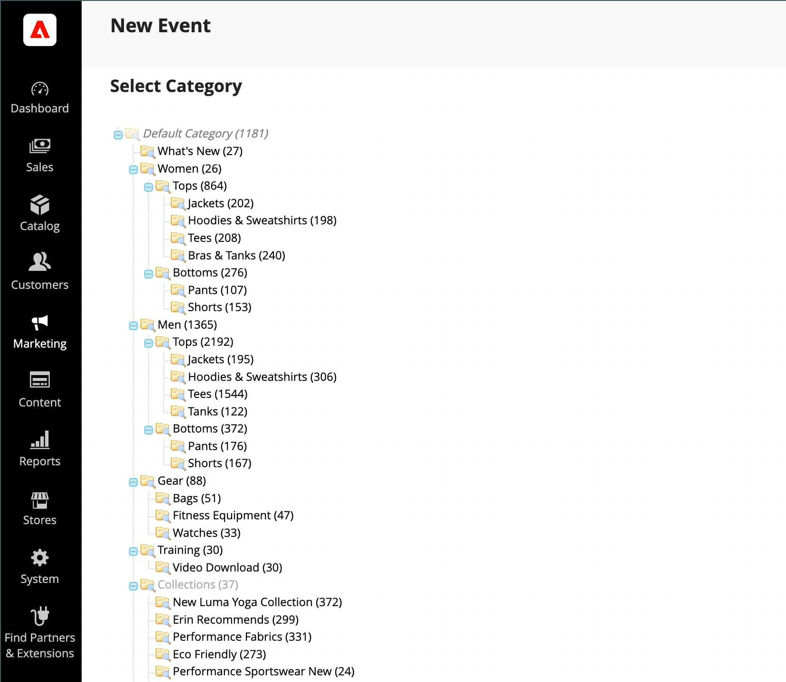
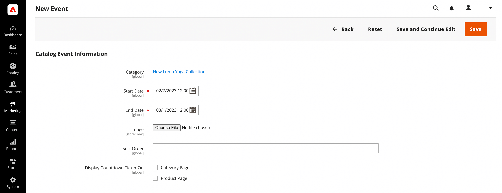

# 创建和更新事件

{{ee-feature}}

每个事件都与目录中的一个类别关联，一次只能有一个事件与任何给定类别关联。 要在您的商店中显示即将举行的活动的列表，您还必须设置 [目录事件轮播](../content-design/widget-event-carousel.md) 构件。

{width="700" zoomable="yes"}

## 创建事件

1. 在 _管理员_ 侧栏，转到 **[!UICONTROL Marketing]** > _[!UICONTROL Private Sales]_>**[!UICONTROL Events]**.

1. 在右上角，单击 **[!UICONTROL Add Catalog Event]**.

1. 在类别树中，选择要与事件关联的类别。

   由于每个类别一次只能有一个事件，因此已具有事件的任何类别都会被禁用。

   {width="500" zoomable="yes"}

1. 定义 **[!UICONTROL Catalog Event Information]**：

   {width="700" zoomable="yes"}

   - 对于 **[!UICONTROL Start Date]** 使用日历()以选择日期。 使用 **[!UICONTROL Hour]** 和 **[!UICONTROL Minute]** 滑块来设置事件开始的时间。

   - 对于 **[!UICONTROL End Date]** 使用日历()以选择日期。 使用 **[!UICONTROL Hour]** 和 **[!UICONTROL Minute]** 滑块来设置事件结束的时间。

   - 上传 **[!UICONTROL Image]** 对于事件小组件，单击 **[!UICONTROL Choose File]** 并从目录中选择图像文件。

   - 在 **[!UICONTROL Sort Order]** 字段中，输入一个数字，以指明此事件与其他事件一起列出时的显示顺序。

   - 选中要显示倒计时滚动条的每个页面类型的复选框。

1. 完成后，单击 **[!UICONTROL Save]**.

## 更新事件

可以从事件页面或从与事件关联的类别中编辑事件。 当类别具有关联事件时，编辑事件按钮出现在右上角。

### 方法1：从“事件”页面编辑事件

1. 在 _管理员_ 侧栏，转到 **[!UICONTROL Marketing]** > _[!UICONTROL Private Sales]_>**[!UICONTROL Events]**.

1. 在列表中查找该事件，并在编辑模式下将其打开。

1. 对事件进行必要的更改。

1. 完成后，单击 **[!UICONTROL Save]**.

### 方法2：编辑类别中的事件

1. 在 _管理员_ 侧栏，转到 **[!UICONTROL Catalog]** > **[!UICONTROL Categories]**.

1. 在左侧的类别树中，选择与事件关联的类别。

1. 在右上角，单击 **[!UICONTROL Edit Even]t**.

1. 对事件进行必要的更改。

1. 完成后，单击 **[!UICONTROL Save]**.

## 删除事件

1. 在 _管理员_ 侧栏，转到 **[!UICONTROL Marketing]** > _[!UICONTROL Private Sales]_>**[!UICONTROL Events]**.

1. 在列表中查找事件，并在编辑模式下打开该事件。

1. 在右上角，单击 **[!UICONTROL Delete]**.

1. 要确认操作，请单击 **[!UICONTROL OK]**.

## 字段描述

| 字段 | [范围](../getting-started/websites-stores-views.md#scope-settings) | 描述 |
|--- |--- |--- |
| [!UICONTROL Category] | 全局 | 创建事件时，此字段链接回类别树。 编辑事件时，它会链接到与事件相关的类别页面。 |
| [!UICONTROL Start Date] | 全局 | 中事件的开始日期和时间 `MMDDYYYY HH;MM` 格式。 单击日历图标以选择日期。 |
| [!DNL End Date] | 全局 | 中事件的结束日期和时间 `MMDDYYYY HH;MM` 格式。 单击日历图标以选择日期。 |
| [!UICONTROL Image] | 商店视图 | 上传显示在 [目录事件轮播小组件](../content-design/widget-event-carousel.md). |
| [!UICONTROL Sort Order] | 全局 | 确定与其他事件一起列出此事件时显示的顺序。 |
| [!UICONTROL Display Countdown Ticker On] | 全局 | 在每个指定页面的标题中显示倒计时记号。 选项： `Category Page` / `Product Page` |
| [!UICONTROL Status] | 全局 | 根据开始日期和结束日期范围指示事件的状态。 状态是只读值。 值： `Open` / `Closed` / `Upcoming` |

{style="table-layout:auto"}

## 按钮栏

| 按钮 | 描述 |
|--- |--- |
| **[!UICONTROL Back]** | 返回到“事件”页面，而不保存新事件或现有事件中的更改。 |
| **[!UICONTROL Delete]** | 删除事件。 |
| **[!UICONTROL Reset]** | 清除任何未保存的更改的形式，并恢复原始事件信息。 |
| **[!UICONTROL Save and Continue Edit]** | 保存所有更改并保持表单在编辑模式下打开。 |
| **[!UICONTROL Save]** | 保存更改，关闭表单，然后返回到“事件”页面。 |

{style="table-layout:auto"}
