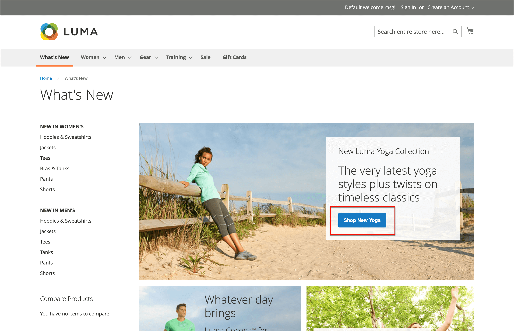
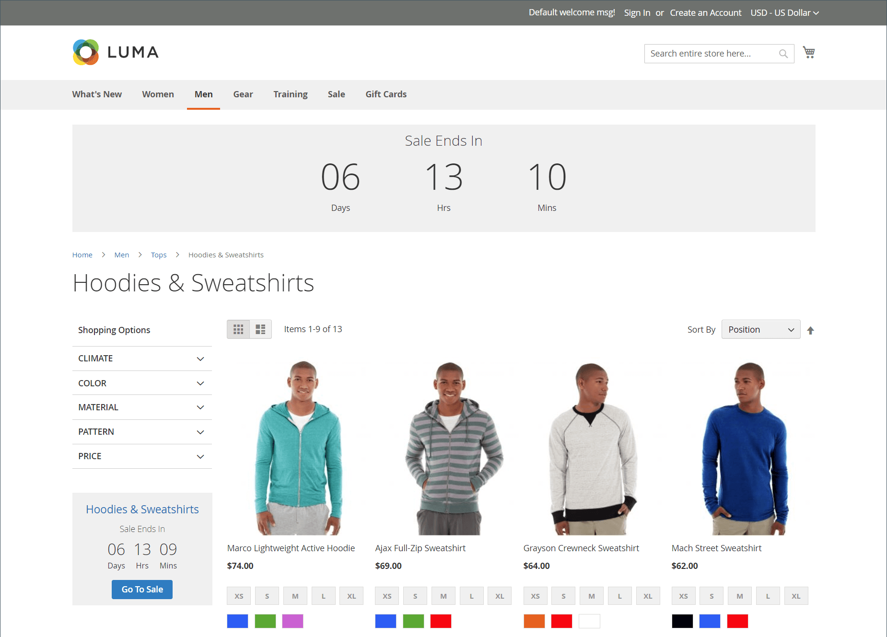

# 私人销售和活动

{{ee-feature}}

私人销售和其他目录活动是利用现有客户群来产生轰动效应和新商机，或卸载剩余库存的一种好方法。 您可以创建限时销售、将销售限定于特定成员，或创建独立的专用销售页。 您还可以定义邀请和活动详细信息。 通过为最佳客户提供VIP待遇，提高品牌忠诚度并产生轰动。 提供对仅会员销售或私人销售的排他性访问权限，以提高品牌忠诚度。 你也可以用这些销售来清算多余的商品。 客户组在仅设置这些类型的成员和VIP销售人员时非常有用。

{width="700" zoomable="yes"}

## 事件管理组件

- **类别** — 每个事件都与您目录中的[类别](../catalog/category-create.md)关联。

- **事件** — 事件销售额基于开始和结束日期。 您可以使用[倒计时记号](#event-ticker)来显示剩余时间。

- **目录事件轮播** — 在配置中启用[目录事件小组件](../content-design/widget-event-carousel.md)后，它可作为打开和即将发生的事件的列表放置在存储页面上，并按结束日期排序。 如果两个或更多事件的结束日期相同，则事件将根据配置中指定的顺序排序。

- **[!UICONTROL Websites]** — 类别权限主要基于[客户组](../customers/customer-groups.md)。

- **类别权限** - [类别权限](../catalog/category-permissions.md)可让您完全控制给定类别中可能发生的特定活动。

- **访问限制** — 通过重定向到登陆页面、登录页面或注册页面，阻止公共[访问](event-configure.md#restrict-access)网站。

- **邀请** — 发送电子邮件时，会附上在商店中创建帐户的链接。 您可以将创建帐户的能力限制为仅接收[邀请](invitations.md)的用户。

- **私人销售报告** - [私人销售报告](../getting-started/private-sales-reports.md)提供了有关已发送的邀请、已邀请的客户和转换的信息。

## 事件记号

滚动条块会为未结事件显示一个倒计时滚动条，其中包含即将发生的事件的开始和结束日期。 如果某个事件已关闭，则滚动条会显示开始日期和结束日期。

{width="700" zoomable="yes"}

如果为某个事件启用了类别页面滚动条，则滚动条块将显示在类别列表的顶部。 如果启用了产品页面滚动条，则滚动条块也会出现在与类别关联的任何产品的产品页面的顶部。

当您[创建事件](event-create.md)时，可以启用事件记号。

{width="700" zoomable="yes"}
