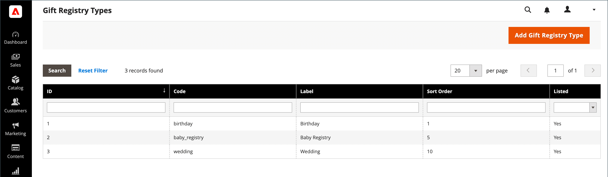
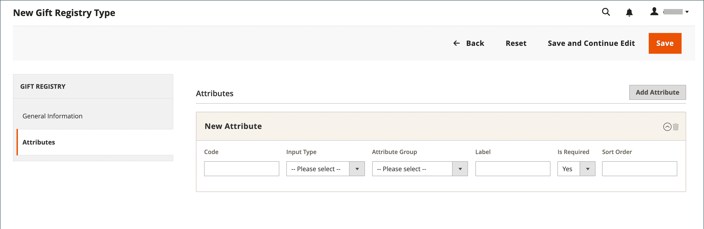

# 礼品注册设置

{{ee-feature}}

可以为任何类型的活动（例如婚礼、生日、周年纪念日、新生婴儿或任何其他特殊场合）创建礼品注册表。 默认情况下，Adobe Commerce包括以下特殊活动：

- 婴儿
- 生日
- 婚礼

在创建注册表时，它会成为客户帐户中礼品注册表类型列表中的选项。

您可以使用三个准备好的礼品登记簿之一，或者创建您自己的自定义登记簿。 每个礼品注册类型都包含多个属性，这些属性是客户创建礼品注册时完成的数据输入字段。 属性提供有关事件、时间和位置的附加信息，或所需的任何其他信息。 根据输入类型，某些属性有多个选项。 例如， `Wedding` 礼品注册类型具有属性 `Role`，使用 `Bride`， `Groom`、和 `Partner` 选项。 要了解有关属性和输入类型的更多信息，请参阅 [属性](../customers/attribute-properties.md).

{width="700" zoomable="yes"}

## 使用准备好的礼品登记表

1. 在 _管理员_ 侧栏，转到 **[!UICONTROL Stores]** > _[!UICONTROL Other Settings]_>**[!UICONTROL Gift Registry]**.

   生日、婚礼和婴儿登记处已可供客户从他们的帐户中使用。

1. 确保完成 [电子邮件模板配置](../systems/email-templates.md#configure-email-templates)，因此它们可反映您的品牌。

## 创建自定义礼品注册表

1. 在管理员侧边栏上，转到 **[!UICONTROL Stores]** > _[!UICONTROL Other Settings]_>**[!UICONTROL Gift Registry]**.

1. 在右上角，单击 **[!UICONTROL Add Gift Registry Type]**.

1. 下 **[!UICONTROL General Information]**，完成以下操作：

   - 输入唯一值 **[!UICONTROL Code]** 在内部标识礼品注册表。

     代码必须以小写字母开头。 其余代码可以是小写字母(a-z)、数字(0-9)和下划线(`_`)。

   - 对象 **[!UICONTROL Label]**，输入您希望礼品注册显示在商店中的名称。

     此标签是客户可用的礼品注册类型列表中的选项。

   - 对象 **[!UICONTROL Sort Order]**，输入数字以确定此礼品注册与其他类型一起列出时的显示顺序。

   - 要激活礼品注册表，请设置 **[!UICONTROL Is Listed]** 到 `Yes`.

     {width="600" zoomable="yes"}

1. 检查礼品注册表的每个部分，以确定要包括的信息类型。

1. 在左侧面板中，选择 **[!UICONTROL Attributes]** 并单击 **[!UICONTROL Add Attribute]**.

   {width="600" zoomable="yes"}

1. 对于每个属性，执行以下操作：

   - 分配唯一 **[!UICONTROL Code]** 以在内部标识属性。 该代码的长度最多可为15个字符，且必须以小写字母开头。 其余代码可以包含小写字母(`a`-`z`)，数字(`0`-`9`)，下划线(`_`)字符来分隔单词。

   - 选择 **[!UICONTROL Input Type]** 用于数据输入。 您可以使用自定义类型或静态类型之一。

   - 如果输入类型有多个选项，请单击 **[!UICONTROL Add New Option]** 并填写每个选项的信息。

     某些输入类型具有其他属性。 例如，事件位置具有使事件可搜索的其他属性，并包含在商店的礼品注册公开列表中。

      - 设置 **[!UICONTROL Attribute Group]** 到礼品注册表中希望显示属性的部分。

      - 对象 **[!UICONTROL Label]**，输入名称以标识注册表中的数据输入字段。

      - 如果要求客户进行选择或在字段中输入值，请设置 **[!UICONTROL Is Required]** 到 `Yes`.

      - 对象 **[!UICONTROL Sort Order]**，请输入一个编号以确定此礼品注册与其他可能在商店中提供的礼品注册一起列出时的显示顺序。

1. 要添加其他选项，请单击 **添加新选项**.

   添加的每个新选项都会显示在顶部的新部分中。 对新属性重复此过程。

1. 完成后，单击 **[!UICONTROL Save]**.

## 字段描述

### [!UICONTROL General Information]

| 字段 | 描述 |
|--- |--- |
| [!UICONTROL Code] | 用于在内部标识礼品注册类型的唯一名称。 该代码的第一个字符必须为小写字母。 代码的其余部分可以是小写字母(a-z)、数字(0-9)和下划线字符(`_`)。 |
| [!UICONTROL Label] | 出现在商店中的礼品注册表类型的名称。 |
| [!UICONTROL Sort Order] | 确定与其他类型一起列出时此礼品注册类型的显示顺序。 |
| [!UICONTROL Is Listed] | 确定商店中的客户是否可以使用礼品注册类型。 选项： `Yes` / `No`. |

{style="table-layout:auto"}

### [!UICONTROL Attributes]

| 字段 | 描述 |
|--- |--- |
| [!UICONTROL Code] | 用于在内部标识属性的唯一名称。 代码可以包含小写字母(a-z)、数字(0-9)和下划线字符(`_`)。 |
| [!UICONTROL Input Type] | 根据类型确定与属性关联的数据类型和输入控件。 |
| [!UICONTROL Attribute Group] | 选择属性在礼品注册表中列出的组。 |
| [!UICONTROL Label] | 在客户的帐户仪表板中标识属性的名称。 |
| [!UICONTROL Is Required] | 指示属性是否为必需条目。 在完成所有必需属性之前，无法保存礼品注册表。 选项： `Yes` / `No`. |
| [!UICONTROL Sort Order] | 确定与其他属性一起列出时属性出现的顺序。 |

{style="table-layout:auto"}

#### [!UICONTROL Input Type Options]

选择与属性关联的数据类型和输入控件。

**_[!UICONTROL Custom Types]_**

| 字段 | 描述 |
|--- |--- |
| [!UICONTROL Text] | 将属性显示为文本字段。 |
| [!UICONTROL Select] | 将属性显示为下拉列表。 单击 **[!UICONTROL Add New Option]** 向下拉列表中添加更多条件： **[!UICONTROL Code]**— 用于在内部标识属性的唯一名称。 **[!UICONTROL Label]**  — 用于标识客户帐户仪表板中属性的名称。 **[!UICONTROL Is Default]**— 设置此开关以选择默认条件。 **[!UICONTROL Delete Option]**  — 单击以删除选项。 |
| [!UICONTROL Date] | 将属性显示为日期字段。 选项： `Short (3/23/2014)` / `Medium (Mar 23, 1914)` / `Long (March 23, 1914)` / `Full (Sunday, March 23, 2014)` |
| [!UICONTROL Country] | 将属性显示为国家/地区的下拉列表。 设置 **[!UICONTROL Show Region]** 至： `Yes` / `No`. |

{style="table-layout:auto"}

**_[!UICONTROL Static Types]_**

| 字段 | 描述 |
|--- |--- |
| [!UICONTROL Event Date] | 确定在存储中使用日期属性的方式。 选项：  **[!UICONTROL Searchable]**— 确定该属性是否可用于高级搜索。 选项： `Yes` / `No`. **[!UICONTROL Is Listed]**  — 确定事件是否包含在存储中可用的事件列表中。 选项： `Yes` / `No`.  **[!UICONTROL Date Format]**— 确定事件日期的格式。 选项： `Short (3/23/2014)` / `Medium (Mar 23, 1914)` / `Long (March 23, 1914)` / `Full (Sunday, March 23, 2014)` |
| [!UICONTROL Event Country] | 将属性显示为国家/地区列表。 选项：  **[!UICONTROL Searchable]**— 确定该属性是否可用于高级搜索。 选项： `Yes` / `No`. **[!UICONTROL Is Listed]**  — 确定事件是否包含在存储中可用的事件列表中。 选项： `Yes` / `No`.  **[!UICONTROL Show Region]**— 确定事件的区域。 |
| [!UICONTROL Event Location] | 与礼品注册相关的事件的位置。  设置 **[!UICONTROL Is Searcheable]** 至： `Yes` / `No`  设置 **[!UICONTROL Is Listed]** 至： `Yes` / `No` |
| [!UICONTROL Role] | 用于标识礼品收件人的角色。 例如， `Bride`， `Groom`，或 `Partner`. **[!UICONTROL Is Searcheable]**— 设置为 `Yes`/ `No` **&#x200B;已列出&#x200B;**— 设置为 `Yes` / `No` **[!UICONTROL Add New Option]**  — 单击以向下拉菜单添加更多条件： **代码**  — 用于在内部标识属性的唯一名称。 **[!UICONTROL Label]**— 用于标识客户帐户仪表板中属性的名称。 **[!UICONTROL Is Default]**  — 设置此开关以选择默认条件。 **[!UICONTROL Delete Option]**— 单击以删除选项。 |

{style="table-layout:auto"}

#### [!UICONTROL Attribute Group Options]

选择属性在礼品注册表中列出的组。

| 字段 | 描述 |
|--- |--- |
| [!UICONTROL Event Information] | 对所有添加有关礼品注册事件、时间、地点等信息的礼品注册属性进行分组。 |
| [!UICONTROL Gift Registry Properties] | 合并所有属性，这些属性直接添加有关礼品注册的信息。 |
| [!UICONTROL Privacy Settings] | 列出添加有关礼品注册事件隐私信息的属性。 |
| [!UICONTROL Recipients Information] | 对属性进行分组，以提供有关创建礼品注册表的人员的信息。 |
| [!UICONTROL Shipping Address] | 组合用于添加有关礼品注册事件装运地址信息的属性。 |

{style="table-layout:auto"}
