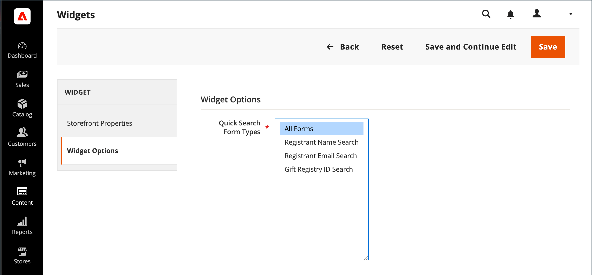

# 添加礼品注册搜索

{{ee-feature}}

[Widget](../content-design/widgets.md)工具可用于将礼品注册搜索框放置到商店中的大多数位置。 您可以指定可供客户使用的搜索选项，如名称、电子邮件地址和礼品注册标识。 当客户单击“搜索”按钮时，结果将显示在“礼品注册搜索”页面上。 如果搜索未返回任何结果，则客户可以使用其他参数重试。

{width="700" zoomable="yes"}

## 配置礼品注册搜索

1. 在&#x200B;_管理员_&#x200B;侧边栏上，转到&#x200B;**[!UICONTROL Content]** > _[!UICONTROL Elements]_>**[!UICONTROL Widgets]**。

1. 单击右上角的&#x200B;**[!UICONTROL Add Widget]**。

1. 选择&#x200B;**[!UICONTROL Settings]**&#x200B;选项卡并执行以下操作：

   - 将&#x200B;**[!UICONTROL Type]**&#x200B;设置为`Gift Registry Search`。

   - 将&#x200B;**[!UICONTROL Design Theme]**&#x200B;设置为商店使用的主题。

   - 单击&#x200B;**[!UICONTROL Continue]**。

   {width="700" zoomable="yes"}

1. 在&#x200B;_[!UICONTROL Storefront Properties]_部分中，执行以下操作：

   - 输入&#x200B;**[!UICONTROL Widget Title]**&#x200B;供内部引用。

   - 将&#x200B;**[!UICONTROL Assign to Store Views]**&#x200B;设置为可用礼品注册搜索的存储区视图。

   - 设置&#x200B;**[!UICONTROL Sort Order]**&#x200B;以确定当页面上存在分配给相同位置的其他块时，礼品注册搜索块的显示顺序。

   {width="700" zoomable="yes"}

1. 在&#x200B;**[!UICONTROL Layout Updates]**&#x200B;部分中，单击&#x200B;**[!UICONTROL Add Layout Update]**。

1. 要确定礼品注册搜索出现在商店中的位置，请执行以下操作：

   - 将&#x200B;**[!UICONTROL Display On]**&#x200B;设置为您希望礼品注册搜索块显示的商店页面。

   - 如果适用，请选择要显示它的&#x200B;**[!UICONTROL Categories]**。

   - 将&#x200B;**[!UICONTROL Container]**&#x200B;设置为页面上放置礼品注册搜索块的位置。

   {width="500" zoomable="yes"}

1. 在左侧面板中，选择&#x200B;**[!UICONTROL Widget Options]**。

1. 要确定网站访客如何搜索礼品注册表，请选择以下任意多个适用的选项：

   - [!UICONTROL All Forms]
   - [!UICONTROL Registrant Name Search]
   - [!UICONTROL Registrant Email Search]
   - [!UICONTROL Gift Registry ID Search]

   {width="700" zoomable="yes"}

1. 完成后，单击&#x200B;**[!UICONTROL Save]**。

1. 提示刷新页面缓存时，单击工作区顶部消息中的链接，然后按照说明操作。

## 字段描述

### [!UICONTROL Settings]

| 字段 | 描述 |
|--- |--- |
| [!UICONTROL Type] | 将`Gift Registry Search`标识为小部件的类型。 |
| [!UICONTROL Design Theme] | 显示礼品注册搜索的存储区使用的主题。 |

{style="table-layout:auto"}

### [!UICONTROL Storefront Properties]

| 字段 | 描述 |
|--- |--- |
| [!UICONTROL Widget Title] | 内部引用的名称。 |
| [!UICONTROL Assign to Store Views] | 标识提供礼品注册搜索的存储区视图。 |
| [!UICONTROL Sort Order] | 指示当同一位置有其他块被指定出现时，礼品注册搜索块的显示顺序。 |

{style="table-layout:auto"}

### [!UICONTROL Layout Updates]

| 字段 | 描述 |
|--- |--- |
| [!UICONTROL Display On] | 指明显示礼品注册搜索块的特定页面或页面类型。 |
| [!UICONTROL Categories] | 如果适用，则标识显示礼品注册搜索项的类别页面。 |
| [!UICONTROL Container] | 指示放置礼品注册搜索位置的页面布局块。 选项因模板和主题而异。 |

{style="table-layout:auto"}

### [!UICONTROL Widget Options]

| 字段 | 描述 |
|--- |--- |
| [!UICONTROL Quick Search Form Types] | 确定可通过礼品注册搜索执行的搜索类型。 选项： `All Forms` / `Registrant Name Search` /` Registrant Email Search` / `Gift Registry ID Search` |

{style="table-layout:auto"}
