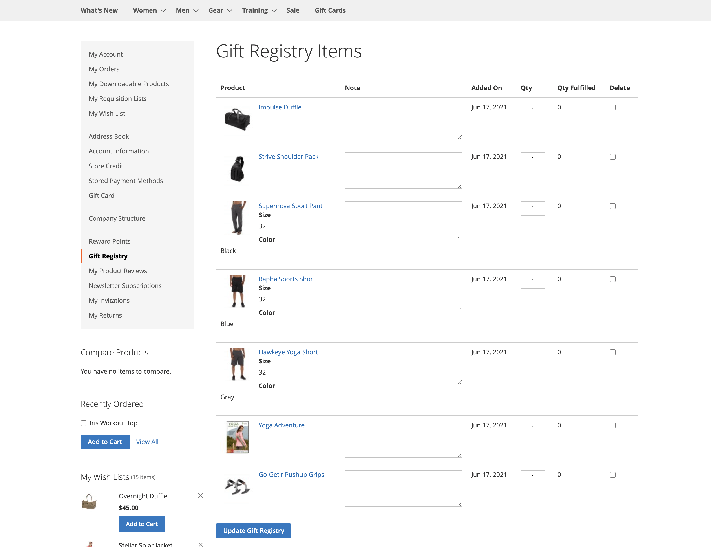

# 礼品注册店面体验

{{ee-feature}}

客户帐户的[礼品注册表](gift-registries.md)部分列出了客户当前的礼品注册表和相关事件。 客户可以管理当前注册并添加新注册。

{width="700" zoomable="yes"}

## 礼品注册信息

客户可以从其帐户创建和管理礼品登记册。 与每种注册表类型相关的所有信息均可从客户帐户获取。

{width="700" zoomable="yes"}

| 部分 | 描述 |
|--- |--- |
| [!UICONTROL General Information] | 此部分通常包括事件的名称、消息或事件描述、隐私设置和事件状态。 |
| [!UICONTROL Event Information] | 此部分包括事件的位置和日期。 对于婚礼，可能还包括每个人能带走的客人数量。 |
| [!UICONTROL Gift Registry Details] | 这可能包括特定于事件的其他信息。 |
| [!UICONTROL Registrant Information] | 本节包括接收注册通知的每个人的姓名和联系信息。 对于婚礼登记表，可以包含“角色”字段，以将登记者关联为新娘或新郎的朋友。 |
| [!UICONTROL Shipping Address] | 此部分显示将发送礼品的位置，并包括运营商交付包裹所需的信息。 |

{style="table-layout:auto"}

>[!NOTE]
>
>当礼品注册表处于非活动状态时，无法对注册表进行搜索和链接。 如果稍后重新激活注册表，则链接仍保持断开状态。

## 创建礼品注册表

1. 客户在其帐户信息板中选择&#x200B;**[!UICONTROL Gift Registry]**。

1. 在&#x200B;_礼品注册表_&#x200B;页面上单击&#x200B;**[!UICONTROL Add New]**。

1. 选择&#x200B;**[!UICONTROL Gift Registry Type]**，例如：

   - 生日

   - 婴儿注册

   - 婚礼

1. 单击&#x200B;**[!UICONTROL Next]**。

1. 输入所需信息，然后单击&#x200B;**[!UICONTROL Save]**。

## 将产品添加到注册表

1. 客户打开要添加到礼品注册事件中的产品。

1. 单击&#x200B;**[!UICONTROL Add to Cart]**。

1. 单击迷你购物车上的&#x200B;**[!UICONTROL View and Edit Cart]**。

1. 在“购物车”页面上，选择所需的事件并单击/点按&#x200B;**[!UICONTROL Add All To Gift Registry]**。

   项目将添加到所选事件的礼品注册表。

## 共享礼品注册表

1. 客户从其帐户信息板转到&#x200B;**[!UICONTROL Gift Registry]**。

1. 查找要管理的注册表事件，然后单击&#x200B;**[!UICONTROL Share]**。

1. 输入所需信息并单击&#x200B;**[!UICONTROL Share Gift Registry]**。

## 编辑礼品注册表

1. 客户从其帐户信息板转到&#x200B;**[!UICONTROL Gift Registry]**。

1. 查找要管理的注册表事件，然后单击&#x200B;**[!UICONTROL Edit]**。

1. 根据需要更改任何选项。

1. 编辑所需的选项并单击&#x200B;**[!UICONTROL Save]**。

## 管理礼品注册物料

1. 客户从其帐户信息板转到&#x200B;**[!UICONTROL Gift Registry]**。

   {width="700" zoomable="yes"}

1. 查找注册表事件，选择要管理的项目，然后单击&#x200B;**[!DNL Manage Items]**。

1. 更改必需选项，如&#x200B;**[!UICONTROL Note]**&#x200B;和&#x200B;**[!UICONTROL Qty]**。

1. 如果需要，请选中该复选框并单击&#x200B;**[!UICONTROL Delete]**&#x200B;以从礼品注册表中删除项目。

1. 单击&#x200B;**[!UICONTROL Update Gift Registry]**&#x200B;以保存更改。

## 删除礼品注册表

1. 客户从其帐户信息板转到&#x200B;**[!UICONTROL Gift Registry]**。

1. 查找要管理的注册表事件，然后单击&#x200B;**[!UICONTROL Delete]**。

1. 单击&#x200B;**[!UICONTROL OK]**&#x200B;确认。
