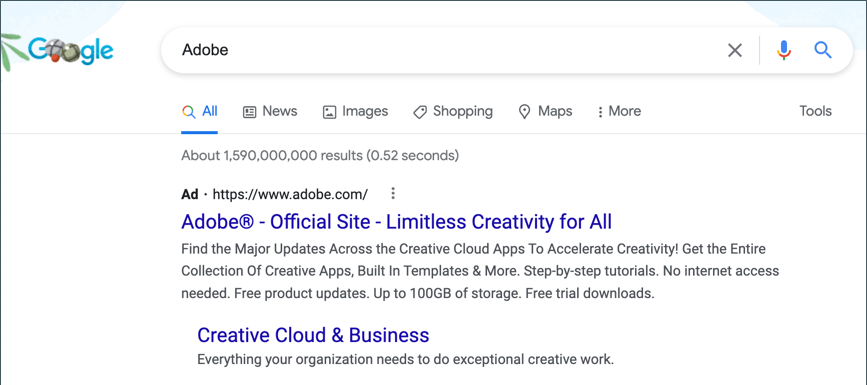

# Google AdWords

[Google AdWords][1] 是一项服务，可用于在Google搜索结果和Google显示网络的公司页面上投放广告。 AdWords仪表板包括管理营销活动、跟踪响应和衡量结果的工具。

转化跟踪显示导致销售或其他有价值的操作的广告点击次数。 此 _成功_ 提交订单后向客户显示的页面用于跟踪转化，因为它仅在销售后显示。 完成商店的Google AdWords配置后，无需将转化跟踪脚本复制到“成功”页面，因为Commerce已具有必要的信息。 要了解更多信息，请参阅 [Google AdWords帮助][2].

{width="500"}

## 步骤1. 创建Google AdWords营销活动

1. 访问 [Google AdWords][3]，并注册帐户。

1. 按照相关说明创建营销策划。

1. 要为营销活动设置转化跟踪，请执行以下操作：

   - 在 **[!UICONTROL Tools]** 选项卡，选择 **[!UICONTROL Conversions]** 并单击 **[!UICONTROL Conversion]**.

   - 提示输入转化源时，选择 **[!UICONTROL Website]**.

   - 输入要跟踪的转换操作的名称并单击 **[!UICONTROL Done]**.

   - 单击 **[!UICONTROL Value]** 并且，如果适用，为转换分配值。 例如：

      - 如果每笔销售收入为5美元，请选择 `Each time it happens` 并指定值 `$5`.
      - 如果每次销售的价值各不相同，则将该值留空。

     要完成，请单击 **[!UICONTROL Done]**.

   - 单击 **[!UICONTROL Conversion windows]** 并完成相应设置，以确定要跟踪转化的时间、报表类别和归因模型。

1. 完成后，单击 **[!UICONTROL Save and Continue]**.

## 步骤2. 获取转化标记

1. 下 **[!UICONTROL Install your tag]**，选择将转化计算在 **[!UICONTROL Page load]**.

1. 作为一个选项，您可以添加 **[!UICONTROL Google Site Stats]** 通知到转化页面。

   通知显示在下角，其中包含指向Google安全标准和Cookie用法的链接。

1. 要选择您希望如何管理AdWords标记，请执行以下操作之一：

   - 如果您计划自己将该脚本添加到商店，请选择 **[!UICONTROL Save instructions and tag]**.
   - 如果您计划让其他人将该脚本添加到您的商店，请选择 **[!UICONTROL Email instructions and tag]**.

1. 完成后，单击 **[!UICONTROL Done]**.

## 步骤3. 配置您的商店

{{gtag-api-note}}

1. 在 _管理员_ 侧栏，转到 **[!UICONTROL Stores]** > _[!UICONTROL Settings]_>**[!UICONTROL Configuration]**.

1. 如果要为特定商店视图配置Google AdWords，请执行以下操作：

   - 在左上角，选择 **[!UICONTROL Store View]** 有待配置。

   - 提示确认范围切换时，单击 **[!UICONTROL OK]**.

1. 在左侧面板中，展开 **[!UICONTROL Sales]** 并选择 **[!UICONTROL Google API]**.

1. 展开  该 **[!UICONTROL Google AdWords]** 部分并执行以下操作：

   - 设置 **[!UICONTROL Enable]** 到 `Yes`.

   - 输入 **[!UICONTROL Conversion ID]** 从您的Google AdWords脚本删除。

   {width="600" zoomable="yes"}

1. 要设置Google Sites Stat通知的格式，请执行以下操作：

   - 设置 **[!UICONTROL Conversion Language]** 到Google AdWords脚本中标识的语言。

   - 输入 **[!UICONTROL Conversion Format]** 用于转化页面上的Google Sites状态通知。

      - `1`   — 显示一行通知，其中包含指向Google跟踪详细信息的链接。
      - `2`  — 显示一个两行通知，其中包含指向Google跟踪相关详细信息的链接。
      - `3`  — 不显示客户通知。

   - 输入 [十六进制代码][4]{：target=&quot;_blank&quot;}用于 **[!UICONTROL Conversion Color]** 要用于Google站点统计信息通知标签的内容。

   - 输入加密文本 **[!UICONTROL Conversion Label]** 显示在Google Sites统计通知中的区段。

     例如： `MlEYCOKBnGoQz6CZoAM`

     **Google AdWords标记代码示例**

     ```html
     <!-- Google Code for Back to School Sale Conversion Page -->
     <script type="text/javascript">
     /* <![CDATA[ */
     var google_conversion_id = 999999999;
     var google_conversion_language = "en";
     var google_conversion_format = "3";
     var google_conversion_color = "ffffff";
     var google_conversion_label = "MlEYCOKBnGoQz6CZoAM";
     var google_remarketing_only = false;
     /* ]]> */
     </script>
     
     <script type="text/javascript" src="//www.googleadservices.com/pagead/conversion.js">
     </script>
     <noscript>
     <div style="display:inline;">
     
     
     </noscript>
     ```

1. 设置 **[!UICONTROL Conversion Value Type]** 更改为以下任一项：

   - `Dynamic`  — 根据动态订单金额值确定已发生转换。
   - `Constant`  — 根据输入的特定值确定已发生转换。

   对于 _常量_ 转化值类型，输入特定的 **[!UICONTROL Value]** 对于 _[!UICONTROL Order Amount]_以符合转换资格。

1. 完成后，单击 **[!UICONTROL Save Config]**.

## 步骤4. 验证配置

在几个小时内，Google AdWords仪表板中的跟踪状态将从 `Unverified` 到 `No recent conversions` 或 `Recording conversions`. 当有人单击您的广告并作出购买时，转化将显示在功能板和促销活动报表的“转化操作”页面上。

[1]: https://www.google.com/adwords/
[2]: https://support.google.com/adwords/answer/6095821
[3]: https://ads.google.com/
[4]: https://www.w3schools.com/colors/colors_picker.asp
