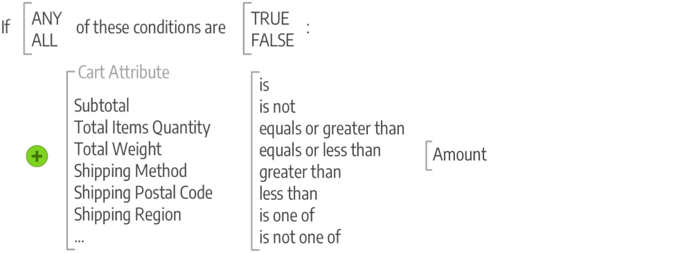

# Commerce促销和促销简介

定位促销活动，创造客户参与的机会，并将购物者转化为购买者。 通过支持购买后活动并向回头客户提供特别折扣来管理客户关系。 了解支持您的SEO计划的最佳实践和技术。

## 促销

_促销_&#x200B;是零售中使用的术语，用于描述楼层计划开发和产品展示的艺术和科学。 您可以将[基于类别的导航](../catalog/navigation-top.md)视为商店的平面图，将产品的动态展示视为可应用于商店中产品列表的条件。 此外，您还可以实施可促进更多产品销售的程序：

- [!BADGE 仅限于PaaS]{type=Informative url="https://experienceleague.adobe.com/en/docs/commerce/user-guides/product-solutions" tooltip="仅适用于云项目(Adobe管理的PaaS基础架构)和内部部署项目上的Adobe Commerce 。"} [可视化促销活动](visual-merchandiser.md) — 一组高级工具，允许您定位产品并应用条件来确定哪些产品出现在类别列表中。

- [礼品登记簿](gift-registries.md) — 让您的客户能够创建特殊场合的礼品登记簿，并邀请朋友和家人从礼品登记簿购买礼品。

- [奖励和忠诚度](rewards-loyalty.md) — 使用积分系统实施独特的计划以提高客户参与度并提高客户忠诚度。 您可以为广泛的交易和客户活动授予积分，并控制积分分配、平衡和到期。

- [私有销售和事件](events-private-sales.md) — 使用现有客户群生成热点和新的潜在客户，或通过私有销售和其他目录事件卸载剩余库存。

>[!TIP]
>
>要了解产品推荐，以及它们如何为您提供insight和控制您为购买者创建最佳体验所需的功能，请参阅[产品推荐用户指南](https://experienceleague.adobe.com/docs/commerce/product-recommendations/guide-overview.html)。

## 促销活动

在Adobe Commerce中，使用促销功能来设置产品关系，并使用价格规则根据各种条件触发折扣。 您可以使用价格规则来提供客户激励，例如：

- 向最佳客户发送特定产品折扣的优惠券
- 为超过一定金额的购买提供免运费
- 为特定时间段安排促销活动

规则是条件（一个或多个）的集合，当满足一个或多个条件时，会将价格更改应用于产品。 每个规则可以有多个条件，当所有或任何（一个或多个，但不是所有）语句为true或false时应用。

### 条件

条件是用于优化应用规则的产品和情况的列表的语句。 条件的属性和选项因可用规则的类型而异。 满足要求时，该操作即完成，例如折扣、一买一卖(BOGO)和其他选项。 规则可以根据您的业务需求、季节性折扣和促销活动以及长达一年的机会而变得简单或复杂。 例如，在购物车小计较高的情况下，您可能希望全年提供免运费时，为假期再添加一些选项。

>[!NOTE]
>
>如果要基于特定产品属性定义条件，则必须将[店面属性](../catalog/attribute-product-create.md)中属性的&#x200B;**[!UICONTROL Use for Promo Rule Conditions]**&#x200B;设置为`Yes`。

### 价格规则

对于[目录价格规则](price-rules-catalog.md)，您将基于目录、比较函数和选定属性中的[属性集](../catalog/attribute-sets.md)生成条件。 你可以通过选择一些语句来创造条件，比如句子。 例如，您可以创建两个价格规则，以根据类别对童装和男装/女装应用折扣。

{width="500"}

[购物车价格规则](price-rules-cart.md)条件可以基于作为商店[root](../catalog/category-root.md)子项的任何类别。 价格规则是预先制定的，只要满足所需条件就会迅速采取行动。 这些规则使用属性，包括产品属性组合，如使用产品属性匹配购物车中的SKU。 这些规则还可以使用产品选择数量条件、复杂规则的条件组合以及购物车属性（如小计）。

{width="500"}

## 通信和SEO

掌握[搜索引擎优化(SEO)](seo-overview.md)对于吸引潜在购买者至关重要。 了解搜索引擎优化和微调网站的内容和呈现方式，以改进搜索引擎为页面编制索引的方式。

在启动应用商店之前要完成的一项任务是，查看用于应用商店发送的所有通信的电子邮件模板，以确保这些模板能够反映您的品牌。 但是，您应该更进一步，开发其他通信以向现有客户推广您的品牌和产品。 您可以使用变量和标记将内容个性化。

>[!NOTE]
>
>Adobe Commerce和Magento Open Source版本2.4.0到2.4.3包含了dotdigital供应商开发的用于与dotdigital Engagement Cloud集成的扩展。 从2.4.4版本开始，此扩展不再与核心版本捆绑在一起，必须从Commerce Marketplace安装和更新。 通过Marketplace，还可以访问扩展开发人员提供的当前文档。
>  
>如果已启用并配置捆绑的扩展，则必须在升级2.4.4的过程中更新您的composer.json文件，并且以后要管理扩展更新。 有关详细信息，请参阅&#x200B;_升级指南_&#x200B;中的[升级模块](https://experienceleague.adobe.com/docs/commerce-operations/upgrade-guide/modules/upgrade.html)。

- [新闻稿](newsletters.md) — 生成新闻稿、管理订阅者列表、开发内容并增加您商店的流量。

- [RSS源](social-rss.md#rss-feeds) — 使用RSS源将您的产品信息发布到购物聚合网站，甚至将其包含在您的新闻稿中。 客户可以订阅您的RSS源，以了解有关新产品和促销的信息。

- [社交网络](social-rss.md#social-networks) — 通过安装Marketplace扩展或向内容页面添加插件，将您的商店与您的社交网络集成。

## Google营销工具

您的商店配置与以下Google工具集成，以帮助优化内容、分析流量并将目录连接到购物聚合和市场。

>[!NOTE]
>
>从2.4.5版本开始，更新了Google服务集成以支持使用GTag API。 GTag是一种用于与Google网页功能集成的统一机制，它支持通过Google服务跟踪和管理内容的最新功能和机会。 有关详细信息，请参阅[Google Analytics开发人员文档](https://developers.google.com/analytics/devguides/collection/gtagjs)。

- [Google Analytics](google-analytics.md) — 使用Google Universal Analytics定义额外的自定义维度和量度以进行跟踪，支持离线和移动设备应用程序交互，并可访问正在进行的更新。

- [Google内容实验](google-content-experiments.md) — 使用Google Analytics内容设置产品、类别或内容页面的A/B测试

- [Google标签管理器](google-tag-manager.md) - (仅限Adobe Commerce)使用Google标签管理器管理许多与营销活动事件相关的标签。

- [Google AdWords](google-adwords.md) — 创建Google AdWords促销活动并跟踪您应用商店的转化情况。
