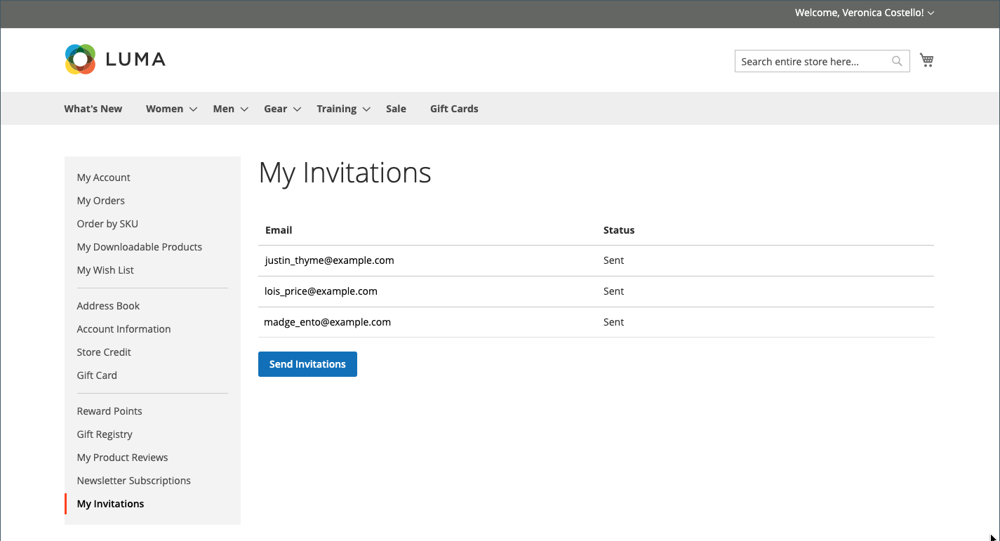

# 活动邀请

{{ee-feature}}

启用邀请后，客户可以从其客户帐户的仪表板发送和查看邀请。 邀请电子邮件包括一个指向您商店的客户登录页面的链接。

## 我的邀请

客户帐户的&#x200B;_[!UICONTROL My Invitations]_&#x200B;部分列出了客户发送的所有邀请。 客户可以向朋友和家人发送邀请，让他们参加商店活动、礼品注册和愿望清单等。

{width="700" zoomable="yes"}

### 邀请工作流程

1. **客户准备邀请**：客户通过帐户仪表板准备收件人列表并完成邀请。 可包含自定义消息，具体取决于配置。
1. **客户发送邀请**：准备就绪后，客户单击&#x200B;_[!UICONTROL Send Invitations]_&#x200B;按钮。
1. **系统管理传输**：系统根据配置中设置的编号批量发送邀请。
1. **客户监视响应**：客户监视来自帐户仪表板的每个邀请的状态，如`Sent`、`Accepted`或`Canceled`。

### 发送邀请

1. 在店面客户帐户的侧边栏中，客户选择&#x200B;**[!UICONTROL My Invitations]**。

1. 在&#x200B;_我的邀请_&#x200B;页面上单击&#x200B;**[!UICONTROL Send Invitation]**。

1. 定义新的邀请项目：

   - 完成电子邮件信息。

   - （可选）通过单击&#x200B;**+**&#x200B;并添加其他电子邮件地址来创建多地址邀请。

     单个邀请的电子邮件地址限制为5个。

   - （可选）输入随附消息。

1. 完成后，单击&#x200B;**[!UICONTROL Send Invitation]**。

将向受邀用户的电子邮件地址发送邀请通知，其中包含用于设置帐户的说明链接。

>[!NOTE]
>
>用户只能向特定电子邮件地址发送一个邀请。 尝试将邀请重新发送到同一电子邮件地址会导致显示错误消息，并且不会发送邀请。

## 为您的商店启用邀请

邀请配置启用商店邀请并决定发送方式。

1. 在&#x200B;_管理员_&#x200B;侧边栏上，转到&#x200B;**[!UICONTROL Stores]** > _[!UICONTROL Settings]_>**[!UICONTROL Configuration]**。

1. 在左侧面板中，展开&#x200B;**[!UICONTROL Customers]**&#x200B;并选择&#x200B;**[!UICONTROL Invitations]**。

1. 展开&#x200B;**[!UICONTROL General]**&#x200B;部分的。

   {width="600" zoomable="yes"}

1. 将&#x200B;**[!UICONTROL Enable Invitations Functionality]**&#x200B;设置为`Yes`。

1. 若要允许客户管理店面的邀请，请将&#x200B;**启用店面的邀请**&#x200B;设置为`Yes`。

1. 将&#x200B;**[!UICONTROL Referred Customer Group]**&#x200B;设置为以下项之一：

   - `Same as Inviter`
   - `Default Customer Group from Configuration`

1. 将&#x200B;**[!UICONTROL New Accounts Registration]**&#x200B;设置为以下项之一：

   - `By Invitation Only`
   - `Available to All`

1. 到&#x200B;**[!UICONTROL Allow Customers to Add Custom Message to Invitation Email]**，选择`Yes`。

1. 要限制一次可发送的邀请数，请在&#x200B;**[!UICONTROL Max Invitations Allowed to be Sent at One Time]**&#x200B;字段中输入数量。

1. 展开&#x200B;**[!UICONTROL Email]**&#x200B;部分中的并执行以下操作：

   {width="600" zoomable="yes"}

   - 选择要用作&#x200B;**[!UICONTROL Customer Invitation Email Sender]**&#x200B;的存储标识。

   - 选择用于发送邀请的&#x200B;**[!UICONTROL Customer Invitation Email Template]**。

1. 完成后，单击&#x200B;**[!UICONTROL Save Config]**。

## 在管理员中发送和管理邀请

在[私人销售报告](../getting-started/private-sales-reports.md)部分中，您可以查看在指定期间发送的邀请数，或您已向其发送邀请的客户。

### 在管理员中创建邀请

1. 在&#x200B;_管理员_&#x200B;侧边栏上，转到&#x200B;**[!UICONTROL Marketing]** > _[!UICONTROL Private Sales]_>**[!UICONTROL Invitations]**。

1. 单击右上角的&#x200B;**[!UICONTROL Add Invitations]**。

1. 在下一个屏幕中，输入电子邮件地址以邀请新客户，添加自定义消息，选择发件人，然后选择受邀者组。

   如果您有多个商店视图，请使用&#x200B;**[!UICONTROL Send From]**&#x200B;选项指定从中发送邀请的存储区视图。

   {width="700" zoomable="yes"}

1. 完成后，单击&#x200B;**[!UICONTROL Save]**。

### 放弃单个实体的邀请

1. 在&#x200B;_管理员_&#x200B;侧边栏上，转到&#x200B;**[!UICONTROL Marketing]** > _[!UICONTROL Private Sales]_>**[!UICONTROL Invitations]**。

1. 使用筛选器查找所需的邀请，并在编辑模式下将其打开。

1. 单击右上角的&#x200B;**[!UICONTROL Discard Invitation]**。

1. 要确认操作，请单击&#x200B;**[!UICONTROL OK]**。

### 放弃多个实体的邀请

1. 在&#x200B;_管理员_&#x200B;侧边栏上，转到&#x200B;**[!UICONTROL Marketing]** > _[!UICONTROL Private Sales]_>**[!UICONTROL Invitations]**。

1. 查找并选择要放弃的邀请。

1. 在左上方，使用&#x200B;**[!UICONTROL Actions]**&#x200B;菜单选择&#x200B;**[!UICONTROL Discard Selected]**&#x200B;并单击&#x200B;**[!UICONTROL Submit]**。

1. 要确认操作，请单击&#x200B;**[!UICONTROL OK]**。

### 字段描述

| 字段 | 描述 |
|--- |--- |
| [!UICONTROL Select] | 选中此复选框可选择要执行某项操作的邀请，或者使用列标题中的选择控件。 选项： `Select All` /` Deselect All` / `Select Visible` / `Unselect Visible` |
| [!UICONTROL ID] | 邀请的内部标识号 |
| [!UICONTROL Email] | 相应的客户电子邮件地址 |
| [!UICONTROL Invitee] | 受邀用户电子邮件 |
| [!UICONTROL Sent] | 发送邀请的时间和日期 |
| [!UICONTROL Registered] | 客户注册的时间和数据 |
| [!UICONTROL Status] | 邀请状态。 选项： `Sent` / `Not Sent` / `Accepted` / `Discarded` |
| [!UICONTROL Valid Website] | 相应的网站 |
| [!UICONTROL Invitee Group] | 被邀请人的客户组 |

{style="table-layout:auto"}
