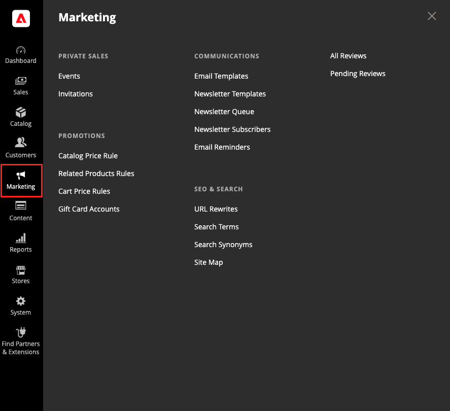

# [!UICONTROL Marketing]菜单

[!UICONTROL Marketing]菜单提供用于管理促销、通信、SEO和用户生成内容的访问工具。

>[!BEGINTABS]

>[!TAB Adobe Commerce]

仅[!BADGE PaaS]{type=Informative url="https://experienceleague.adobe.com/zh-hans/docs/commerce/user-guides/product-solutions" tooltip="仅适用于云项目(Adobe管理的PaaS基础架构)和内部部署项目上的Adobe Commerce 。"}

{width="600" zoomable="yes"}

>[!TAB Adobe Commerce as a Cloud Service]

仅[!BADGE SaaS]{type=Positive url="https://experienceleague.adobe.com/zh-hans/docs/commerce/user-guides/product-solutions" tooltip="仅适用于Adobe Commerce as a Cloud Service和Adobe Commerce Optimizer项目(Adobe管理的SaaS基础架构)。"}

{width="600" zoomable="yes"}

>[!ENDTABS]

## 显示[!UICONTROL Marketing]菜单

在&#x200B;_管理员_&#x200B;侧边栏上，单击&#x200B;**[!UICONTROL Marketing]**。

## 主要部分

### [!UICONTROL Promotions]

创建根据各种条件触发折扣的[目录](price-rules-catalog.md)和[购物车](price-rules-cart.md)价格规则。 设置[促销活动](introduction.md#promotions)，在满足所需条件时启动操作。

(仅限Adobe Commerce)创建[相关产品规则](product-related-rules.md)并管理[礼品卡帐户](../stores-purchase/product-gift-card-accounts.md)。

### [!UICONTROL Private Sales]

仅[!BADGE PaaS]{type=Informative url="https://experienceleague.adobe.com/zh-hans/docs/commerce/user-guides/product-solutions" tooltip="仅适用于云项目(Adobe管理的PaaS基础架构)和内部部署项目上的Adobe Commerce 。"}

{{ee-feature}}

通过私人销售和其他目录活动，您可以利用现有客户群来产生新的热门话题和潜在客户，这些话题仅对会员开放，或邀请会员参加。

### [!UICONTROL Communications]

自定义从应用商店发送的所有通知。 创建[新闻稿](newsletters.md)并发布[RSS](social-rss.md#rss-feeds)源。

(仅限Adobe Commerce)设置当满足条件时向客户发送[电子邮件提醒](email-reminder-rules.md)的规则。

### [!UICONTROL SEO & Search]

分析[搜索词](../catalog/search-terms.md)和[同义词](../catalog/search-terms.md#search-synonyms)以帮助客户查找商店中的产品、管理[元数据](meta-data.md)以及创建[网站地图](sitemap-xml.md)。 使用[重定向](url-rewrite.md)管理URL更改并避免链接损坏。

### [!UICONTROL User Content]

仅[!BADGE PaaS]{type=Informative url="https://experienceleague.adobe.com/zh-hans/docs/commerce/user-guides/product-solutions" tooltip="仅适用于云项目(Adobe管理的PaaS基础架构)和内部部署项目上的Adobe Commerce 。"}

合并用户生成的[产品评论](product-reviews.md)，以营造一种社区意识并提高销售额。
