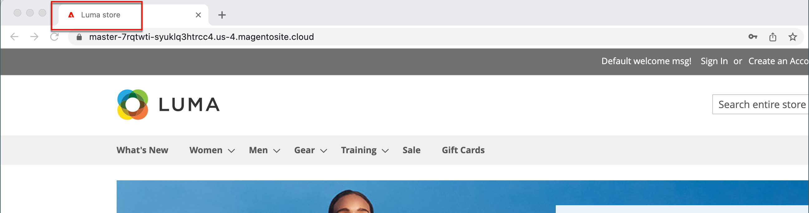

# 元数据

>[!TIP]
>
>对于Adobe Commerce as a Cloud Service，请参阅Commerce Storefront文档中的[元数据准则](https://experienceleague.adobe.com/developer/commerce/storefront/setup/seo/metadata/?lang=zh-Hans)

您的商店中加载了可在其中输入富含关键词的元数据的位置，以改进搜索引擎为您的网站编制索引的方式。 在设置存储时，您可以输入初步元数据，以便稍后完成。 随着时间的推移，您可以微调元数据，以定位客户的购买模式和偏好。

{width="700" zoomable="yes"}

## 元标题

元标题显示在浏览器和搜索结果列表的标题栏和选项卡中。 元标题对于页面应是唯一的，且长度应小于70个字符。

{width="600"}

## 元关键字

尽管一些搜索引擎会忽略元关键字，但其他搜索引擎会继续使用它们。 当前的最佳做法是在元标题和元描述中加入高值关键字。

{width="500"}

## 元描述

元描述提供搜索结果列表的页面的简要概述。 理想情况下，元描述长度应介于150到160个字符之间，尽管字段最多可接受255个字符。

## 丰富的代码片段

富代码片段为搜索结果列表和其他应用程序提供详细信息。 默认情况下，基于[schema.org][1]标准的结构化数据标记会添加到您商店的产品模板中。 因此，搜索引擎可以获得更多信息以作为&#x200B;_富代码片段_&#x200B;包含在产品列表中。

## 规范meta标记

某些搜索引擎会惩罚具有指向同一内容的多个URL的网站。 当多个URL具有相同或相似的内容时，规范meta标记会告知搜索引擎要索引的页面。 使用canonical meta标记可以提高网站排名并汇总页面查看次数。 规范meta标记放置在产品或类别页面的`<head>`块中。 它提供一个指向您的首选URL的链接，因此搜索引擎会赋予它更大的权重。

### 示例1：类别路径创建重复的URL

例如，如果您的目录配置为在产品URL中包含类别路径，则您的商店会生成多个指向同一产品页面的URL。

    http://mystore.com/gear/bags/driven-backpack.html
    http://mystore.com/driven-backpack.html

### 示例2：类别页面完整URL

启用类别的规范meta标记后，商店的类别页面将包含一个指向完整类别URL的规范URL：

    http://mystore.com/gear/bags/

### 示例3：产品页面完整URL

启用产品的规范元标记后，产品页面将包含一个指向域名/产品URL密钥的规范URL，因为产品URL密钥是全局唯一的。

    http://mystore.com/driven-backpack.html

如果您还在product URL中包含类别路径，则canonical URL将保留domain-name/product-url-key。 但是，也可以使用其完整URL访问该产品，该URL包括类别。 例如，如果产品URL密钥为`driven-backpack`并且已分配给Gear > Bag类别，则可以使用任一URL访问该产品。

您可以通过从URL中省略类别或使用canonical meta标记将搜索引擎定向到按产品或类别编制索引来避免受到搜索引擎的惩罚。 作为最佳实践，建议您为类别和产品启用canonical meta标记。

### 启用canonical meta标记

1. 在&#x200B;_管理员_&#x200B;侧边栏上，转到&#x200B;**[!UICONTROL Stores]** > _[!UICONTROL Settings]_>**[!UICONTROL Configuration]**。

1. 在左侧面板中，展开&#x200B;**[!UICONTROL Catalog]**&#x200B;并在下面选择&#x200B;**[!UICONTROL Catalog]**。

1. 展开&#x200B;**搜索引擎优化**&#x200B;部分的。

   要更改任何字段值，您必须先清除每个字段后面的&#x200B;**使用系统值**&#x200B;复选框。

   {width="600" zoomable="yes"}

1. 如果您希望搜索引擎仅使用完整的类别路径索引类别页面，请执行以下操作：

   - 将&#x200B;**Use Canonical Link Meta Tag for Categories**&#x200B;设置为`Yes`。

   - 将&#x200B;**Use Canonical Link Meta Tag for Products**&#x200B;设置为`No`。

1. 如果您希望搜索引擎仅使用域名/product-url-key格式索引产品页面，请执行以下操作：

   - 将&#x200B;**Use Canonical Link Meta Tag for Products**&#x200B;设置为`Yes`。

   - 将&#x200B;**Use Canonical Link Meta Tag for Categories**&#x200B;设置为`No`。

1. 完成后，单击&#x200B;**[!UICONTROL Save Config]**。

## 元数据演示

观看以下视频，了解如何管理SEO元数据：

>[!VIDEO](https://video.tv.adobe.com/v/343750?quality=12&learn=on)

[1]: https://schema.org/
