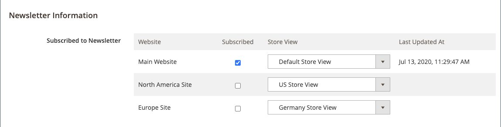

# 管理新闻稿订阅者

作为最佳实践，您应定期管理订阅列表，并确保处理任何取消订阅的请求。 在一些法域，法律规定取消订阅的请求在特定时间段内处理。

您可以使用活动订阅的简单列表轻松管理订阅者。 当客户提交取消订阅请求时，您只需将&#x200B;_取消订阅_&#x200B;操作应用到一个或多个选定的订阅即可。

在具有多个商店视图的单站点设置中，客户帐户订阅可以与特定商店视图相关联。

在具有全局[客户帐户范围](../customers/customer-account-scope.md)的多商店和多站点设置中，客户帐户可以订阅多个网站/商店的新闻稿。 在这种情况下，您可能需要编辑客户帐户以管理订阅组，或取消特定站点/商店的订阅以响应请求。

如果要使用第三方服务发送新闻稿，可以将订阅列表导出为CSV或XML文件。

## 管理客户的订阅

1. 在&#x200B;_管理员_&#x200B;侧边栏上，转到&#x200B;**[!UICONTROL Customers]** > **[!UICONTROL All Customers]**。

1. 在网格中查找客户，然后单击&#x200B;_[!UICONTROL Action]_列中的&#x200B;**[!UICONTROL Edit]**。

1. 单击左侧面板中的&#x200B;**[!UICONTROL Newsletter]**。

1. 根据您的网站/商店设置修改客户的订阅。

   对于单站点/单商店设置，您只需选中或清除&#x200B;**[!UICONTROL Subscribed to Newsletter]**&#x200B;复选框即可。

   {width="500" zoomable="yes"}

   对于单个站点/多存储区设置，您可以选择或清除&#x200B;**[!UICONTROL Subscribed to Newsletter]**&#x200B;复选框，并将&#x200B;**[!UICONTROL Subscribed on Store View]**&#x200B;设置为订阅的正确存储区视图。

   {width="500" zoomable="yes"}

   对于具有全局客户帐户范围的多站点/多商店设置，页面会显示所有站点的订阅状态。 您可以选择或清除&#x200B;**[!UICONTROL Subscribed]**&#x200B;复选框和/或更改订阅的&#x200B;**[!UICONTROL Store View]**。

   {width="500" zoomable="yes"}

1. 单击&#x200B;**[!UICONTROL Save Customer]**。

## 从订阅者列表中取消订阅

1. 在&#x200B;_管理员_&#x200B;侧边栏上，转到&#x200B;**[!UICONTROL Marketing]** > _[!UICONTROL Communications]_>**[!UICONTROL Newsletter Subscribers]**。

   对于多站点设置，如果某些客户具有多个站点的订阅，则每个订阅将作为行项目显示在网格中。

1. 在网格中查找订户，然后选中第一列中的复选框。

   >[!NOTE]
   >
   >要批量取消订阅，请选中要取消的每个订阅者的复选框。

1. 将&#x200B;_[!UICONTROL Action]_控件设置为&#x200B;**[!UICONTROL Unsubscribe]**并单击&#x200B;**[!UICONTROL Submit]**。

   {width="600" zoomable="yes"}

   记录的状态更改为`Unsubscribed`。

## 导出订阅者列表

1. 从&#x200B;_[!UICONTROL Newsletter Subscribers]_列表中，使用筛选器控件以仅包含_&#x200B;状态&#x200B;_为`Subscribed`的记录，以及相应的网站、商店或商店视图。

1. 将&#x200B;**[!UICONTROL Export to]**&#x200B;控件设置为以下项之一：

   - `CSV`
   - `XML`

1. 单击&#x200B;**[!UICONTROL Export]**&#x200B;并在屏幕底部查找提示并保存文件。

   {width="600" zoomable="yes"}

## 从订户列表中删除订户

1. 在&#x200B;_管理员_&#x200B;侧边栏上，转到&#x200B;**[!UICONTROL Marketing]** > _[!UICONTROL Communications]_>**[!UICONTROL Newsletter Subscribers]**。

1. 在网格中查找订户，然后选中第一列中的复选框。

1. 将&#x200B;_[!UICONTROL Action]_控件设置为&#x200B;**[!UICONTROL Delete]**并单击&#x200B;**[!UICONTROL Submit]**。

1. 提示确认时，单击&#x200B;**[!UICONTROL OK]**。
