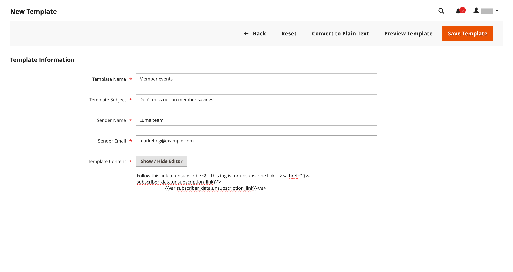

# 新闻稿模板

您可以根据不同目的创建所需数量的新闻稿模板。 您可以发送每周产品更新、每月新闻稿或年度假日新闻稿。 新闻稿模板可以使用HTML标记或纯文本进行准备。 与HTML不同，纯文本新闻稿不包含图像、富文本或格式化的链接。 在网格中，“模板类型”列指示模板是HTML还是文本。

{width="700" zoomable="yes"}

## 创建新闻稿模板

1. 在管理员侧边栏上，转到&#x200B;**[!UICONTROL Marketing]** > _[!UICONTROL Communications]_>**[!UICONTROL Newsletter Template]**。

1. 要添加模板，请单击&#x200B;**[!UICONTROL Add New Template]**。

1. 完成模板设置：

   - 对于&#x200B;**[!UICONTROL Template Name]**，输入内部引用的名称。

   - 对于&#x200B;**[!UICONTROL Template Subject]**，描述新闻稿的用途。

   - 对于&#x200B;**[!UICONTROL Sender Name]**，请输入要作为新闻稿发送者显示的人员姓名。

   - 对于&#x200B;**[!UICONTROL Sender Email]**，输入新闻稿发件人的电子邮件地址。

   {width="600" zoomable="yes"}

   - 对于&#x200B;**[!UICONTROL Template Content]**，单击&#x200B;**[!UICONTROL Show / Hide Editor]**&#x200B;以显示WYSIWYG编辑器并根据需要更新内容。

     若要了解详细信息，请参阅[使用编辑器](../content-design/editor.md)。

     >[!NOTE]
     >
     >请勿删除模板内容底部的取消订阅链接。 在某些司法管辖区，法律要求建立链接。

   - 对于&#x200B;**[!UICONTROL Template Styles]**，输入格式化内容所需的CSS声明。

1. 单击&#x200B;**[!UICONTROL Preview Template]**&#x200B;查看其外观并进行任何所需的更改。

1. 完成后，单击&#x200B;**[!UICONTROL Save Template]**。

   保存模板后，下次编辑模板时将会显示&#x200B;**[!UICONTROL Save As]**。 它可以用于保存模板的变体而不覆盖原始变体。

## 将模板转换为纯文本

1. 在页面顶部，单击&#x200B;**[!UICONTROL Convert to Plain Text]**，然后在出现提示时单击&#x200B;**[!UICONTROL OK]**。

1. 要预览模板的纯文本版本，请单击&#x200B;**[!UICONTROL Preview Template]**。

   预览将在新的浏览器选项卡中打开。

1. 要保存纯文本版本，请单击&#x200B;**[!UICONTROL Save Template]**。

## 恢复HTML

1. 在页面顶部，单击&#x200B;**[!UICONTROL Return HTML Version]**。  

1. 要预览模板的HTML版本，请单击&#x200B;**[!UICONTROL Preview Template]**。

   预览将在新的浏览器选项卡中打开。

1. 要保存HTML版本，请单击&#x200B;**[!UICONTROL Save Template]**。

## 删除新闻稿模板

1. 在&#x200B;_管理员_&#x200B;侧边栏上，转到&#x200B;**[!UICONTROL Marketing]** > _[!UICONTROL Communications]_>**[!UICONTROL Newsletter Template]**。

1. 找到要删除的新闻稿模板，然后在编辑模式下打开它。

1. 在菜单栏中，单击&#x200B;**[!UICONTROL Delete Template]**&#x200B;按钮。

1. 要确认操作，请单击&#x200B;**[!UICONTROL OK]**。

## 网格列

| 列 | 描述 |
|--- |--- |
| [!UICONTROL ID] | 分配给每个新闻稿模板的唯一数字标识符 |
| [!UICONTROL Template] | 模板实体的名称 |
| [!UICONTROL Added] | 创建模板实体的日期 |
| [!UICONTROL Updated] | 上次更新模板实体的日期 |
| [!UICONTROL Subject] | 新闻稿模板的主题 |
| [!UICONTROL Sender] | 发件人的联系信息 |
| [!UICONTROL Template Type] | 模板类型： `html`或`text` |
| [!UICONTROL Actions] | **[!UICONTROL Preview]**：打开单独的窗口以预览模板&#x200B; **[!UICONTROL Queue Newsletter]**：将新闻稿模板放入发送队列。 |

{style="table-layout:auto"}
