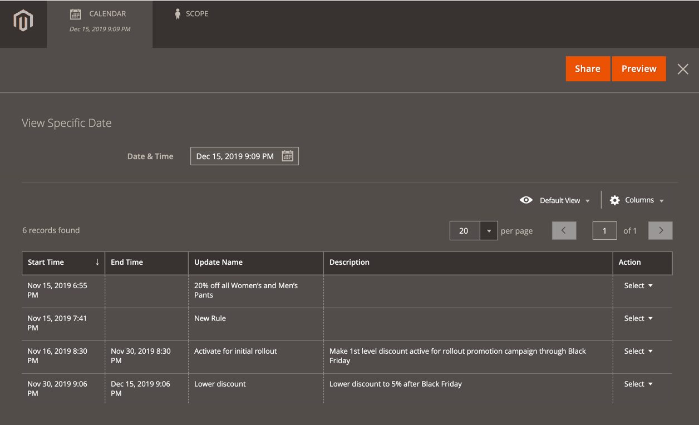

# 目录价格规则的计划更改

{{ee-feature}}

保存或更新新价格规则后，“计划的更改”框将显示在页面顶部。 目录价格规则可以按计划作为促销活动的一部分应用，并与其他内容更改一起分组。 您可以根据对价格规则的计划更改创建促销活动，或将更改应用于现有促销活动。

{width="600" zoomable="yes"}

## 计划价格规则更新的工作方式

- 所有计划的更新将连续应用。 这意味着任何实体一次只能有一个计划更新。

- 任何计划的更新将应用于其时间范围内的所有存储视图。 因此，实体无法同时对不同存储视图进行不同的计划更新。 所有存储视图中的所有实体属性值（不受当前计划更新影响）均从默认值获取，而不是从上次计划更新获取。

- 如果在同一促销活动中运行了多个价格规则，则价格规则的“优先级”设置将确定哪条规则优先。 若要了解详细信息，请参阅[内容暂存](../content-design/content-staging.md)。

## 在特定时间结束价格规则销售

如果创建的有效价格规则没有结束日期，并且您需要在特定时间将其结束，则无法编辑现有的计划更新来添加结束日期。 相反，您必须创建一个新的计划更新，以将规则状态更改为`Inactive`。 将此新更新的开始日期设置为希望销售结束的日期和时间。

## 计划目录价格规则的更新

1. 在&#x200B;_管理员_&#x200B;侧边栏上，转到&#x200B;**[!UICONTROL Marketing]** > _[!UICONTROL Promotions]_>**目录价格规则**。

1. 在编辑模式下打开规则。

1. 在页面顶部的&#x200B;**[!UICONTROL Scheduled Changes]**&#x200B;框中，单击&#x200B;**[!UICONTROL Schedule New Update]**。

1. 选择&#x200B;**[!UICONTROL Save as a New Update]**&#x200B;选项后，执行以下操作：

   - 对于&#x200B;**[!UICONTROL Update Name]**，输入规则更新的名称。

   - 输入更新的&#x200B;**[!UICONTROL Description]**&#x200B;摘要，包括应用它的方式或原因。

   - 使用&#x200B;_日历_ （）选择使计划更改生效的&#x200B;**[!DNL Start Date]**&#x200B;和&#x200B;**[!UICONTROL End Date]**。 要创建开放更改，请将结束日期留空。

   {width="600" zoomable="yes"}

   >[!NOTE]
   >
   >开始和结束日期/时间由默认的管理员面板日期/时间和时区决定，而不是由特定网站的时区决定。 考虑网站的时区，以正确确定开始和结束时间。 为位于不同时区、需要在特定本地时间启动和/或停止的网站创建单独的规则。

1. 向下滚动到&#x200B;**[!UICONTROL Rule Information]**&#x200B;部分，并根据需要更改规则。

   您可以计划更改任何规则参数，包括规则的网站（范围）/客户组、规则的条件和规则应用的操作。 有关详细信息，请参阅[创建目录价格规则](price-rules-catalog-create.md)。

   >[!NOTE]
   >
   >无论何时更新任何规则信息参数，都应确保&#x200B;_[!UICONTROL Status]_&#x200B;设置正确。 如果您希望更改产生一个主动应用的规则，请将状态设置为`Active`。

1. 完成后，单击&#x200B;**[!UICONTROL Save]**。

   计划的更改将显示在页面顶部，其中包含营销活动的开始和结束日期。

## 编辑计划的规则更改

>[!NOTE]
>
>如果促销活动链接到多个目录价格规则，则您只能从[内容暂存仪表板](../content-design/content-staging-dashboard.md)中编辑促销活动。

1. 在页面顶部的&#x200B;**[!UICONTROL Scheduled Changes]**&#x200B;框中，单击&#x200B;**[!UICONTROL View/Edit]**。

1. 对计划更新进行任何必要的更改。

1. 单击&#x200B;**[!UICONTROL Save]**。

## 预览计划的规则更改

1. 在页面顶部的&#x200B;**[!UICONTROL Scheduled Changes]**&#x200B;框中，单击&#x200B;**[!UICONTROL Preview]**。

   预览会打开一个新的浏览器选项卡，加载应用了计划更改的店面。 导航到受更改影响的产品。

   {width="600" zoomable="yes"}

1. 在“预览”窗口的左上角，单击&#x200B;**[!UICONTROL Calendar]**。

   日历详细信息显示安排在同一天举行的其他营销活动。 列表中的每条记录都是一个单独的规则更新。

   {width="600" zoomable="yes"}

1. 要预览其他日期或时间，请单击&#x200B;**[!UICONTROL Date & Time]**&#x200B;日历并执行以下操作：

   - 选择其他日期和/或时间。

   - 单击&#x200B;**[!UICONTROL Preview]**。

1. 要返回到日历，请单击“预览”页标题中的&#x200B;**[!UICONTROL Calendar]**。

   在此，您可以执行以下操作：

   **共享指向预览的链接**

   要与其他管理员用户共享指向商店预览的链接，请单击&#x200B;**[!UICONTROL Share]**。 将链接复制到剪贴板并将其粘贴到电子邮件正文中。

   >[!NOTE]
   >
   >如果您的[角色具有管理管理员用户帐户的访问权限](../systems/permissions-user-roles.md)，则您可以创建或更新具有管理员权限的现有用户帐户，以便您可以共享预览链接。

   **更改预览范围**

   要查看不同商店视图的计划更改，请单击“预览”页面标题中的&#x200B;**[!UICONTROL Scope]**。 选择要预览的网站、商店或商店视图。

1. 如有必要，请返回日历并单击&#x200B;**[!UICONTROL View/Edit]**&#x200B;列中的&#x200B;_[!UICONTROL Action]_&#x200B;以打开另一个计划更新。
