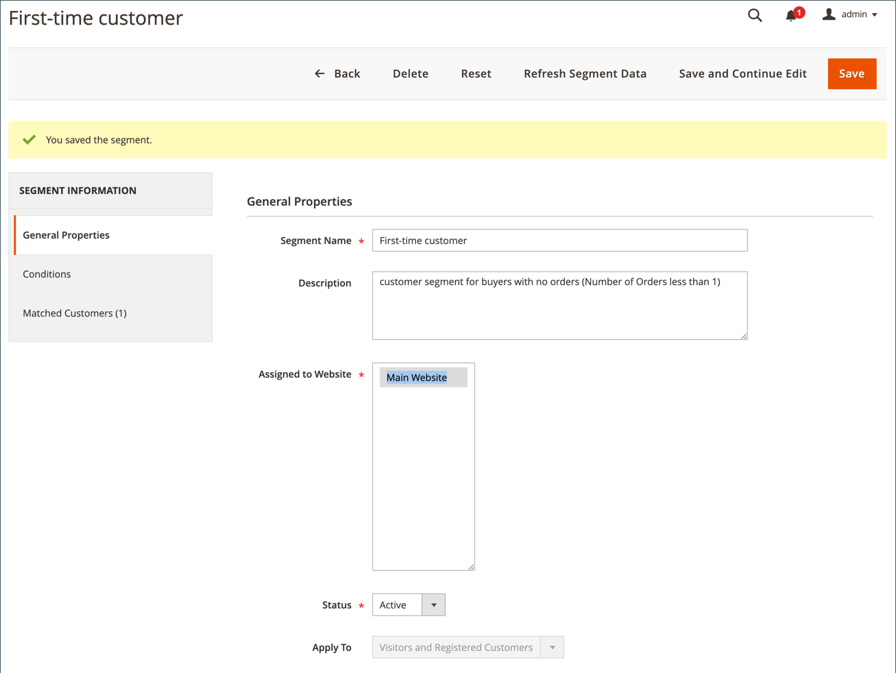

# 购物车价格规则示例 — 首次购买的折扣

{{ee-feature}}

购物车价格规则可用于在客户首次购买时自动为他们提供折扣，而无需赠券。

要提供面向首次客户的折扣，您可以：

- 创建定义为 _没有订单的买家_，然后
- 创建定位新客户区段的购物车价格规则。

>[!NOTE]
>
>确保已启用客户区段功能。 请参阅 [创建客户区段](../customers/customer-segment-create.md).

## 步骤1. 创建客户区段

1. 在 _管理员_ 侧栏，转到 **[!UICONTROL Customers]** > **[!UICONTROL Segments]**.

1. 在右上角，单击 **[!UICONTROL Add Segment]**.

1. 定义 **[!UICONTROL General Properties]**.

   - 输入 **[!UICONTROL Segment Name]** 以识别客户区段(例如： _首次客户_)。

   - 对象 **[!UICONTROL Assigned to Website]**，选择可在其中使用客户区段的网站。

   - 对象 **[!UICONTROL Status]**，选择 `Active`.

   - 对象 **[!UICONTROL Apply to]**，选择 `Visitors and Registered Customers`.

   - 完成后，单击 **[!UICONTROL Save and Continue Edit]**.

     左侧面板中提供了其他选项。

   {width="600" zoomable="yes"}

1. 定义 **[!UICONTROL Conditions]**.

   在本例中，条件定位的客户 _订单总数小于1_ 为真。

   - 在左侧的面板中，选择 **[!UICONTROL Conditions]**.

     默认条件开始于“如果所有这些条件均为TRUE：”

   - 单击 _添加_ ()并选择 `Number of Orders`.

   - 单击 **[!UICONTROL is]** 并选择 `less than`.

   - 单击 **...** 并输入 `1` 在字段中。

   - 单击绿色复选标记(  )以保存条件设置。

   {width="600" zoomable="yes"}

1. 单击 **[!UICONTROL Save]**.

客户区段创建并显示在 _[!UICONTROL Customer Segments]_网格。

>[!TIP]
>
>记下区段ID。 您可以使用此ID号创建购物车价格规则。

## 步骤2. 创建购物车价格规则

1. 在 _管理员_ 侧栏，转到 **[!UICONTROL Marketing]** > _[!UICONTROL Promotions]_>**[!UICONTROL Cart Price Rule]**.

1. 在右上角，单击 **[!UICONTROL Add New Rule]**.

   此 **[!UICONTROL Rule Information]** 默认情况下，将显示部分，其中包含可展开的部分 **[!UICONTROL Conditions]** 和 **[!UICONTROL Conditions]**.

1. 定义 **[!UICONTROL Rule Information]**.

   - 完成 **[!UICONTROL Rule Name]** 和 **[!UICONTROL Description]** 字段。 这些字段仅供内部参考。

   - 对象 **[!UICONTROL Websites]**，选择要提供规则的网站。

   - 对象 **[!UICONTROL Customer Groups]**，选择将应用此规则的客户组。

     要选择多个组，请按住Ctrl键(PC)或Command键(Mac)并单击每个选项。

     >[!NOTE]
     >
     >此列表中的选项取决于在中创建和管理的客户组 **[!UICONTROL Customers]** > **[!UICONTROL Customer Groups]**.

   - 对象 **[!UICONTROL Coupon]**，选择 `No Coupon`.

   - 对象 **[!UICONTROL Uses per Customer]**，输入 `1`.

   - 对象 **[!UICONTROL Priority]**，输入一个数字以建立此规则相对于其他规则的优先级。

     >[!NOTE]
     >
     >当同一目录产品满足为多个价格规则设置的条件时，优先级设置非常重要。 具有最高优先级设置的规则将针对客户激活。 最高优先级为1。 在本例中，输入 `1` 表示此规则先于任何其他价格规则应用。 此值由 **[!UICONTROL Discard Subsequent Rules]** 在中设置 **[!UICONTROL Action]** 部分。

   - 完成后，单击 **[!UICONTROL Save and Continue Edit]**.

     左侧面板中提供了其他选项。

   {width="600" zoomable="yes"}

1. 定义 **[!UICONTROL Conditions]**.

   - 向下滚动并展开  该 **[!UICONTROL Conditions]** 部分。

     默认规则开始于“如果所有这些条件都为TRUE：”。

   - 单击 _添加_ ()并选择 `Customer Segment`.

     限定符字段默认为 `matches`.

   - 单击 **...** 并输入要定位的客户段的段标识。

     在本例中，在步骤1中创建的新区段的区段ID为 `2`.

     >[!NOTE]
     >
     >如果您不知道区段ID，请单击选择器图标(  )以显示“客户区段”列表。 您可以在字段中手动输入ID，或选中所需区段的复选框以自动填充该字段。

   - 单击绿色复选标记(  )以保存条件设置。

   - 完成后，单击 **[!UICONTROL Save and Continue Edit]**.

     此规则行适用于匹配客户区段ID 2的所有客户。

   {width="400"}

1. 向下滚动并展开 该 **[!UICONTROL Conditions]** 部分，并定义规则的操作。

   在此部分中，您可以定义要用于首次客户的折扣类型和折扣值/金额。 此示例为所有满足定义的条件的客户定义了10%的折扣。 有关其他可用选项的信息，请参阅 [创建购物车价格规则](price-rules-cart-create.md).

   - 对象 **[!UICONTROL Apply]**，选择产品价格折扣的百分比。

   - 对象 **[!UICONTROL Discount Amount]**，输入 `10`.

   - 要仅将此价格规则应用于产品金额，请设置 **[!UICONTROL Apply to Shipping Amount]** 到 `No`.

   - 要防止系统将多个价格规则应用于同一产品，请设置 **[!UICONTROL Discard Subsequent Rules]** 到 `Yes`.

   - 完成后，单击 **[!UICONTROL Save]**.

   {width="600" zoomable="yes"}

新规则通常在一小时内可用。 测试规则以确保它按您定义的规则工作。

## 步骤3：保存并测试规则

{{new-price-rule}}

1. 规则完成后，单击 **[!UICONTROL Save Rule]**.

1. 测试规则以确保其正常工作。
