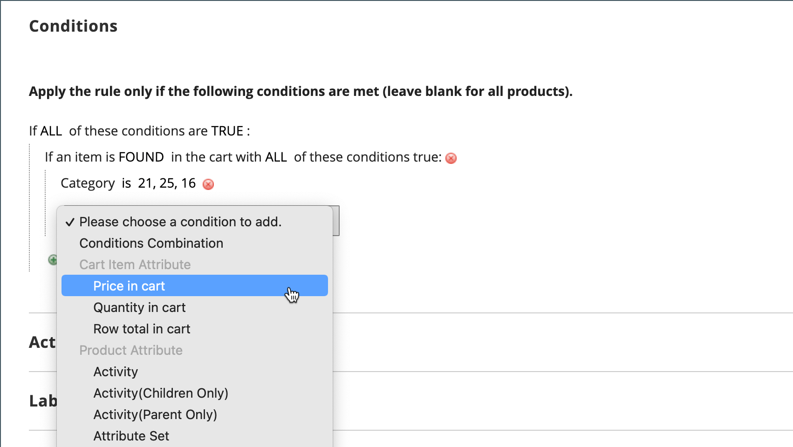

# 购物车价格规则示例 — 具有最低产品价格的折扣

可使用购物车价格规则根据购物车中的最低产品价格提供百分比折扣。 在以下示例中，当至少将一个指定类别中价格超过$30.00的产品添加到购物车时，会将10%的折扣应用于整个购物车中的所有产品。 折扣格式如下：

当至少1件产品来自Y类别时，可享有X%的购物车折扣，且价格超过Z美元。

## 步骤1. 创建购物车规则

按照基本[说明](price-rules-cart.md)创建购物车规则。

## 步骤2. 定义条件

1. 向下滚动并展开&#x200B;**[!UICONTROL Conditions]**&#x200B;部分的。

1. 单击&#x200B;_添加_ （）并选择&#x200B;**[!UICONTROL Product Attribute Combination]**。

   {width="500" zoomable="yes"}

1. 单击下一行开头的&#x200B;_添加_ （），然后在&#x200B;**[!UICONTROL Product Attribute]**&#x200B;下的列表中选择&#x200B;**[!UICONTROL Category]**。

   - 单击(**...**) _更多_&#x200B;链接以显示其他选项。

     {width="600" zoomable="yes"}

   - 单击&#x200B;_选择器_ （）图标查看可用的类别。 在类别树中，选中要包含的每个类别的复选框。 单击复选图标接受类别选择。

     {width="600" zoomable="yes"}

1. 单击下一行开头的&#x200B;_添加_ （）并执行以下操作：

   - 在&#x200B;**[!UICONTROL Cart Item Attribute]**&#x200B;下的列表中，选择&#x200B;**[!UICONTROL Price in cart]**。

     {width="500"}

   - 单击&#x200B;**是**&#x200B;并选择`equals or greater than`。

   - 单击&#x200B;**...**&#x200B;并输入购物车中的价格必须符合此条件的金额。 例如，输入`30`。

     {width="500"}

1. 单击&#x200B;**[!UICONTROL Save and Continue Edit]**。

## 步骤3. 定义操作

1. 展开&#x200B;**[!UICONTROL Actions]**&#x200B;部分中的并执行以下操作：

   {width="600" zoomable="yes"}

   - 将&#x200B;**[!UICONTROL Apply]**&#x200B;设置为`Percent of product price discount`。

   - 输入&#x200B;**[!UICONTROL Discount Amount]**。 例如，输入`10`获得10%的折扣。

   - 要阻止将其他促销活动应用于购买，请将&#x200B;**[!UICONTROL Discard subsequent rules]**&#x200B;设置为`Yes`。

1. 单击&#x200B;**[!UICONTROL Save and Continue Edit]**&#x200B;并根据需要完成规则。

## 步骤4. 完成标签

完成购物车价格规则说明的[第4](price-rules-cart.md)步，以输入结帐期间出现的任何标签。

## 步骤5：保存并测试规则

{{new-price-rule}}

1. 规则完成后，单击&#x200B;**[!UICONTROL Save Rule]**。
1. 测试规则以确保其正常工作。
