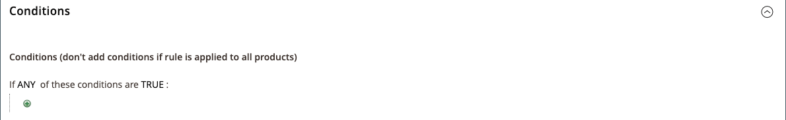

# 具有多个SKU的目录价格规则

单个目录价格规则可应用于多个SKU，这使得根据产品、品牌或类别创建各种促销活动成为可能。 创建此规则时，您需要设置与所选SKU匹配的条件。 在构建规则时，您可以轻松地浏览并从网格中选择SKU。

## 步骤1. 验证产品属性的店面属性

在开始之前，请确保 [店面属性](../catalog/attribute-product-create.md#step-4-describe-the-storefront-properties) 的 `sku` 属性设置为 `Use in Promo Rules`.

1. 在 _管理员_ 侧栏，转到 **[!UICONTROL Stores]** > _[!UICONTROL Attributes]_>**[!UICONTROL Product]**.

1. 在顶部的搜索筛选器中 _[!UICONTROL Attribute Code]_列，输入 `sku` 并单击&#x200B;**[!UICONTROL Search]**.

1. 单击以打开 `sku` 编辑模式下的属性。

1. 在左侧面板中，单击 **[!UICONTROL Storefront Properties]** 并确保 **[!UICONTROL Use for Promo Rule Conditions]** 设置为 `Yes`.

1. 如果更改了属性的值，请单击 **[!UICONTROL Save Attribute]**.

## 步骤2. 将价格规则应用于多个SKU

1. 在 _管理员_ 侧栏，转到 **[!UICONTROL Marketing]** > _[!UICONTROL Promotions]_>**[!UICONTROL Catalog Price Rules]**.

1. 执行以下操作之一：

   - 按照说明创建 [目录价格规则](price-rules-catalog.md).
   - 打开现有的目录价格规则。

1. 展开  该 **[!UICONTROL Conditions]** 部分，并执行以下操作：

   - 在第一行中，将第一个参数设置为 `ANY`.

     {width="600" zoomable="yes"}

   - 单击 _添加_ ()的行首，并在下的列表中 **[!UICONTROL Product Attribute]**，单击 `SKU`.

     {width="600" zoomable="yes"}

   - 要进行比较，您可以选择以下选项。 如果要从SKU列表中至少查找一个， `select is one of`. 如果要查找必须找到所有要应用的SKU组，请选择 `is`. 我们建议选择 `is one of`.

     {width="600" zoomable="yes"}

   - 要完成条件，请单击更多(**...**)链接，然后单击 _选择器_ ()图标。

     {width="600" zoomable="yes"}

   - 浏览、过滤或搜索以查找要添加的SKU。 在列表中，选中要包含的每个产品的复选框。

   - 单击 **[!UICONTROL Save and Apply]** 以将SKU添加到条件。

     {width="600" zoomable="yes"}

1. 完成规则，包括任何 [操作](price-rules-catalog.md) 条件达成时采取。

1. 规则完成后，单击 **[!UICONTROL Save]**.

{{new-price-rule}}
