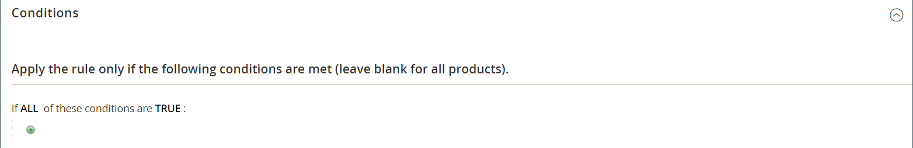

# 购物车价格规则示例 — 购买此项即可获得

此示例说明如何设置 [购物车价格规则](price-rules-cart.md) 对于 _买这个，免费_ 提升。 折扣格式如下：

_购买X数量的产品，免费获取Y数量_

## 步骤1. 创建购物车价格规则

完成 [步骤1](price-rules-cart.md) ，以完成规则信息。

## 步骤2. 定义条件

完成 [步骤2](price-rules-cart.md) ，以定义价格规则的条件。 这是可以添加到规则的两个条件中的第一个，用于确定何时触发规则。 它可以基于以下各项的组合：

- 产品属性
- 产品
- 购物车属性
-  (仅限Adobe Commerce)客户区段

如果留空，则会为每个购物车触发规则。

{width="600" zoomable="yes"}

## 步骤3. 定义操作

1. 展开  该 **[!UICONTROL Actions]** 部分并执行以下操作：

   - 设置 **[!UICONTROL Apply]** 到 `Buy X get Y free (_[!UICONTROL _[!UICONTROL Discount Amount]_]_ is Y)`.

   - 设置 **[!UICONTROL Discount Amount]** 到 `1`. 这是客户免费收到的数量。

   - 要限制满足条件时可以应用的折扣数，请在 **[!UICONTROL Maximum Qty Discount is Applied To]** 字段。 此值使用以下方式计算 [公式](#maximum-quantity-discount).

   - 对象 **[!UICONTROL Discount Qty Step (Buy X)]**，输入客户必须购买才能获得折扣的数量。 在本例中，客户必须购买三件。

   - 如果要阻止将其他折扣应用于购买，请设置 **[!UICONTROL Discard subsequent rules]** 到 `Yes`.

   {width="600" zoomable="yes"}

1. 要仅将规则应用于购物车中的特定项目，请完成条件以描述促销所需的购物车项目和/或产品属性。

   以下示例使用SKU将规则应用于可配置产品的所有关联变体。

   {width="600" zoomable="yes"}

1. 要包含 **[!UICONTROL Free Shipping]**，选择 `For matching items only`.

1. 单击 **[!UICONTROL Save and Continue Edit]** 并根据需要完成规则的其余部分。

## 步骤4. 填写标签

完成 [步骤4](price-rules-cart.md) ，以输入结帐期间显示的标签。

## 步骤5：保存并测试规则

{{new-price-rule}}

1. 规则完成后，单击 **[!UICONTROL Save Rule]**.

1. 测试规则以确保其正常工作。

## 变体

购买X获取Y免费作为单次操作处理，使用 _行总计_ 依赖关系。 所有项目都必须来自同一SKU，才符合促销资格。 例如：

从类别A购买X数量的产品，免费获取相同产品的Y数量。

要将自由产品限制在类别A、B和C，请按如下方式设置操作：

如果所有这些条件都为TRUE：类别是A、B、C之一

要限制任何类别（A、B或C）的免费项目并从SKU（D123、E123或F123）接收Y，请设置如下操作：

如果所有这些条件都成立：SKU是D123、E123、F123之一

## 最大数量折扣

使用以下公式可确定“最大数量折扣”的正确值：

公式= `(X+Y) * (M/Y)`
位置
`X` =购买的项目数
`Y` =空闲项目数
`M` =允许的最大空闲项目数

例如：

购买五件物品可免费购买两件，最多允许购买四件物品。

    位置
    X = 5
    Y = 2
    M = 4
    最大数量折扣= (5+2)*(4/2)=(7)*(2)=14

购买五件物品，免费购买三件，最多允许九件物品。

    位置
    X = 5
    Y = 3
    M = 9
    最大数量折扣= (5+3)*(9/3)=24

20件可免费购买2件，最多允许20件免费商品。

    位置
    X = 20
    Y = 2
    M = 20
    最大数量折扣= (20+2)*(20/2)=(22)*(10)=220
