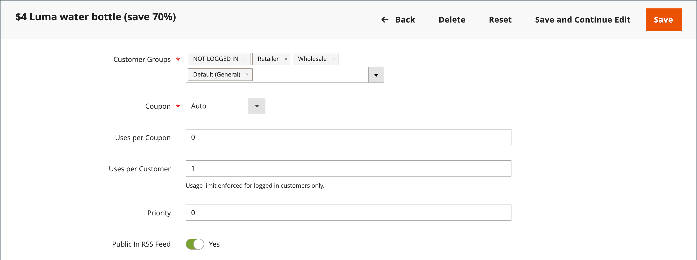

# 优惠券代码

优惠券代码用于 [购物车价格规则](price-rules-cart.md) ，以便在满足一组条件时应用折扣。 例如，可以为特定客户组或购买超过一定金额的客户创建优惠券代码。 要将优惠券用于购买，客户可以在购物车中输入优惠券代码，或者在贵机构的收银机中输入此代码。 _砖和砂浆_ 商店。 以下是一些可在商店中使用优惠券的方法：

- 通过电子邮件向客户发送优惠券
- 生成打印的优惠券
- 为移动用户创建店内优惠券

优惠券代码可以通过电子邮件发送，或包含在新闻稿、目录和广告中。 优惠券代码的列表可以导出并发送到商业打印机。 你还可以使用快速响应代码创建店内优惠券，购物者可以用智能手机扫描这些优惠券。 二维码可链接到您网站上的一个页面，其中包含有关促销活动的更多信息。

从Commerce 2.4.7开始，购物者可以向购物车应用多个优惠券。 商家还可以使用购物辅助申请多张优惠券。

## 配置优惠券代码

自动生成的优惠券代码的长度和格式由配置控制。 字符可以设置为所有数字、所有字母或组合。 您可以按设置的间隔插入短划线以方便阅读，还可以添加前缀和后缀以将代码与特定活动或计划关联。

1. 在 _管理员_ 侧栏，转到 **[!UICONTROL Stores]** > _[!UICONTROL Settings]_>**[!UICONTROL Configuration]**.

1. 在左侧面板中，展开 **[!UICONTROL Customers]** 并选择 **[!UICONTROL Promotions]**.

   {width="600" zoomable="yes"}

1. 展开 **[!UICONTROL Auto Generated Specific Coupon Codes]** 部分。

   {width="600" zoomable="yes"}

1. 输入 **[!UICONTROL Code Length]**，包括前缀、后缀和分隔符。

1. 设置 **[!UICONTROL Code Format]** 更改为以下任一项：

   - `Alphanumeric`
   - `Alphabetical`
   - `Numeric`

1. 对象 **[!UICONTROL Code Prefix]**，输入要显示在所有优惠券代码开头的值。

1. 对象 **[!UICONTROL Code Suffix]**，输入要显示在所有优惠券代码末尾的值。

1. 对象 **[!UICONTROL Dash Every X Characters]**，输入每个短划线之间的字符数。

   即使数字相同，具有不同短划线图案的优惠券代码也被视为不同的代码。

1. 完成后，单击 **[!UICONTROL Save Config]**.

## 创建优惠券

>[!NOTE]
>
>在创建优惠券之前，请使用 `bin/magento cron:run` 命令验证cron是否正在运行。 请参阅 [从命令行运行cron](https://experienceleague.adobe.com/docs/commerce-operations/configuration-guide/cli/configure-cron-jobs.html#run-cron-from-the-command-line) 在 _配置指南_ 以了解更多信息。

### 方法1：创建特定优惠券

1. 按照说明创建 [购物车价格规则](price-rules-cart.md).

1. 在 **[!UICONTROL Rule Information]** 部分，设置 **[!UICONTROL Coupon]** 到 `Specific Coupon`.

1. 输入 **[!UICONTROL Coupon Code]** 将与促销一起使用。

   代码的格式（数字、字母数字或字母顺序）由 [配置](#configure-coupon-codes).

1. 要限制优惠券的使用次数，请执行以下操作：

   - 输入数字 **[!UICONTROL Uses per Coupon]**.
   - 输入数字 **[!UICONTROL Uses per Customer]**.

   对于无限制使用，请将这些字段留空。

   {width="600" zoomable="yes"}

   >[!NOTE]
   >
   >如果多个客户同时使用同一优惠券，则由于优惠券处理延迟，可能会超出设置的使用量限制。

1. 要使优惠券在某个时间段内有效，请执行以下操作：

   -  (仅限Magento Open Source)完成 **从** 和 **至** 日期。 要选择日期，请单击 **日历** ()图标来填充字段。 如果将日期范围留空，则该规则不会过期。

   -  (仅限Adobe Commerce)执行以下操作之一：

     **选项1：** 计划新的更新

      - 单击 **[!UICONTROL Schedule New Update]** 在页面的右上角。

        {width="600" zoomable="yes"}

      - 输入 **[!UICONTROL Update Name]** 和 **[!UICONTROL Description]**.

      - 选择 **开始日期** 和 **[!UICONTROL End Date]** 从日历(  )。 如果将日期范围留空，则该规则不会过期。

      - 完成后，单击 **[!UICONTROL Save]**.

        {width="600" zoomable="yes"}

     **选项2：** 分配给现有更新：

      - 选择 **[!UICONTROL Assign to Another Update]**.

      - 在列表中查找更新，然后单击 **[!UICONTROL Select]**.

1. 完成 [购物车价格规则](price-rules-cart.md) 根据需要。

### 方法2：生成优惠券批次

生成折扣券是一个异步操作，它将在后台执行，这样您就可以继续在Admin中工作而不需要等待操作完成。 任务完成后，系统将显示一条消息。

1. 按照说明创建 [购物车价格规则](price-rules-cart.md).

1. 下 **[!UICONTROL Coupon Code]**，选择 **[!UICONTROL Use Auto Generation]** 复选框。

1. 要限制每位客户可使用优惠券的次数，请输入 **[!UICONTROL Uses per Customer]**.

   {width="600" zoomable="yes"}

   >[!NOTE]
   >
   >如果多个客户同时使用同一优惠券，则由于优惠券处理延迟，可能会超出设置的使用量限制。

1. 向下滚动并展开  该 **[!UICONTROL Manage Coupon Codes]** 部分并执行以下操作：

   {width="600" zoomable="yes"}

   - 对象 **[!UICONTROL Coupons Qty]**，输入要生成的优惠券的编号。

   - 输入 **[!UICONTROL Code Length]**，不包括前缀、后缀或分隔符。

   - 设置 **[!UICONTROL Code Format]** 更改为以下任一项：

      - `Alphanumeric`
      - `Alphabetical`
      - `Numeric`

   - （可选）输入 **[!UICONTROL Code Prefix]** 添加到代码的开头处。

   - （可选）输入 **[!UICONTROL Code Suffix]** ，以添加到代码的末尾。

   - （可选）对于 **[!UICONTROL Dash Every X Characters]**，输入每个短划线之间的字符数。 例如，如果代码长度为12个字符，并且每4个字符出现一个破折号，则它看起来会像 `xxxx-xxxx-xxxx`. 短划线使代码更易于阅读和输入。

1. 完成后，单击 **[!UICONTROL Generate]**.

   系统显示 `Message is added to queue, wait to get your coupons soon`.

   cron作业完成后，将显示生成的代码列表。

   | 字段 | 描述 |
   |-------------|-------------|
   | [!UICONTROL Coupon Code] | 已创建且可用于接收特殊条件的唯一优惠券代码。 |
   | [!UICONTROL Created] | 创建优惠券代码的日期。 |
   | [!UICONTROL Used] | 指示是否使用了优惠券。 |
   | [!UICONTROL Times Used] | 指示使用优惠券代码的次数。 |

   {style="table-layout:auto"}

通过选择文件格式并单击 **[!UICONTROL Export]**.

要删除优惠券代码，请从列表中选择一个或多个代码。 选择 `Delete` 从 **[!UICONTROL Actions]**  选择器，然后单击 **[!UICONTROL Submit]**.

>[!NOTE]
>
>尽管Commerce允许配置多个优惠券代码，但客户在购物车中只能使用一个优惠券代码。 要允许在购物车中同时使用多个优惠券代码，您可以考虑使用来自的相应扩展 [Commerce Marketplace](https://marketplace.magento.com/).

## 优惠券报告

此 _优惠券_ 报告汇总特定日期范围内使用的每个优惠券的数据。 由于优惠券是从购物车中应用的，因此报表包含所有已兑换优惠券的数据，而不考虑来自哪些优惠券的数据 [订单状态](../stores-purchase/order-status.md). 因此，报告可能包括预计总数和实际总数。 可以针对特定的商店视图、时段、订单状态和购物车价格规则对报表进行过滤。

在以下示例中，两个客户使用了优惠券代码“H20”。 其中一个订单已开票，但另一个订单仍未开票 _待处理_. “预计销售小计”、“销售折扣”和“销售合计”列显示两个订单的合计金额，但“小计”、“折扣”和“合计”列中只显示实际开票订单。 报表中的每一行表示一个优惠券促销活动。

{width="600" zoomable="yes"}

### 运行报告

1. 在 _管理员_ 侧栏，转到 **[!UICONTROL Reports]** > _[!UICONTROL Sales]_>**[!UICONTROL Coupons]**.

1. 如果您有多个商店视图，请设置 **[!DNL Store View]** 以建立报表的范围。

1. 刷新销售 [statistics](../getting-started/sales-reports.md#refresh-statistics) 在当天单击 _上次更新时间_ 工作区顶部的消息。

   接下来，单击以选择 **[!UICONTROL Coupons]** 复选框，然后单击 **[!UICONTROL Refresh]**.

   {width="600" zoomable="yes"}

1. 要筛选数据，请执行以下操作：

   {width="600" zoomable="yes"}

   - 设置 **[!UICONTROL Date Used]** 更改为以下任一项：

      - `Order Created`
      - `Order Updated`

     此 _已更新订单_ 报告是实时创建的，不需要刷新。

   - 要定义报告涵盖的时间段，请设置 **[!UICONTROL Period]** 更改为以下任一项：

      - `Day`
      - `Month`
      - `Year`

   - 要定义报表的日期范围，请输入 **从** 和 **至** 日期（M/D/YY格式）。

   - 打印特定报表 [订单状态](../stores-purchase/order-status.md)，设置 **[!UICONTROL Order Status]** 到 `Specified` 并从列表中选择订单状态。

   - 要忽略报表中无数据的行，请设置 **[!UICONTROL Empty Rows]** 到 `No`.

   - 要定义报表中包含的优惠券活动，请执行下列操作之一：

      - 要包括所有价格规则中的所有优惠券活动，请设置 **[!UICONTROL Cart Price Rule]** 到 `Any`.
      - 要仅包括与特定价格规则相关的活动，请设置 **[!UICONTROL Cart Price Rule]** 到 `Specified` 并在列表中选择购物车价格规则。

1. 准备运行报告时，单击 **[!UICONTROL Show Report]**.

   报告将显示在页面底部。

### 筛选器选项

| 字段 | 描述 |
|--- |--- |
| [!UICONTROL Date Used] | 标识用作报表基础的日期字段。 选项： **[!UICONTROL Order Created]**：根据客户下达订单的日期生成报表。 要确保包含最新数据，请单击消息中的链接以刷新统计信息。 **[!UICONTROL Order Updated]**：根据上次更新订单的日期生成报表。 此报表使用实时数据，不需要刷新统计数据。 |
| [!UICONTROL Period] | 确定用于报表的日期范围类型。 选项： `Day` / `Month` / `Year` |
| [!UICONTROL From] | 指示报表中包含的订单数据范围内的第一个日期。 |
| [!UICONTROL To] | 指示报表中包含的订单数据范围中的最后日期。 |
| [!UICONTROL Order Status] | 按订单状态筛选报表。 可以为所有订单生成报表，也可以将报表限制为特定订单状态。 选项：  **[!UICONTROL Any]**：包含所有订单，不考虑状态。 **[!UICONTROL Specified]**：仅包含具有指定状态的订单。 报表中不包括已取消的订单。 |
| [!UICONTROL Empty Rows] | 确定报表是否包含可能检索到的任何空数据行。 选项： `Yes` / `No` |
| [!UICONTROL Cart Price Rules] | 确定报表中包含哪些优惠券促销活动。 选项： **[!UICONTROL Any]**：包含在指定日期范围内使用的任何优惠券促销的订单信息。 **[!UICONTROL Specified]**：仅包含在指定日期范围内所选优惠券促销的订单信息。 |

{style="table-layout:auto"}

### 报表列

| 列 | 描述 |
|--- |--- |
| [!UICONTROL Interval] | 指示要包含在报表中的优惠券使用日期范围。 间隔可以是特定的日、月、年或日期范围。 间隔日期的格式如下所示，根据中设置的值 **[!UICONTROL Period]** 设置： `Day`：2019年6月21日 `Month`：2019年6月 `Year`：2019年 |
| [!UICONTROL Coupon Code] | 客户在购物车中输入的折扣代码以获取折扣。 |
| [!UICONTROL Price Rule] | 与优惠券关联的价格规则的名称。 |
| [!UICONTROL Uses] | 在为报表指定的日期范围内使用优惠券的次数。 |
| [!UICONTROL Sales Subtotal] | 与优惠券一起下达的所有订单中的预计小计。  销售小计表示所有合格订单的汇总小计，并包括 `Pending` 尚未开票的销售订单。 |
| [!UICONTROL Sales Discount] | 与优惠券一起下达的所有订单的预计折扣金额。  折扣表示所有符合条件的订单的合计折扣金额，包括 `Pending` 尚未开票的销售订单。 |
| [!UICONTROL Sales Total] | 与优惠券一起下达的所有订单的预计总计。 销售总额包括任何运费和手续费，减去折扣金额。  销售总额表示所有符合条件的订单的合计总金额，包括 `Pending` 尚未开票的销售订单。 该值包括“小计”加运费和包装费，减去“折扣”加税。   计算方式： `((Subtotal + Shipping & Handling) - Discount) + Tax` |
| [!UICONTROL Subtotal] | 所有使用优惠券的已开票订单的汇总小计。 |
| [!UICONTROL Discount] | 所有使用优惠券的已开票订单的总折扣。 |
| [!UICONTROL Total] | 使用优惠券的所有已开票订单的汇总订单合计。 |

{style="table-layout:auto"}
