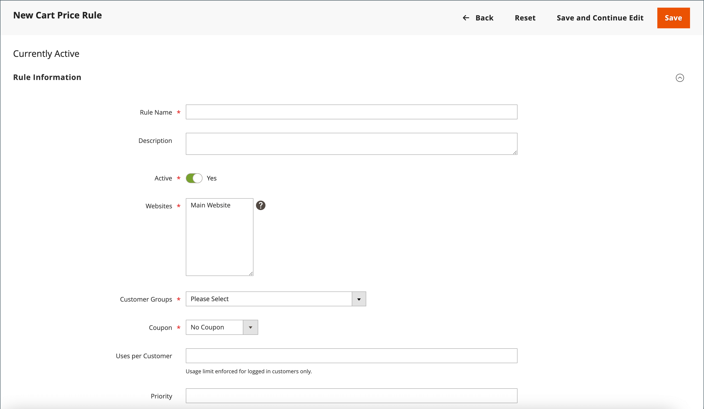
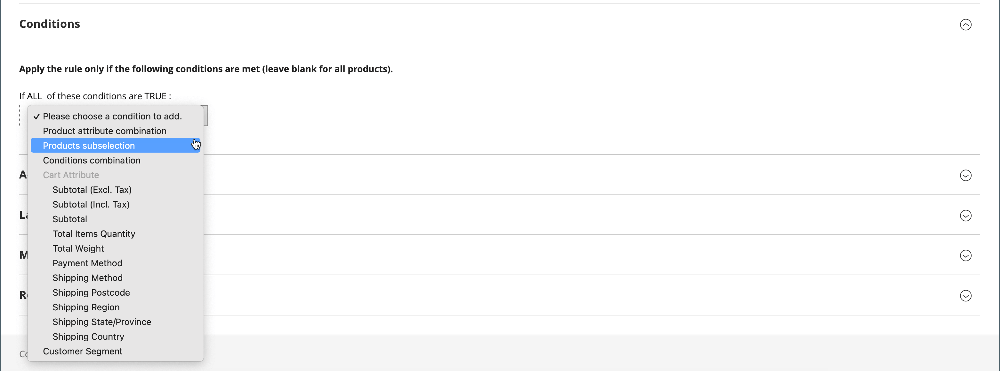
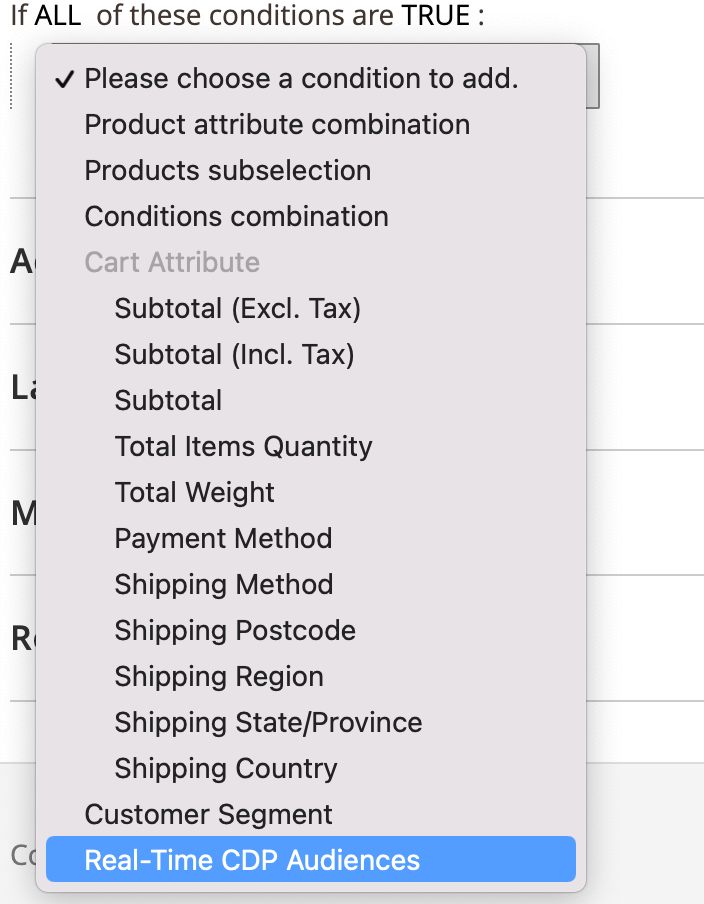
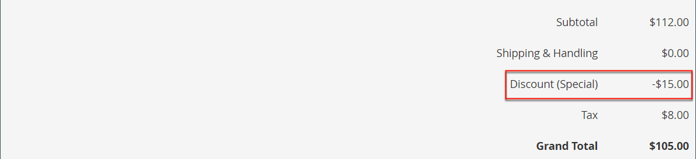
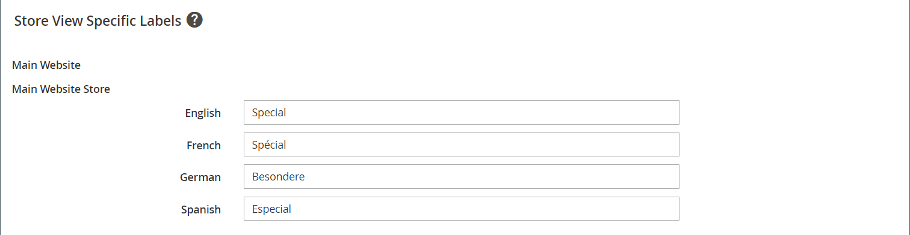

# 创建购物车价格规则

完成以下步骤以添加规则、描述条件和定义操作。 还要完成标签并测试规则。 价格规则条件可以基于购物车或 [产品属性](../catalog/product-attributes.md) 或 [Real-Time CDP受众](#use-real-time-cdp-audiences-to-set-a-condition)，但不在 [可自定义的选项](../catalog/settings-advanced-custom-options.md).

## 步骤1：添加规则

1. 在 _管理员_ 侧栏，转到 **[!UICONTROL Marketing]** > _[!UICONTROL Promotions]_>**[!UICONTROL Cart Price Rules]**.

1. 单击 **[!UICONTROL Add New Rule]** 并执行以下操作：

   - 下 _[!UICONTROL Rule Information]_，完成&#x200B;**[!UICONTROL Rule Name]**和&#x200B;**[!UICONTROL Description]**.

   - 如果不希望规则立即生效，请设置 **[!UICONTROL Active]** 到 `No`.

   {width="600" zoomable="yes"}

1. 建立 [范围](../getting-started/websites-stores-views.md#scope-settings) 在该规则中，执行以下操作：

   - 选择 **[!UICONTROL Websites]** 在促销活动可用的位置。

   - 选择 **[!UICONTROL Customer Groups]** 促销应用于的对象。

     如果您希望促销活动仅对注册客户可用， **_不要_** 选择 `NOT LOGGED IN` 选项。

1. 设置要应用的规则，无论是否有 [优惠券](price-rules-cart-coupon.md) 如下所示：

   - 要在不使用优惠券代码的情况下应用购物车规则，请设置 **[!UICONTROL Coupon]** 到 `No Coupon` 并跳至步骤5。

   - 要将优惠券与价格规则关联，请设置 **[!UICONTROL Coupon]** 到 `Specific Coupon` 并执行以下操作：

      - 输入自由文本 **[!UICONTROL Coupon Code]** 客户必须输入以接收折扣。

      - 要设置优惠券可用次数的限制，请完成以下选项：

     | 选项 | 描述 |
     |------|-----------|
     | `Uses per Coupon` | 确定优惠券代码的使用次数。 如果没有限制，请将该字段留空。 |
     | `Uses per Customer` | 确定属于任何选定客户组的同一注册客户可以使用购物车价格规则的次数。 设置不适用于属于NOT LOGGED IN客户组的访客购物者，也不适用于未登录到其帐户进行购买的客户。 如果没有限制，请将该字段留空。 |

     {style="table-layout:auto"}

     要了解更多信息，请参阅 [优惠券代码](price-rules-cart-coupon.md).

     {width="600" zoomable="yes"}

   -  (仅限Magento Open Source)使用 _日历_ ()以选择 **[!UICONTROL From]** 和 **[!UICONTROL To]** 促销的日期范围。

1. 输入一个数字以定义 **[!UICONTROL Priority]** 与同时生效的其他价格规则的“操作”设置有关的价格规则。

   >[!NOTE]
   >
   >当两个购物车规则/优惠券代码同时对同一产品有效时，优先级设置很重要。 具有最高优先级设置的规则(`1` 作为最高者)控制购物车操作。 请参阅 _放弃后续价格规则_ 在 _定义操作_ 步骤。

   >[!NOTE]
   >
   >具有相同优先级的购物车价格规则不会产生合并折扣。 每个规则逐个应用于匹配产品。

1. 要将规则应用于已发布，请执行以下操作 [RSS源](social-rss.md#rss-feeds)，设置 **在RSS信息源中公开** 到 `Yes`.

1. 单击 **[!UICONTROL Save and Continue Edit]**.

   -  (仅限Magento Open Source)保存规则后，购物车价格规则的名称将显示在页面顶部。

   -  (仅限Adobe Commerce)保存规则后，购物车价格规则的名称和 [计划的更改](price-rule-cart-scheduled-changes.md) 框显示在页面顶部。

     {width="600" zoomable="yes"}

## 第2步：描述条件

在此步骤中，将说明订单必须符合哪些条件才能获得促销资格。 当满足一组条件时，该规则将执行操作。

如果您使用的是Real-Time CDP中的受众，请跳至 [本节](#use-real-time-cdp-audiences-to-set-a-condition).

>[!NOTE]
>
>购物车价格规则应用于 **_每个_** 购物车中的产品 _[!UICONTROL Conditions]_符合选项卡。 在中添加条件_[!UICONTROL Actions]_ 选项卡以限制受购物车价格规则影响的产品数量。

>[!NOTE]
>
>如果至少一个条件产品属性的值为空，则购物车价格规则不适用于该产品。

1. 在左侧面板中，选择 **[!UICONTROL Conditions]**.

   {width="600" zoomable="yes"}

   默认情况下，将显示第一个条件，其状态为：

   `If **ALL** of these conditions are **TRUE**:`

   语句有两个粗体链接，单击这两个链接可显示语句该部分的选项选择。 您可以通过更改这些值的组合来创建不同的条件。 执行以下任一操作：

   - 单击 **[!UICONTROL ALL]** 并选择 `ALL` 或 `ANY`.
   - 单击 **[!UICONTROL TRUE]** 并选择 `TRUE` 或 `FALSE`.
   - 保持不变，以将规则应用于所有产品。

1. 单击 _添加_ ()的开头，为该条件选择一个选项，例如购物车属性、产品细选或组合。

   对于此示例，请完成条件的下一部分，如下所示：

   - 提示时 **[!UICONTROL Choose the condition to add]**，选择 `Products Subselection`.

     {width="600" zoomable="yes"}

   - 在条件语句中，单击 **[!UICONTROL total quantity]** 并选择 `total quantity` 或 `total amount`.

   >[!IMPORTANT]
   >
   >[!UICONTROL Total amount] 是行总计，因此税不包含在 `total amount` 对于 [!UICONTROL Products Subselection] 购物车价格规则条件。 使用 [!UICONTROL Subtotal (Incl. Tax)] 包括税的条件。

   - 在条件语句中，单击 **[!UICONTROL is]** 并选择 `greater than`.

1. 当条件的下一部分出现时，单击语句的元素，以便您能够查看每个带变量值的链接的位置。

1. 单击“更多”(...)链接，然后输入 `100`.

   此条件要求购物车的总数量为 `101` 或更高。

   {width="600" zoomable="yes"}

1. 单击 **添加** ()，然后添加一个基于以下条件 **类别**.

   {width="600" zoomable="yes"}

1. 在条件的下一部分，单击 _更多_ (**...**)链接以显示输入字段，然后打开 _选择器_ ()，以显示类别树。

1. 选中要用作价格规则条件的类别的复选框，然后单击  图标以接受类别选择。

   条件可以基于作为商店子项的任何类别 [根类别](../catalog/category-root.md).

   {width="600" zoomable="yes"}

1. 要添加更多条件，请单击 _添加_ ()，并定义另一个条件。

   您可以根据需要多次重复此过程，以说明价格规则必须满足的条件。 以下是一些示例：

   **示例1：** 地区价格规则

   要创建区域价格规则，请使用以下购物车属性之一：

   - `Shipping Postcode`
   - `Shipping Region`
   - `Shipping State/Province`
   - `Shipping Country`

   **示例2：** 购物车总计

   要根据购物车总数确定条件，请使用以下购物车属性之一：

   - `Subtotal`
   - `Total Items Quantity`
   - `Total Weight`

>[!NOTE]
>
>如果同时进行多个促销活动，则促销活动 _小计_ 条件应用于 _基础_ 购物车小计 **_早于_** 任何折扣。

>[!IMPORTANT]
>
>**仅适用于采购订单**：根据一个或多个特定付款方法设置购物车价格规则时，折扣将应用于创建采购订单时的总计。 创建采购订单后，如果付款方式更改为购物车价格规则未涵盖的付款方式，则折扣仍应用于合计。

### 将产品属性添加到购物车价格规则

1. 转到 **[!UICONTROL Stores]** > _[!UICONTROL Attributes]_>**[!UICONTROL Product]**并打开产品属性。

1. 在左侧面板中，选择 **[!UICONTROL Storefront Properties]**.

1. 设置 **[!UICONTROL Use for Promo Rule Conditions]** 到 `Yes`.

1. 单击 **[!UICONTROL Save Attribute]**.

1. 转到 **[!UICONTROL Marketing]** > **[!UICONTROL Cart Price Rules]** 并打开所需的购物车价格规则。

1. 展开  该 **[!UICONTROL Condition]** 部分并选择 **[!UICONTROL Product attribute combination]**.

1. 将此条件设置为以下值之一：

   - 单击 **[!UICONTROL FOUND]** 并选择 `FOUND` 或 `NOT FOUND`.

   - 单击 **[!UICONTROL ALL]** 并选择 `ALL` 或 `ANY`.

1. 单击 _添加_ ()图标，然后选择 **[!UICONTROL Product Attribute]** 您为促销规则条件设置的属性。

1. 单击 **[!UICONTROL Save]**.

>[!NOTE]
>
>使用时 `is not one of` 带有 _SKU_ 产品属性和可配置产品，必须同时选择父产品和子产品SKU。 要避免在规则中列出所有子SKU，您可以使用 `does not contain` 可配置产品及其子产品的公共SKU部件的条件。

### 使用Real-Time CDP受众设置条件

您可以为基于Real-Time CDP的购物车价格规则设置条件 [受众](../customers/audience-activation.md).

1. 展开 **[!UICONTROL Conditions]**，单击“+”图标，然后选择 **[!UICONTROL Real-Time CDP Audience]** 从名单上。

   {width="300"}

1. 选择 _更多_ (**...**)图标，单击 **[!UICONTROL Open Chooser]**，并查看所有可用的Real-Time CDP受众。

   {width="600" zoomable="yes"}

1. 选择要用于购物车价格规则的Real-Time CDP受众。

   | 选项 | 描述 |
   |------|-----------|
   | `ID` | 管理员中使用的受众的内部标识符 |
   | `Real-Time CDP Audience ID` | 在Experience Platform中创建受众时的唯一标识符 |
   | `Name` | 受众的名称，如 `Orders over $50` |
   | `Description` | 受众的描述，如 `People who placed an order over $50 in the last month.`. |
   | `Source` | 指示受众的来源，如 `Experience Platform`. |
   | `Website` | 指示您已链接到包含受众的数据流的网站。 当您通过将Commerce实例连接到Experience Platform时，将创建此链接 [[!DNL Data Connection]](https://experienceleague.adobe.com/docs/commerce-merchant-services/data-connection/fundamentals/connect-data.html) 扩展。 |

   {style="table-layout:auto"}

在下一步中，您将定义满足条件时要执行的操作。

## 步骤3：定义操作

购物车价格规则操作描述在满足条件时如何更新价格。

1. 向下滚动到 **[!UICONTROL Actions]**，并展开  部分。

   {width="600" zoomable="yes"}

1. 设置 **[!UICONTROL Apply]** 折扣选项之一：

   | 选项 | 描述 |
   |------|-----------|
   | `Percent of product price discount` | 通过从原始价格中减去百分比来折扣物料。 折扣适用于购物车中的每个合格项目。 例如：输入 `10` 在 [!UICONTROL Discount Amount] 更新后的价格比原价低10%。 |
   | `Fixed amount discount` | 通过从购物车中每个合格项目的原始价格减去固定金额来折扣项目。 例如：输入 `10` 在 [!UICONTROL Discount Amount] 更新后的价格比原价低10美元。 |
   | 整个购物车的固定金额折扣 | 通过从购物车总计中减去固定金额对整个购物车进行折扣。 例如：输入10 [!UICONTROL Discount Amount] 从购物车总计中减去$10。 默认情况下，折扣仅适用于购物车小计。 要将折扣分别应用于小计和运费，请使用 _[!UICONTROL Apply to Shipping Amount]_选项。 |
   | `Buy X get Y free` | 定义客户必须购买才能免费接收数量的数量。 (此 [!UICONTROL Discount Amount] 是Y。) |

   {style="table-layout:auto"}

   - 输入 **[!UICONTROL Discount Amount]** 作为数字，不带符号。 例如，根据所选的折扣选项，数字10可能表示百分比、固定金额或物料数量。

   - 对于 _购买X免费获得Y_ 折扣，在 **[!UICONTROL Discount Qty Step (Buy X)]** 客户必须购买才能获得折扣的字段。

   - 在 **[!UICONTROL Maximum Qty Discount is Applied To]** 字段中，输入同一采购中符合折扣条件的相同产品的最大数量。

   - 设置 **[!UICONTROL Apply to Shipping Amount]** ()，如下所示：

     | 选项 | 描述 |
     |------|-----------|
     | `Yes` | 将折扣金额单独应用于小计和装运金额。 |
     | `No` | 仅将折扣金额应用于小计。 |

     {style="table-layout:auto"}

   - 要在应用此规则后停止处理其他规则，请设置 **[!UICONTROL Discard Subsequent Rules]** ()到 `Yes`. 此设置可防止对同一产品应用多个折扣。

     | 选项 | 描述 |
     |------|-----------|
     | `Yes` | 阻止应用可能应用于产品的任何其他定价规则。 当多个定价规则应用于同一产品时，只有具有最高定义优先级的定价规则（在规则中） [!UICONTROL Priority] 字段)才能应用于符合条件的产品。 这可以防止多个定价规则栈叠并提供意外的额外折扣。 |
     | `No` | 允许对同一产品应用多个定价规则。 这可能会导致栈叠并提供与您的挂牌价格对应的多个折扣。 |

     {style="table-layout:auto"}

     >[!IMPORTANT]
     >
     >要放弃后续规则，定价规则必须使用在每个规则的优先级字段中设置的已定义优先级，并且多个规则不应定义相同的优先级。 请参阅 **[!UICONTROL Priority]** 在 _添加新规则_ 步骤。

1. 要定义 **_精确_** 购物车中受购物车价格规则影响的产品，请添加 **_其他_** 操作所需的条件。

   要确定是否对符合条件的订单应用免运费，请设置 **[!UICONTROL Free Shipping]** 更改为以下任一项：

   | 选项 | 描述 |
   |------|-----------|
   | `No` | 不提供免费送货服务。 |
   | `For matching items only` | 只有符合规则条件的项目才提供免运费。 |
   | `For shipment with matching items` | 包含匹配物料的任何装运均提供免运费。 此 [免费送货](../stores-purchase/shipping-free.md) 必须启用投放方法才能使用此选项。 |

   {style="table-layout:auto"}

1.  (仅限Adobe Commerce)对于 **[!UICONTROL Add Rewards Points]**，输入客户获得的固定点数 **_一次_** 每次应用购物车价格规则时。

   如果未启用奖励积分，请将此字段留空。

1. 完成后，单击 **[!UICONTROL Save and Continue Edit]**.

## 第4步：完成标签

该标签显示在订单的总数部分，用于标识折扣。 标签文本在单词后面用括号括起来 `Discount`. 您可以为所有商店视图输入默认标签，也可以为每个视图输入不同的标签。

{width="600"}

1. 向下滚动到 **[!UICONTROL Labels]**，并展开 部分。

1. 输入要用作 **[!UICONTROL Default Rule Label for All Store Views]**.

   {width="600" zoomable="yes"}

1. 如果您的商店有多个视图，或多个网站有多个视图，请为每个视图输入相应的标签文本。

   例如，如果每个商店视图使用不同的语言，则为每个视图输入标签的翻译。

   {width="600" zoomable="yes"}

## 步骤5：添加相关的动态块（可选）

{{ee-feature}}

[动态块](../content-design/dynamic-blocks.md) 当满足条件时，与规则关联的内容会显示在店面中。

1. 展开  该 **[!UICONTROL Related Dynamic Blocks]** 部分。

1. 使用 [搜索过滤器](../getting-started/admin-workspace.md) 以查找要与规则关联的块。

1. 选中第一列中的复选框可将块与规则关联。

   要了解更多信息，请参阅 [价格规则中的动态块](../content-design/dynamic-blocks-price-rules.md).

## 步骤6：保存并测试规则

1. 完成后，单击 **[!UICONTROL Save Rule]**.

1. 测试规则以确保其正常工作。

   价格规则每晚都会与其他系统规则一起自动处理。 在创建价格规则时，请留出足够的时间使其进入系统。 还要测试规则以确保其正确运行。 随着新规则的加入，Commerce会相应地重新计算价格和优先级。

## 购物车价格规则演示

观看以下视频，了解如何创建购物车价格规则：

>[!VIDEO](https://video.tv.adobe.com/v/343835?quality=12)

## 字段描述

### [!UICONTROL Rule Information]

| 字段 | 描述 |
|--- |--- |
| [!UICONTROL Rule Name] | （必需）规则的名称供内部参考。 |
| [!UICONTROL Description] | 规则的描述应包括规则的用途，并解释其使用方式。 |
| [!UICONTROL Active] | （必需）确定规则在存储中是否处于活动状态。 选项： `Yes` / `No` |
| [!UICONTROL Websites] | （必需）标识可以使用规则的网站。 |
| [!UICONTROL Customer Groups] | （必需）标识应用规则的客户组。 |
| [!UICONTROL Coupon] | （必需）指示优惠券是否与规则关联。 选项：  **[!UICONTROL No Coupon]**— 没有与规则关联的优惠券。 **[!UICONTROL Specific Coupon]**  — 特定优惠券与规则关联。  **[!UICONTROL Coupon Code]**— 出现提示时，输入客户必须输入才能利用促销的优惠券代码。 **[!UICONTROL Use Auto Generation]**  — 选中此复选框可自动生成多个可用于促销的优惠券代码。  **[!UICONTROL Auto]**— 显示 _[!UICONTROL Manage Coupon Codes]_部分，以定义要生成的优惠券代码的格式。 |
| [!UICONTROL Uses per Coupon] | 确定优惠券代码的使用次数。 如果没有限制，请将该字段留空。 |
| [!UICONTROL Uses per Customer] | 确定属于任何选定客户组的同一注册客户可以使用购物车价格规则的次数。 不适用于属于NOT LOGGED IN客户组的访客购物者，或者不适用于未登录到其帐户进行购买的客户。 对于无限制，请留空。 |
| [!UICONTROL Priority] | 指示此规则相对于其他规则的优先级的数字。 最高优先级是数字 `1`. |
| [!UICONTROL Public in RSS Feed] | 确定促销活动是否包含在商店的公共RSS信息源中。 选项：  `Yes` / `No` |
| [!UICONTROL From] |  (仅限Magento Open Source)可以使用优惠券的第一个日期。 |
| [!UICONTROL To] |  (仅限Magento Open Source)可使用优惠券的最后日期。 |

{style="table-layout:auto"}

### [!UICONTROL Conditions]

指定在购物车价格规则生效之前必须满足的条件。 如果留空，该规则将应用于购物车中的所有产品。 条件可以基于购物车和产品属性的任意组合。 但是， [可自定义的选项](../catalog/settings-advanced-custom-options.md) 无法在购物车价格规则条件中引用。

### [!UICONTROL Actions]

| 字段 | 描述 |
|--- |--- |
| [!UICONTROL Apply] | 确定应用于购买的计算类型。 选项：  **[!UICONTROL Percent of product price discount]**— 通过从原始价格中减去百分比来折扣物料。 例如：输入 `10` 在 _[!UICONTROL Discount Amount]_更新后的价格比原价低10%。 **[!UICONTROL Fixed amount discount]**— 通过从购物车中每个合格项目的原始价格减去固定金额来折扣项目。 例如：输入 `10` 在_[!UICONTROL Discount Amount]_ 更新后的价格比原价低10美元。  **[!UICONTROL Fixed amount discount for whole cart]**— 通过从购物车小计中减去固定金额，对整个购物车进行折扣。 例如：输入 `10` 在 _[!UICONTROL Discount Amount]_从购物车小计中减去$10。 默认情况下，折扣仅适用于购物车小计。 要将折扣分别应用于小计和运费，请参阅_应用于装运金额&#x200B;_. **[!UICONTROL Buy X Get Y Free (discount amount is Y)]**— 定义客户必须购买才能免费接收数量的数量。 (此_[!UICONTROL Discount Amount]_ 是Y。) |
| [!UICONTROL Discount Amount] | （必需）提供的折扣金额。 |
| [!UICONTROL Maximum Qty Discount is Applied To] | 设置在同一购买中可以应用折扣的最大产品数。 |
| [!UICONTROL Discount Qty Step (Buy X)] | 设置所表示的产品数量 `X` 在 `Buy X Get Y Free` 提升。 |
| [!UICONTROL Apply to Shipping Amount] | 确定是否将折扣单独应用于小计金额和装运金额。 否则，它仅应用于小计。 选项： `Yes` / `No` |
| [!UICONTROL Discard Subsequent Rules] | 确定当此购物车价格规则匹配时，是否可将较低优先级的规则（1为最高优先级）应用于产品。 启用此选项可防止将多个折扣应用于同一产品。 选项： `Yes` / `No` |
| [!UICONTROL Free Shipping] | 确定促销中是否包含免运费，如果包含，则确定哪些项目。 选项：  **[!UICONTROL No]**— 当前规则不提供免运费。 **[!UICONTROL For matching items only]**  — 只有购物车中与规则匹配的特定项目才提供免运费。  **[!UICONTROL For shipment with matching items]**— 购物车中的所有项目均提供免运费。 此 [免费送货](../stores-purchase/shipping-free.md) 必须启用投放方法才能使用此选项。 |
| [!UICONTROL Add Reward Points] |  (仅限Adobe Commerce)指定数量 [奖励积分](rewards-loyalty.md) 客户在应用价格规则时获取的收入。 |

{style="table-layout:auto"}

### [!UICONTROL Labels]

| 字段 | 描述 |
|--- |--- |
| [!UICONTROL Default Rule Label for All Store Views] | 标识折扣的默认标签，可用于所有商店视图。 |
| [!UICONTROL Store View Specific Labels] | 如果适用，请指定其他标签以标识每个商店视图的折扣。 |

{style="table-layout:auto"}

### [!UICONTROL Related Dynamic Blocks]

{{ee-feature}}

标识任意 [动态块](../content-design/dynamic-blocks.md) 与规则关联的属性。
