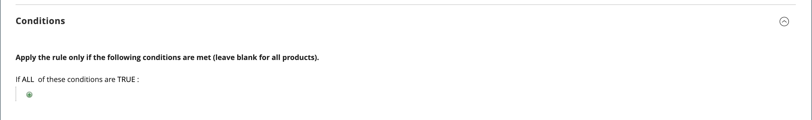

# 免费赠品促销

*免费赠品*&#x200B;促销活动允许您设置[购物车价格规则](price-rules-cart.md)，在特定条件下将免费商品添加到购物车。

>[!NOTE]
>
>Luma店面不支持此功能。 它可通过[GraphQL](https://developer.adobe.com/commerce/webapi/graphql/schema/cart/mutations/select-free-gift/)访问，并可在Edge Delivery Services (EDS)店面中使用。

## 创建免费赠品促销

本节介绍如何使用以下格式创建免费赠品促销活动：

**购买X产品，免费获取Y产品**

1. [创建购物车价格规则](price-rules-cart.md#step-1-add-a-rule)并免费促销礼品。

1. [描述购物车说明的条件](price-rules-cart.md#step-2-describe-the-conditions)以定义价格规则的条件。 这是可以添加到规则的多个条件中的第一个，用于确定何时触发规则。 它可以基于以下各项的组合：

   - 产品属性
   - 产品
   - 购物车属性
   - Adobe Commerce客户区段

   如果留空，则会为每个购物车触发规则。

   {width="600" zoomable="yes"}

1. 定义购物车价格规则的操作：

   1. 展开 (../assets/icon-display-expand.png) **[!UICONTROL Actions]**&#x200B;部分并输入以下信息：

   - 将&#x200B;**[!UICONTROL Apply]**&#x200B;设置为`Free Gift`。
   - 在&#x200B;**[!UICONTROL Gift SKU(s)]**&#x200B;中，选择客户可以选择作为免费礼品的一个或多个SKU。
   - 将&#x200B;**[!UICONTROL Free Gift Discount Type]**&#x200B;设置为&#x200B;**[!UICONTROL Price Based]**&#x200B;或&#x200B;**[!UICONTROL Discount Based]**。
   - 在&#x200B;**[!UICONTROL Gift Qty]**&#x200B;中，输入客户收到的免费赠品的数量。 例如，如果希望客户收到两个免费项目，请输入`2`。
   - 要阻止应用其他折扣，请将&#x200B;**[!UICONTROL Discard subsequent rules]**&#x200B;设置为`Yes`。

   1. 单击&#x200B;**[!UICONTROL Save and Continue Edit]**&#x200B;并根据需要完成规则的其余部分。

1. [完成购物车价格规则说明的标签](price-rules-cart.md)，以输入结帐时显示的标签。

{width="600" zoomable="yes"}

{{new-price-rule}}

1. 规则完成后，单击&#x200B;**[!UICONTROL Save Rule]**。

## 变体

您可以通过多种不同的方式自定义购物车价格规则。 免费赠品功能可以配置两种不同的折扣类型：

- **基于价格** ：以`0`的价格添加了礼品行项目。
- **基于折扣** ：对礼品行项目应用全额折扣。
