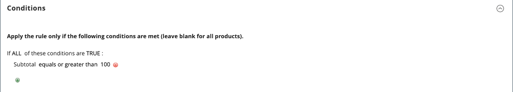

# 购物车价格规则示例 — 免运费促销

免费送货可作为[优惠券](price-rules-cart-coupon.md)的促销活动提供，无论是否提供。 免运费优惠券或优惠券也可以应用于客户提货订单，以便对订单开票和发货以完成[工作流](../stores-purchase/order-processing.md#order-workflow-and-processing)。

某些装运承运人配置使您能够根据最低订单提供免运费。 要扩展此基本功能，您可以使用购物车价格规则根据多个产品属性、购物车内容和客户组创建复杂的条件。

## 步骤1. 启用免费送货

1. 在您的商店配置中启用[免运费](../stores-purchase/shipping-free.md)。

1. 完成您要用于免费送货的任何[承运人服务](../stores-purchase/carriers.md)的免费送货设置。

## 步骤2. 创建购物车价格规则

在&#x200B;_管理员_&#x200B;侧边栏上，转到&#x200B;**[!UICONTROL Marketing]** > _[!UICONTROL Promotions]_>**[!UICONTROL Cart Price Rules]**。

请按照以下步骤设置您要提供的免运费促销类型。

### 示例1：任何订单的免运费

1. 按如下方式完成&#x200B;**[!UICONTROL Rule Information]**：

   - 输入&#x200B;**[!UICONTROL Rule Name]**&#x200B;供内部引用。
   - 输入简短&#x200B;**[!UICONTROL Description]**&#x200B;以描述规则。
   - 将&#x200B;**[!UICONTROL Active]**&#x200B;设置为`Yes`。
   - 在&#x200B;**[!UICONTROL Websites]**&#x200B;框中，选择要提供免运费优惠券的每个站点。
   - 选择应用规则的&#x200B;**[!UICONTROL Customer Groups]**。
   - 将&#x200B;**[!UICONTROL Coupon]**&#x200B;设置为以下项之一：
      - 要提供免运费促销活动而不提供优惠券，请接受默认(`No Coupon`)设置。
      - 要将优惠券与价格规则结合使用，请选择`Specific Coupon`。 如有必要，请完成说明以设置[优惠券](price-rules-cart-coupon.md)。

1. 向下滚动并展开 **[!UICONTROL Actions]**&#x200B;部分，然后执行以下操作：

   - 将&#x200B;**[!UICONTROL Apply]**&#x200B;设置为`Percent of product price discount`。
   - 将&#x200B;**[!UICONTROL Apply to Shipping Amount]**&#x200B;设置为`Yes`。
   - 将&#x200B;**[!UICONTROL Free Shipping]**&#x200B;设置为`For matching items only`。

   {width="600" zoomable="yes"}

### 示例2：金额超过$的订单的免费发运

1. 如上一个示例中所述，完成&#x200B;**[!UICONTROL General Information]**&#x200B;设置。

1. 向下滚动并展开&#x200B;**[!UICONTROL Conditions]**&#x200B;部分的。

1. 单击&#x200B;_添加_ （）以插入条件并执行以下操作：

   - 在&#x200B;**[!UICONTROL Cart Attribute]**&#x200B;下的列表中，选择`Subtotal`。
   - 单击&#x200B;**[!UICONTROL is]**&#x200B;并选择`equals or greater than`。
   - 单击&#x200B;**...**&#x200B;并输入小计阈值（如`100`）以完成条件。

   {width="600" zoomable="yes"}

1. 如有必要，请展开 **[!UICONTROL Actions]**&#x200B;部分并执行以下操作：

   - 将&#x200B;**[!UICONTROL Apply]**&#x200B;设置为`Percent of product price discount`。
   - 将&#x200B;**[!UICONTROL Apply to Shipping Amount]**&#x200B;设置为`Yes`。
   - 将&#x200B;**[!UICONTROL Free Shipping]**&#x200B;设置为`For matching items only`。

## 步骤3. 完成标签

完成购物车价格规则说明的[第4](price-rules-cart.md)步，以输入结帐期间出现的任何标签。

## 步骤4. 保存并测试规则

{{new-price-rule}}

1. 规则完成后，单击&#x200B;**[!UICONTROL Save Rule]**。

1. 测试规则以确保其正常工作。
