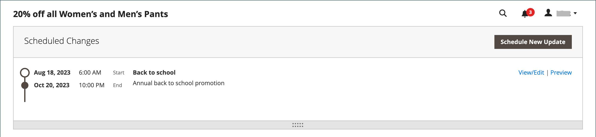

# 创建目录价格规则

按照这些说明，在满足一组条件时，对特定产品应用折扣。 目录价格规则折扣在产品放入购物车之前生效。

## 步骤1：添加规则

1. 在&#x200B;_管理员_&#x200B;侧边栏上，转到&#x200B;**[!UICONTROL Marketing]** > _[!UICONTROL Promotions]_>**[!UICONTROL Catalog Price Rule]**。

1. 单击右上角的&#x200B;**[!UICONTROL Add New Rule]**。

   _[!UICONTROL Rule Information]_部分包含&#x200B;**[!UICONTROL Conditions]**和&#x200B;**[!UICONTROL Actions]**的可扩展部分。

   {width="700" zoomable="yes"}

1. 完成&#x200B;**[!UICONTROL Rule Name]**&#x200B;和&#x200B;**[!UICONTROL Description]**&#x200B;字段。

   这些字段仅供内部参考。

1. 根据需要设置价格规则的&#x200B;**[!UICONTROL Status]**。

   默认情况下，状态为`Inactive`。

   >[!NOTE]
   >
   >创建规则后，可根据需要通过将状态更改为`Active`或`Inactive`来更新其状态。

1. 选择要使规则可用的&#x200B;**[!UICONTROL Websites]**。

1. 选择将应用此规则的&#x200B;**[!UICONTROL Customer Groups]**。

   要选择多个组，请按住Ctrl键(PC)或Command键(Mac)并单击每个选项。

   >[!NOTE]
   >
   >此列表中的选项取决于&#x200B;_客户_ > _客户组_&#x200B;中创建和管理的客户组。

1. (仅限Magento Open Source)输入&#x200B;**[!UICONTROL From]**&#x200B;和&#x200B;**[!UICONTROL To]**&#x200B;日期以确定价格规则何时生效。

   您可以输入日期或使用&#x200B;**[!UICONTROL Calendar]** （）选择日期。 如果将日期留空，则会在保存价格规则时启用该规则。

1. 输入一个数字以建立此规则相对于其他规则的&#x200B;**[!UICONTROL Priority]**。

   >[!NOTE]
   >
   >当同一目录产品满足为多个价格规则设置的条件时，_[!UICONTROL Priority]_设置很重要。 具有最高优先级设置（优先级从最高到最低依次为0、1、2、3...）的规则将对该产品激活。

## 第2步：定义条件

大多数可用条件基于现有属性值。 要将规则应用于所有产品，请将条件留空。

>[!NOTE]
>
>如果至少一个条件产品属性的值为空，则目录价格规则不适用于该产品。

>[!NOTE]
>
>要将`Category`产品属性条件应用于任何[捆绑](../catalog/product-create-bundle.md)或[分组的](../catalog/product-create-grouped.md)产品，必须将所有子产品分配到同一类别才能正确应用规则。 如果不能，您可以改用[购物车价格规则](price-rules-cart-create.md)促销活动。

1. 向下滚动并展开&#x200B;**[!UICONTROL Conditions]**&#x200B;部分的。

   默认情况下，将显示第一个条件，其状态为：

   `If **ALL** of these conditions are **TRUE**:`

   {width="400"}

   语句有两个粗体链接，单击这两个链接可显示语句该部分的选项选择。 您可以通过更改这些值的组合来创建不同的条件。

1. 可通过以下任一方式更改语句：

   - 单击&#x200B;**[!UICONTROL ALL]**&#x200B;并选择`ALL`或`ANY`。
   - 单击&#x200B;**[!UICONTROL TRUE]**&#x200B;并选择`TRUE`或`FALSE`。
   - 保持不变，以将规则应用于所有产品。

   您可以通过更改这些值的组合来创建不同的条件。 在本例中，使用默认条件。

1. 单击下一行开头的&#x200B;_添加_ （）图标，然后选择条件的选项，如产品属性或组合。

1. 在&#x200B;**[!UICONTROL Product Attribute]**&#x200B;下的列表中，选择要用作条件基础的属性。

   对于此示例，条件为`Attribute Set`。

   {width="400"}

   >[!NOTE]
   >
   >要使属性显示在列表中，必须将其配置为在促销规则条件中使用。 若要了解详细信息，请参阅[产品属性](../catalog/product-attributes.md)。

   >[!NOTE]
   >
   >在将`is not one of`条件与&#x200B;_SKU_&#x200B;产品属性和可配置产品一起使用时，必须同时选择父产品和子产品SKU。 要避免在规则中列出所有子SKU，您可以将`does not contain`条件与可配置产品及其子产品的公共SKU部件一起使用。

   选定的条件会显示在语句中，其后是两个粗体链接。 根据您选择的条件属性，选项会有所不同。 这份声明现在表示：

   `If **ALL** of these conditions are **TRUE**:  Attribute Set **is** …`

1. 单击&#x200B;**[!UICONTROL is]**&#x200B;并选择描述要满足的条件的比较运算符。

   这些选项可能包含用于不同比较的选项。 在此示例中，选项为`is`和`is not`。

1. 选择或输入条件的值。

   根据条件，您可以从网格或列表中选择产品，输入数值等。

   {width="400"}

   选定的项目会显示在语句中，以完成条件。

   `If **ALL** of these conditions are **TRUE**:   Attribute Set **is Default**`

1. 若要向语句中添加其他条件行，请单击&#x200B;_添加_ （）图标，然后选择以下选项之一：

   - `Conditions Combination`
   - `Product Attribute`

   重复该过程，直到完成所有所需条件为止。

   如果您在任何时候要删除部分条件语句，请单击行末的&#x200B;**[!UICONTROL Delete]** (图标。

## 步骤3：定义操作

1. 展开的&#x200B;**[!UICONTROL Actions]**&#x200B;部分，然后执行以下操作：

   {width="600" zoomable="yes"}

1. 在&#x200B;**[!UICONTROL Pricing Structure Rules]**&#x200B;下，将&#x200B;**[!UICONTROL Apply]**&#x200B;设置为以下项之一：

   - `Apply as percentage of original` — 通过减去正常价格的百分比来折扣项目。 例如：在折扣金额中输入10作为最终价格，该最终价格比常规价格低10%。
   - `Apply as fixed amount` — 通过从正常价格中减去固定金额的折扣项目。 例如：在折扣金额中输入10，以获得比正常价格低10美元的最终价格。
   - `Adjust final price to this percentage` — 按正常价格的百分比调整最终价格。 例如：在折扣金额中输入25作为最终价格，该最终价格比常规价格低75%。
   - `Adjust final price to discount value` — 将最终价格设置为固定的折扣金额。 例如：在最终价格$20.00的折扣额中输入20。

   >[!NOTE]
   >
   >_正常价格_&#x200B;是指不含任何高级定价（特价/层/组）或促销折扣的基本产品价格。 _最终价格_&#x200B;指购物车中显示的折扣价格。  使用以下公式将&#x200B;**_最终_**&#x200B;产品价格计算为&#x200B;**_最低_**&#x200B;相关价格：  `Final Price=Min(Regular(Base) Price, Group(Tier) Price, Special Price, Catalog Price Rule) + Sum(Min Price per each required custom option)`

   >[!NOTE]
   >
   >**_固定价格_**&#x200B;产品可自定义选项&#x200B;_不_&#x200B;受组价格、层价格、特殊价格或目录价格规则的影响。

1. 输入&#x200B;**[!UICONTROL Discount Amount]**。

1. 要在应用此规则后停止处理其他规则，请将&#x200B;**[!UICONTROL Discard Subsequent Rules]**&#x200B;设置为`Yes`。

   >[!NOTE]
   >
   >将此项设置为`Yes`是一种防止系统向同一产品应用多个折扣（规则）的保护措施。

## 步骤4：添加相关的动态块

{{ee-feature}}

只要满足条件，店面就会显示与目录价格规则关联的[动态块](../content-design/dynamic-blocks.md)。 这是一个可选步骤。

1. 展开的&#x200B;**[!UICONTROL Related Dynamic Blocks]**&#x200B;部分。

1. 使用[搜索筛选器](../getting-started/admin-workspace.md)查找要与规则关联的动态块。

1. 选中第一列中的复选框可将动态块与规则关联。

   {width="600" zoomable="yes"}

1. 单击&#x200B;**[!UICONTROL Save and Continue Edit]**。

## 步骤5：计划规则

{{ee-feature}}

>[!NOTE]
>
>将规则设置为活动必须添加为计划更新。 若要了解详细信息，请参阅[计划的更改](price-rule-catalog-scheduled-changes.md)。

1. 在&#x200B;_计划的更改_&#x200B;框中，单击框顶部的&#x200B;**[!UICONTROL Schedule New Update]**。

   如果规则具有现有的计划更新，则可以单击列出的更改右侧的&#x200B;**[!UICONTROL View/Edit]**。

   您可以编辑现有更新或将目录价格规则分配给另一个活动。 默认情况下已选中&#x200B;**编辑现有更新**&#x200B;选项。

1. 要计划规则，请输入价格规则要处于活动状态的&#x200B;**[!UICONTROL Start Date]**&#x200B;和&#x200B;**[!UICONTROL End Date]**。

   您可以输入日期或从&#x200B;_日历_ （）中选择日期。

   {width="600" zoomable="yes"}

1. 单击&#x200B;**[!UICONTROL Save]**。

1. 在&#x200B;_规则信息_&#x200B;部分中，将&#x200B;**[!UICONTROL Status]**&#x200B;设置为`active`。

## 步骤6：保存并测试规则

1. 完成后，保存规则。

   - (仅Magento Open Source)单击&#x200B;**[!UICONTROL Save and Apply]**。

   - (仅限Adobe Commerce)单击&#x200B;**[!UICONTROL Save]**。

     “规则信息”页面在规则的计划更改中显示更新的时间线。

     {width="600" zoomable="yes"}

1. 更新规则的属性：

   - (仅限Adobe Commerce)单击&#x200B;**[!UICONTROL Edit]**&#x200B;以显示&#x200B;_[!UICONTROL Rule Information]_页。

   -  (仅限Magento Open Source)单击列表中的规则以显示&#x200B;_[!UICONTROL Rule Information]_页。

1. 测试规则以确保其正常工作。

   价格规则每晚都会与其他系统规则一起自动处理。 在创建价格规则时，请在测试规则之前留出足够的时间让它进入系统，以确保它正常工作。 随着新规则的添加，Commerce会相应地重新计算价格和优先级。

## 目录价格规则演示

观看本视频，了解如何创建目录价格规则：

>[!VIDEO](https://video.tv.adobe.com/v/343834?quality=12&learn=on)

## 字段描述

### [!UICONTROL Rule Information]

| 字段 | 描述 |
|-----|-----------|
| [!UICONTROL Rule name] | （必需）规则的名称供内部参考。 |
| [!UICONTROL Description] | 规则的描述应包括规则的用途并解释其使用方式。 |
| [!UICONTROL Websites] | （必需）标识可以使用规则的网站。 |
| [!UICONTROL Customer Groups] | （必需）标识应用规则的客户组。 |
| [!UICONTROL Priority] | 指示此规则相对于其他规则的优先级的数字。 从最高到最低的优先级为`0,1,2,3...` |
| [!UICONTROL Status] |  (仅限Magento Open Source)确定存储中的规则是否处于活动状态。 选项： `Yes` / `No` |
| [!UICONTROL From] | (仅Magento Open Source)指定价格规则生效的第一天。 如果留空，价格规则将在保存后生效。 |
| [!UICONTROL To] | (仅Magento Open Source)指定价格规则生效的最后一天。 如果留空，价格规则将无限期地继续。 |

{style="table-layout:auto"}

### [!UICONTROL Conditions]

指定目录价格规则生效之前必须满足的条件。 如果留空，该规则将应用于所有产品。

### [!UICONTROL Actions]

| 字段 | 描述 |
|-----|-----------|
| [!UICONTROL Apply] | 确定应用于购买的计算类型。 选项：  **[!UICONTROL Apply as percentage of original]**— 通过减去正常价格的百分比来折扣项目。 **[!UICONTROL Apply as fixed amount]** — 通过从正常价格中减去固定金额的折扣项目。  **[!UICONTROL Adjust final price to this percentage]**— 按正常价格的百分比调整最终价格。 **[!UICONTROL Adjust final price to discount value]** — 将最终价格设置为固定的折扣金额。   **_注意：_**常规价格是指不含任何高级定价（特价/层/组）或促销折扣的基本产品价格。 最终价格是指购物车中显示的折扣价格。  使用以下公式将**_最终&#x200B;_**产品价格计算为**_最低&#x200B;_**相关价格：  `Final Price=Min(Regular(Base) Price, Group(Tier) Price, Special Price, Catalog Price Rule) + Sum(Min Price per each required custom option)` |
| [!UICONTROL Discount Amount] | （必需）提供的折扣金额。 |
| [!UICONTROL Discard Subsequent Rules] | 确定是否可以将其他规则应用于此购买。 要防止将多个折扣应用于同一购买，请选择`Yes`。 选项： `Yes` / `No` |

{style="table-layout:auto"}

### [!UICONTROL Related Dynamic Blocks]

{{ee-feature}}

标识与规则关联的任何[动态块](../content-design/dynamic-blocks.md)。
