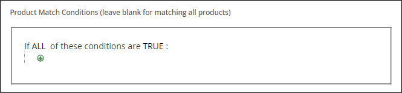

# 创建相关的产品规则

{{ee-feature}}

创建相关产品规则的过程与设置价格规则类似。 首先，定义要匹配的条件，然后选择要显示的产品。 在任意给定时间，可能会触发多个活动规则以显示相关产品、追加销售和交叉销售。 每个规则的优先级决定了产品块在页面上的显示顺序。

>[!NOTE]
>
>对于要在目标规则中使用的属性， [_[!UICONTROL Use for Promo Rule Conditions]_](../catalog/product-attributes.md) 属性必须设置为 `Yes`.

>[!NOTE]
>
>此 `All Store Views` 范围值始终用于两者 [!UICONTROL Products to Match] 和 [!UICONTROL Products to Display] 所有产品属性的条件。 当产品属性对于不同的商店视图和网站具有不同的值时，这也适用。

## 创建相关的产品规则

1. 在 _管理员_ 侧栏，转到 **[!UICONTROL Marketing]** > _[!UICONTROL Promotions]_>**[!UICONTROL Related Product Rules]**.

1. 在右上角，单击 **[!UICONTROL Add Rule]**.

   {width="600" zoomable="yes"}

1. 完成 **[!UICONTROL Rule Information]** 如下所示：

   - 输入 **[!UICONTROL Rule Name]** 以在管理员中工作时标识规则。

   - 对象 **[!UICONTROL Priority]**，输入一个数字，以决定当其他规则的结果定位到同一位置时，结果在页面上的显示顺序。 数字 `1` 是头等大事。

   - 要启用规则，请设置 **[!UICONTROL Status]** 到 `Active`.

   - 设置 **[!UICONTROL Apply To]** 更改为以下任一项：

      - `Related Products`
      - `Up-sells`
      - `Cross-sells`

   - 如果规则在特定时间范围内处于活动状态，请输入 **[!UICONTROL From]** 和 **[!UICONTROL To]** 日期。

   - 对象 **[!UICONTROL Result Limit]**，输入要显示在结果列表中的记录数。 最大数量为20。

   - 如果规则应用于特定 [客户区段](../customers/customer-segments.md)，设置 **[!UICONTROL Customer Segments]** 到 `Specified` 并从列表中选择客户区段。

1. 在左侧面板中，选择 **[!UICONTROL Products to Match]** 并构建条件，就像您为 [目录价格规则](price-rules-catalog.md).

   {width="500"}

1. 在左侧面板中，选择 **[!UICONTROL Products to Display]** 并构建结果条件，就像您对 [目录价格规则](price-rules-catalog.md).

   {width="500"}

   完成条件以描述要包含在显示结果中的产品。

1. 完成后，单击 **[!UICONTROL Save]**.

## 删除相关产品规则

1. 在 _管理员_ 侧栏，转到 **[!UICONTROL Marketing]** > _[!UICONTROL Promotions]_>**[!UICONTROL Related Product Rules]**.

1. 查找要删除的相关产品规则。

1. 单击规则以打开详细信息页面。

1. 在右上角，单击 **[!UICONTROL Delete]**.

1. 要确认操作，请单击 **[!UICONTROL OK]**.

## 相关产品规则演示

观看本视频，了解如何创建相关的产品规则：

>[!VIDEO](https://video.tv.adobe.com/v/343837?quality=12&learn=on)

## 字段描述

| 字段 | 描述 |
|--- |--- |
| [!UICONTROL Rule Name] | 标识规则供内部使用的名称。 |
| [!UICONTROL Priority] | 确定规则的结果与针对页面上相同位置的其他结果集一起显示时的显示顺序。 该值可以设置为任意整数，最高优先级为1。 例如，如果有多个适用向上销售规则，则优先级最高的规则出现在其他规则之前。 每组结果中产品的排序顺序是随机的。 任何手动配置的追加销售、交叉销售和相关产品始终在任何基于规则的产品促销之前出现在页面上。 |
| [!UICONTROL Status] | 控制规则的活动状态。 选项： `Active` / `Inactive` |
| [!UICONTROL Apply To] | 标识与规则关联的产品关系类型。 选项： `Related Products` / `Up-sells` / `Cross-sells` |
| [!UICONTROL From Date] | 如果规则在一定时间内处于活动状态，则此设置将确定规则处于活动状态的第一个日期。 |
| [!UICONTROL To Date] | 如果规则在一定时间内处于活动状态，则此设置将确定规则处于活动状态的最后日期。 |
| [!UICONTROL Result Limit] | 确定一次显示在结果中的产品数量。 最大数量为20。 如果找到更多匹配结果，则每次刷新页面时，产品都会在块中旋转。 |
| [!UICONTROL Customer Segments] | 标识应用规则的客户区段。 选项： `All` / `Specified` |

{style="table-layout:auto"}
