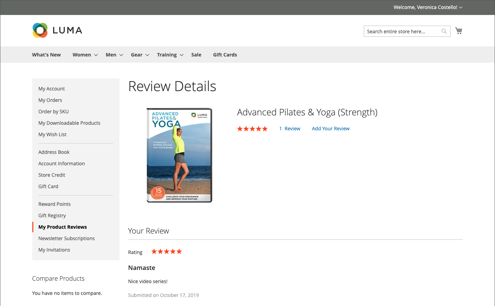
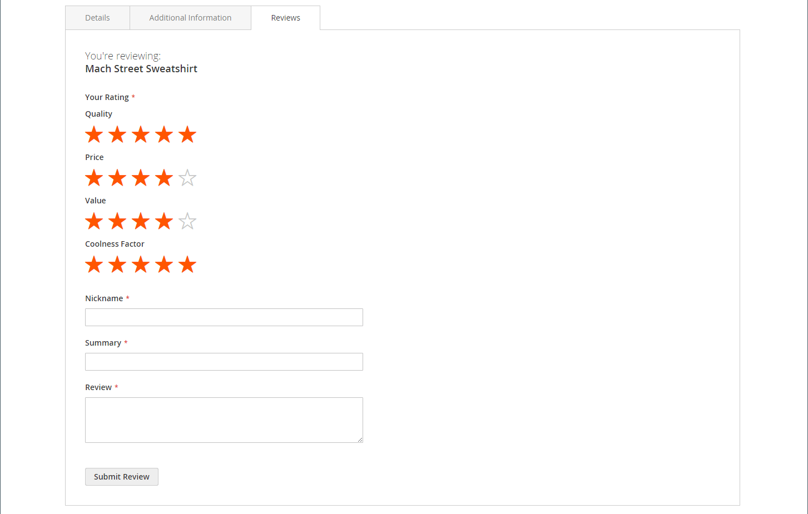
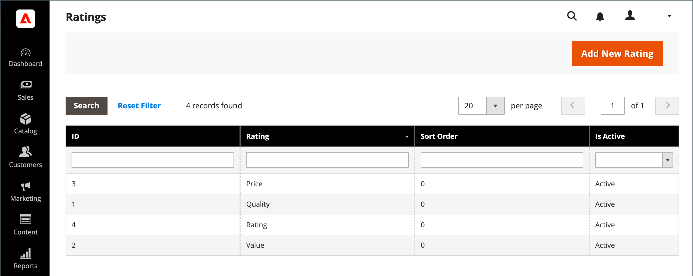
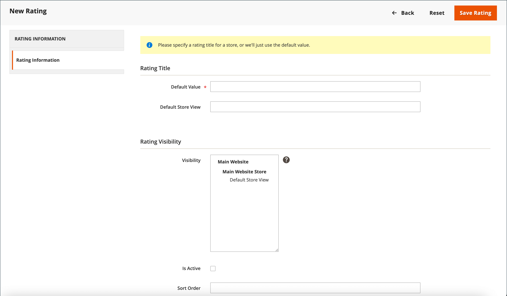

# 产品评价

产品审查有助于建立一种社区意识，被认为比任何广告资金都更可信。 事实上，一些搜索引擎为有产品评论的网站提供了比没有产品评论的网站更高的排名。 对于通过搜索特定产品找到您网站的人，产品评论基本上就是您商店的登陆页面。 产品审查可帮助人们找到您的商店，让他们保持参与，并且通常有助于销售。

Commerce包括可从管理员管理的本机产品审阅功能。 您还可以使用[Commerce Marketplace](../getting-started/commerce-marketplace.md)中的扩展来使用托管的审核管理系统。

>[!NOTE]
>
>Adobe Commerce和Magento Open Source版本2.4.0到2.4.3包含了Yotpo供应商开发的扩展。 从2.4.4版本开始，此扩展不再与核心版本捆绑在一起，必须从Commerce Marketplace安装和更新。 通过Marketplace，还可以访问扩展开发人员提供的当前文档。
>&#x200B;>  
>&#x200B;>如果已启用并配置捆绑的扩展，则必须在升级2.4.4的过程中更新您的composer.json文件，并且以后要管理扩展更新。 有关详细信息，请参阅&#x200B;_升级指南_&#x200B;中的[升级模块](https://experienceleague.adobe.com/docs/commerce-operations/upgrade-guide/modules/upgrade.html)。

## 店面的产品评论

启用本机产品审阅功能后，客户可以为目录中的任何产品编写审阅。 可通过单击以下链接从产品页面中编写审阅：

- **添加您的评论**，针对具有现有评论的产品。

- **成为第一个审阅此产品的人**，查看没有现有审阅的产品。

[!UICONTROL Reviews]选项卡列出了所有当前审阅以及用于提交审阅的表单。

您的配置决定了客户在编写产品评论之前是否必须在您的商店中开立帐户，或者他们是否可以作为来宾提交评论。 要求审阅人开户可防止匿名提交并提高审阅质量。

{width="700" zoomable="yes"}

星型数表示产品的满意度。 访客可以单击该链接来阅读审阅并编写自己的审阅。 作为奖励，客户可以因提交评论而获得奖励积分。 提交审核后，审核将发送给管理员进行审核。 获得批准后，该审阅结果会发布在您的商店中。

{width="700" zoomable="yes"}

### [!UICONTROL My Product Reviews]

客户帐户仪表板的&#x200B;_[!UICONTROL My Product Reviews]_&#x200B;部分列出了客户提交并批准发布的所有审核。 每个审阅摘要都包含提交审阅的日期、指向产品页面的链接以及审阅详细信息。

{width="700" zoomable="yes"}

1. 在其帐户的侧边栏中，客户选择&#x200B;**[!UICONTROL My Product Reviews]**。

1. 要查看完整审阅，请单击&#x200B;**[!UICONTROL See Details]**。

   {width="700" zoomable="yes"}

## 启用产品审核功能

Commerce产品审阅功能默认处于启用状态。

>[!NOTE]
>
>若要将这些字段设置为`No`并禁用Commerce产品审核，您必须清除&#x200B;**使用系统值**&#x200B;复选框。

1. 在&#x200B;_管理员_&#x200B;侧边栏上，转到&#x200B;**[!UICONTROL Stores]** > _[!UICONTROL Settings]_>**[!UICONTROL Configuration]**。

1. 在左侧面板中，展开&#x200B;**[!UICONTROL Catalog]**&#x200B;并选择下方的&#x200B;**[!UICONTROL Catalog]**。

1. 展开&#x200B;**[!UICONTROL Product Reviews]**&#x200B;部分的。

   {width="600" zoomable="yes"}

1. 将&#x200B;**[!UICONTROL Enabled]**&#x200B;设置为`Yes`。

   这是启用产品审阅的默认设置。

1. 将&#x200B;**[!UICONTROL Allow Guests to Write Reviews]**&#x200B;设置为`Yes`。

   这是默认设置，可确定客户是否必须在您的商店中开立帐户才能编写产品评论。

1. 完成后，单击&#x200B;**[!UICONTROL Save Config]**。

## 创建自定义评级

通过Commerce产品审核，客户可以在提交产品审核时分配评级。 默认评级包括质量、价格和价值。 除了这些之外，您还可以添加自己的自定义评级。 目录页面上显示的五星级评级是每个产品的平均值。

{width="700" zoomable="yes"}

1. 在&#x200B;_管理员_&#x200B;侧边栏上，转到&#x200B;**[!UICONTROL Stores]** > _[!UICONTROL Attributes]_>**[!UICONTROL Rating]**。

1. 单击右上角的&#x200B;**[!UICONTROL Add New Rating]**。

   {width="700" zoomable="yes"}

1. 在&#x200B;_[!UICONTROL Rating Title]_&#x200B;部分中，输入新评分的&#x200B;**[!UICONTROL Default Value]**。

   如果适用，还应输入每个商店视图的翻译。

   {width="600" zoomable="yes"}

1. 在&#x200B;_评分可见性_&#x200B;部分中，将&#x200B;**[!UICONTROL Visibility In]**&#x200B;设置为将使用评分的存储区视图。

   要选择多个存储视图，请按住Ctrl键(PC)或Command键(Mac)并单击每个项目。

   >[!NOTE]
   >
   >除非将评级分配给商店视图，否则评级不可见。

1. 对于&#x200B;**[!UICONTROL Sort Order]**，输入一个数字以确定此评分与其他人一起列出的顺序。

1. 如果要在店面中显示您的评分，请选中&#x200B;**[!UICONTROL Is Active]**&#x200B;复选框。

   {width="600" zoomable="yes"}

1. 完成后，单击&#x200B;**[!UICONTROL Save Rating]**。

   目录产品网格页面上将显示每个产品的所有审阅的平均评分。

   {width="700" zoomable="yes"}
