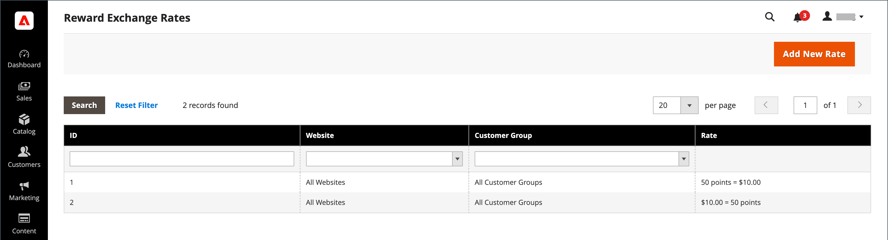
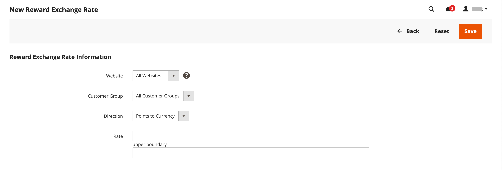

# 奖励汇率

{{ee-feature}}

奖励汇率确定基于订单金额获得的点数以及获得的点数的值。 不同的汇率可适用于不同的网站及不同的客户群组。 如果来自不同网站和客户组的多个汇率适用于同一客户，则适用以下优先级规则：

## 汇率优先级

**1**：适用于特定网站和特定客户组。

**2**：适用于所有网站和特定客户组。

**3**：适用于特定网站和所有客户组。

**4**：适用于所有网站和所有客户组。

将货币转换为点数时，无法划分点数。 任何货币余额都会向下舍入。 例如，如果$2.00转换为10分，则以$2.00的组获得分数。 因此，7.00美元的订单将获得30分，其余1.00美元将向下舍入。 订单的货币金额定义为商家收到的金额，或总计减去运费、税金、折扣、商店贷项和礼品卡的金额。 当订单中没有未开票项目时（所有项目均已付款或已取消），将获得积分。 如果管理员用户不想让客户获得已取消订单的奖励积分，则可以从“管理客户”页面手动扣减这些积分。

## 设置汇率

{width="700" zoomable="yes"}

1. 在&#x200B;_管理员_&#x200B;侧边栏上，转到&#x200B;**[!UICONTROL Stores]** > _[!UICONTROL Other Settings]_>**[!UICONTROL Reward Exchange Rates]**。

1. 单击右上角的&#x200B;**[!UICONTROL Add New Rate]**。

1. 在&#x200B;**[!UICONTROL Reward Exchange Rate Information]**&#x200B;部分中，执行以下操作：

   {width="600" zoomable="yes"}

   - 将&#x200B;**[!UICONTROL Website]**&#x200B;设置为奖励汇率适用的网站。

   - 将&#x200B;**[!UICONTROL Customer Group]**&#x200B;设置为套用奖励汇率的组。

   - 将&#x200B;**[!UICONTROL Direction]**&#x200B;设置为以下项之一：

      - `Points to Currency`
      - `Currency to Points`

   对于任一方向设置，金额均以网站的基本货币表示。

1. 根据&#x200B;_[!UICONTROL Direction]_&#x200B;设置输入&#x200B;**[!UICONTROL Rate]**&#x200B;值。

   | 方向 | 费率设置 |
   |---------|-------------|
   | [!UICONTROL Points to Currency] | 在前&#x200B;_[!UICONTROL Rate]_&#x200B;字段中，输入点数。 在第二个&#x200B;_[!UICONTROL Rate]_&#x200B;字段中，输入点的货币值。 |
   | [!UICONTROL Currency to Points] | 在前&#x200B;_[!UICONTROL Rate]_&#x200B;字段中，输入货币值。 在第二个&#x200B;_[!UICONTROL Rate]_&#x200B;字段中，输入由货币值表示的点数。 |

   将点数转换为货币时，无法划分点数。 例如，如果10点转换为2.00美元，则必须以10点为一组兑换点。 因此，25点可兑换4.00美元，客户余额还剩5点。

   建议您同时为`Points to Currency`和`Currency to Points`设置转换。

1. 完成后，单击&#x200B;**[!UICONTROL Save]**。

## 删除奖励汇率

1. 在&#x200B;_管理员_&#x200B;侧边栏上，转到&#x200B;**[!UICONTROL Stores]** > _[!UICONTROL Other Settings]_>**[!UICONTROL Reward Exchange Rates]**。

1. 查找要删除的奖励汇率，并在编辑模式下将其打开。

1. 在菜单栏中，单击&#x200B;**[!UICONTROL Delete]**。

1. 要确认操作，请单击&#x200B;**[!UICONTROL OK]**。

## 字段描述

| 字段 | 描述 |
|--- |--- |
| [!UICONTROL Website] | 适用奖励率的网站。 |
| [!UICONTROL Customer Group] | 奖励率适用的客户组。 |
| [!UICONTROL Direction] | 确定汇率定义的事务处理类型。 选项：  **[!UICONTROL Points to Currency]**— 定义作为订单金额的点数可以应用的点数。 在前&#x200B;_[!UICONTROL Rate]_&#x200B;字段中，输入点数。 在第二个&#x200B;_[!UICONTROL Rate]_&#x200B;字段中，输入点的货币值。 **[!UICONTROL Currency to Points]** — 定义可以获得客户积分的订单金额。 在前&#x200B;_[!UICONTROL Rate]_&#x200B;字段中，输入货币值。 在第二个&#x200B;_[!UICONTROL Rate]_&#x200B;字段中，输入由货币值表示的点数。 |
