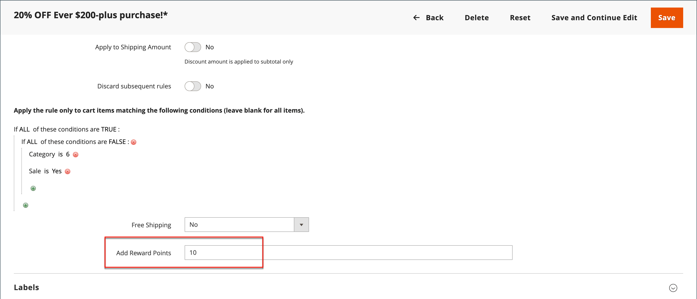

# 价格规则中的奖励积分

{{ee-feature}}

我们可根据客户提供的奖励积分， [购物车价格规则](price-rules-cart.md). 积分奖励可以是价格规则的唯一操作，也可以带有折扣使用。

>[!NOTE]
>
>[奖励汇率](reward-exchange-rates.md) 在结账期间客户和管理员用户兑换奖励点数需要进行配置。

## 向价格规则添加奖励积分

1. 在 _管理员_ 侧栏，转到 **[!UICONTROL Marketing]** > _[!UICONTROL Promotions]_>**[!UICONTROL Cart Price Rules]**.

1. 单击 **[!UICONTROL Add New Rule]** 以创建购物车价格规则，或单击现有购物车价格规则以将其打开。

1. 向下滚动，展开  该 **[!UICONTROL Actions]** 部分，设置条件，然后在 **[!UICONTROL Add Reward Points]** 字段。

   {width="600" zoomable="yes"}

1. 按照标准说明完成 [购物车价格规则](price-rules-cart-create.md).

   激活价格规则后，购物车中会显示一条消息，告知客户可通过下订单获得多少积分。 这仅适用于已注册的用户，并且当用户登录时可能会有所不同。
