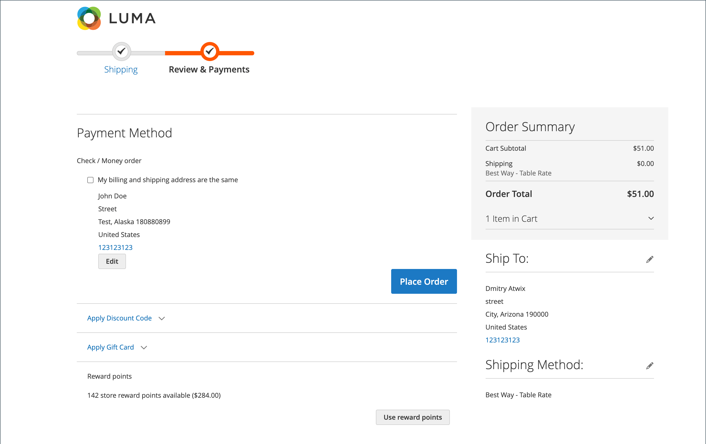

# 奖励积分店面体验

{{ee-feature}}

此 [奖励点数](rewards-loyalty.md) 部分，显示客户获得的奖励积分的当前余额及其奖励积分余额的历史记录。

{width="700" zoomable="yes"}

## 在结账期间兑换奖励积分

如果 [奖励汇率](reward-exchange-rates.md) 替换为 `Points to Currency` 配置方向，客户可以在结账时使用奖励积分。

1. 将所有必需的产品添加到购物车后，客户会导航到结帐。

1. 输入所有必需的送货信息并导航到 _审核与支付_ 步骤。

1. 在 _[!UICONTROL Reward points]_部分，检查可用点的数量及其货币值。

1. 点击次数 **[!UICONTROL Use reward points]**.

{width="700" zoomable="yes"}

可用积分折扣应用于小计。

>[!NOTE]
>
>如果可用余额大于订单的总计，则不需要使用其他付款方法。
