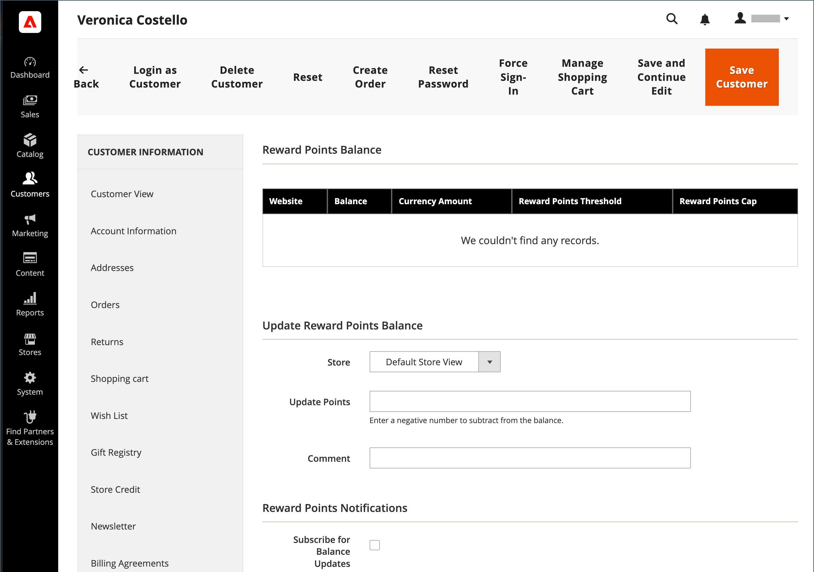

# 奖励和忠诚计划

{{ee-feature}}

此 _奖励积分_ Adobe Commerce中的system使您能够实施独特的计划，以提高客户参与度并提高客户忠诚度。 可以为广泛的交易和客户活动授予积分，并且可以设置配置来控制积分分配、平衡和到期。 客户可以根据您在奖励点数和货币之间建立的兑换率将点数兑换为购买商品。

## 购物车价格规则

积分奖励客户可根据 [购物车规则](price-rules-cart.md). 它们可以按价格规则的唯一动作获得奖励，也可以附带折扣。

## 客户余额

管理员用户可为每位客户管理奖励点余额。 如果在店面中启用，客户还可以查看其积分余额的详细信息。

## 兑换点

>[!NOTE]
>
>[奖励汇率](reward-exchange-rates.md) 在结账期间客户和管理员用户兑换奖励点数需要进行配置。

在结账过程中，管理员用户和客户（如果已启用）可以兑换积分。 在“付款方法”部分，已启用的付款方法上方将显示一个使用我的奖励积分复选框。 包括可用点数和货币汇率。 如果可用余额大于订单的总计，则无需其他付款方式。 应用于订单的奖励积分数与订单总额一起显示（从总计中扣除），类似于商店信用卡或礼品卡。 如果奖励积分与商店信用卡或礼品卡一起使用，则首先扣除奖励积分。 如果订单总额大于可兑换的奖励点数，则扣减商店信用卡或礼品卡。

>[!NOTE]
>
>不建议将奖励积分用于COD采购，因为只有在订单开票后才能确认付款收据。

## 退回奖励积分

带有奖励积分的订单可以退回到奖励积分余额，直至订单中赎回的金额。 在 [_新建贷项通知单_ 页面](../stores-purchase/credit-memo-create.md)，则可以输入应用于客户余额的点数。 默认情况下，字段包含按顺序使用的完整点数。

## 启用商店的奖励点操作

奖励点配置确定奖励点在商店中的呈现方式并定义基本操作参数。

{width="600" zoomable="yes"}

### 步骤1. 配置奖励积分

1. 在 _管理员_ 侧栏，转到 **[!UICONTROL Stores]** > _[!UICONTROL Settings]_>**[!UICONTROL Configuration]**.

1. 在左侧面板中，展开 **[!UICONTROL Customers]** 并选择 **[!UICONTROL Reward Points]**.

1. 展开  该 **[!UICONTROL Reward Points]** 部分并执行以下操作：

   - 要激活奖励积分，请设置 **[!UICONTROL Enable Reward Points Functionality]** 到 `Yes`.

   - 要允许客户获得自己的奖励积分，请设置 **[!UICONTROL Enable Reward Points Functionality on Storefront]** 到 `Yes`.

   - 要允许客户查看其奖励的详细历史记录，请设置 **[!UICONTROL Customers May See Reward Point History]** 到 `Yes`.

1. 对象 **[!UICONTROL Reward Points Balance Redemption Threshold]**，输入兑换前必须累计的点数（无最小值为空）。

1. 对象 **[!UICONTROL Cap Reward Points Balance At]**，输入客户可累计的最大点数（空白表示无限制）。

1. 对象 **[!UICONTROL Reward Points Expire in (days)]**，输入奖励积分过期前的天数（空白表示无过期）。

1. 设置 **[!UICONTROL Reward Points Expiry Calculation]** 更改为以下任一项：

   - `Static`  — 根据配置中设置的天数确定奖励分数的剩余生命周期。 如果配置中的到期限制更改，则现有点的到期日期不会更改。

   - `Dynamic`  — 计算奖励点余额增加时的剩余天数。 如果配置中的到期限制发生更改，则所有现有点的到期都将相应地更新。

1. 如果要自动退款可用的奖励积分，请设置 **[!UICONTROL Refund Reward Points Automatically]** 到 `Yes`.

1. 要在获得积分的订单全部或部分退款时撤消通过采购获得的奖励积分，请设置 **[!UICONTROL Deduct Reward Points from Refund Amount Automatically]** 到 `Yes`.

   >[!NOTE]
   >
   >只有通过正在退款的订单获得的点数会受到影响。

1. 设置 **[!UICONTROL Landing Page]** 内容页面，该页面介绍了您的奖励积分计划。

   确保使用您自己的信息更新默认的“奖励积分”页面。

1. 完成后，单击 **[!UICONTROL Save Config]**.

### 步骤2. 配置客户活动获得的点数

在此步骤中，指定可为各种客户活动获得的奖励积分数。 当客户完成分配了点的活动时，将会向客户显示一条消息，指明他们已获得多少点。

1. 展开  该 **[!UICONTROL Actions for Acquiring Reward Points by Customer]** 部分。

   {width="600" zoomable="yes"}

1. 要允许根据配置的获得采购的奖励积分，请执行以下操作 [奖励汇率](reward-exchange-rates.md)，设置 **[!UICONTROL Purchase]** 到 `Yes`.

   >[!NOTE]
   >
   >为他们的员工获得奖励积分 _第一_ 订单，客户必须注册 _早于_ 该交易记录由付款方式捕获。 大多数支付方法都可以配置为捕获交易 _自动_ 下订单时，但 _早于_ 客户帐户注册已完成。

1. 对象 **[!UICONTROL Registration]**，输入开立客户帐户获得的点数。

1. 对象 **[!UICONTROL Newsletter Signup]**，输入订阅新闻稿的注册客户获得的点数。

1. 对象 **[!UICONTROL Converting Invitation to Customer]**，输入发送邀请的客户获得的点数，然后收件人打开客户帐户。

   您可以限制为发送邀请的客户获取点数的邀请转换次数（无限制为空白）。 要执行此操作，请在 **[!UICONTROL Invitation to Customer Conversions Quantity Limit]** 字段。

1. 对象 **[!UICONTROL Converting Invitation to Order]**，输入向客户发送邀请函（收件人随后下达订单）的客户获得的点数，并执行以下操作：

   - 对象 **订单转换邀请数量限制**，输入当收件人下达初始订单时，发送邀请的客户获得的点数（空表示无限制）。

   - 对象 **[!UICONTROL Invitation Conversion to Order Reward]**，选择 `Each` 用于获得收件人订单每次下单的点数的选项，或者选择 `First` 用于仅获得收件人第一次下订单的积分的选项。

1. 对象 **[!UICONTROL Review Submission]**，输入提交审核且已批准发布的客户获得的点数。

1. 然后，要限制可用于获得每位客户点数的评论数量，请在 **[!UICONTROL Rewarded Reviews Submission Quantity Limit]** 字段（空表示无限制）。

1. 完成后，单击 **[!UICONTROL Save Config]**.

### 步骤3. 完成电子邮件通知设置

1. 展开  该 **[!UICONTROL Email Notification Settings]** 部分。

   {width="600" zoomable="yes"}

1. 设置 **[!UICONTROL Email Sender]** 将显示为余额更新和到期通知发送者的商店联系人。

1. 如果您希望默认订阅客户，以接收有关余额更新和即将到期日期的通知，请设置 **[!UICONTROL Subscribe Customers by Default]** 到 `Yes`.

1. 设置 **[!UICONTROL Balance Update Email]** 用于通知的模板，该通知在客户点数余额更新时发送给客户。

1. 设置 **[!UICONTROL Reward Points Expiry Warning Email]** 到达到一批点的到期限制时发送给客户的通知所使用的模板。

1. 对象 **[!UICONTROL Expiry Warning Before (days)]**，输入发送该通知的点过期前的天数。

1. 完成后，单击 **[!UICONTROL Save Config]**.

## 更新奖励积分余额

奖励积分余额可以从管理员更新。

1. 在 _管理员_ 侧栏，转到 **[!UICONTROL Customers]** > **[!UICONTROL All Customers]**.

1. 在网格中查找客户并单击 **[!UICONTROL Edit]** 在 _[!UICONTROL Action]_列。

1. 下 _客户信息_，选择 **[!UICONTROL Reward Points]** 部分。

1. 输入数字 **[!UICONTROL Update Points]**：

   - 要更新奖励积分金额，请输入数字以增加总积分余额。
   - 要减去奖励积分金额，请输入要减少总积分余额的负数。

1. 输入 **[!UICONTROL Comments]** 回报点数调整（如有需要）。

   {width="700" zoomable="yes"}

1. （可选）为客户订阅 _奖励积分通知_：

   - **[!UICONTROL Subscribe for Balance Updates]**
   - **[!UICONTROL Subscribe for Points Expiration Notifications]**

1. 单击 **[!UICONTROL Save Customer]**.

与奖励积分相关的所有操作都会显示在客户的 _[!UICONTROL Reward Points History]_把他们的账户堵在店面。

## 字段描述

| 字段 | 描述 |
|--- |--- |
| [!UICONTROL Balance] | 客户奖励积分的当前余额 |
| [!UICONTROL Amount Balance] | 当前现金余额的金额 |
| [!UICONTROL Points] | 添加或减去的点数 |
| [!UICONTROL Amount] | 加减货币金额 |
| [!UICONTROL Rate] | 此 [奖励汇率](reward-exchange-rates.md) |
| [!UICONTROL Website] | 将奖励点历史记录分配到的网站 |
| [!UICONTROL Reason] | 分值原因： **[!UICONTROL Making purchases]**— 客户每次购买时都可以获得点数。 **[!UICONTROL Registering on the site]**  — 注册时累计（一次）。 **[!UICONTROL Subscribing to a newsletter]**— 首次订阅时累计（一次）。 **[!UICONTROL Sending Invitations]**  — 通过邀请朋友加入网站来获取点数。 **[!UICONTROL Converting Invitations to Customer]**— 每次发出邀请时都能获得点数，在网站上注册的主要朋友将获得点数。 **[!UICONTROL Converting Invitations to Order]**  — 获得每次销售所发送邀请的积分。 **[!UICONTROL Review Submission]**— 获得提交产品评价的点数。 |
| [!UICONTROL Created] | 奖励积分更新的日期和时间 |
| [!UICONTROL Expired] | 已过期的奖励积分数 |
| [!UICONTROL Comment] | 添加或减去点时的注释 |

{style="table-layout:auto"}

## 资源疑难解答

有关排查奖励点问题的帮助，请参阅以下Commerce支持知识库文章：

- [部分订单上的会员积分](https://experienceleague.adobe.com/docs/commerce-knowledge-base/kb/support-tools/patches/v1-0-8/mdva-31295-magento-patch-loyalty-points-on-partial-orders.html)
- [404错误 — 删除多送货结帐的奖励点](https://experienceleague.adobe.com/docs/commerce-knowledge-base/kb/troubleshooting/storefront/magento-2.4.0-404-error-removing-rewards-points-on-multi-shipping-checkout.html)
