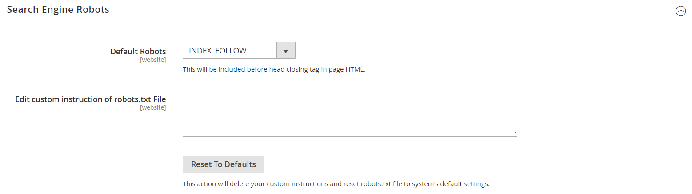

# SEO概述

_搜索引擎优化_ (SEO)是微调网站的内容和呈现方式以改进搜索引擎对页面进行索引的方式。 Commerce包含各种功能来支持您持续的SEO工作。

>[!TIP]
>
>对于Adobe Commerce as a Cloud Service，请参阅Commerce Storefront文档中的[SEO准则](https://experienceleague.adobe.com/developer/commerce/storefront/setup/seo/indexing/)

## 元数据

仅[!BADGE PaaS]{type=Informative url="https://experienceleague.adobe.com/en/docs/commerce/user-guides/product-solutions" tooltip="仅适用于云项目(Adobe管理的PaaS基础架构)和内部部署项目上的Adobe Commerce 。"}

了解有关为您的网站和商店添加和增强富含关键字的[元数据](meta-data.md)的详细信息。

## 使用站点地图

仅[!BADGE PaaS]{type=Informative url="https://experienceleague.adobe.com/en/docs/commerce/user-guides/product-solutions" tooltip="仅适用于云项目(Adobe管理的PaaS基础架构)和内部部署项目上的Adobe Commerce 。"}

[站点地图](sitemap-xml.md)改进了搜索引擎对存储进行索引的方式，并设计为查找可能被网络爬虫忽略的页面。 可以将站点地图配置为为所有页面和图像编制索引。

## URL重写

仅[!BADGE PaaS]{type=Informative url="https://experienceleague.adobe.com/en/docs/commerce/user-guides/product-solutions" tooltip="仅适用于云项目(Adobe管理的PaaS基础架构)和内部部署项目上的Adobe Commerce 。"}

通过[URL重写](url-rewrite.md)工具，您可以更改与产品、类别或CMS页面关联的任何URL。

## 搜索引擎机器人

Commerce配置包括用于生成和管理Web爬虫程序以及编制网站索引的机器人的说明的设置。 如果`robots.txt`的请求到达Commerce（而不是物理文件），则会动态路由到robots控制器。 说明是大多数搜索引擎识别和遵循的指令。

默认情况下，Commerce生成的robots.txt文件包含有关Web Crawler的说明，以避免对包含系统内部使用的文件的网站某些部分进行索引。 您可以使用默认设置，或者为所有人或特定搜索引擎定义自己的自定义说明。 网上有许多文章详细探讨了这个主题。

### 自定义说明示例

**允许完全访问**

    用户代理：*
    不允许：

**不允许访问所有文件夹**

    用户代理：*
    不允许： /

**默认指令**

    用户代理： *
    不允许： /index.php/
    不允许： /*?
    不允许： /checkout/
    不允许： /app/
    不允许： /lib/
    不允许： /*.php$
    不允许： /pkginfo/
    不允许： /report/
    不允许： /var/
    不允许： /catalog/
    不允许： /customer/
    不允许： /sendfriend/
    不允许： /review/
    不允许： /*SID=

### 配置`robots.txt`

1. 在&#x200B;_管理员_&#x200B;侧边栏上，转到&#x200B;**[!UICONTROL Content]** > _[!UICONTROL Design]_>**[!UICONTROL Configuration]**。

1. 在网格的第一行中找到&#x200B;**[!UICONTROL Global]**&#x200B;配置，然后单击&#x200B;**[!UICONTROL Edit]**。

   {width="700" zoomable="yes"}

1. 向下滚动并展开 **[!UICONTROL Search Engine Robots]**&#x200B;部分，然后执行以下操作：

   {width="600" zoomable="yes"}

   - 将&#x200B;**[!UICONTROL Default Robots]**&#x200B;设置为以下项之一：

     | 选项 | 描述 |
     |------|------------|
     | `INDEX, FOLLOW` | 指示Web爬网程序为站点编制索引，并在以后检查是否有更改。 |
     | `NOINDEX, FOLLOW` | 指示Web爬网程序避免为站点编制索引，但稍后要检查是否有更改。 |
     | `INDEX, NOFOLLOW` | 指示Web爬网程序对站点编制一次索引，但以后不要检查是否有更改。 |
     | `NOINDEX, NOFOLLOW` | 指示Web爬网程序避免为站点编制索引，并且以后不要回来查看更改。 |

     {style="table-layout:auto"}

   - 如果需要，请在&#x200B;**[!UICONTROL Edit Custom instruction of robots.txt file]**&#x200B;框中输入自定义说明。 例如，在站点处于开发状态时，您可能希望禁止访问所有文件夹。

   - 若要恢复默认说明，请单击&#x200B;**[!UICONTROL Reset to Default]**。

1. 完成后，单击&#x200B;**[!UICONTROL Save Configuration]**。
