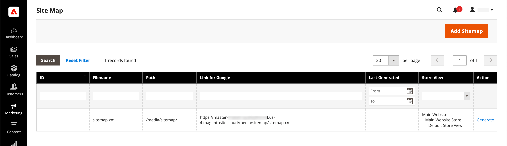
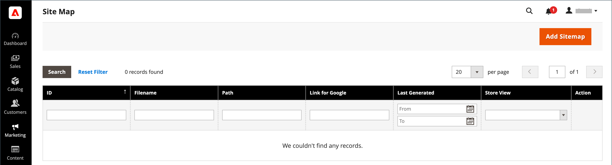

# 站点地图

网站地图改进了搜索引擎为存储编制索引的方式，并设计为可查找可能被网络爬虫忽略的页面。 可以将站点地图配置为为所有页面和图像编制索引。

启用后，Commerce会创建一个名为的文件 `sitemap.xml` 会保存到您指定的位置的安装中。 利用配置，可设置更新频率以及每种内容类型的优先级。 您的网站地图应按照网站内容更改频率进行更新，更改频率可以是每日、每周或每月。

当您的网站处于开发状态时，您可能会在 `robots.txt` 用于Web爬网程序的文件，以避免对网站编制索引。 然后，在启动之前，您可以更改相关说明，以允许为网站编制索引。

有关技术信息，请参阅 [添加Sitemap和robots.txt][1] 在 _云基础架构上的Commerce指南_.

{width="700" zoomable="yes"}

## 步骤1. 配置站点地图

完成 [XML站点地图配置](#site-map-configuration) 以确定包含的内容以及网站地图的更新频率。

## 步骤2. 生成网站地图

1. 在 _管理员_ 菜单，转到 **[!UICONTROL Marketing]** > _[!UICONTROL SEO & Search]_>**[!UICONTROL Site Map]**.

1. 单击 **[!UICONTROL Add Site Map]**.

   {width="700" zoomable="yes"}

1. 输入网站地图 **[!UICONTROL Filename]**. 例如： `sitemap.xml`

1. 输入 **[!UICONTROL Path]** 以确定站点地图文件在服务器上的存放位置。 确保路径可写。

   - `/sitemap/`  — 将站点地图文件放置在名为的目录中 _Sitemap_.

   - `/`  — 将站点地图文件放置在Commerce安装的基本路径或根目录下。

   {width="600" zoomable="yes"}

1. 完成后，单击 **[!UICONTROL Save & Generate]**.

   站点地图可能需要几分钟才能显示在网格中。

## 步骤3. 配置和启用robots.txt （可选）

完成 [搜索引擎机器人](seo-overview.md#search-engine-robots) 使用相关说明进行配置，这些说明指示搜索引擎爬取要编制索引的网站部分。

## 步骤4. 将您的网站地图提交到搜索引擎

您可以通过向不同的搜索引擎提供指向以下内容的链接，将您的网站地图提交到这些搜索引擎： `sitemap.xml` 文件，而不是Commerce安装中的文件。 要复制链接，请执行以下操作：

1. 在 _网站地图_ 列表中，右键单击该URL **[!UICONTROL Link for Google]** 列。

1. 在菜单中，选择 **[!UICONTROL Copy Link Address]**.

有关更多信息，请参阅特定搜索引擎的说明。 以下是指向两个热门搜索引擎的说明的链接：

- [Google][2]
- [Microsoft® Bing][3]

## 步骤5：恢复先前的自动机指令（可选）

您现在可以恢复原始（默认）限制。

## 管理多个网站的站点地图和robots.txt

如果您拥有多个网站，则可以简化创建和提交站点地图的过程。 简单 [创建](#site-map-configuration) 包含所有已验证存储的URL的一个或多个站点地图，并将这些站点地图保存到单个位置。 所有站点都必须在 [Google搜索控制台](https://support.google.com/webmasters/answer/7451001).

要为多存储实例创建站点地图，请执行以下操作：

1. 创建名为的文件夹 `sitemaps` 然后，在网站的根目录下为每个域创建子文件夹：

       /sitemaps/domain_1/
       /sitemaps/domain_2/
   
1. 在 _管理员_ 侧栏，转到 **[!UICONTROL Marketing]** > _[!UICONTROL SEO & Search]_>**[!UICONTROL Site Map]**.

1. 创建或编辑每个商店的站点地图列表，并设置 **[!UICONTROL Path]** 添加到您为商店创建的存储库：

   `/sitemaps/domain_1/`
   `/sitemaps/domain_2/`

1. 如果需要，请更新robots.txt文件。

   要确保将搜索引擎蜘蛛正确定向到新的sitemap，可以更新或创建robots.txt文件。 在顶部添加以下行。

       网站站点地图
       站点地图： https://www.domain_1.com/sitemaps/domain_1/sitemap.xml
       站点地图： https://www.domain_2.com/sitemaps/domain_2/sitemap.xml
   
>[!NOTE]
>
>如果您的网站使用 [Apache](https://experienceleague.adobe.com/docs/commerce-operations/installation-guide/prerequisites/web-server/apache.html) Web服务器引擎，您应该更新 [`.htaccess`](https://httpd.apache.org/docs/current/howto/htaccess.html) 文件，将任何其他Sitemap请求定向到适当的位置。

## 列描述

| 列 | 描述 |
|------|-----------|
| [!UICONTROL ID] | 当前站点地图的连续记录编号。 |
| [!UICONTROL Filename] | 站点地图的文件名。 |
| [!UICONTROL Path] | 站点地图在服务器上的位置。 例如：  `/sitemap/`  — 将站点地图文件放置在名为的目录中 _Sitemap_，比Commerce安装的根目录低一个级别。  `/`  — 将站点地图文件放置在Commerce安装的基本路径或根目录下。 |
| [!UICONTROL Link for Google] | 将提交到Google和其他搜索引擎的站点地图的URL。 |
| [!UICONTROL Last Generated] | 指示上次生成网站地图的日期和时间。 |
| [!UICONTROL Store View] | 应用站点地图的商店视图。 |
| [!UICONTROL Generate] | 重新生成站点地图。 |

{style="table-layout:auto"}

## 站点地图配置

您的网站地图应按照网站内容更改频率进行更新，更新频率可以是每日、每周或每月。 利用配置，可设置每种内容类型的频率和优先级。

### 步骤1. 设置内容更新的频率和优先级

1. 在 _管理员_ 侧栏，转到 **[!UICONTROL Stores]** > _[!UICONTROL Settings]_>**[!UICONTROL Configuration]**.

1. 在左侧面板中，展开 **[!UICONTROL Catalog]** 并选择 **[!UICONTROL XML Sitemap]**.

1. 展开  该 **[!UICONTROL Categories Options]** 部分并执行以下操作：

   >[!NOTE]
   >
   >如有需要，清除 **[!UICONTROL Use system value]** 复选框以更改这些设置。

   - 设置 **[!UICONTROL Frequency]** 更改为以下任一项：

      - `Always`
      - `Hourly`
      - `Daily`
      - `Weekly`
      - `Monthly`
      - `Yearly`
      - `Never`

   - 对象 **[!UICONTROL Priority]**，请输入一个值，介于 `0.0` 和 `1.0`. 零的优先级最低。

   {width="600" zoomable="yes"}

   有关这些选项的详细列表，请参阅 [类别选项](../configuration-reference/catalog/xml-sitemap.md#categories-options) 在 _配置引用_.

1. 展开  该 **[!UICONTROL Products Options]** 部分并完成 **[!UICONTROL Frequency]** 和 **[!UICONTROL Priority]** 设置。

   有关这些选项的详细列表，请参阅 [产品选项](../configuration-reference/catalog/xml-sitemap.md#products-options) 在 _配置引用_.

1. 要确定站点地图中包含图像的程度，请设置 **[!UICONTROL Add Images into Sitemap]** 更改为以下任一项：

   - `None`
   - `Base Only`
   - `All`

   {width="600" zoomable="yes"}

1. 展开  该 **[!UICONTROL CMS Pages Options]** 部分并完成 **[!UICONTROL Frequency]** 和 **[!UICONTROL Priority]** 设置。

   {width="600" zoomable="yes"}

   有关这些选项的详细列表，请参阅 [CMS页面选项](../configuration-reference/catalog/xml-sitemap.md#cms-pages-options) 在 _配置引用_.

1. 展开  该 **[!UICONTROL Store Url Options]** 部分并完成 **[!UICONTROL Frequency]** 和 **[!UICONTROL Priority]** 设置。

   {width="600" zoomable="yes"}

   有关这些选项的详细列表，请参阅 [存储Url选项](../configuration-reference/catalog/xml-sitemap.md#store-url-options) 在 _配置引用_.

1. 完成后，单击 **[!UICONTROL Save Config]**.

### 步骤2. 完成生成设置

1. 展开  该 **[!UICONTROL Generation Settings]** 部分。

   如有需要，清除 **使用系统值** 复选框以更改这些设置。

   {width="600" zoomable="yes"}

   有关这些选项的详细列表，请参阅 [生成设置](../configuration-reference/catalog/xml-sitemap.md#generation-settings) 在 _配置引用_.

1. 要生成站点地图，请设置 **[!UICONTROL Enabled]** 到 `Yes` 并执行以下操作：

   - 设置 **[!UICONTROL Start Time]** 到您希望站点地图更新的小时、分钟和秒。

   - 设置 **[!UICONTROL Frequency]** 更改为以下任一项：

      - `Daily`
      - `Weekly`
      - `Monthly`

   - 对象 **[!UICONTROL Error Email Recipient]**，输入在站点地图更新期间发生错误时要接收通知的人员的电子邮件地址。

   - 设置 **[!UICONTROL Error Email Sender]** 发送给显示为错误通知发送者的商店联系人。

   - 设置 **[!UICONTROL Error Email Template]** 到用于错误通知的模板。

### 步骤3. 设置站点地图文件限制

1. 展开  该 **[!UICONTROL Sitemap File Limits]** 部分。

   {width="600" zoomable="yes"}

   有关这些选项的详细列表，请参阅 [站点地图文件限制](../configuration-reference/catalog/xml-sitemap.md#sitemap-file-limits) 在 _配置引用_.

1. 对象 **[!UICONTROL Maximum No of URLs per File]**，输入站点地图中可包含的最大URL数。

   默认情况下，限制为50,000。

1. 对象 **[!UICONTROL Maximum File Size]**，输入为Sitemap分配的最大字节数。

   默认大小为10,485,760字节。

### 步骤4. 设置搜索引擎提交设置

1. 展开  该 **[!UICONTROL Search Engine Submission Settings]** 部分。

   {width="600" zoomable="yes"}

1. 如果使用 `robots.txt` 文件，以便为爬取网站的搜索引擎提供说明，请设置 **[!UICONTROL Enable Submission to Robots.txt]** 到 `Yes`.

1. 完成后，单击 **[!UICONTROL Save Config]**.

[1]: https://experienceleague.adobe.com/docs/commerce-cloud-service/user-guide/configure-store/robots-sitemap.html
[2]: https://support.google.com/webmasters/answer/183669?hl=en
[3]: https://www.bing.com/webmasters/help/Sitemaps-3b5cf6ed
