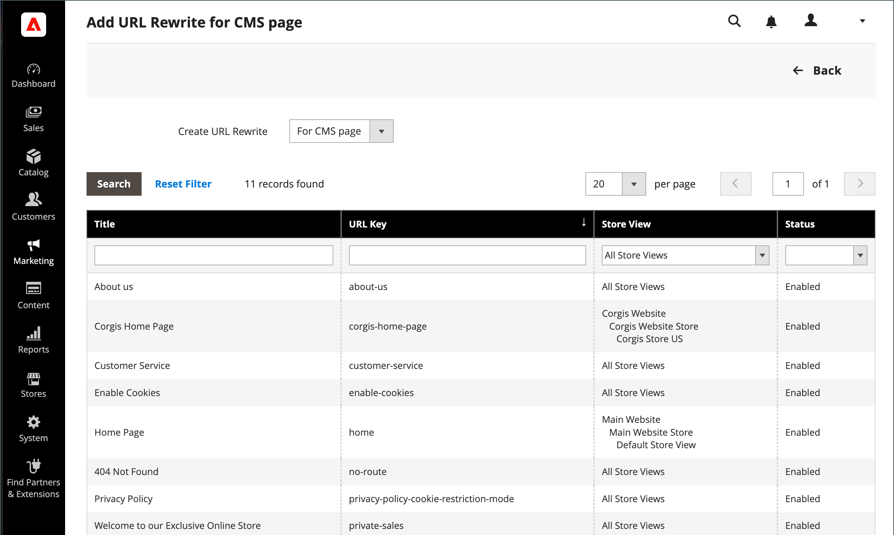

# 内容页面URL重写

在开始之前，请确保您确切了解重定向的作用。 思考以下方面 _目标_ / _源_ 或 _重定向到_ / _重定向自_. 尽管人们可能仍会从搜索引擎或过时的链接导航到之前的页面，但重定向会导致您的商店切换到新目标。

{width="700" zoomable="yes"}

## 步骤1. 计划重写

要避免错误，请记下 _重定向到_ 页面和 _重定向自_ 页面。

如果不确定，请打开商店中的每个页面，并从浏览器的地址栏复制路径。

### CMS页面路径

重定向至： `new-page`

重定向自： `old-page`

## 步骤2. 创建重写

{{url-rewrite-params}}

1. 在 _管理员_ 侧栏，转到 **[!UICONTROL Marketing]** > _[!UICONTROL SEO & Search]_>**[!UICONTROL URL Rewrites]**.

1. 在继续操作之前，请执行以下操作以验证请求路径是否可用。

   - 在顶部的搜索筛选器中 **[!UICONTROL Request Path]** 列中，输入要重定向的页面的URL键，然后单击 **[!UICONTROL Search]**.

   - 如果该页面有多个重定向记录，请查找与适用的商店视图匹配的重定向记录，然后在编辑模式下打开该页面。

   - 在右上角，单击 **[!UICONTROL Delete]**. 出现提示时，单击 **[!UICONTROL OK]** 以确认。

1. 返回“URL重写”页面时，单击 **[!UICONTROL Add URL Rewrite]**.

1. 设置 **[!UICONTROL Create URL Rewrite]** 到 `for CMS page`.

1. 在网格中找到新的目标页面，并在编辑模式下打开。

   {width="700" zoomable="yes"}

1. 在“URL Rewrite Information（URL重写信息）”下，执行以下操作：

   - 如果您有多个商店视图，请选择 **[!UICONTROL Store]** 在适用重写时。

   - 对象 **[!UICONTROL Request Path]**，输入客户请求的原始页面的URL键。 这是 _重定向自_ 页面。

     >[!NOTE]
     >
     >对于指定的存储，请求路径必须是唯一的。 如果已经有使用同一请求路径的重定向，则在尝试保存该重定向时会收到一个错误。 必须先删除以前的重定向，然后才能创建重定向。

   - 设置 **[!UICONTROL Redirect]** 更改为以下任一项：

      - `Temporary (302)`
      - `Permanent (301)`

   - 请键入重写的简短说明，以供您参考。

   {width="600" zoomable="yes"}

1. 在保存重定向之前，请查看以下内容：

   - 左上角的链接显示目标页面的名称。
   - 请求路径包含原始文件的路径 _重定向自_ 页面。

1. 完成后，单击 **[!UICONTROL Save]**.

   新的重写将显示在列表顶部的网格中。

## 步骤3. 测试结果

1. 转到您商店的主页。

1. 执行以下操作之一：

   - 导航到原始文件 _重定向自_ 页面。
   - 在浏览器的地址栏中，输入原始 _重定向自_ 页面，紧跟商店URL并按 **输入**.

   此时将显示新的目标页面，而不是原始页面请求。

## 字段描述

| 字段 | 描述 |
|--- |--- |
| [!UICONTROL Create URL Rewrite] | 指示重写的类型。 创建重写后无法更改类型。 选项： `Custom` / `For category` / `For product` / `For CMS page` |
| [!UICONTROL Request Path] | 要重定向的CMS页面。 请求路径必须是唯一的，并且不能被另一个重定向使用。 如果收到请求路径存在的错误消息，请删除现有的重定向，然后重试。 |
| [!UICONTROL Target Path] | 系统用来指向目标的内部路径。 目标路径呈灰显状态，无法编辑。 |
| [!UICONTROL Redirect] | 确定重定向的类型。 选项：  **[!UICONTROL No]**— 未指定重定向。 **[!UICONTROL Temporary (302)]**  — 向搜索引擎指示重写时间有限。 搜索引擎通常不会保留页面排名信息以进行临时重写。  **[!UICONTROL Permanent (301)]**— 向搜索引擎指示重写是永久的。 搜索引擎通常会保留页面排名信息以进行永久重写。 |
| [!UICONTROL Description] | 描述重写的用途，以供内部参考。 |

{style="table-layout:auto"}
