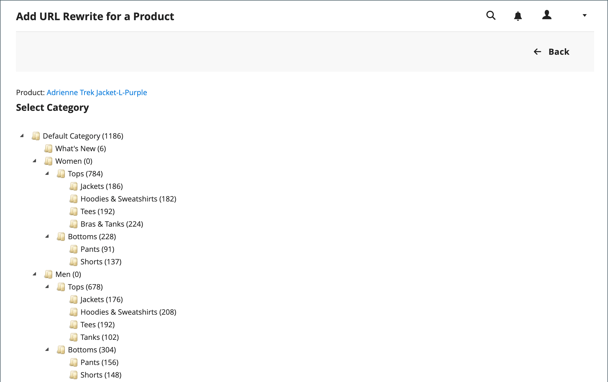
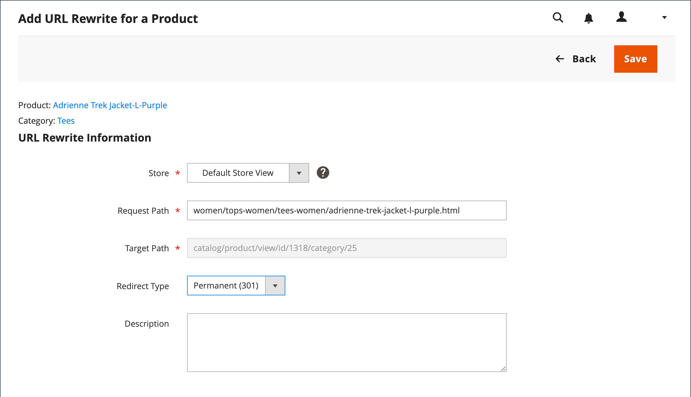
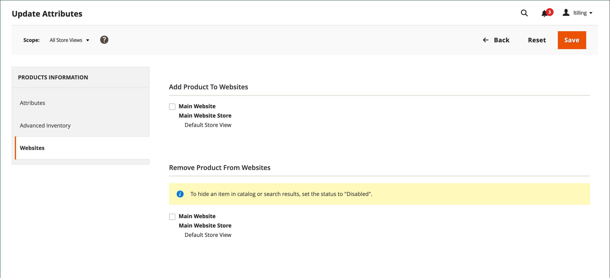

# 产品URL重写

在开始之前，请确保您确切了解重定向应该实现的目标。 思考以下方面 _目标_ / _原始请求_ 或 _重定向到_ / _重定向自_. 尽管人们可能仍会从搜索引擎或过时的链接导航到之前的页面，但重定向会导致您的商店切换到新目标。

如果 [自动重定向](url-redirect-product-automatic.md) 已为您的商店启用，因此在使用产品时不需要创建重写 [URL键](../catalog/catalog-urls.md) 已更改。

{{url-rewrite-skip}}

## 步骤1. 计划重写

要避免出错，请写下 _重定向到_ 路径和 _重定向自_ 路径并包含URL密钥和后缀（如果适用）。

如果您不确定，请打开您商店中的每个产品页面，然后从浏览器的地址栏复制路径。 在创建产品重定向时，您可以包含或排除 [类别路径](../catalog/catalog-urls.md). 在本例中，我们创建了一个没有类别路径的产品重定向。

### 具有类别路径的产品

重定向至： `gear/bags/impulse-duffle.html`

重定向自： `gear/bags/overnight-duffle.html`

### 没有类别路径的产品

重定向至： `impulse-duffle.html`

重定向自： `overnight-duffle.html`

## 步骤2. 创建重写

{{url-rewrite-params}}

1. 在 _管理员_ 侧栏，转到 **[!UICONTROL Marketing]** > _[!UICONTROL SEO & Search]_>**[!UICONTROL URL Rewrites]**.

1. 在继续操作之前，请执行以下操作以验证请求路径是否可用。

   - 在顶部的搜索筛选器中 **[!UICONTROL Request Path]** 列中，输入要重定向的页面的URL键，然后单击 **[!UICONTROL Search]**.

   - 如果该页面有多个重定向记录，请查找与适用的商店视图匹配的重定向记录，然后在编辑模式下打开该页面。

   - 在右上角，单击 **[!UICONTROL Delete]**. 出现提示时，单击 **[!UICONTROL OK]** 以确认。

1. 在URL重写页面的右上角，单击 **添加URL重写**.

1. 设置 **[!UICONTROL Create URL Rewrite]** 到 `For product`.

1. 在网格中，查找作为重定向的目标（目标）的产品，然后单击行。

   {width="700" zoomable="yes"}

1. 在类别树下，单击 **[!UICONTROL Skip Category Selection]**.

   对于此示例，重定向不包含类别。

   {width="600" zoomable="yes"}

   “为产品添加URL重写”页面的左上角显示指向目标的链接，而“目标路径”字段显示路径的系统版本，该版本无法更改。 最初，重定向路径字段还会显示目标路径。

   - 如果您有多个商店视图，请设置 **[!UICONTROL Store]** 到应用重写的视图。 否则，将为每个视图创建一个重写。

   - 对象 **[!UICONTROL Request Path]**，通过输入原始产品请求的URL密钥和后缀（如果适用）来替换默认值。 这是 _重定向自_ 您在规划步骤中标识的产品。

     >[!NOTE]
     >
     >对于指定的存储，请求路径必须是唯一的。 如果已经有使用同一请求路径的重定向，则在尝试保存该重定向时会收到一个错误。 必须先删除以前的重定向，然后才能创建重定向。

   - 设置 **[!UICONTROL Redirect Type]** 更改为以下任一项：

      - `Temporary (302)`
      - `Permanent (301)`

   - 供您参考，请输入摘要 **[!UICONTROL Description]** 重新写入的权限。

   {width="600" zoomable="yes"}

1. 在保存重定向之前，请查看以下内容：

   - 左上角的链接显示目标产品的名称。
   - 请求路径包含原始文件的路径 _重定向自_ 产品。

1. 完成后，单击 **[!UICONTROL Save]**.

   新产品重写现在显示在“URL重写”网格的顶部。

## 步骤3. 测试结果

1. 转到您商店的主页。

1. 执行以下操作之一：

   - 导航到原始文件 _重定向自_ 产品请求页面。
   - 在浏览器的地址栏中，输入原始文件的路径 _重定向自_ product紧跟在商店URL之后，然后按 **输入**.

   此时将显示新的Target产品，而不是原始产品请求。

## 字段描述

| 字段 | 描述 |
|--- |--- |
| [!UICONTROL Create URL Rewrite] | 指示重写的类型。 创建重写后无法更改类型。 选项： `Custom` / `For category` / `For product` / `For CMS page` |
| [!UICONTROL Request Path] | 要重定向的产品。 根据您的配置，请求路径可能包括 `.html` 或 `.htm` 后缀和类别。 请求路径必须是唯一的，并且不能被另一个重定向使用。 如果您收到请求路径存在的错误，请删除现有重定向，然后重试。 |
| [!UICONTROL Target Path] | 系统用来指向重定向目标的内部路径。 目标路径呈灰显状态，无法编辑。 |
| [!UICONTROL Redirect] | 确定重定向的类型。 选项：  **[!UICONTROL No]**— 未指定重定向。 许多操作都会创建此类型的重定向请求。 例如，每次将产品添加到类别时， `No` 在每个商店视图中创建类型。 **[!UICONTROL Temporary (302)]**  — 向搜索引擎指示重写时间有限。 搜索引擎通常不会保留页面排名信息以进行临时重写。  **[!UICONTROL Permanent (301)]**— 向搜索引擎指示重写是永久的。 搜索引擎通常会保留页面排名信息以进行永久重写。 |
| [!UICONTROL Description] | 描述重写的用途，以供内部参考。 |

{style="table-layout:auto"}

## 多个URL重写

您可以使用以下步骤同时快速更新多个或所有产品的URL重写。

1. 在 _管理员_ 侧栏，转到 **[!UICONTROL Catalog]** > **[!UICONTROL Products]**.

1. 选择要更新URL重写的所有产品。

1. 下 _[!UICONTROL Actions]_，选择&#x200B;**[!UICONTROL Update attributes]**更新多个或全部重写。

1. 下 _[!UICONTROL PRODUCTS INFORMATION]_，单击&#x200B;**[!UICONTROL Websites]**选项卡。

1. 在 _[!UICONTROL Add Product To Websites]_部分，选择要还原URL重写的所有网站。

1. 准备更新时，单击 **[!UICONTROL Save]**.

>[!NOTE]
>
>所有选定的产品都将读取到选定的网站，并重新生成URL重写。

{width="600" zoomable="yes"}
