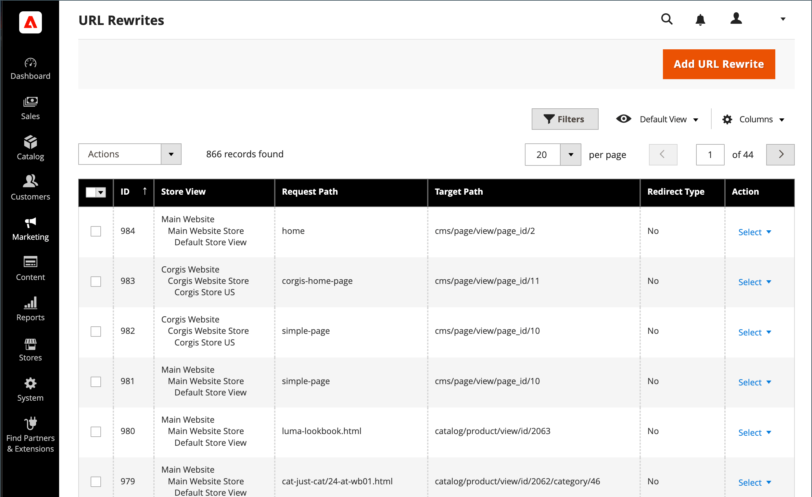

# URL重写

>[!TIP]
>
>对于Adobe Commerce as a Cloud Service，请参阅Commerce Storefront文档中的[SEO准则](https://experienceleague.adobe.com/developer/commerce/storefront/setup/seo/indexing/?lang=zh-Hans)

URL重写工具允许您更改与产品、类别或CMS页面关联的任何URL。 创建URL重写时，Commerce会自动创建永久重定向(301)，以便将指向旧URL的任何链接重定向到新地址。

>[!NOTE]
>
>要同时更新多个或所有产品的URL重写，请参阅[多个URL重写](url-rewrite-product.md#multiple-url-rewrites)。

>[!BEGINSHADEBOX “了解重写和重定向”]

术语&#x200B;_重写_&#x200B;和&#x200B;_重定向_&#x200B;通常可互换使用，但它们是不同的操作：

* **URL重写** — 一种服务器端进程，它在内部将一个URL映射到另一个URL，而不更改浏览器地址栏中显示的内容。 当访客请求URL时，服务器会在后台将其作为其他URL处理，但浏览器会继续显示原始URL。

* **URL重定向** — 向浏览器发送HTTP响应，指示浏览器导航到其他URL。 浏览器的地址栏将更新以显示新的URL。 重定向可以是临时的(302)或永久的(301)。

>[!ENDSHADEBOX]

## 重写工具的工作原理

在Adobe Commerce中，默认情况下，URL重写工具会创建永久重定向(301)，以便在您更改产品、类别或页面的URL键时保留SEO值。 此行为可确保现有链接继续正常使用，并保持搜索引擎排名。

默认情况下，您的商店已启用[自动URL重定向](url-redirect-product-automatic.md)，并且在每个产品的URL键字段下选中了&#x200B;**为旧URL创建永久重定向**&#x200B;复选框。

{{url-rewrite-skip}}

{width="600" zoomable="yes"}

{{url-rewrite-params}}

## URL重写演示

观看以下视频，了解如何管理URL重写：

>[!VIDEO](https://video.tv.adobe.com/v/3410123?captions=chi_hans&quality=12&learn=on)

## 创建URL重写

使用URL重写工具创建产品和类别重定向，以及商店中任何页面的自定义重定向。 应用URL重写配置后，指向上一个URL的任何现有链接都会无缝重定向到新地址。

您可以创建URL重写至：

* 添加高值关键字以改进搜索引擎为产品编制索引的方式。

* 为临时季节性更改或永久更改添加其他URL。

* 为页面(包括CMS内容页面)添加有效路径。 例如，您可以创建一个URL，以便在系统上创建一个对用户或SEO更友好的URL，该URL始终按其内部ID引用产品和类别。

您创建的URL重写可以重定向到现有类别或自定义页面，而无需更改网站结构，从而轻松为营销活动创建令人印象深刻的URL。

{width="700" zoomable="yes"}

Commerce提供以下URL重写类型：

* [产品重写](url-rewrite-product.md)
* [类别重写](url-rewrite-category.md)
* [CMS页面重写](url-rewrite-cms-page.md)
* [自定义重写](url-rewrite-custom.md)

### 用例和示例

URL重写通常在以下情况下使用：

#### 将内部系统URL更改为对SEO友好的URL

Commerce在内部使用基于ID的URL，但您可以为客户创建SEO友好的URL：

**系统URL（内部）：**

    http://www.example.com/catalog/category/id/6

**面向客户的URL：**

    http://www.example.com/peripherals/keyboard.html

#### 产品重新品牌化或URL优化

当您重命名产品或希望改进其SEO URL时，请创建重定向以保留现有链接：

**原始URL：**

    http://www.example.com/peripherals/keyboard.html

**新的优化URL：**

    http://www.example.com/ergonomic-keyboard.html

重写工具会自动创建从旧URL到新URL的301重定向，因此客户和搜索引擎可无缝地重定向到正确的页面。

#### 促销登陆页面

为营销活动创建临时或永久自定义URL：

**促销URL：**

    http://www.example.com/all-on-sale.html
    http://www.example.com/save-now/spring-sale

## 其他URL管理配置

以下部分介绍了如何为Commerce配置Web服务器重写和规范URL。

### 配置Web服务器重写

>[!NOTE]
>
>本节介绍Web服务器级别的URL重写，它与URL重写工具功能不同。 Web服务器重写处理技术URL格式（如删除`index.php`），而URL重写工具管理内容更改的重定向。

启用Web服务器重写是初始Commerce设置的一部分，通常在安装期间进行配置。 启用后，Web服务器（Apache或Nginx）会自动从URL中删除文件名`index.php`，从而创建更干净的、SEO更友好的地址。
以下示例显示了在启用Web服务器重写和不启用Web服务器重写的情况下URL的显示方式：

**没有Web服务器重写的URL**

    http://www.yourdomain.com/magento/index.php/storeview/url-identifier

带有Web服务器重写的&#x200B;**URL**

    http://www.yourdomain.com/magento/storeview/url-identifier

#### 启用或禁用Web服务器重写：

1. 在&#x200B;_管理员_&#x200B;侧边栏上，转到&#x200B;**[!UICONTROL Stores]** > _[!UICONTROL Settings]_>**[!UICONTROL Configuration]**。

1. 在展开&#x200B;**[!UICONTROL General]**&#x200B;的左侧面板中，选择&#x200B;**[!UICONTROL Web]**。

1. 展开扩展选择器&#x200B;**[!UICONTROL Search Engine Optimization]**。

   {width="600" zoomable="yes"}

1. 将&#x200B;**[!UICONTROL Use Web Server Rewrites]**&#x200B;设置为您的首选项。

1. 完成后，单击&#x200B;**[!UICONTROL Save Config]**。

### 指定规范URL

出于SEO目的，您的每个网页应该只有一个不同的URL。

如果您有一个可供多个URL访问的页面，或者您拥有的内容相似的其他页面，Google会将这些页面视为同一页面的重复版本。 Google选择一个URL作为规范版本并对该URL进行爬网，而所有其他URL则被视为重复URL，爬网的频率较低。

如果您没有明确告知给Google哪个URL是规范的，则会为您做出选择，或者可能会认为这两者具有相等权重。 这可能会导致不必要的行为，并可能导致爬网预算无效和分布式反向链接不足。

根据您设置网站的方式，索引中可能会有您网站的多个版本，例如：

    https://www.example.com
    https://www.example.com/
    http://www.example.com
    https://example.com
    https://www.example.com/index.html

要指定规范页面，请参阅[Google Search Central文档](https://developers.google.com/search/docs/crawling-indexing/consolidate-duplicate-urls)。
