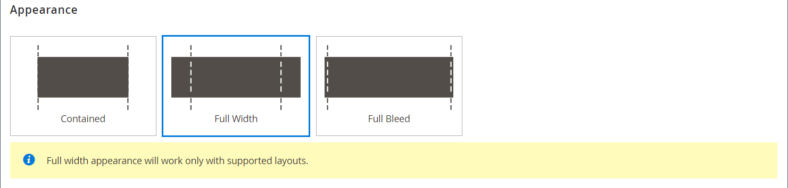
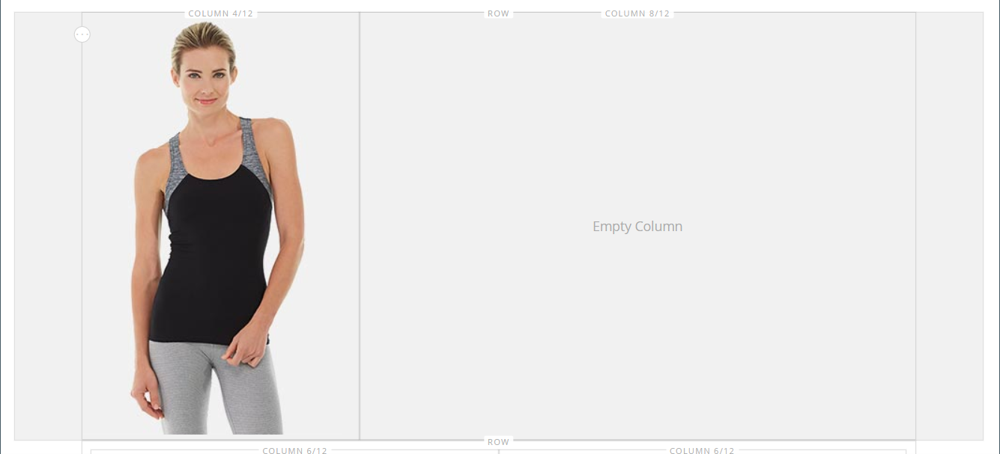

# [!DNL Page Builder]演练第1部分：简单页面

按照此三部分练习进行操作，通过创建一个简单页面来熟悉[!DNL Page Builder]工作区，该页面说明了创建您自己的设计中内容丰富的页面是多么容易。

{width="700" zoomable="yes"}

>[!NOTE]
>
>这些演练已更新，以反映对2.4.1版本中[!DNL Page Builder]工作区的近期更改。

## 开始之前

在开始本练习之前，建议您增加[管理员会话生命周期](../systems/security-admin.md)以防止会话在您工作时超时。

验证所需的内容管理配置设置：

- 已在[WYSIWYG选项](../content-design/editor.md#configure-the-editor)配置中启用WYSIWYG编辑器。

- 已在[高级内容工具](setup.md)配置中启用[!DNL Page Builder]。

### 下载演练图像资产

1. 下载[`simple-page-assets`](./assets/simple-page-assets.zip)文件并将文件保存到您的本地系统。

1. 导航到下载的文件并解压缩文件。

   在Windows系统上，右键单击并选择&#x200B;**[!UICONTROL Extract All]**&#x200B;文件。 然后，选择目标文件夹并单击&#x200B;**[!UICONTROL Extract]**。

   在Mac系统上，只需双击zip文件，然后将提取的文件移动到目标文件夹即可。

   该文件夹包含以下图像文件：

   ![[!DNL Page Builder]个演练文件 — 简单页面资产](./assets/pb-tutorial-simple-page-assets.png){width="500"}

按照顺序执行本演练的三个部分。

## 第1部分：带有横幅的完全出血行

在简单页面练习的这一可选部分中，您将创建一个具有完整出血行和横幅的页面。 该行具有桌面和移动设备的不同背景图像。

![[!DNL Page Builder]带有横幅的完全出血行](./assets/pb-tutorial1-full-bleed-with-banner.png){width="700" zoomable="yes"}

### 步骤1：创建页面

1. 在&#x200B;_管理员_&#x200B;侧边栏上，转到&#x200B;**[!UICONTROL Content]** > _[!UICONTROL Elements]_>**[!UICONTROL Pages]**。

1. 单击右上角的&#x200B;**[!UICONTROL Add New Page]**&#x200B;并执行以下操作：

   - 若要防止在您的存储中发布此页面，请将&#x200B;**[!UICONTROL Enable Page]**&#x200B;设置为`No`。

   - 对于&#x200B;**[!UICONTROL Page Title]**，输入`Simple Page`。

   {width="600" zoomable="yes"}

1. 展开&#x200B;**[!UICONTROL Design]**&#x200B;部分的。

   请注意，默认情况下，**[!UICONTROL Layout]**&#x200B;设置为`Page -- Full Width`。 除了五个标准[布局](../content-design/page-layout.md)选项外，[!DNL Page Builder]还添加了页面、类别和产品的全宽布局。

1. 如果样本数据可用，请将&#x200B;**[!UICONTROL New Theme]**&#x200B;设置为`Magento Luma`。 否则，您可以选择其他可用的主题或将其留空以使用默认主题。

   _[!UICONTROL New Theme]_设置可用于覆盖默认主题并将其他主题应用到页面。

   >[!NOTE]
   >
   >全宽布局只能与兼容的[主题](../content-design/themes.md)一起使用。

   {width="600" zoomable="yes"}

1. 单击右上角的&#x200B;**[!UICONTROL Save]**。

   保存该页面后，名称&#x200B;_简单页面_&#x200B;将显示在页面的左上角。

### 第2步：设置行的格式

1. 展开&#x200B;**[!UICONTROL Content]**&#x200B;部分的。

   此操作显示带有空行的[!DNL Page Builder]预览。

   >[!NOTE]
   >
   >[内容标题](workspace.md)字段是可选的。 默认情况下，根据主题设置标题级别1 (H1)的格式。 在本练习中，_内容标题_&#x200B;保留为空。

   {width="600" zoomable="yes"}

1. 单击&#x200B;**[!UICONTROL Edit with Page Builder]**&#x200B;或在内容预览区域内。

   在展开的[!DNL Page Builder] [工作区](workspace.md)中，左侧的面板提供了可用于在阶段中构建内容的内容工具。

1. 将鼠标悬停在空行上以显示工具箱。

   每个内容容器都有一个工具箱，其中包含一组相似的选项。

   ![[!DNL Page Builder]行工具箱](./assets/pb-layout-page-add-content-row-tools.png){width="600" zoomable="yes"}

1. 在行工具箱中，选择&#x200B;_设置_ ({width="20"}图标。

1. 在&#x200B;_[!UICONTROL Appearance]_下，选择&#x200B;**完全出血**。

   “完全出血”外观设置可将行和背景的内容区域的左右边框扩展到页面的全部宽度。

   {width="600" zoomable="yes"}

1. 向下滚动到&#x200B;_[!UICONTROL Advanced]_部分并将所有&#x200B;**[!UICONTROL Margins and Padding]**设置设置为`0`。

   此设置可确保横幅扩展行的完整宽度。

   {width="600" zoomable="yes"}

1. 要保存设置并返回[!DNL Page Builder]工作区，请向上滚动到页面顶部并单击右上角的&#x200B;**[!UICONTROL Save]**。

### 步骤3：添加横幅

>[!NOTE]
>
>[!DNL Page Builder]具有名为&#x200B;_Banner_&#x200B;的新内容类型，此步骤中特别介绍了该类型。 以前的“内容”菜单中的&#x200B;_Banner_&#x200B;选项现在是&#x200B;_动态块_。

1. 在[!DNL Page Builder]面板中，展开&#x200B;**[!UICONTROL Media]**&#x200B;并将&#x200B;**横幅**&#x200B;占位符拖到舞台上。

   {width="600" zoomable="yes"}
1. 将鼠标悬停在横幅容器上以显示工具箱。

   >[!NOTE]
   >
   >现在，舞台有两个内容容器，每个容器都有一个单独的工具箱。 由于横幅嵌套在行中，因此请确保您使用的是正确的工具箱。

   除了工具箱之外，还包含&#x200B;_上传图像_&#x200B;和&#x200B;_从图库中选择_&#x200B;按钮，以便您可以直接从舞台上快速更改横幅。

   {width="600" zoomable="yes"}

1. 在横幅工具箱中，选择&#x200B;_设置_ （ {width="20"} ）图标。

1. 在&#x200B;_[!UICONTROL Appearance]_下，选择&#x200B;**[!UICONTROL Collage Right]**。

   “拼贴右侧”设置将内容放置在横幅的右侧。

   {width="600" zoomable="yes"}

1. 向下滚动到&#x200B;_[!UICONTROL Background]_部分并设置横幅的背景图像：

   - 对于&#x200B;**[!UICONTROL Background Image]**，单击&#x200B;**上传**。

     {width="600" zoomable="yes"}

     导航到保存提取的简单页面资产的目录，然后选择`wide-banner-background.jpg`文件。

     上传图像，并显示上传图像的缩略图。 文件名、图像尺寸和文件大小如下所述。

     {width="600" zoomable="yes"}

   - 对于&#x200B;**[!UICONTROL Background Mobile Image]**，单击&#x200B;**上传**。

     在同一文件目录中，选择`wide-banner-background-mobile.jpg`文件。

     移动设备使用移动设备背景图像，每当将桌面浏览器窗口的大小调整为移动设备的宽度时，也会使用背景图像。

     {width="600" zoomable="yes"}

   - 回滚到页面顶部并单击&#x200B;**[!UICONTROL Save]**&#x200B;以保存设置并返回[!DNL Page Builder]工作区。

     背景显示在舞台上，并扩展行的完整宽度。

     带有背景图像的{width="600" zoomable="yes"}

   请注意行右侧显示的占位符文本。 此文本的位置反映了&#x200B;_拼贴右侧_&#x200B;外观设置。

1. 单击占位符文本，然后输入以下消息作为两行：

   `Get fit and look fab in new seasonal styles.`

   `New LUMA yoga collection`

   编辑器工具栏显示在文本框上方。 文本可以直接从舞台输入和格式化，也可以选择横幅工具箱中的&#x200B;_设置_。

   {width="600" zoomable="yes"}

1. 对文本应用格式：

   - 选择文本的第一行。 然后，在&#x200B;**格式**&#x200B;下的编辑器工具栏上，选择`Heading 2`。

     {width="600" zoomable="yes"}

   - 选择第二行文本。 然后，在&#x200B;**格式**&#x200B;下的编辑器工具栏上，选择`Paragraph`。

   格式设置应用与当前主题关联的样式表中的样式。

   {width="600" zoomable="yes"}
__

1. 将鼠标悬停在上面以显示横幅工具箱，再次选择&#x200B;_设置_ （{width="20"} ）图标，然后滚动到&#x200B;_[!UICONTROL Content]_部分。

   请注意，您的文本显示在&#x200B;_消息文本_&#x200B;框中。 可以从舞台或横幅设置的&#x200B;_[!UICONTROL Content]_部分输入和编辑文本。

   {width="600" zoomable="yes"}

1. 继续在&#x200B;_[!UICONTROL Content]_部分中，设置横幅链接和按钮：

   - 将&#x200B;**链接**&#x200B;设置为`Category`，然后单击&#x200B;**[!UICONTROL Select]**&#x200B;以显示类别树。

   - 选择`What's New`作为链接的类别。

     {width="600" zoomable="yes"}

   - 将&#x200B;**[!UICONTROL Show Button]**&#x200B;设置为`Always`。

   - 对于&#x200B;**[!UICONTROL Button Text]**，输入`Shop Now`作为按钮上显示的文本。

   - 对于&#x200B;**[!UICONTROL Button Type]**，接受`Primary`默认值。

     当前主题中的按钮样式决定了按钮格式。

1. 设置横幅叠加：

   您可以使用叠加将背景颜色应用到由“外观”设置定义的活动内容区域。 横幅背景图像在横幅全宽范围内保持可见。

   - 将&#x200B;**[!UICONTROL Show Overlay]**&#x200B;设置为`Always`。

   - 对于&#x200B;**[!UICONTROL Overlay Color]**，请执行下列操作之一：

      - 单击颜色方框并选择白色色板。
      - 单击&#x200B;_无颜色_&#x200B;文本框并输入`White`或十六进制值`#ffffff`。

     然后，单击&#x200B;**[!UICONTROL Apply]**。

     {width="600" zoomable="yes"}

   - 回滚到页面顶部并单击&#x200B;**[!UICONTROL Save]**&#x200B;以保存设置并返回[!DNL Page Builder]工作区。

     按钮显示在舞台上横幅消息的下方。

     内容阶段中的{width="600" zoomable="yes"}

1. 在舞台的右上角，单击&#x200B;_关闭全屏_ （）图标。

   单击此图标会返回该页面的&#x200B;_[!UICONTROL Content]_部分，并显示预览。

   您可以随时在两种工作区模式之间切换。

1. 单击右上角的&#x200B;**[!UICONTROL Save]**&#x200B;箭头并选择&#x200B;**[!UICONTROL Save & Close]**。

1. 如果出现提示，请单击页面顶部消息中的[缓存管理](../systems/cache-management.md)链接，然后刷新任何无效的缓存。

## 第2部分：包含的行具有两个相等列

在本练习的此部分中，您将向页面中添加一行，并将该行划分为两个相等的列。 然后，将链接图像添加到每一列。 在说明中，每个新行都添加到第一行之前，以使[!DNL Page Builder]面板与舞台对齐。 在练习结束时，您可以重新排列行，使其与简单页面示例匹配。

{width="600" zoomable="yes"}

### 步骤1：添加行

1. 在“页面”网格中，找到您在本练习第一部分中创建的&#x200B;_简单页面_，并在&#x200B;_[!UICONTROL Action]_列中选择&#x200B;**[!UICONTROL Edit]**。

1. 展开&#x200B;**[!UICONTROL Content]**&#x200B;部分的。

1. 单击&#x200B;**[!UICONTROL Edit with Page Builder]**&#x200B;或在内容预览区域内。

1. 在&#x200B;_[!UICONTROL Layout]_下的[!DNL Page Builder]面板中，将&#x200B;**[!UICONTROL Row]**占位符拖到舞台上，并将其放在横幅上方。

   红色基准线标记两行之间的边界。

   {width="600" zoomable="yes"}

1. 将鼠标悬停在新行上以显示工具箱，然后选择&#x200B;_设置_ （ {width="20"} ）图标。

   {width="600" zoomable="yes"}

1. 在&#x200B;_[!UICONTROL Appearance]_下，接受&#x200B;**包含**默认设置。

   此设置将行的内容区域限制为主题定义的页面宽度。

   {width="600" zoomable="yes"}

1. 单击右上角的&#x200B;**[!UICONTROL Save]**&#x200B;以保存设置并返回[!DNL Page Builder]工作区。

### 第2步：添加列

1. 在&#x200B;_[!UICONTROL Layout]_下的[!DNL Page Builder]面板中，将&#x200B;**[!UICONTROL Column]**占位符拖到新行中。

   {width="600" zoomable="yes"}

   该行现在分为两列，每列的宽度相等。 每列都是一个单独的内容容器，并具有自己的专用选项工具箱。

   {width="600" zoomable="yes"}

1. 在第一列的左上角，单击圆形&#x200B;_网格_&#x200B;控件（）以显示网格准则。

   网格可确保内容保持一致，并在桌面和移动设备上正确呈现。 有关配置网格大小的信息，请参阅[!DNL Page Builder]设置主题中的[配置 [!DNL Page Builder]](setup.md#configure-page-builder)部分。

   每个列容器顶部边框的圆括号(6/12)中的数字表示每列中的网格划分数，以及行中的划分总数。

   {width="600" zoomable="yes"}的网格大小详细信息

### 步骤3：添加带有链接的图像

在此步骤中，您将了解如何将图像上传到横幅。

1. 在[!DNL Page Builder]面板中，展开&#x200B;**[!UICONTROL Media]**&#x200B;部分并将&#x200B;**[!UICONTROL Image]**&#x200B;占位符拖到第一列。

   {width="600" zoomable="yes"}

1. 将示例图像插入占位符。

   {width="600" zoomable="yes"}

   对于位于系统上的映像，可以选择以下任一方法：

   - **上载图像文件**：在第一列，单击&#x200B;**[!UICONTROL Upload Image]**。 然后，导航到保存提取的简单页面资产的目录，并选择`small-banner-1.jpg`文件。

     {width="600" zoomable="yes"}

     重复此操作，将`small-banner-2.jpg`文件添加到第二列。

   - **拖动图像文件**：在您的桌面上，打开简单页面资产文件夹，并将其放在您正在处理[!DNL Page Builder]舞台的管理浏览器窗口旁边。 然后，将文件`small-banner-1.jpg`从简单页面资源文件夹拖放到第一列。

     {width="600" zoomable="yes"}

     重复此操作，将`small-banner-2.jpg`文件添加到第二列。

1. 确定目录中的哪个页面要链接到每个图像。

1. 将鼠标悬停在第一列中的图像上以显示工具箱，然后选择&#x200B;_设置_ （ {width="20"} ）图标。

   {width="600" zoomable="yes"}

1. 将图像链接到类别：

   - 向下滚动并将&#x200B;**链接**&#x200B;设置为`Category`。

   - 在类别树中，向下钻取并选择`Men's Hoodies & Sweatshirt`类别。

   - 在右上角，**[!UICONTROL Save]**&#x200B;设置并返回[!DNL Page Builder]工作区。

1. 重复上一步骤，将第二列中的图像链接到&#x200B;_齿轮_&#x200B;类别。

1. 在舞台的右上角，单击&#x200B;_关闭全屏_ （）图标。

   单击此图标会返回该页面的&#x200B;_[!UICONTROL Content]_部分，并显示预览。

1. 单击右上角的&#x200B;**[!UICONTROL Save]**&#x200B;箭头并选择&#x200B;**[!UICONTROL Save & Close]**。

1. 出现提示时，请单击页面顶部消息中的[缓存管理](../systems/cache-management.md)链接，然后刷新任何无效的缓存。

## 第3部分：具有不相等列的全宽行

此页面的最后一行包含产品评论中的内容。 添加一个全宽行并将其划分为两个宽度不同的列。 将背景图像添加到第一列，并将匹配的背景颜色应用于行以获得统一的效果。

{width="500"}

### 步骤1：添加行

1. 在“页面”网格中，找到您在本练习第一部分中创建的&#x200B;_简单页面_，并在&#x200B;_[!UICONTROL Action]_列中选择&#x200B;**[!UICONTROL Edit]**。

1. 展开&#x200B;**[!UICONTROL Content]**&#x200B;部分的。

1. 单击&#x200B;**[!UICONTROL Edit with Page Builder]**&#x200B;或在内容预览区域内。

1. 在&#x200B;_[!UICONTROL Layout]_下的[!DNL Page Builder]面板中，将&#x200B;**[!UICONTROL Row]**占位符拖到舞台上，并将其置于本练习第二部分中创建的行上方。

   红色基准线标记两行之间的边界。

   {width="600" zoomable="yes"}

1. 将鼠标悬停在新行上以显示工具箱，然后选择&#x200B;_设置_ （{width="20"} ）图标。

   {width="600" zoomable="yes"}

1. 在&#x200B;_[!UICONTROL Appearance]_下的“编辑行”页面上，选择&#x200B;**[!UICONTROL Full Width]**。

   此设置将内容区域限制为由主题定义的最大页面宽度。 背景颜色和/或图像不受限制，并会扩展行的完整宽度。

   {width="600" zoomable="yes"}

1. 在&#x200B;_[!UICONTROL Background]_部分中，输入`#f1f1f1`作为&#x200B;**[!UICONTROL Background Color]**。

   {width="600" zoomable="yes"}

1. 向下滚动到&#x200B;_[!UICONTROL Advanced]_部分，并将所有&#x200B;**边距和边距**值设置为`0`。

   {width="600" zoomable="yes"}

1. 回滚到页面顶部并单击&#x200B;**[!UICONTROL Save]**&#x200B;以保存设置并返回[!DNL Page Builder]工作区。

   该行的背景颜色现在为淡黄色。

   舞台中具有背景颜色的{width="600" zoomable="yes"}

### 步骤2：添加不同宽度的列

1. 在&#x200B;_[!UICONTROL Layout]_下的[!DNL Page Builder]面板中，将&#x200B;**[!UICONTROL Column]**占位符拖到舞台上的顶行。

   {width="600" zoomable="yes"}

1. 将第一列的右边框拖动到网格上12个(`4/12`)位置中的四个位置。

   第二列的大小调整为12的8个(`8/12`)。

   {width="600" zoomable="yes"}

1. 将鼠标悬停在第一列容器上以显示工具箱，然后选择&#x200B;_设置_ （ {width="20"} ）图标。

1. 向下滚动到&#x200B;_[!UICONTROL Advanced]_部分，并将所有&#x200B;**边距和边距**值设置为`0`。

   {width="600" zoomable="yes"}

1. 回滚到页面顶部并单击&#x200B;**[!UICONTROL Save]**&#x200B;以保存设置并返回[!DNL Page Builder]工作区。

### 第3步：在第一列中添加图像

1. 在[!DNL Page Builder]面板中，展开&#x200B;**[!UICONTROL Media]**&#x200B;并将&#x200B;**[!UICONTROL Image]**&#x200B;内容类型拖到第一列。

   {width="600" zoomable="yes"}

1. 在图像占位符中，单击&#x200B;**[!UICONTROL Upload Image]**。

   {width="600" zoomable="yes"}

1. 导航到保存提取的简单页面资产的目录，然后选择`review-image.jpg`文件。

   上传的图像显示在第一列中，并与行的背景颜色无缝混合。

   {width="600" zoomable="yes"}

### 步骤4：将审核内容添加到第二列

行的第二列应包含客户评论的内容，包括五星级评级图像和格式化的文本消息。

1. 在[!DNL Page Builder]面板中，展开&#x200B;**[!UICONTROL Elements]**&#x200B;部分并将&#x200B;**[!UICONTROL Text]**&#x200B;内容类型拖到第二列。

   {width="600" zoomable="yes"}

1. 单击文本元素以显示编辑器工具栏。

1. 在工具栏中，单击&#x200B;_插入图像_ （）图标，然后执行以下操作：

   {width="600" zoomable="yes"}

   - 在&#x200B;_[!UICONTROL Insert/edit image]_对话框中，单击_[!UICONTROL Source]_&#x200B;字段旁边的&#x200B;_查找_ （ ）图标。

     {width="600" zoomable="yes"}

   - 在&#x200B;_[!UICONTROL Select Images]_页面上，单击&#x200B;**[!UICONTROL Choose Files]**。

   - 在保存简单页面资产的文件夹中，选择`rating.png`。

   - 返回页面，双击图像拼贴以将其选中并将其URL插入Source字段。

     {width="600" zoomable="yes"}

   - 对于&#x200B;**[!UICONTROL Image Description]**，输入`5-Star Rating`并单击&#x200B;**[!UICONTROL OK]**&#x200B;将图像插入列。

   - 在编辑器工具栏中，单击&#x200B;**居中对齐** （）以居中对齐列中的图像。

     {width="600" zoomable="yes"}

1. 将插入点放在五星形图像的后面，按Enter/Return键以开始新行，然后输入以下文本：

   `Awesome Tank!`

   `I'm a long distance runner and it keeps me pretty comfortable, although these companies always act like their shirts are magical and really it's just pretty basic stuff. Still it's a great shirt, and I would recommend it.`

   `Antonia Racer Tank – Reviewed by Allyson`

   文字在键入时居中。

   {width="600" zoomable="yes"}中居中的文本

1. 设置文本格式：

   - 在第一行文本中单击任意位置，然后在&#x200B;**格式**&#x200B;下的编辑器工具栏上选择`Heading 2`。

   - 选择其余文本，然后在编辑器工具栏的&#x200B;**格式**&#x200B;下，选择`Paragraph`。

   根据与主题关联的样式表对文本进行格式设置。

1. 获取图像的尺寸，以便您可以在列中垂直居中对齐内容：

   - 将鼠标悬停在第一列中的图像上以显示工具箱，然后选择&#x200B;_设置_ （{width="20"} ）图标。

   - 在图像的缩略图下方，记下图像的尺寸。

     {width="600" zoomable="yes"}

   - 单击右上角的&#x200B;**关闭**。

1. 将内容垂直居中于第二列：

   - 将鼠标悬停在第二列上以显示工具箱，然后选择&#x200B;_设置_ （{width="20"} ）图标。

   >[!NOTE]
   >
   >确保选择列容器而不是文本容器以显示正确的工具箱。

   - 对于&#x200B;**[!UICONTROL Minimum Height]**，输入`450`作为第一列中图像的高度（以像素为单位）。

   - 将&#x200B;**[!UICONTROL Vertical Alignment]**&#x200B;设置为`Center`。

   {width="600" zoomable="yes"}

1. 向下滚动到&#x200B;_[!UICONTROL Advanced]_部分，并将所有&#x200B;**[!UICONTROL Margins and Padding]**值设置为零( `0` )。

   {width="600" zoomable="yes"}

1. 向后滚动到页面顶部并在右上角，单击&#x200B;**[!UICONTROL Save]**&#x200B;以保存设置并返回[!DNL Page Builder]工作区。

   阶段中带有审阅内容的{width="600" zoomable="yes"}

### 步骤5：插入目录产品链接

1. 选择`Antonia Racer Tank`文本，然后单击编辑器工具栏中的&#x200B;_插入链接_ （）图标。

1. 在&#x200B;_插入链接_&#x200B;对话框中，指定指向目录产品的链接：

   - 输入产品&#x200B;**[!UICONTROL URL]**。

     您可以输入相对或完全限定的URL。 在此示例中输入了以下相对链接：

     `../antonia-racer-tank.html`

   - （可选）对于&#x200B;**Title**，输入产品名称。

     标题链接属性被某些浏览器用作工具提示。

     {width="600" zoomable="yes"}

   - 完成后，单击&#x200B;**[!UICONTROL OK]**&#x200B;保存链接。

     现在，横幅中会突出显示链接的文本。

     {width="600" zoomable="yes"}

1. 在舞台的右上角，单击&#x200B;_关闭全屏_ （）图标。

   单击此图标会返回该页面的&#x200B;_[!UICONTROL Content]_部分，并显示预览。

1. 单击右上角的&#x200B;**[!UICONTROL Save]**。

### 步骤6：重新排列行

完成所有三行后，最后一步是重新排列这些行，以匹配原始&#x200B;_简单页面_&#x200B;示例。 要与原始示例匹配，必须将第一行移至底部，将最后一行移至顶部。

1. 如有必要，请展开 **[!UICONTROL Content]**&#x200B;部分。

1. 单击&#x200B;**[!UICONTROL Edit with Page Builder]**&#x200B;或在内容预览区域内。

1. 将鼠标悬停在舞台上的第一行上以显示工具箱，然后选择&#x200B;_移动_ （）图标。

   {width="600" zoomable="yes"}

1. 在验证行中的所有内容均已选中时按住鼠标按钮，并将行拖到页面底部红色准则下方的位置。

   >[!NOTE]
   >
   >如果您意外只移动了部分内容（例如图像），则只需将内容移回其所属位置并重试。

   {width="600" zoomable="yes"}

1. 重复此过程以将第一行移动到第二位置。

   现在，页面中行的顺序与简单页面示例匹配。

1. 在舞台的右上角，单击&#x200B;_关闭全屏_ （）图标。

   单击此图标会返回该页面的&#x200B;_[!UICONTROL Content]_部分，并显示预览。

1. 单击右上角的&#x200B;**[!UICONTROL Save]**&#x200B;箭头并选择&#x200B;**[!UICONTROL Save & Close]**。

1. 如果出现提示，请单击页面顶部消息中的[缓存管理](../systems/cache-management.md)链接，然后刷新任何无效的缓存。

您已完成简单页面练习。 保留您创建的工作，以便您稍后可以参考它。

准备就绪后，继续执行[第2部分：块](2-blocks.md)。
