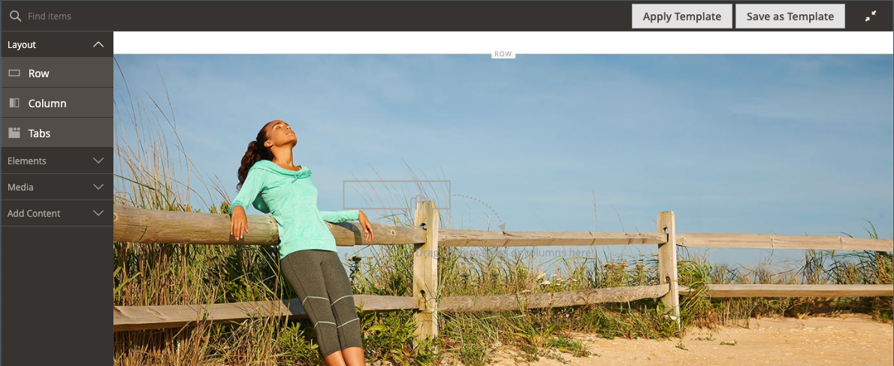
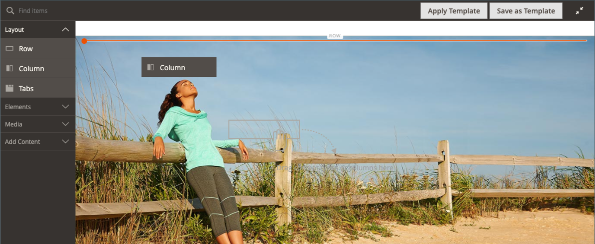
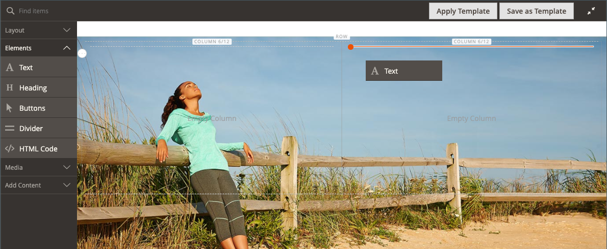
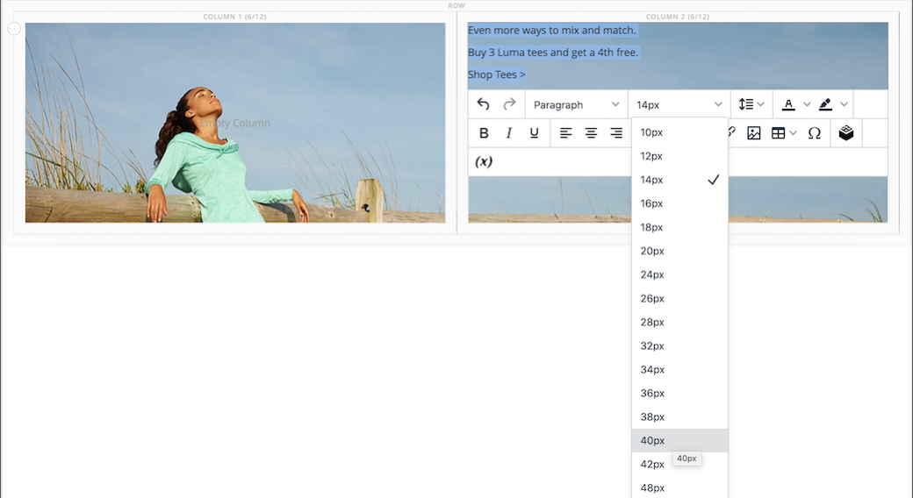
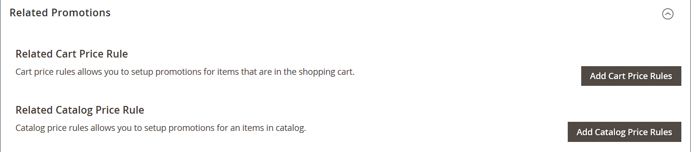
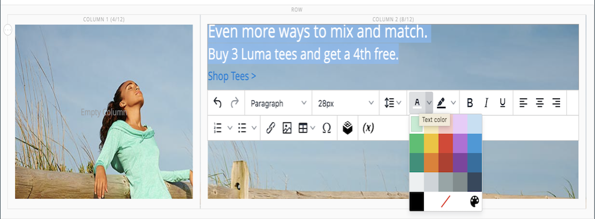

# [!DNL Page Builder] 演练第2部分：块

以下练习说明了两者之间的差异 [简单块](../content-design/blocks.md) 和 [动态块](dynamic-block.md)以及如何使用 [!DNL Page Builder] 创建每种类型的块。

>[!NOTE]
>
>[!DNL Page Builder] 具有名为的新内容类型 _横幅_，在第一个演练练习中会用到它，它和以前的横幅功能无关。 中以前的Banner选项是什么 [“内容”菜单](../content-design/content-menu.md)，现在为 _动态块_.

{width="700" zoomable="yes"}

本练习假定您已完成 [第1部分：简单页面](1-simple-page.md)，包括先决条件和 [下载的示例文件](./assets/simple-page-assets.zip). 按照顺序执行本演练的各个部分。

>[!NOTE]
>
>这些演练已更新，以反映最近对 [!DNL Page Builder] workspace 2.4.1版本中的工作区。 如果您使用的是较低版本的Adobe Commerce，请使用 [!DNL Page Builder] 练习包含在 [[!DNL Commerce] 2.3用户指南](https://docs.magento.com/user-guide/v2.3/cms/page-builder-learn.html).

## 第1部分：创建简单块

在本演练练习中，您将创建一个简单的块，其中包含来自 [!DNL Google Maps]. 简单块有时称为 _CMS块_ 或 _静态块_，因为内容不会更改。 简单的块非常适用于您可能希望重复使用的内容。

### 步骤1：创建块

1. 在 _管理员_ 侧栏，转到 **[!UICONTROL Content]** > _[!UICONTROL Elements]_>**[!UICONTROL Blocks]**.

1. 在右上角，单击 **[!UICONTROL Add New Block]**.

1. 对象 **[!UICONTROL Block Title]**，输入 `Google Map`.

1. 对象 **[!UICONTROL Identifier]**，输入 `google-map`.

1. 选择 **[!UICONTROL Store View]** 块可用的位置。

   {width="600" zoomable="yes"}

1. 在右上角，单击 **[!UICONTROL Save]**.

### 第2步：添加 [!DNL Google Map]

1. 向下滚动到 [!DNL Page Builder] 内容预览（当前为空）并单击 **[!UICONTROL Edit with Page Builder]**.

1. 在 [!DNL Page Builder] 面板，展开 **[!UICONTROL Media]** 并拖动 **[!UICONTROL Map]** 舞台占位符。

   {width="600" zoomable="yes"}

   在以下情况下，将显示商店位置的映射： [!DNL Google Maps] 已为您的商店配置。

   {width="600" zoomable="yes"}

   出现占位符映射的情况 [!DNL Google Maps] 尚未为您的存储配置。

   ![[!DNL Google Maps] 占位符](./assets/pb-tutorial2-media-map-not-configured.png){width="600" zoomable="yes"}

1. 在舞台的右上角，单击 _关闭全屏_ ()图标。

   单击此图标会返回到 _[!UICONTROL Content]_显示预览的块的区域。

1. 在右上角，单击 **[!UICONTROL Save]** 箭头并选择 **[!UICONTROL Save & Close]**.

### 步骤3：配置 [!DNL Google Maps]

如果 [!DNL Google Maps] 已针对您的商店进行了配置，您可以跳过此步骤并继续下一步。

1. 转到 [Google Cloud平台控制台](https://console.cloud.google.com/google/maps-apis/overview).

1. 单击项目下拉列表，然后选择或创建要为其添加API密钥的项目。

1. 要配置API凭据，请按照 [说明][1] 在 [!DNL Google Maps] 文档。

1. 将API密钥复制到剪贴板。

1. 返回到 [!DNL Commerce] 管理员并转到 **[!UICONTROL Stores]** > _[!UICONTROL Settings]_>**[!UICONTROL Configuration]**.

1. 在左侧面板中的 _[!UICONTROL General]_，选择&#x200B;**[!UICONTROL Content Management]**.

1. 展开  **[!UICONTROL Advanced Content Tools]**.

   {width="600" zoomable="yes"}

   欲知关于 [!UICONTROL Content Management Advanced Tools] 配置选项，请参见 [_配置参考指南_](../configuration-reference/general/content-management.md).

1. 对象 **[!UICONTROL Google Maps API Key]**，粘贴您复制的密钥。

1. 单击 **[!UICONTROL Test Key]**.

   如果您的钥匙有问题，请返回 [!DNL Google Maps] Platform站点来解决问题。 然后，重试。

1. 验证密钥后，单击 **[!UICONTROL Save Config]**.

### 步骤4：将块添加到页面

1. 在 _管理员_ 侧栏，转到 **[!UICONTROL Content]** > _[!UICONTROL Elements]_>**[!UICONTROL Pages]**.

1. 在网格中，查找 _[!UICONTROL Simple Page]_您在第一个教程中创建并选择的附加内容&#x200B;**[!UICONTROL Edit]**在_[!UICONTROL Action]_ 列。

1. 展开  该 **[!UICONTROL Content]** 部分并单击 **[!UICONTROL Edit with Page Builder]** 或位于内容预览区域内。

1. 在 [!DNL Page Builder] 下的面板 _[!UICONTROL Layout]_，拖动&#x200B;**[!UICONTROL Row]**舞台顶部的占位符。

   {width="600" zoomable="yes"}

1. 在 [!DNL Page Builder] 面板，展开 **[!UICONTROL Add Content]** 并拖动 **[!UICONTROL Block]** 新行的占位符。

1. 将鼠标悬停在空的块容器上以显示工具箱，然后选择 _设置_ ({width="20"} )图标。

   {width="600" zoomable="yes"}

1. 在“编辑块”页上，单击 **[!UICONTROL Select Block]**.

   {width="600" zoomable="yes"}

1. 在搜索框中，输入 `map` 并按Enter/Return键查找您创建的块。

   {width="600" zoomable="yes"}

1. 在网格中，单击 **[!UICONTROL Select]** 以选择 [!DNL Google Maps] 封锁。

1. 在右上角，单击 **[!UICONTROL Save]** 以保存设置并返回到 [!DNL Page Builder] 工作区。

1. 在舞台的右上角，单击 _关闭全屏_ ()图标。

   单击此图标会返回到 _[!UICONTROL Content]_显示预览的页面的部分。

1. 在右上角，单击 **[!UICONTROL Save]** 箭头并选择 **[!UICONTROL Save & Close]**.

**恭喜！** 您已完成“块”练习的第一部分。 请务必保留您的工作以备参考。

## 第2部分：创建动态块

动态块包括确定块出现的位置、时间和对象的逻辑。 在本演练练习中，您将为促销创建一个动态块，该块会在满足价格规则条件时触发，并且仅显示在特定客户区段中。 此示例的结果与第一个练习中创建的横幅类似，但有逻辑控制它何时出现在店面中。

{width="600" zoomable="yes"}

### 第1步：创建新的动态块

1. 在 _管理员_ 侧栏，转到 **[!UICONTROL Content]** > _[!UICONTROL Elements]_>**[!UICONTROL Dynamic Blocks]**.

   {width="700" zoomable="yes"}

1. 在右上角，单击 **[!UICONTROL Add Dynamic Block]**.

   {width="600" zoomable="yes"}

1. 完成新动态块的基本设置：

   - 设置 **[!UICONTROL Enable Dynamic Block]** 到 `Yes`.

   - 对象 **[!UICONTROL Dynamic Block Name]**，输入 `Tee Shirt Promo`.

   - 设置 **[!UICONTROL Dynamic Block Type]** 到 `Content Area` 并单击 **[!UICONTROL Done]**.

     动态块类型确定 [页面布局](../content-design/page-layout.md) 方块被放置的位置。 为商店设置动态块时，请考虑页面布局和 [主题](../content-design/themes.md)，以便更好地利用可用空间。 有些商店的活动内容区域仅限于固定宽度，而有些商店则扩展了屏幕的全宽。

     {width="600" zoomable="yes"}

   - 对象 **[!UICONTROL Customer Segment]**，选中要应用于动态块的每个区段的复选框，然后单击 **完成** 以保存区段列表。

     对于以下示例，有两种 [客户区段](../customers/customer-segments.md) 按性别识别注册客户。 此动态块仅会显示在注册女顾客在您的商店中购物时登录到其帐户中。

     {width="600" zoomable="yes"}

### 第2步：完成设置

向下滚动到 _[!UICONTROL Content]_部分，显示为空 [!DNL Page Builder] 内容预览，然后单击&#x200B;**[!UICONTROL Edit with Page Builder]**. 然后，完成以下任务：

**任务1：** 添加背景图像

1. 将鼠标悬停在行容器上以显示工具箱，然后选择 _设置_ ({width="20"} )图标。

1. 下 _[!UICONTROL Appearance]_，选择&#x200B;**[!UICONTROL Full Bleed]**.

1. 对象 **[!UICONTROL Minimum Height]**，输入 `400px`.

1. 滚动到 _[!UICONTROL Background]_部分并设置&#x200B;**[!UICONTROL Background Image]**通过单击&#x200B;**[!UICONTROL Select from Gallery]**并选择 `wide-banner-background.png` 已在第一个教程中上传图像。

1. 在右上角，单击 **[!UICONTROL Save]** 以应用设置并返回到 [!DNL Page Builder] 工作区。

   {width="600" zoomable="yes"}

**任务2：** 添加列

在 [!DNL Page Builder] 下的面板 _[!UICONTROL Layout]_，拖动&#x200B;**[!UICONTROL Column]**行上的占位符。

{width="600" zoomable="yes"}

该行现在分为两列，每列的宽度相等。

**任务3：** 添加文本

1. 在 [!DNL Page Builder] 面板，展开 **[!UICONTROL Elements]** 并拖动 **文本** 第二列的占位符。

   {width="600" zoomable="yes"}

1. 在编辑器中输入以下三行文本：

   `Even more ways to mix and match.`

   `Buy 3 Luma tees and get a 4th free.`

   `Shop Tees >`

   {width="600" zoomable="yes"}

1. 选择所有三行文本，并使用工具栏设置 **行高** 到 `40px`.

   {width="600" zoomable="yes"}

1. 设置 **[!UICONTROL Font Size]** ，如下所示：

   | 折线图 | 字体大小 |
   |-----| ---------- |
   | 第1行： | `28px` |
   | 第2行： | `24px` |
   | 第3行： | `18px` |

   由于此块可放置在页面上的任何位置，因此请使用默认段落样式，而不是标题级别。 此外，不必担心列中文本尚未正确换行。  

   {width="600" zoomable="yes"}

**任务4：** 添加链接

在第一个练习中，您已了解如何使用 [按钮](buttons.md) 内容类型以创建链接。 此示例说明如何从编辑器工具栏插入链接。

1. 在另一个浏览器选项卡中，打开店面并导航到将成为链接目标目标的页面。

   您可以使用完全限定的URL或省略对商店域的引用的相对URL。

   完整URL ： `https://mystore.com/women/tops-women/tees-women.html`

   相对URL ： `../women/tops-women/tees-women.html`

1. 返回到 [!DNL Page Builder] 工作区选项卡和文本编辑器，选择 `Shop Tees >` 文本位于第三行，然后选择 **粗体** ()。

1. 使用 `Shop Tees >` 第三行中的文本仍被选中，请选择 **插入/编辑链接** ()。

   {width="600" zoomable="yes"}

1. 对象 **[!UICONTROL URL]**，输入您准备的相对链接。

1. 设置 **[!UICONTROL Target]** 到 `None`.

   此设置将在同一浏览器窗口中打开页面，而不是打开新选项卡。

1. 对象 **[!UICONTROL Title]**，输入 `Shop Tees`.

   标题链接属性被某些浏览器用作工具提示。

1. 要保存链接并返回到 [!DNL Page Builder] 工作区，单击 **[!UICONTROL OK]**.

   {width="600" zoomable="yes"}

1. 在舞台的右上角，单击 _关闭全屏_ ()图标。

   单击此图标会返回到 _[!UICONTROL Content]_显示预览的动态块的区域。

1. 在右上角，单击 **[!UICONTROL Save]**.

### 步骤3：添加价格规则

1. 打开 _T恤促销活动_ 再次处于编辑模式下的动态块。

1. 展开  该 **[!UICONTROL Related Promotions]** 部分并单击 **[!UICONTROL Add Cart Price Rules]**.

   {width="600" zoomable="yes"}

1. 在 _添加相关购物车价格规则_ 页面上，选中 _购买3件T恤并免费购买4件_ 价格规则并单击 **[!UICONTROL Add Selected]**.

   {width="600" zoomable="yes"}

   价格规则显示在 _相关促销活动_ 部分，在 _相关购物车价格规则_. 您可以将多个价格规则与一个动态块关联。 但是，这个简单的示例只使用一个。

   {width="600" zoomable="yes"}

1. 在右上角，单击 **[!UICONTROL Save]**.

### 步骤4：将动态块添加到页面

1. 在 _管理员_ 侧栏，转到 **[!UICONTROL Content]** > _[!UICONTROL Elements]_>**[!UICONTROL Pages]**

1. 查找 _简单页面_ 您在 [首次演练练习](1-simple-page.md) 并在编辑模式下将其打开。

1. 展开  该 **[!UICONTROL Content]** 部分并单击 **[!UICONTROL Edit with Page Builder]**.

1. 将鼠标悬停在与动态块相同的图像所在的顶行上，以显示工具箱和 _移除_ ( {width="20"} )图标。

   要确认从页面中删除行，请单击  **[!UICONTROL OK]** .

1. 在 [!DNL Page Builder] 下的面板 _[!UICONTROL Layout]_，拖动新的&#x200B;**[!UICONTROL Row]**舞台顶部的占位符。

1. 在 [!DNL Page Builder] 面板，展开 **[!UICONTROL Add Content]** 并拖动 **[!UICONTROL Dynamic Block]** 新行的占位符。

   {width="600" zoomable="yes"}

1. 将鼠标悬停在动态块容器上以显示工具箱并选择 _设置_ ( {width="20"} )图标。

   {width="600" zoomable="yes"}

1. 在 _[!UICONTROL Edit Dynamic Block]_页面，单击&#x200B;**[!UICONTROL Select Dynamic Block]**.

   {width="600" zoomable="yes"}

1. 查找 _[!DNL Tee Shirt Promo]_您创建并点击的动态块&#x200B;**[!UICONTROL Select]**.

   下面显示了动态块信息的摘要。

   {width="600" zoomable="yes"}

1. 接受默认值 **[!UICONTROL Template]**， `Dynamic Block Block Template`.

1. 完成后，单击 **[!UICONTROL Save]** 以保存设置并返回到 [!DNL Page Builder] 工作区。

   {width="600" zoomable="yes"}

1. 在舞台的右上角，单击 _关闭全屏_ ()图标。

   单击此图标会返回到 _[!UICONTROL Content]_显示预览的页面的部分。

1. 在右上角，单击 **[!UICONTROL Save]** 箭头并选择 **[!UICONTROL Save & Close]**.

您已完成“块”练习的第二部分。 请务必保留您的工作以备参考。

## 第3部分：更新动态块

在本练习的最后一部分，就是当页面在您的商店中活动时，编辑动态块。 然后，以客户区段成员的身份登录商店，以显示块。

{width="600" zoomable="yes"}

### 步骤1：编辑动态块

1. 在 _管理员_ 侧栏，转到 **[!UICONTROL Content]** > _[!UICONTROL Elements]_>**[!UICONTROL Dynamic Blocks]**.

1. 查找您的 _[!DNL Tee Shirt Promo]_在网格中打开动态块，并在编辑模式下打开它。

1. 展开  该 **[!UICONTROL Content]** 部分并单击 **[!UICONTROL Edit with Page Builder]**.

1. 更改列宽：

   - 将鼠标悬停在两列之间的边框上。

   - 按住鼠标按钮并将边框向左拖动两个部分。

     {width="600" zoomable="yes"}

     第一列是12个网格分区中的4个(4/12)，第二列是12个网格分区中的8个(8/12)。

     {width="600" zoomable="yes"}

1. 更改文本颜色：

   - 选择前两行文本。

   - 在编辑器工具栏上，选择 **[!UICONTROL Text Color]** 然后单击 **[!UICONTROL White]** 色板。

   {width="600" zoomable="yes"}

1. 在舞台的右上角，单击 _关闭全屏_ ()图标。

   单击此图标会返回到 _[!UICONTROL Content]_显示预览的动态块的区域。

1. 在右上角，单击 **[!UICONTROL Save]**.

### 步骤2：查看动态块

由于此动态块仅对特定客户区段的成员可见，因此您必须以客户区段成员的客户身份登录才能查看促销。 在此示例中，该块仅对女性客户显示。

1. 打开浏览器窗口到您的店面。

1. 要查看示例页面，请修改地址栏中的URL，如下所示：

   mystore.com/sample-page

   如果您的存储配置为包含html后缀，请按照以下方式包含该后缀：

   mystore.com/sample-page.html

1. 以女性客户身份登录：

   - 在主页的右上角，单击 **[!UICONTROL Sign In]**.

   - 如果您的系统上安装了示例Luma数据，请使用以下凭据：

     **[!UICONTROL Email]** - `roni_cost@example.com`

     **[!UICONTROL Password]** -  `roni_cost3@example.com`

   - 单击 **[!UICONTROL Sign In]**.

   - 返回到示例页面，以查看您在T恤促销活动中创建的动态块。

   {width="700" zoomable="yes"}

您已完成“阻止”练习。 请务必保留您的工作以备参考。

准备就绪后，转到 [第3部分：目录内容](3-catalog-content.md)

[1]: https://developers.google.com/maps/documentation/javascript/get-api-key
