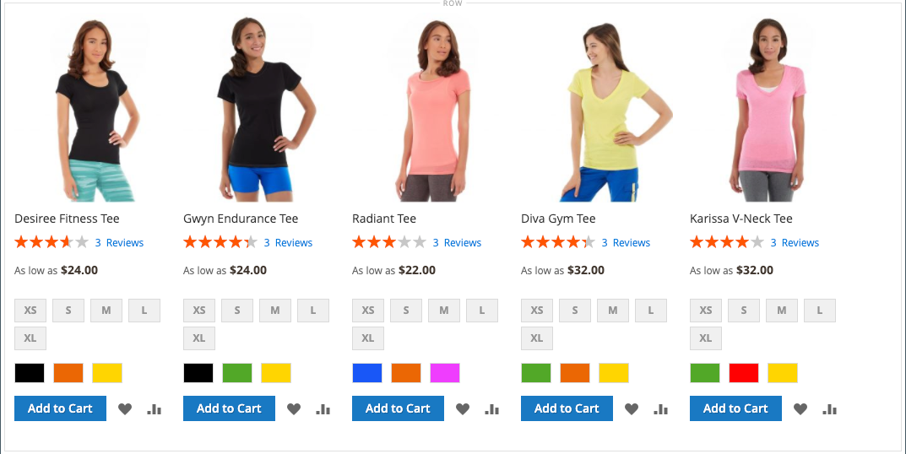
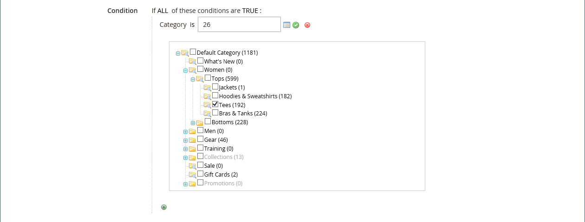
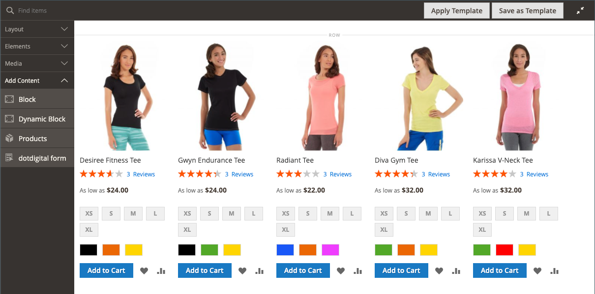
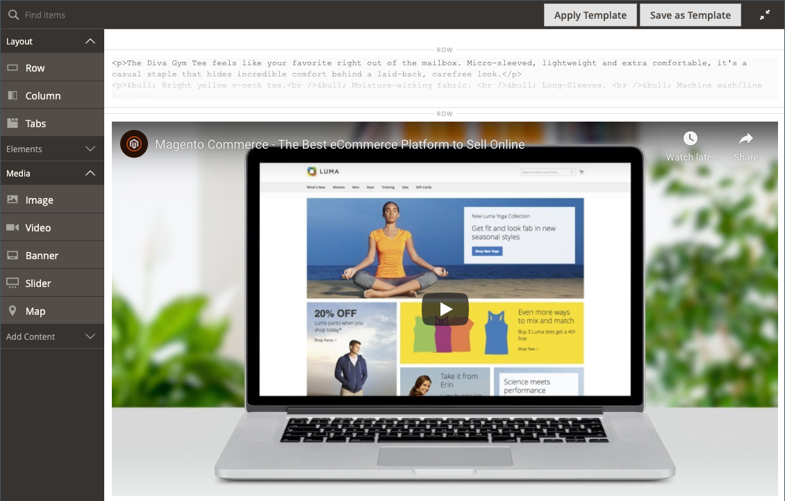

# [!DNL Page Builder]演练第3部分：目录内容

此练习演示了向页面添加产品列表、自定义产品页面以及创建自定义属性（将[!DNL Page Builder]工作区添加到产品属性集）是多么容易。

{width="600" zoomable="yes"}

本练习假设您已完成[第1部分：简单页面](1-simple-page.md)和第2部分：块[，包括先决条件和下载的示例文件。 ](2-blocks.md)按照顺序执行本练习的三个部分。

## 第1部分：添加产品列表

[!DNL Page Builder]可以轻松地将产品列表添加到阶段。 在此示例中，产品列表直接添加到页面。

### 第1步：将产品列表添加到暂存环境

1. 在&#x200B;_管理员_&#x200B;侧边栏上，转到&#x200B;**[!UICONTROL Content]** > _[!UICONTROL Elements]_>**[!UICONTROL Pages]**。

1. 查找您在第一个练习中创建并在第二个练习中修改的&#x200B;_简单页面_，然后在&#x200B;**[!UICONTROL Edit]**&#x200B;列中选择&#x200B;_[!UICONTROL Action]_。

1. 展开扩展选择器&#x200B;**[!UICONTROL Content]**，然后单击&#x200B;**[!UICONTROL Edit with Page Builder]**&#x200B;或内容预览区域内。

1. 在[!DNL Page Builder]下的&#x200B;_[!UICONTROL Layout]_面板中，将&#x200B;**[!UICONTROL Row]**拖到舞台顶部。

1. 在[!DNL Page Builder]面板中，展开&#x200B;**[!UICONTROL Add Content]**&#x200B;并将&#x200B;**[!UICONTROL Products]**&#x200B;占位符拖到新行中。

   {width="600" zoomable="yes"}

### 第2步：编写条件

1. 将鼠标悬停在空的产品容器上以显示工具箱，然后选择&#x200B;_设置_ （ {width="20"} ）图标。

   {width="600" zoomable="yes"}

1. 对于&#x200B;**[!UICONTROL Select Products By]**，请选择`Condition`。

1. 添加条件：

   - 单击&#x200B;_添加_ （）图标。

   - 在&#x200B;_[!UICONTROL Product Attribute]_下，选择&#x200B;**[!UICONTROL Category]**。

     {width="600" zoomable="yes"}

   - 通过单击“更多(...)”图标，然后单击“_[!UICONTROL Category is]选择器_”（_选择器图标_）图标，完成条件中的部分。

     {width="600" zoomable="yes"}

   - 在类别树中，向下钻取到&#x200B;**女性> Tops**&#x200B;类别，并选择&#x200B;**Tees**&#x200B;复选框。

     {width="600" zoomable="yes"}

   - 单击复选标记（）图标。

     相应的类别ID将显示在字段中，以完成条件。

### 第3步：完成设置

1. 输入&#x200B;**[!UICONTROL Number of Products to Display]**。

   默认情况下，该列表会显示五个产品。

1. 根据需要完成其余设置。

   如果需要，请使用[添加内容 — 产品](products.md)页面末尾的字段描述以供参考。

1. 完成后，单击&#x200B;**[!UICONTROL Save]**&#x200B;保存设置并返回[!DNL Page Builder]工作区。

   {width="600" zoomable="yes"}

1. 在舞台的右上角，单击&#x200B;_关闭全屏_ （ {width="20"} ）图标。

   单击此图标会返回该页面的&#x200B;_[!UICONTROL Content]_部分，并显示预览。

1. 单击右上角的&#x200B;**[!UICONTROL Save]**&#x200B;箭头并选择&#x200B;**[!UICONTROL Save & Close]**。

## 第2部分：自定义产品页面

>[!NOTE]
>
>管理员用户必须具有针对其[!UICONTROL Content]角色范围[的](../systems/permissions-user-roles.md)权限，才能看到[!UICONTROL Edit with Page Builder]按钮并能够使用页面生成器。

在本练习的这一可选部分中，您将了解通过在产品页面的一组选项卡下方放置视频来自定义产品页面有多么简单。 更新[类别页面](../catalog/categories-content-settings.md)内容的进程基本相同。

1. 在&#x200B;_管理员_&#x200B;侧边栏上，转到&#x200B;**[!UICONTROL Catalog]** > **[!UICONTROL Products]**。

1. 查找可用于此示例的简单产品，并在编辑模式下打开它。

1. 向下滚动并展开扩展选择器&#x200B;**[!UICONTROL Content]**。

1. 在&#x200B;_[!UICONTROL Description]_旁边，单击&#x200B;**[!UICONTROL Edit with Page Builder]**。

   {width="600" zoomable="yes"}

   如果之前输入的产品描述没有[!DNL Page Builder]，则当前描述在[HTML代码](html-code.md)容器中显示为HTML。 使用Luma主题，产品描述将显示在“详细信息”选项卡上。

1. 在[!DNL Page Builder]下的&#x200B;_[!UICONTROL Layout]_面板中，将&#x200B;**[!UICONTROL Row]**拖到舞台上，将其放置在HTML代码容器下。

   当行处于正确位置时，查找要显示的红色指南。

   {width="600" zoomable="yes"}

1. 在[!DNL Page Builder]面板中，展开&#x200B;**[!UICONTROL Media]**&#x200B;并将&#x200B;**[!UICONTROL Video]**&#x200B;占位符拖到新行中。

   行{width="600" zoomable="yes"}视频占位符

1. 将鼠标悬停在空的视频容器上以显示工具箱，然后选择&#x200B;_设置_ （ {width="20"} ）图标。

   {width="500" zoomable="yes"}

1. 输入&#x200B;**[!UICONTROL Video URL]**。

   视频可以托管在[YouTube](https://www.youtube.com/)或[Vimeo](https://vimeo.com/)上。 此示例中的视频可以在YouTube上的以下URL找到：

   `https://www.youtube.com/watch?v=ZpFrNyD4100`

   {width="500" zoomable="yes"}

1. 输入视频显示的&#x200B;**[!UICONTROL Maximum Width]**&#x200B;像素。

   如果将此选项留空，则视频会填充可用空间。

1. 单击&#x200B;**[!UICONTROL Save]**&#x200B;保存设置并返回[!DNL Page Builder]工作区。

   内容阶段中的{width="600" zoomable="yes"}

1. 在舞台的右上角，单击&#x200B;_关闭全屏_ （ {width="20"} ）图标。

   单击此图标会返回该页面的&#x200B;_[!UICONTROL Content]_部分，并显示预览。

1. 单击右上角的&#x200B;**[!UICONTROL Save]**&#x200B;箭头并选择&#x200B;**[!UICONTROL Save & Close]**。

在店面中，视频显示在选项卡组的下方。 要查看页面在移动设备上的外观，可以调整窗口大小。

产品页面上显示了{width="600" zoomable="yes"}

**恭喜！**&#x200B;您已完成“目录内容”教程的第二部分。 保留您创建的工作，以便您稍后可以参考它。

## 第3部分：添加自定义属性

使用[!DNL Page Builder]自定义属性将功能齐全的[!DNL Page Builder]工作区添加到产品页面，您可以使用该工作区创建吸引人的内容。 在练习的这一部分中，您将了解如何使用[!DNL Page Builder]输入类型创建自定义属性，并将其应用于目录中的产品页面。 有关这些属性的详细信息，请参阅[产品属性](../catalog/product-attributes.md)。

### 步骤1：创建产品

要避免对实时商店进行更改，请使用所述的属性创建产品。

1. 在&#x200B;_管理员_&#x200B;侧边栏上，转到&#x200B;**[!UICONTROL Catalog]** > **[!UICONTROL Products]**。

1. 单击右上角的&#x200B;**[!UICONTROL Add Product]**。

1. 创建具有以下属性的产品：

   - 
     [！UICONTROL属性集]: Default
   - [!UICONTROL Product Name]：我的产品
   - 
     [!UICONTROL SKU]: Tutorial
   - 
     [!UICONTROL Price]: 75.00
   - 
     [!UICONTROL Quantity]: 100
   - [!UICONTROL Stock Status]：有货
   - 
     [!UICONTROL Weight]: 1
   - [!UICONTROL Categories]：女性>上衣>T恤

1. 单击右上角的&#x200B;**[!UICONTROL Save]**&#x200B;箭头并选择&#x200B;**[!UICONTROL Save & Close]**。

### 步骤2：创建自定义属性

在此步骤中，您将创建两个新的自定义属性，以显示如何使用[!DNL Page Builder]和文本编辑器输入类型。

1. 在&#x200B;_管理员_&#x200B;侧边栏上，转到&#x200B;**[!UICONTROL Stores]** > _[!UICONTROL Attributes]_>**[!UICONTROL Product]**。

1. 单击右上角的&#x200B;**[!UICONTROL Add New Attribute]**。

1. 输入属性的&#x200B;**[!UICONTROL Default Label]**。

   对于此示例，使用`My Page Builder Attribute`作为标签。

1. 将&#x200B;**[!UICONTROL Catalog Input Type for Store Owner]**&#x200B;设置为`Page Builder`。

   创建自定义属性时，您可以指定最适合该应用程序的编辑器为`Page Builder`或标准WYSIWYG `Text Editor`。

   ![[!DNL Page Builder]输入类型](./assets/pb-attribute-page-builder.png){width="600" zoomable="yes"}

1. 展开扩展选择器&#x200B;**[!UICONTROL Advanced Attribute Properties]**&#x200B;并进行以下设置：

   - [!UICONTROL Attribute Code]：输入小写字符形式的属性代码，使用连字符而不是空格。 对于此示例，请使用`my_page_builder_attribute`。
   - [!UICONTROL Scope]：接受默认值`Store View`。
   - [!UICONTROL Default Value]：输入属性的默认值。
   - 
     [!UICONTROL Unique Value]: `No`
   - 
     [!UICONTROL Add to Column Options]: `No`
   - 
     [!UICONTROL Use in Filter Options]: `Yes`

1. 在左侧的&#x200B;_[!UICONTROL Attribute Information]_面板中，选择&#x200B;**[!UICONTROL Storefront Properties]**并进行以下设置：

   - 
     [!UICONTROL Use for Promo Rule Conditions]: `Yes`
   - 
     [!UICONTROL Visible on Catalog Pages on Storefront]: `Yes`
   - 
     [!UICONTROL Used in Product Listing]: `Yes`

1. 完成后，单击&#x200B;**[!UICONTROL Save Attribute]**。

1. 重复上述步骤，创建具有相同基本属性的第二个属性，但文本编辑器输入类型如下所示：

   - [!UICONTROL Default Label]：我的文本编辑器属性
   - [!UICONTROL Catalog Input Type for Store Owner]：文本编辑器
   - 
     [！UICONTROL属性代码]: `my_text_editor_attribute`

### 步骤3：更新产品属性集

1. 在&#x200B;_管理员_&#x200B;侧边栏上，转到&#x200B;**[!UICONTROL Stores]** > _[!UICONTROL Attributes]_>**[!UICONTROL Attribute Set]**。

   对于此示例，您暂时将新属性添加到`default`属性集。 在本练习结束时，从属性集中删除属性，这样就不会影响您的目录。

   >[!NOTE]
   >
   >如果不想更改您的实时商店，您可以遵循操作，而无需更新属性集。

1. 在列表中找到&#x200B;_[!UICONTROL Default]_属性集，双击该属性集以在编辑模式下将其打开。

1. 在&#x200B;_未分配属性_&#x200B;列表中，找到您创建的新属性，并将每个属性拖到&#x200B;_[!UICONTROL Groups]_下的&#x200B;**[!UICONTROL Content]**列中。

   属性在[!UICONTROL Groups]列中的位置决定了它在页面上的显示位置。

   {width="600" zoomable="yes"}

1. 单击&#x200B;**[!UICONTROL Save]**&#x200B;以返回到“属性集”列表。

1. 出现提示时，单击页面顶部的&#x200B;**[!UICONTROL Cache Management]**&#x200B;链接，并刷新任何无效的缓存。

### 步骤4：更新产品

1. 在&#x200B;_管理员_&#x200B;侧边栏上，转到&#x200B;**[!UICONTROL Catalog]** > **[!UICONTROL Products]**。

1. 在“产品”网格中，找到&#x200B;_我的产品_&#x200B;并以编辑模式将其打开。

1. 向下滚动并展开扩展选择器&#x200B;**[!UICONTROL Content]**。

   在部分的顶部，有两个产品内容的标准属性：

   - _简短说明_，它使用标准WYSIWYG [编辑器](../content-design/editor.md)。
   - _描述_，显示[!DNL Page Builder]预览。

   {width="600" zoomable="yes"}

   当您滚动到部分的下半部分时，您创建并分配了以下两个属性：

   - _我的[!DNL Page Builder]属性_，显示[!DNL Page Builder]预览。
   - _我的文本编辑器属性_，它使用标准WYSIWYG编辑器。

   {width="600" zoomable="yes"}

1. 在&#x200B;**我的文本编辑器属性**&#x200B;编辑器中，输入`Text Editor Attribute placeholder text`。

   - 单击右上角的&#x200B;**[!UICONTROL Save]**&#x200B;箭头并选择&#x200B;**[!UICONTROL Save & Close]**。

1. 对于&#x200B;**我的页面生成器属性**，单击&#x200B;**[!UICONTROL Edit with Page Builder]**&#x200B;并添加描述文本：

   - 在[!DNL Page Builder]面板中，展开&#x200B;**[!UICONTROL Elements]**&#x200B;并将&#x200B;**[!UICONTROL Text object]**&#x200B;拖到舞台上。

   - 输入`Page Builder attribute placeholder text`。

   - 在舞台的右上角，单击&#x200B;_关闭全屏_ （ {width="20"} ）图标。

     {width="600" zoomable="yes"}

1. 向上滚动到&#x200B;**[!UICONTROL Description]**，单击&#x200B;**[!UICONTROL Edit with Page Builder]**，然后使用与上一步相同的方法添加您喜欢的任何文本。

1. 在产品页面的右上角，单击&#x200B;**[!UICONTROL Save]**&#x200B;箭头并选择&#x200B;**[!UICONTROL Save & Close]**。

1. 如果出现提示，请单击页面顶部消息中的&#x200B;**[!UICONTROL Cache Management]**&#x200B;链接，然后刷新任何无效的缓存。

### 步骤5：查看结果

1. 导航到店面的示例产品页面。

   在本例中，产品位于顶部导航中的“女性”>“上衣”>“T恤”下。

1. 向下滚动至&#x200B;_我的页面生成器属性_&#x200B;信息。

   属性在产品页面上的位置由主题决定。 在Luma主题中，新属性位于产品描述之后。

   店面中的![[!DNL Page Builder]和文本编辑器属性](./assets/pb-storefront-product-attribute.png){width="600" zoomable="yes"}

您已完成[!DNL Page Builder]目录内容练习。 保留您创建的工作，以便您稍后可以参考它。
