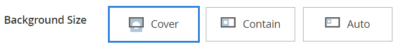

# 媒体 — 横幅

使用&#x200B;_Banner_&#x200B;内容类型在[[!DNL Page Builder] 阶段](workspace.md#stage)中添加带插图、交互组件，使用户能够使用call to action和按钮。

>[!NOTE]
>
>以前的“内容”菜单中的&#x200B;_横幅_&#x200B;选项现在是[动态块](../content-design/dynamic-blocks.md)。

店面主页上的{width="700" zoomable="yes"}

{{$include /help/_includes/page-builder-save-timeout.md}}

## 横幅工具箱

将鼠标悬停在横幅容器上时，将显示横幅工具箱。

{width="600" zoomable="yes"}

| 工具 | 图标 | 描述 |
|--- |--- |--- |
| 移动 | {width="25"} | 将横幅移动到舞台上的另一个位置。 |
| （标签） | 横幅 | 将当前内容容器标识为横幅。 将鼠标悬停在容器上可查看工具箱。 |
| 设置 | {width="25"} | 打开“编辑横幅”页面，您可以在此页面更改横幅和容器的属性。 |
| 隐藏 | {width="25"} | 隐藏当前横幅。 |
| 显示 | {width="25"} | 显示隐藏的横幅。 |
| 复制 | {width="25"} | 制作横幅的副本。 |
| 移除 | {width="25"} | 从舞台上删除横幅。 |
| [!UICONTROL Upload New Image] |  | 将图像从本地文件系统上传到图片库以作为横幅背景。 |
| [!UICONTROL Select from Gallery] |  | 将图片库中的现有图像用作横幅背景。 |

{style="table-layout:auto"}

{{$include /help/_includes/page-builder-hidden-element-note.md}}

## 添加横幅

1. 在[!DNL Page Builder]面板中，展开&#x200B;**[!UICONTROL Media]**&#x200B;并将&#x200B;**[!UICONTROL Banner]**&#x200B;占位符拖到舞台上。

   {width="600" zoomable="yes"}

   已包含&#x200B;_[!UICONTROL Upload Image]_和_[!UICONTROL Select from Gallery]_&#x200B;按钮，因此您可以直接从舞台快速更改横幅内容。 您还可以更改&#x200B;_[!UICONTROL Edit Banner]_页面上的内容。

1. 单击横幅占位符以显示[文本编辑器](../content-design/editor.md)并输入横幅的内容。

   您还可以使用[Content](#content)设置包含更复杂的横幅内容。

## 更改横幅设置

1. 将鼠标悬停在横幅容器上以显示工具箱，然后选择&#x200B;_设置_ （）图标。

1. 有关更新可用设置的详细信息，请参阅以下部分：

   - [[!UICONTROL Appearance]](#appearance)
   - [[!UICONTROL Content]](#content)
   - [[!UICONTROL Background]](#background)
   - [[!UICONTROL Advanced]](#advanced)

1. 完成后，单击右上角的&#x200B;**[!UICONTROL Save]**&#x200B;以关闭&#x200B;_[!UICONTROL Edit Banner]_页面。

1. 单击右上角的&#x200B;**[!UICONTROL Save]**&#x200B;以应用设置并返回到[!DNL Page Builder]工作区。

## [!UICONTROL Appearance]

横幅很容易设置和管理，因为它们基于四个预定义模板之一。

- 选择以下横幅投放位置类型之一：

  | 投放 | 描述 |
  | --------- | ----------- |
  | [!UICONTROL Poster] | 将内容与按钮置于横幅中央。 如果使用叠加，则会扩展横幅的完整宽度。 |
  | [!UICONTROL Collage Left] | 将内容和按钮放置在横幅左侧的已定义区域中。 如果使用叠加，则仅覆盖定义的区域。 |
  | [!UICONTROL Collage Center] | 将内容和按钮放置在横幅中央的已定义区域中。 如果使用叠加，则仅覆盖定义的区域。 |
  | [!UICONTROL Collage Right] | 将内容和按钮放置在横幅右侧的已定义区域中。 如果使用叠加，则仅覆盖定义的区域。 |

  {style="table-layout:auto"}

  {width="600" zoomable="yes"}

- （可选）输入行的&#x200B;**[!UICONTROL Minimum Height]**。

  最小高度可以是具有任何有效CSS单位（如`100px`、`50%`、`50em`、`100vh`）的数字，也可以是计算（如`100vh - 237px`）。

  例如，您可以将横幅的最低高度设置为延伸页面的完整高度，从而为全页背景图像和视频提供引人注目的选项。

## [!UICONTROL Background]

有许多选项可用于定义横幅的背景显示。 您可以应用简单的颜色或背景图像，并管理更复杂的效果。

### [!UICONTROL Background Color]

通过选择色板、单击拾色器或输入有效的颜色名称或等效的十六进制值来指定背景颜色。 此设置确定行的背景颜色。 您还可以调整颜色的不透明度。

{width="200"}

可以通过以下三种方式之一设置值：

- 预定义的颜色名称，如`White`
- 颜色的十六进制颜色值，如`#ffffff`
- 颜色的rgba值，具有不透明度百分比，如`rgba(255, 255, 255, 0.75)`

如果要选择颜色，请单击&#x200B;_无颜色_&#x200B;框左侧的色板。

{width="600" zoomable="yes"}

如果单击颜色框再次打开拾色器，则滑块下方的框显示当前的红色、绿色、蓝色和Alpha值(rgba)。 最后一个数字以小数表示当前的不透明度百分比。 可以使用滑块调整不透明度，或输入所需的小数值。

{width="600" zoomable="yes"}

>[!NOTE]
>
>[!DNL Page Builder]还支持背景图像中的透明层，即&#x200B;_Alpha通道_，这些背景图像可用于创建具有不同不透明度的背景。

### [!UICONTROL Background Type]

背景类型可以是图像或视频。 [!DNL Page Builder]默认为`Image`并显示各种图像设置。 如果选择`Video`，[!DNL Page Builder]会将图像设置与视频设置进行交换。 以下各节将介绍两种背景类型设置。

{width="200"}

### 图像类型设置

如果将&#x200B;_背景类型_&#x200B;设置为`Image`，请使用以下设置来定义背景图像显示。

带有背景图像的{width="600" zoomable="yes"}

- **[!UICONTROL Background Image]** — 如果需要，请使用提供的工具选择要应用于横幅的背景图像：

  | 工具 | 描述 |
  | ---- | ----------- |
  | [!UICONTROL Upload] | 将图像文件从本地计算机上载到图片库，然后将其应用为横幅的背景图像。 |
  | [!UICONTROL Select from Gallery] | 提示您从图库中选择现有图像作为横幅的背景图像。 |
  | {width="25"} | 允许您将图像拖到相机图块或浏览到本地文件系统中的图像。 |

  {style="table-layout:auto"}

- **[!UICONTROL Background Mobile Image]** — 如果需要，请使用相同的工具选择不同的背景图像以在移动设备上显示。

- **[!UICONTROL Background Size]** — 设置此选项以确定背景图像相对于横幅宽度的缩放方式：

  | 选项 | 描述 |
  | ------ | ----------- |
  | `Cover` | 背景图像覆盖横幅的全部宽度。 |
  | `Contain` | 背景图像被限制为内容区域的宽度。 |
  | `Auto` | 应用当前样式表中的大小。 |

  {style="table-layout:auto"}

  {width="200"}

- **[!UICONTROL Background Position]** — 设置此选项以确定背景图像与横幅的锚定关系：

  | 锚点 | 职位 |
  | ------ | ----------- |
  | `Top` | 左/中/右 |
  | `Center` | 左/中/右 |
  | `Bottom` | 左/中/右 |

  {style="table-layout:auto"}

  锚点类似于将图像附加到指定背景位置的横幅上的推针。

- **[!UICONTROL Background Attachment]** — 设置附件类型以确定背景图像相对于滚动页面的移动方式：

  | 选项 | 描述 |
  | ------ | ----------- |
  | `Scroll` | 当页面滚动时，将同步附加的背景图像以向下移动。 |
  | `Fixed` | （不适用于移动设备）当容器在图像上滚动并且固定在指定的背景位置时，背景图像不会移动。 |

  {style="table-layout:auto"}

- **[!UICONTROL Background Repeat]** — 如果要重复背景图像以填充空间，请更改此设置`Yes`。

### 视频类型设置

如果将&#x200B;_[!UICONTROL Background Type]_设置为`Video`，请使用以下设置来定义背景图像显示。

- **[!UICONTROL Video URL]** — 输入有效的视频URL。 有效的视频URL可以是指向的链接：

   - YouTube视频： `https://youtu.be/CoDhMRUUjeI`
   - Vimeo视频： `https://vimeo.com/190156113`
   - 有效的视频文件（建议使用`.mp4`）： `https://myvideos.com/spiral.mp4`

  {width="200"}

- **[!UICONTROL Overlay Color]** — 选择要将透明色调应用于视频的颜色。

- **[!UICONTROL Infinite Loop]** — 设置为`No`可使视频播放一次并停止。 当它设置为`Yes`（默认）时，视频将无限循环地重复。

- **[!UICONTROL Lazy Load]** — 设置为`No`以使视频随页面加载，即使不可见也是如此。 当设置为`Yes`（默认）时，仅当在屏幕上可见时，才会从源加载视频。

- **[!UICONTROL Play Only When Visible]** — 设置为`No`可让视频在加载后立即开始播放，无论视频是否可见。 当设置为`Yes`（默认）时，视频仅在可见时开始播放。

- **[!UICONTROL Fallback Image]** — 如果需要，请指定在视频加载之前以及由于某个原因视频未加载时要在屏幕上显示的图像。

## [!UICONTROL Content]

您可以直接在舞台上修改横幅内容，也可以在更改设置时进行修改。 这些设置可提供更复杂的内容功能，例如横幅链接和按钮以及叠加图。 内容的位置反映了[外观](#appearance)版面设置。

### 舞台上的简单内容

1. 单击占位符文本，然后输入要显示在横幅上的文本。

   编辑器工具栏显示在文本框上方。

   {width="600" zoomable="yes"}

1. 使用编辑器工具栏输入文本和设置文本格式，以及插入元素，例如链接、图像和小组件。

   {width="600" zoomable="yes"}

### 设置中的复杂内容

1. 将鼠标悬停在横幅容器上以显示工具箱，然后选择&#x200B;_设置_ （ {width="25"} ）图标。

1. 向下滚动到&#x200B;_[!UICONTROL Content]_部分，并使用&#x200B;**[!UICONTROL Message Text]**编辑器输入横幅文本并设置其格式。

   您还可以插入元素，如文本链接、图像和小组件。

   {width="600" zoomable="yes"}

1. 如果需要，请为横幅指定&#x200B;**[!UICONTROL Link]**。

   该链接是客户单击横幅按钮或区域时显示的目标页面。 您可以使用以下三种链接类型之一：

   - **[!UICONTROL URL]** — 链接到相对或完全限定的URL。
   - **[!UICONTROL Product]** — 根据产品名称或SKU标识目标页面。 根据部分名称或全名按名称搜索产品。 从搜索结果列表中选择产品。
   - **[!UICONTROL Category]** — 将目标页面标识为类别树中的特定类别或子类别。 根据部分名称或全名搜索类别。 从所显示树的展开部分中选择类别。
   - **[!UICONTROL Page]** — 将目标页面标识为特定内容页面。 根据部分名称或全名搜索页面。 从搜索结果列表中选择页面。

   >[!NOTE]
   >
   >从2.4.1版本开始，由于店面显示问题，[!DNL Page Builder]不再支持链接横幅和嵌套文本中的链接。 如果您在&#x200B;_[!UICONTROL Message Text]_中使用链接，则无法配置_[!UICONTROL Link]_&#x200B;选项。 如果您希望将单个链接用于整个横幅，则可以从文本中删除所有链接。 
   >
   >{width="200"}

1. 如果需要，可添加按钮以提示客户关注该链接。

   横幅“外观”设置将单个链接或按钮放置在文本下方。 完成要添加链接或按钮的属性。

   {width="600" zoomable="yes"}

   >[!NOTE]
   >
   >您还可以通过将[块](block.md)添加到横幅来使用多个按钮或链接。 为避免冲突，请将所有链接或按钮保留在单独的块中，并且不要将链接或按钮直接添加到横幅中。

   - 将&#x200B;**[!UICONTROL Show Button]**&#x200B;设置为以下项之一：

     | 选项 | 描述 |
     | ------ | ----------- |
     | `Always` | 横幅上始终会显示一个按钮。 |
     | `On Hover` | 仅悬停时横幅上才会显示一个按钮。 |
     | `Never Show` | 横幅上绝不显示按钮。 |

     {style="table-layout:auto"}

   - 输入要显示在按钮上的&#x200B;**[!UICONTROL Button Text]**。

   - 将&#x200B;**[!UICONTROL Button Type]**&#x200B;设置为以下项之一：

     | 选项 | 描述 |
     | ------ | ----------- |
     | `Primary` | 从当前样式表中应用主按钮样式。 |
     | `Secondary` | 应用当前样式表中的辅助按钮样式（如果适用）。 |
     | `Link` | 创建超链接而不是按钮。 |

     {style="table-layout:auto"}

     当前主题中的按钮样式决定了按钮格式。 通常，主按钮的背景颜色比辅助按钮更突出。

1. 将&#x200B;**[!UICONTROL Show Overlay]**&#x200B;设置为以下项之一：

   | 选项 | 描述 |
   | ------ | ----------- |
   | `Always` | 该叠加始终可见。 |
   | `On Hover` | 叠加仅在悬停时显示。 |
   | `Never Show` | 叠加不可见。 |

   {style="table-layout:auto"}

   您可以使用叠加将背景颜色应用于由[!UICONTROL Appearance]设置定义的活动内容区域。 横幅背景图像在横幅全宽范围内保持可见。

   如果选择显示叠加，请设置&#x200B;**[!UICONTROL Overlay Color]**：

   - 单击&#x200B;**无颜色**&#x200B;样本，然后选择样本。
   - 在&#x200B;**无颜色**&#x200B;字段中，输入有效的颜色名称或十六进制值。

   {width="600" zoomable="yes"}

1. 单击右上角的&#x200B;**[!UICONTROL Save]**&#x200B;以应用设置并返回到[!DNL Page Builder]工作区。

   带有短信和按钮的{width="600" zoomable="yes"}

## [!UICONTROL Search Engine Optimization] {#seo}

这些设置的文本对搜索引擎可见，并改进了为页面编制索引的方式。

- 对于&#x200B;**[!UICONTROL Alternative Text]**，输入要显示的数字辅助工具的&#x200B;_alt_&#x200B;文本说明。

  替代文本的使用是辅助功能的最佳实践，在某些区域是法律所要求的。 在HTML中，`alt`属性是`image`标记的子集： `<image title="tooltip" alt="description" src="image.jpg">`。

- 对于&#x200B;**[!UICONTROL Title Attribute]**，输入要作为鼠标悬停时的工具提示显示的文本。

  作为最佳实践，请选择一个描述性且关键词丰富的标题，以改进搜索引擎为图像编制索引的方式。 在HTML中，`title`属性是`image`标记的子集： `<image title="tooltip" alt="description" src="image.jpg">`。

## [!UICONTROL Advanced]

1. 要控制添加到横幅的内容容器的水平位置，请选择&#x200B;**[!UICONTROL Alignment]**：

   | 选项 | 描述 |
   | ------ | ----------- |
   | `Default` | 应用在当前主题的样式表中指定的对齐默认设置。 |
   | `Left` | 将内容容器沿横幅容器的左边框对齐，并允许使用指定的任何边距。 |
   | `Center` | 将内容容器对齐横幅容器的中心，并允许指定的任何边距。 |
   | `Right` | 将内容容器沿横幅容器的右边框对齐，并允许使用指定的任何边距。 |

   {style="table-layout:auto"}

1. 设置应用于横幅容器所有四个侧面的&#x200B;**[!UICONTROL Border]**&#x200B;样式：

   | 选项 | 描述 |
   | ------ | ----------- |
   | `Default` | 应用关联样式表指定的默认边框样式。 |
   | `None` | 不提供任何容器边框的可见指示。 |
   | `Dotted` | 容器边框显示为虚线。 |
   | `Dashed` | 容器边框显示为虚线。 |
   | `Solid` | 容器边框显示为实线。 |
   | `Double` | 容器边框显示为双线。 |
   | `Groove` | 容器边框显示为一条开槽线。 |
   | `Ridge` | 容器边框显示为脊线。 |
   | `Inset` | 容器边框显示为内嵌行。 |
   | `Outset` | 容器边框显示为外线。 |

   {style="table-layout:auto"}

1. 如果设置了除`None`之外的边框样式，请完成边框显示选项：

   - **[!UICONTROL Border Color]** — 通过选择色板、单击拾色器或输入有效的颜色名称或等效的十六进制值来指定颜色。

     {width="600" zoomable="yes"}

   - **[!UICONTROL Border Width]** — 输入边框线条宽度的像素数。

   - **[!UICONTROL Border Radius]** — 输入像素数，以定义用于使边框每个角倒圆角的半径大小。

1. （可选）从当前样式表中指定要应用于横幅容器的&#x200B;**[!UICONTROL CSS classes]**&#x200B;的名称。

   用空格分隔多个类名。

1. 输入&#x200B;**[!UICONTROL Margins and Padding]**&#x200B;的值（以像素为单位）以指定横幅的外边距和内边距。

   在横幅容器图中输入每个相应的值。

   | 选项 | 描述 |
   | ------ | ----------- |
   | [!UICONTROL Margins] | 应用于容器所有边的外边缘的空白空间量。 |
   | [!UICONTROL Padding] | 应用于容器所有边的内边缘的空白空间量。 |

   {style="table-layout:auto"}

<!-- Last updated from includes: 2023-09-11 14:30:19 -->
