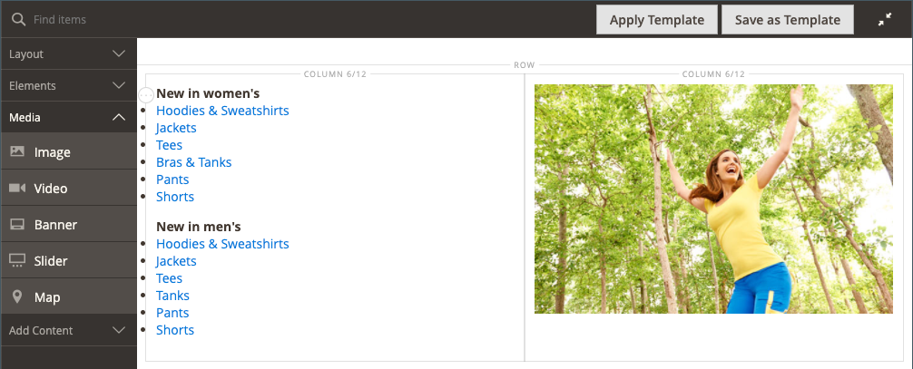
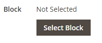
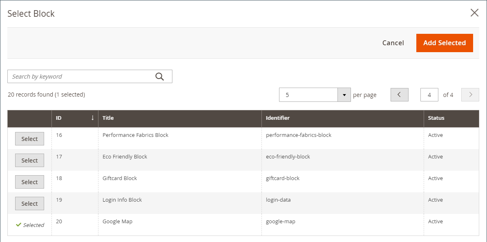
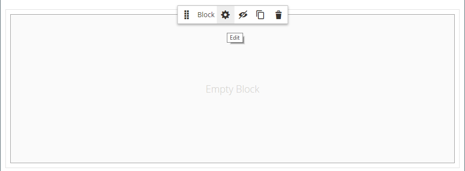

# 添加内容 — 阻止

使用 _块_ 内容类型，用于添加现有的、活动的 [块](../content-design/blocks.md) 到 [[!DNL Page Builder] 阶段](workspace.md#stage). 在以下示例中，第一列包含带有页面侧菜单的块。 第二列包含图像。

{width="600" zoomable="yes"}

{{$include /help/_includes/page-builder-save-timeout.md}}

## 块工具箱

| 工具 | 图标 | 描述 |
| --------- | -------- | ------------- |
| 移动 |  | 将块容器及其内容移动到舞台上的另一个位置。 |
| 设置 |  | 打开“编辑块”页面，您可以在此页面中选择块并更改容器的属性。 |
| 隐藏 |  | 隐藏当前块容器及其内容。 |
| 显示 |  | 显示隐藏的块容器及其内容。 |
| 复制 |  | 制作块容器及其内容的副本。 |
| 移除 |  | 从阶段中删除块容器及其内容。 |

{style="table-layout:auto"}

{{$include /help/_includes/page-builder-hidden-element-note.md}}

## 添加现有块

1. 导航至 [!DNL Page Builder] 目标页面、块、动态块、产品或类别上的工作区。

1. 在 [!DNL Page Builder] 面板，展开 **[!UICONTROL Add Content]** 并拖动 **[!UICONTROL Block]** 舞台占位符。

   {width="600" zoomable="yes"}

1. 将鼠标悬停在空的块容器上以显示工具箱，然后选择 _设置_ ( {width="25"} )图标。

1. 单击 **[!UICONTROL Select Block]**.

   {width="200"}

1. 在要添加块的行中，单击 **[!UICONTROL Select]** 在最后一列。

   {width="600" zoomable="yes"}

   所选块的名称将显示在页面上。

   {width="200"}

1. 使用本页末尾的字段说明作为参考，根据需要完成其余设置。

1. 完成后，单击 **[!UICONTROL Save]** 以应用设置并返回到 [!DNL Page Builder] 工作区。

### 高级设置

1. 要控制块在父容器中的位置，请选择 **[!UICONTROL Alignment]**：

   | 选项 | 描述 |
   | ------ | ----------- |
   | `Default` | 应用在当前主题的样式表中指定的对齐默认设置。 |
   | `Left` | 将列表沿父容器的左边框对齐，并允许使用指定的任何边距。 |
   | `Center` | 将列表与父容器的中心对齐，并允许使用指定的任何边距。 |
   | `Right` | 沿父容器的右边框对齐块，并允许指定的任何边距。 |

   {style="table-layout:auto"}

1. 设置 **[!UICONTROL Border]** 应用于块容器所有四个边的样式：

   | 选项 | 描述 |
   | ------ | ----------- |
   | `Default` | 应用关联样式表指定的默认边框样式。 |
   | `None` | 不提供任何容器边框的可见指示。 |
   | `Dotted` | 容器边框显示为虚线。 |
   | `Dashed` | 容器边框显示为虚线。 |
   | `Solid` | 容器边框显示为实线。 |
   | `Double` | 容器边框显示为双线。 |
   | `Groove` | 容器边框显示为一条开槽线。 |
   | `Ridge` | 容器边框显示为脊线。 |
   | `Inset` | 容器边框显示为内嵌行。 |
   | `Outset` | 容器边框显示为外线。 |

   {style="table-layout:auto"}

1. 如果设置的边框样式不是 `None`，完成边框显示选项：

   | 选项 | 描述 |
   | ------ |------------ |
   | [!UICONTROL Border Color] | 通过选择色板、单击拾色器或输入有效的颜色名称或等效的十六进制值来指定颜色。 |
   | [!UICONTROL Border Width] | 输入边框线条宽度的像素数。 |
   | [!UICONTROL Border Radius] | 输入像素数，以定义用于使边框每个角倒圆角的半径大小。 |

   {style="table-layout:auto"}

1. （可选）指定以下项目的名称： **[!UICONTROL CSS classes]** 要应用于容器的当前样式表中。

   用空格分隔多个类名。

1. 以像素为单位输入 **[!UICONTROL Margins and Padding]** 确定块容器的外边距和内边距。

   在图表中输入相应的值。

   | 容器区域 | 描述 |
   | -------------- | ----------- |
   | [!UICONTROL Margins] | 应用于容器所有边的外边缘的空白空间量。 选项： `Top` / `Right` / `Bottom` / `Left` |
   | [!UICONTROL Padding] | 应用于容器所有边的内边缘的空白空间量。 选项： `Top` / `Right` / `Bottom` / `Left` |

   {style="table-layout:auto"}

## 编辑块设置

1. 将鼠标悬停在块容器上并选择 _设置_ ( {width="25"} )图标。

   {width="600" zoomable="yes"}

1. 要选择其他块，请单击 **[!UICONTROL Select Block]**.

   - 在活动块列表中，单击 **[!UICONTROL Select]** 要添加的块。
   - 单击 **[!UICONTROL Add Selected]**.

1. 根据需要更新其余设置，可使用此页末尾的字段描述作为参考。

1. 完成后，单击 **[!UICONTROL Save]** 以应用设置并返回到 [!DNL Page Builder] 工作区。

## 复制块

1. 将鼠标悬停在块容器上以显示工具箱，然后选择 _复制_ ()图标。

   副本会出现在原始文件的正下方。

1. 要将新块移动到新位置，请将鼠标悬停在容器上，然后单击 _移动_ ()。

1. 选择并拖动块，直到红色指示线出现在新位置。

   移动块时，每个容器的顶部和底部边框显示为虚线。

## 从舞台上删除块

1. 将鼠标悬停在块容器上以显示工具箱，然后选择 _移除_ ()图标。

1. 提示确认时，单击 **[!UICONTROL OK]**.
