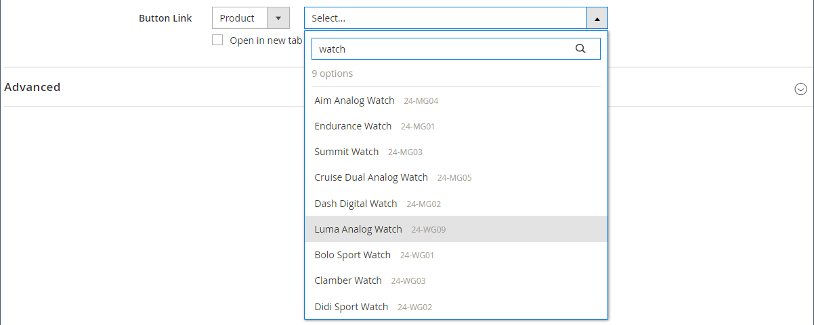

# 元素 — 按钮

使用 _按钮_ 内容类型，用于在 [[!DNL Page Builder] 阶段](workspace.md#stage). 您可以水平或垂直排列按钮，并将它们直接添加到舞台上的行、列、选项卡和横幅中。

{width="600" zoomable="yes"}

{{$include /help/_includes/page-builder-save-timeout.md}}

## 工具箱

在使用“按钮”内容类型时，您可以添加和编辑单个按钮以及包含一个或多个按钮的按钮容器。 每个组件都有自己的工具箱，您可以使用它们来设计 [!DNL Page Builder] 暂存。

### 单个按钮工具箱

{width="500" zoomable="yes"}

| 工具 | 图标 | 描述 |
| --------- | -------- | -------------- |
| 设置 | {width="25"} | 打开“编辑按钮”页面，您可以在该页面中更改按钮的属性。 |
| 复制 | {width="25"} | 创建按钮副本。 |
| 移除 | {width="25"} | 从舞台上删除按钮。 |

{style="table-layout:auto"}

### 按钮容器工具箱

{width="500" zoomable="yes"}

| 工具 | 图标 | 描述 |
| --------- | ----------------- | ----------- |
| 移动 | {width="25"} | 将按钮容器移至页面上的另一个有效位置。 |
| 添加 | {width="25"} | 向容器添加按钮。 |
| （标签） | 按钮 | 将当前容器标识为按钮元素。 |
| 设置 | {width="25"} | 打开“编辑按钮”页面，您可以在此页面更改容器的属性。 |
| 隐藏 | {width="25"} | 隐藏按钮容器。 |
| 显示 | {width="25"} | 显示隐藏按钮容器。 |
| 复制 | {width="25"} | 复制按钮容器。 |
| 移除 | {width="25"} | 从舞台中删除按钮容器及其内容。 |

{style="table-layout:auto"}

{{$include /help/_includes/page-builder-hidden-element-note.md}}

## 添加单个按钮

1. 在 [!DNL Page Builder] 面板，展开 **[!UICONTROL Elements]** 并拖动 **[!UICONTROL Buttons]** 舞台上的行、列或选项卡集的占位符。

   {width="500" zoomable="yes"}

1. 将鼠标悬停在按钮上以显示工具箱，然后选择 _设置_ ()图标。

1. 输入 **[!UICONTROL Button Text]** 按钮上显示的内容。

   {width="600" zoomable="yes"}

1. 设置 **[!UICONTROL Button Type]** 更改为以下任一项：

   | 类型 | 描述 |
   | ------ | ----------- |
   | `Primary` | 从当前样式表中应用主按钮样式。 |
   | `Secondary` | 应用当前样式表中的辅助按钮样式（如果适用）。 |
   | `Link` | 创建超链接而不是按钮。 |

   {style="table-layout:auto"}

   {width="500" zoomable="yes"}

1. 设置 **[!UICONTROL Button Link]** 使用以下类型之一：

   - **[!UICONTROL URL]**  — 输入链接的目标URL。

     URL可以是商店中产品或页面的相对链接，也可以是完全限定的URL。

     相对URL示例 —  `../luma-analog-watch.html`

     完全限定的URL示例 —  `http://mystore.com/luma-analog-watch.html`

     如果链接指向其他网站，则可以在新的浏览器选项卡中打开该链接，以保持当前页面对商店开放。

     要阻止访客离开您的商店，请选择 **[!UICONTROL Open in new tab]** 复选框。

   - **[!UICONTROL Product]**  — 输入产品名称（部分或完整）或SKU，然后在列表中选择产品名称。

     >[!NOTE]
     >
     >产品会根据以下条件显示在列表中 _显示缺货产品_ 设置。 对于多源商家，使用 [Inventory management](../inventory-management/introduction.md)，则产品列表仅受分配给默认网站的源的限制。

     {width="600" zoomable="yes"}

   - **[!UICONTROL Category]**  — 输入类别名称（部分或全部）或单击空白字段以显示类别树。 然后，在树中选择类别名称。

     {width="600" zoomable="yes"}

   - **[!UICONTROL Page]**  — 输入CMS页面的名称（部分或完整），或者单击空白字段以显示完整列表。 然后，在搜索结果列表中选择该页面的名称。

     {width="600" zoomable="yes"}

1. 完成 [高级设置][advanced-settings] 根据需要。

1. 完成后，单击 **[!UICONTROL Save]** 以应用设置并返回到 [!DNL Page Builder] 工作区。

## 添加一组按钮

以下各节将介绍一系列步骤，这些步骤将从单个按钮开始，并在按钮容器中创建一组三个按钮。 如果您还没有单独的按钮，请按照之前的说明将单独的按钮添加到舞台。

### 步骤1：创建第二个按钮

1. 将鼠标悬停在按钮容器上以显示工具箱，然后选择 _添加_ ( {width="20"} )图标。

   {width="500" zoomable="yes"}

1. 输入要显示在第二个按钮上的文本。

1. 单击“新建”按钮以显示其工具箱，然后选择 _设置_ ( {width="20"} )图标。

   {width="500" zoomable="yes"}

1. 设置 **[!UICONTROL Button Type]** 到 `Secondary`.

1. 设置 **[!UICONTROL Button Link]** 根据需要。

   在以下示例中，链接是前往的相对URL [联系我们](../getting-started/store-details.md#contact-us-form) 页面。

   {width="600" zoomable="yes"}

1. 完成 [高级设置][advanced-settings] 根据需要。

1. 完成后，单击 **[!UICONTROL Save]** 以应用设置并返回到 [!DNL Page Builder] 工作区。

### 第2步：创建第三个按钮

1. 再次单击舞台上的第二个按钮，然后选择 _复制_ ( {width="20"} )图标。

   {width="500" zoomable="yes"}

1. 输入要显示在第三个按钮上的文本。

1. 单击第三个按钮以显示工具箱，然后选择 _设置_ ( {width="20"} )图标。

   {width="500" zoomable="yes"}

1. 更新 **[!UICONTROL Button Link]** 根据需要。

1. 在右上角，单击 **[!UICONTROL Save]** 以应用设置并返回到 [!DNL Page Builder] 工作区。

### 步骤3：更新按钮容器

1. 将鼠标悬停在按钮容器上以显示工具箱，然后选择 _设置_ ( {width="20"} )图标。

   {width="500" zoomable="yes"}

1. 下 _[!UICONTROL Appearance]_，选择&#x200B;**[!UICONTROL Stacked]**.

1. 设置 **[!UICONTROL All Buttons are same size]** 到 `Yes`.

   {width="300"}

1. 使用中的说明，根据需要更新其余设置 [更改按钮容器的设置][button-container].

1. 完成后，单击 **[!UICONTROL Save]** 以应用设置并返回到 [!DNL Page Builder] 工作区。

   舞台上将显示完整的栈叠按钮集，其中包含一个主按钮和两个辅助按钮。

   {width="500" zoomable="yes"}

## 移动按钮

1. 单击要移动的按钮。

1. 选择并拖动移动( {width="20"} )图标（显示在按钮文本的前面）显示在按钮容器中的按钮的新位置。

   {width="500" zoomable="yes"}

## 更改按钮的设置

1. 单击舞台上的按钮以显示工具箱，然后选择 _设置_ ( {width="20"} )图标。

   {width="500" zoomable="yes"}

1. 根据需要更新标准设置。

   - **[!UICONTROL Button Text]**  — 输入要显示在按钮上的文本（也可以直接从舞台更新）。

   - **[!UICONTROL Button Type]**  — 确定按钮格式。

     | 类型 | 描述 |
     | ------ | ----------- |
     | `Primary` | 从当前样式表中应用主按钮样式。 |
     | `Secondary` | 应用当前样式表中的辅助按钮样式（如果适用）。 |
     | `Link` | 创建超链接而不是按钮。 |

     {style="table-layout:auto"}

   - **[!UICONTROL Button Link]**  — 确定单击按钮时提供的目标页面。

     | 选项 | 描述 |
     | ------ | ----------- |
     | `URL` | 使用相对或完全限定的URL来标识目标页面。 |
     | `Product` | 基于产品名称或SKU标识目标页面。 可以根据部分名称或全名搜索产品名称。 然后从搜索结果列表中选择产品。 |
     | `Category` | 将目标页面标识为类别树中的特定类别或子类别。 |
     | `Page` | 将目标页标识为特定的CMS页。 |

     {style="table-layout:auto"}

1. 完成 [高级设置][advanced-settings] 根据需要。

1. 要保存设置并返回至 [!DNL Page Builder] 工作区，单击 **[!UICONTROL Save]** 在右上角。

## 更改按钮容器的设置

1. 将鼠标悬停在按钮容器上以显示工具箱，然后选择 _设置_ ( {width="20"} )图标。

1. 更新 **[!UICONTROL Appearance]** 设置。

   - 使用排列选项在容器中水平或垂直显示按钮：

     | 选项 | 描述 |
     | ------ | ----------- |
     | `Inline` | 水平排列按钮。 |
     | `Stacked` | 垂直排列按钮。 |

     {style="table-layout:auto"}

   - 设置 **[!UICONTROL All buttons are same size]** 根据您的喜好选择。

     当设置为 `Yes`，根据最长按钮文本的长度，容器中的所有按钮具有一致的大小。

1. 完成 [高级设置][advanced-settings] 根据需要。

1. 完成后，单击 **[!UICONTROL Save]** 以应用设置并返回到 [!DNL Page Builder] 工作区。

## 更改高级设置

您可以修改 _[!UICONTROL Advanced]_单个按钮和按钮容器的设置。

1. 要控制父容器中的位置，请选择 **[!UICONTROL Alignment]**：

   | 选项 | 描述 |
   | ------ | ----------- |
   | `Default` | 应用在当前主题的样式表中指定的对齐默认设置。 |
   | `Left` | 将内容沿父容器的左边框对齐，并允许使用指定的任何边距。 |
   | `Center` | 将内容与父容器的中心对齐，并允许指定的任何边距。 |
   | `Right` | 将内容沿父容器的右边框对齐，并允许使用指定的任何边距。 |

   {style="table-layout:auto"}

1. 设置 **[!UICONTROL Border]** 应用于按钮或按钮容器所有四侧的样式：

   | 选项 | 描述 |
   | ------ | ----------- |
   | `Default` | 应用关联样式表指定的默认边框样式。 |
   | `None` | 不提供任何容器边框的可见指示。 |
   | `Dotted` | 容器边框显示为虚线。 |
   | `Dashed` | 容器边框显示为虚线。 |
   | `Solid` | 容器边框显示为实线。 |
   | `Double` | 容器边框显示为双线。 |
   | `Groove` | 容器边框显示为一条开槽线。 |
   | `Ridge` | 容器边框显示为脊线。 |
   | `Inset` | 容器边框显示为内嵌行。 |
   | `Outset` | 容器边框显示为外线。 |

   {style="table-layout:auto"}

1. 如果设置的边框样式不是 `None`，完成边框显示选项：

   | 选项 | 描述 |
   | ------ |------------ |
   | [!UICONTROL Border Color] | 通过选择色板、单击拾色器或输入有效的颜色名称或等效的十六进制值来指定颜色。 |
   | [!UICONTROL Border Width] | 输入边框线条宽度的像素数。 |
   | [!UICONTROL Border Radius] | 输入像素数，以定义用于使边框每个角倒圆角的半径大小。 |

   {style="table-layout:auto"}

1. （可选）指定以下项目的名称： **[!UICONTROL CSS classes]** ，以应用于按钮或按钮容器。

   用空格分隔多个类名。

1. 以像素为单位输入 **[!UICONTROL Margins and Padding]** 确定按钮或按钮容器的外边距和内边距。

   在图表中输入相应的值。

   | 容器区域 | 描述 |
   | -------------- | ----------- |
   | [!UICONTROL Margins] | 应用于容器所有边的外边缘的空白空间量。 选项： `Top` / `Right` / `Bottom` / `Left` |
   | [!UICONTROL Padding] | 应用于容器所有边的内边缘的空白空间量。 选项： `Top` / `Right` / `Bottom` / `Left` |

   {style="table-layout:auto"}

[advanced-settings]: #change-advanced-settings
[button-container]: #change-settings-for-a-button-container
