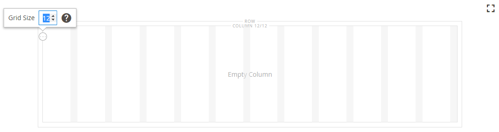
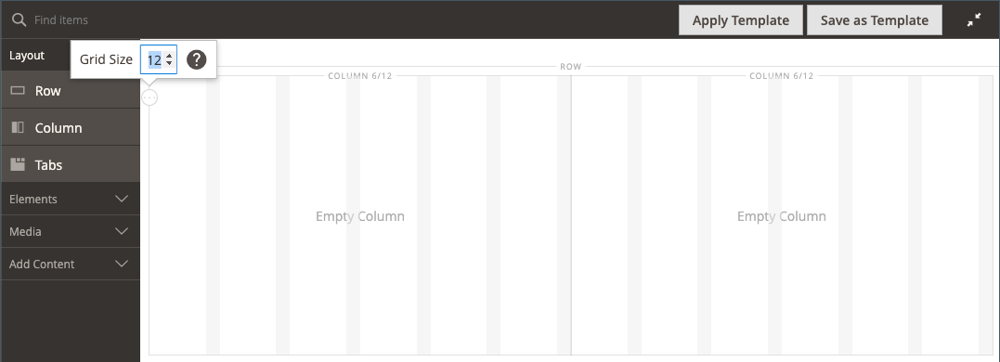
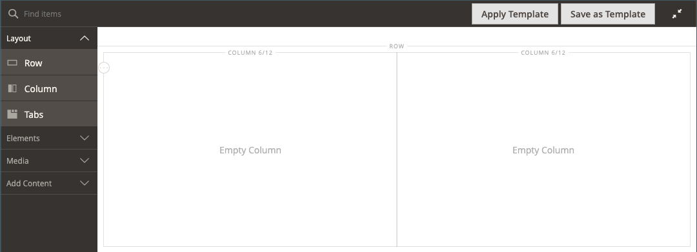
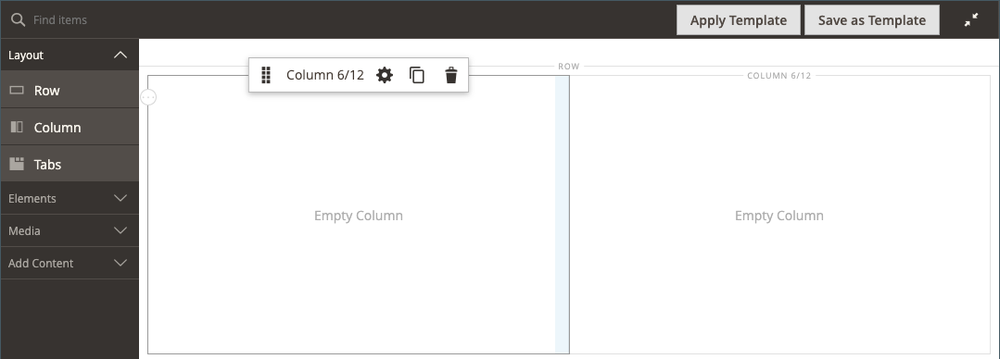
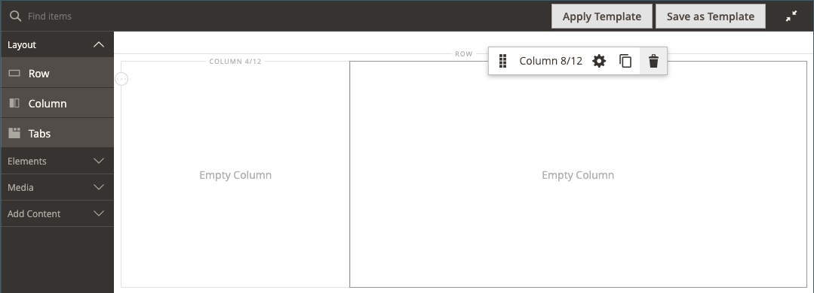
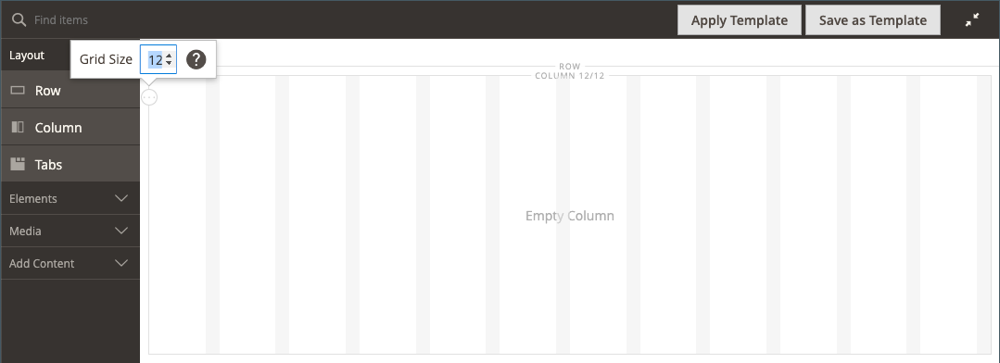

# 布局 — 列

使用 _列_ 内容类型，用于将页面划分到 [[!DNL Page Builder] 阶段](workspace.md#stage). 将列添加到行或选项卡或直接添加到舞台时，列组最初会被分为两列，两列的宽度相等。 您可以根据需要添加或删除列。 可通过拖动两列之间的边框来调整列的大小。 将调整下一列的宽度以填充行、选项卡或舞台中的可用空间。 单列可延伸舞台或其容器的整个宽度。

{width="600" zoomable="yes"}

{{$include /help/_includes/page-builder-save-timeout.md}}

## 2.4.5版本中的更新

页面生成器功能已在2.4.5版本中更新，以便用户现在使用 _[!DNL Columns]_作为单个列的父容器。 此新容器还支持背景属性，并且无需将列换行。 它减少了不必要的标记，并对店面显示和体验提供了更精细的控制。

您可以更改 [!DNL Columns] 通过在组中其他列的上方或下方拖动一列来栈叠这些列。 这打开了各种新的可能布局组合，无需开发人员自定义即可实现这些组合。

观看本视频，了解如何 [!DNL Columns] 容器可用于优化页面布局：

>[!VIDEO](https://video.tv.adobe.com/v/345828?quality=12)

## 列工具箱

每列都有一个选项工具箱，当您将鼠标悬停在该容器上时，将会显示这些选项。

| 工具 | 图标 | 描述 |
|--- |--- |--- |
| 移动 | {width="25"} | 将列及其内容移动到相对于其他列的另一个位置。 |
| （标签） | 列 | 将当前容器标识为列。 将鼠标悬停在列容器上以显示工具箱。 |
| 设置 | {width="25"} | 打开“编辑列”页，在该页中可以更改容器的属性。 |
| 复制 | {width="25"} | 生成当前列的副本。 |
| 移除 | {width="25"} | 删除当前列及其内容。 |

{style="table-layout:auto"}

## 列网格

此 [网格](workspace.md) 确保内容在列中始终保持一致，并帮助页面在桌面和移动设备上正确呈现。 欲了解更多信息，请参见 [高级内容工具](setup.md) 的部分 [!DNL Page Builder] 配置。

{width="500" zoomable="yes"}

在以下两列示例中，每个列容器顶部边框的圆括号(6/12)中的数字表示每列的网格划分数以及划分总数。 在本例中，该列是总共12个网格单位中的6个网格单位的宽度。

{width="600" zoomable="yes"}

## 添加列

1. 在 [!DNL Page Builder] 下的面板 _[!UICONTROL Layout]_，拖动&#x200B;**[!UICONTROL Column]**到舞台上。

   {width="600" zoomable="yes"}

   列组现在分为两列，两列的宽度相等。 每列都是一个单独的内容容器，并且有自己的一组工具箱选项。

   {width="600" zoomable="yes"}

1. 在列组的左上角，单击 _网格_ 工具()，并根据需要调整网格大小。

   将内容放在网格上有助于使内容保持一致，并在桌面和移动设备上正确呈现页面。 欲了解更多信息，请参见 [高级内容工具](../configuration-reference/general/content-management.md) 的部分 [!DNL Page Builder] 配置。

   {width="600" zoomable="yes"}

## 调整列大小

1. 将鼠标悬停在两列之间的边框上。

   边框加亮，选定列的工具箱出现。

   {width="600" zoomable="yes"}

1. 按住鼠标按钮以显示网格，并将边框拖到网格上的新位置。

   两列的宽度会调整以反映更改。 每列的新宽度显示在标签之后，例如 `4/12` （12个中有4个）和 `8/12` （12个中有8个）。

   {width="600" zoomable="yes"}

## 删除列

1. 将鼠标悬停在要移除的列上以显示工具箱，然后选择 _移除_ ( {width="20"} )图标。

   {width="600" zoomable="yes"}

1. 如果列包含内容，请单击 **[!UICONTROL OK]** 以确认。

   为了将来加快流程，您可以通过选择 **[!UICONTROL Do not show this again]** 复选框。

   列组现在具有单个列(12/12)和网格。 由于网格仅对列可用，因此可以使用此技术来显示网格。

   {width="600" zoomable="yes"}

1. 如果希望列组将剩余列扩展为行或舞台的完整宽度：

   - 将鼠标悬停在该列上以显示工具箱，然后选择 _设置_ ( {width="20"} )图标。

   - 向下滚动到 _[!UICONTROL Advanced]_部分并设置所有四个&#x200B;**[!UICONTROL Padding]**值到 `0`.

     {width="600" zoomable="yes"}

   - 在右上角，单击 **[!UICONTROL Save]** 关闭 _[!UICONTROL Edit Column]_页面。

1. 单击 _关闭全屏_ ( {width="20"} )图标，然后单击 **[!UICONTROL Save]** 在右上角。

## 更改列设置

1. 将鼠标悬停在该列上以显示工具箱，然后选择 _设置_ ( {width="20"} )图标。

   {width="600" zoomable="yes"}

1. 更改 **[!UICONTROL Appearance]** 设置。

   - 选择用于确定列相对于其容器的位置的对齐设置。

     | 选项 | 描述 |
     | ------ | ----------- |
     | `Full Height` | 列会扩展其容器的完整高度。 |
     | `Top Aligned` | 列将在其容器顶部对齐。 |
     | `Centered` | 列居中在其容器中间。 |
     | `Bottom Aligned` | 该列在其容器底部对齐。 |

     {style="table-layout:auto"}

   - 如果需要，请输入 **[!UICONTROL Minimum Height]** 用于列。 例如，可以设置最小高度以匹配背景图像的高度。

   - 如果设置最小高度，则设置 **[!UICONTROL Vertical Alignment]**  控制添加到列中的内容容器的位置(`Top`， `Center`，或 `Bottom`)。

1. 更改列内容的背景。

   - **[!UICONTROL Background Color]**  — 通过选择色板、单击拾色器或输入有效的颜色名称或等效的十六进制值来指定颜色。 此设置确定列的背景颜色。

   - **[!UICONTROL Background Image]**  — 如果需要，请使用提供的工具选择要应用于列的背景图像：

     | 工具 | 描述 |
     | ------ | ----------- |
     | [!UICONTROL Upload] | 将图像文件从本地计算机上载到图片库，然后将其作为列的背景图像应用。 |
     | [!UICONTROL Select from Gallery] | 提示您从图库中选择现有图像作为列的背景图像。 |
     | {width="25"} | 允许您将图像拖到相机图块或浏览到本地文件系统中的图像。 |

     {style="table-layout:auto"}

   - **[!UICONTROL Background Mobile Image]**  — 如果需要，请使用相同的工具来选择要在移动设备上显示的不同背景图像。

   - **[!UICONTROL Background Size]**  — 更改此设置以确定相对于列宽缩放背景图像的方式：

     | 选项 | 描述 |
     | ------ | ----------- |
     | `Cover` | 背景图像覆盖列的整个宽度。 |
     | `Contain` | 背景图像被限制为内容区域的宽度。 |
     | `Auto` | 应用在当前主题的样式表中指定的默认背景大小。 |

     {style="table-layout:auto"}

   - **[!UICONTROL Background Position]**  — 更改此设置以确定图像相对于列的锚点。 选项： `Top Left`， `Top Center`， `Top Right`， `Center Left`， `Center`， `Center Right`， `Bottom Left`， `Bottom Center`，或 `Bottom Right`

   - **[!UICONTROL Background Attachment]**  — 更改此设置以确定背景图像相对于滚动页面的移动方式：

     | 选项 | 描述 |
     | ------ | ----------- |
     | `Scroll` | 背景图像将同步以便在页面滚动时向下移动。 |
     | `Fixed` | （不适用于移动设备）当容器在图像上滚动时，背景图像不会移动，并且会固定到指定的背景位置。 |

     {style="table-layout:auto"}

   - **[!UICONTROL Background Repeat]**  — 如果要重复背景图像以填充空间，请更改此设置 `Yes`.

1. 更新 _[!UICONTROL Advanced]_设置。

   - 要控制添加到列中的内容容器的水平位置，请选择 **[!UICONTROL Alignment]**：

     | 选项 | 描述 |
     | ------ | ----------- |
     | `Default` | 应用在当前主题的样式表中指定的对齐默认设置。 |
     | `Left` | 将内容容器沿列容器的左边框对齐，并允许使用指定的任何边距。 |
     | `Center` | 将内容容器对齐列容器的中心，并允许指定的任何边距。 |
     | `Right` | 将内容容器沿列容器的右边框对齐，并允许使用指定的任何边距。 |

     {style="table-layout:auto"}

   - 设置 **[!UICONTROL Border]** 样式，应用于列容器的所有四侧：

     | 选项 | 描述 |
     | ------ | ----------- |
     | `Default` | 应用关联样式表指定的默认边框样式。 |
     | `None` | 不提供任何容器边框的可见指示。 |
     | `Dotted` | 容器边框显示为虚线。 |
     | `Dashed` | 容器边框显示为虚线。 |
     | `Solid` | 容器边框显示为实线。 |
     | `Double` | 容器边框显示为双线。 |
     | `Groove` | 容器边框显示为一条开槽线。 |
     | `Ridge` | 容器边框显示为脊线。 |
     | `Inset` | 容器边框显示为内嵌行。 |
     | `Outset` | 容器边框显示为外线。 |

     {style="table-layout:auto"}

   - 如果设置的边框样式不是 `None`，完成边框显示选项：

     | 选项 | 描述 |
     | ------ |------------ |
     | [!UICONTROL Border Color] | 通过选择色板、单击拾色器或输入有效的颜色名称或等效的十六进制值来指定颜色。 |
     | [!UICONTROL Border Width] | 输入边框线条宽度的像素数。 |
     | [!UICONTROL Border Radius] | 输入像素数，以定义用于使边框每个角倒圆角的半径大小。 |

     {style="table-layout:auto"}

   - （可选）指定以下项目的名称： **[!UICONTROL CSS classes]** 要应用于列容器的当前样式表中。

     用空格分隔多个类名。

   - 以像素为单位输入 **[!UICONTROL Margins and Padding]** 指定列的外边距和内边距。

     在列容器图中输入每个相应的值。

     | 容器区域 | 描述 |
     | -------------- | ----------- |
     | [!UICONTROL Margins] | 应用于容器所有边的外边缘的空白空间量。 选项： `Top` / `Right` / `Bottom` / `Left` |
     | [!UICONTROL Padding] | 应用于容器所有边的内边缘的空白空间量。 选项： `Top` / `Right` / `Bottom` / `Left` |

     {style="table-layout:auto"}

1. 完成后，单击 **[!UICONTROL Save]** 以应用设置并返回到 [!DNL Page Builder] 工作区。
