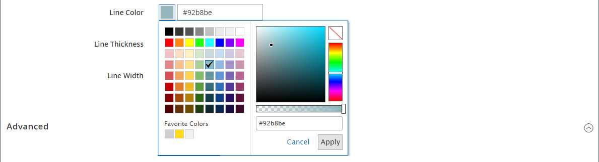

# 元素 — 分隔条

使用 _分隔条_ 内容类型，用于将规则添加为中不同内容部分之间的可视分隔符 [[!DNL Page Builder] 阶段](workspace.md#stage). 可以指定分隔线的线颜色、厚度和宽度。 您还可以控制对齐方式、设置边距和填充以及容器边框的格式。 默认情况下，分隔线是扩展容器整个宽度的细线规则，其中允许使用边距。

{width="500" zoomable="yes"}

尽管大多数分隔线容器是不可见的，但下面的示例用红色虚线边框显示容器，以便您查看分隔线、内边距和容器之间的关系。 可以调整分隔线顶部和底部的内边距，以控制元素之间的间距。

{width="500" zoomable="yes"}

{{$include /help/_includes/page-builder-save-timeout.md}}

## 分隔线工具箱

| 工具 | 图标 | 描述 |
| ---- | --------------------| ------------|
| 移动 | {width="25"} | 将分隔线容器移至页面上的另一个有效位置。 |
| （标签） | 分隔条 | 将当前容器标识为分隔线元素。 |
| 设置 | {width="25"} | 打开“编辑分隔条”页面，您可以在此页面更改分隔条及其容器的属性。 |
| 隐藏 | {width="25"} | 隐藏分隔条容器。 |
| 显示 | {width="25"} | 显示隐藏的分隔符容器。 |
| 复制 | {width="25"} | 制作分隔条容器的副本。 |
| 移除 | {width="25"} | 从舞台中删除分隔线容器及其内容。 |

{style="table-layout:auto"}

{{$include /help/_includes/page-builder-hidden-element-note.md}}

## 添加分隔条

1. 在 [!DNL Page Builder] 面板，展开 **[!UICONTROL Elements]** 并拖动 **[!UICONTROL Divider]** 舞台上的行、列或选项卡集的占位符。

   在将分隔线放置在舞台上的另一个内容容器之前或之后时，请使用红色准则作为参考。

   {width="600" zoomable="yes"}

   在以下示例中，分隔符标记了文本新部分的开始。

   {width="500" zoomable="yes"}

1. 要指定新分隔符的设置，请按照以下步骤操作。

## 更改分隔线设置

1. 将鼠标悬停在分隔线容器上以显示工具箱，然后选择 _设置_ ( {width="20"} )图标。

   {width="500" zoomable="yes"}

1. 更改分隔条 **[!UICONTROL Line Color]** 使用以下方法之一：

   - 请输入有效的 [HTML颜色名称][1]. 例如， `Teal`.
   - 输入十六进制颜色值。 例如， `#008080`.

   完成后，单击 **[!UICONTROL Apply]**.

   {width="600" zoomable="yes"}

1. 输入 **[!UICONTROL Line Thickness]** 以像素为单位。

1. 要指明度量单位，请输入 **[!UICONTROL Line Width]** 后跟 `px` 或 `%`.

   {width="600" zoomable="yes"}

1. 更新 _[!UICONTROL Advanced]_设置。

   - 要控制分隔线在父容器中的位置，请选择 **[!UICONTROL Alignment]**：

     | 选项 | 描述 |
     | ------ | ----------- |
     | `Default` | 应用在当前主题的样式表中指定的对齐默认设置。 |
     | `Left` | 将列表沿父容器的左边框对齐，并允许使用指定的任何边距。 |
     | `Center` | 将列表与父容器的中心对齐，并允许使用指定的任何边距。 |
     | `Right` | 沿父容器的右边框对齐块，并允许指定的任何边距。 |

     {style="table-layout:auto"}

     在下例中，选项设置为使用分隔线的中心对齐。

     {width="600" zoomable="yes"}

   - 设置 **[!UICONTROL Border]** 应用于分隔线容器所有四个边的样式：

     | 选项 | 描述 |
     | ------ | ----------- |
     | `Default` | 应用关联样式表指定的默认边框样式。 |
     | `None` | 不提供任何容器边框的可见指示。 |
     | `Dotted` | 容器边框显示为虚线。 |
     | `Dashed` | 容器边框显示为虚线。 |
     | `Solid` | 容器边框显示为实线。 |
     | `Double` | 容器边框显示为双线。 |
     | `Groove` | 容器边框显示为一条开槽线。 |
     | `Ridge` | 容器边框显示为脊线。 |
     | `Inset` | 容器边框显示为内嵌行。 |
     | `Outset` | 容器边框显示为外线。 |

     {style="table-layout:auto"}

   - 如果设置的边框样式不是 `None`，完成边框显示选项：

     | 选项 | 描述 |
     | ------ |------------ |
     | [!UICONTROL Border Color] | 通过选择色板、单击拾色器或输入有效的颜色名称或等效的十六进制值来指定颜色。 |
     | [!UICONTROL Border Width] | 输入边框线条宽度的像素数。 |
     | [!UICONTROL Border Radius] | 输入像素数，以定义用于使边框每个角倒圆角的半径大小。 |

     {style="table-layout:auto"}

   - （可选）指定以下项目的名称： **[!UICONTROL CSS classes]** 要应用于容器的当前样式表中。

     用空格分隔多个类名。

   - 以像素为单位输入 **[!UICONTROL Margins and Padding]** 确定分隔线容器的外边距和内边距。

     在图表中输入相应的值。

     | 容器区域 | 描述 |
     | -------------- | ----------- |
     | [!UICONTROL Margins] | 应用于容器所有边的外边缘的空白空间量。 选项： `Top` / `Right` / `Bottom` / `Left` |
     | [!UICONTROL Padding] | 应用于容器所有边的内边缘的空白空间量。 选项： `Top` / `Right` / `Bottom` / `Left` |

     {style="table-layout:auto"}

1. 完成后，单击 **[!UICONTROL Save]** 以应用设置并返回到 [!DNL Page Builder] 工作区。

   {width="500" zoomable="yes"}

## 复制分隔条

对于具有特定设置的格式化分隔条，制作重复项比使用新的占位符从头开始更有效。

1. 将鼠标悬停在分隔线容器上以显示工具箱，然后选择 _复制_ ( {width="20"} )图标。

   重复分隔线容器显示在原始分隔线的正下方。

   {width="500" zoomable="yes"}

1. 将鼠标悬停在新分隔线容器上以显示工具箱，然后选择 _移动_ ( {width="20"} )图标。

   {width="500" zoomable="yes"}

1. 选择并拖动分隔线，直到红色基准线标记新位置。

   移动分隔线时，每个容器的顶边框和底边框显示为虚线。

   {width="500" zoomable="yes"}

[1]: https://en.wikipedia.org/wiki/Web_colors
