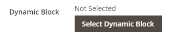

# 添加内容 — 动态块

使用动态块内容类型将现有[动态块](../content-design/dynamic-blocks.md)添加到[[!DNL Page Builder] 阶段](workspace.md#stage)。

店面上的{width="700" zoomable="yes"}

{{$include /help/_includes/page-builder-save-timeout.md}}

## 动态块工具箱

| 工具 | 图标 | 描述 |
| --------- | ------------- | ----------------- |
| 移动 | {width="25"} | 将块容器及其内容移动到舞台上的另一个位置。 |
| 设置 | {width="25"} | 打开&#x200B;_编辑块_&#x200B;页面，您可以在其中选择块并更改容器的属性。 |
| 隐藏 | {width="25"} | 隐藏当前块容器及其内容。 |
| 显示 | {width="25"} | 显示隐藏的块容器及其内容。 |
| 复制 | {width="25"} | 制作块容器及其内容的副本。 |
| 移除 | {width="25"} | 从阶段中删除块容器及其内容。 |

{style="table-layout:auto"}

{{$include /help/_includes/page-builder-hidden-element-note.md}}

## 向阶段添加现有动态块

1. 导航到目标页面、块、产品或类别上的[!DNL Page Builder]工作区。

1. 在[!DNL Page Builder]面板中，展开&#x200B;**[!UICONTROL Add Content]**&#x200B;并将&#x200B;**[!UICONTROL Dynamic Block]**&#x200B;占位符拖到舞台上。

   {width="600" zoomable="yes"}

1. 将鼠标悬停在空的动态块容器上以显示工具箱，然后选择&#x200B;_设置_ （ {width="20"} ）图标。

   {width="600" zoomable="yes"}

1. 在&#x200B;_编辑动态块_&#x200B;页面上，单击&#x200B;**[!UICONTROL Select Dynamic Block]**&#x200B;并使用列表选择块。

   {width="600" zoomable="yes"}

   在列表中，找到要插入的动态块，然后单击&#x200B;**[!UICONTROL Select]**。 然后，单击&#x200B;**[!UICONTROL Add Selected]**。

   {width="600" zoomable="yes"}

   下面显示了动态块信息的摘要。

   {width="600" zoomable="yes"}

1. 将&#x200B;**[!UICONTROL Template]**&#x200B;设置为以下项之一：

   | 选项 | 描述 |
   | ------ | ----------- |
   | `Dynamic Block Block Template` | 添加独立块。 |
   | `Dynamic Block Inline Template` | 将块内容插入到文本中。 |

   {style="table-layout:auto"}

   {width="200"}

1. 根据需要完成高级设置。

1. 完成后，单击&#x200B;**[!UICONTROL Save]**&#x200B;以应用设置并返回到[!DNL Page Builder]工作区。

### 高级设置

1. 若要控制动态块在父容器中的位置，请选择&#x200B;**[!UICONTROL Alignment]**：

   | 选项 | 描述 |
   | ------ | ----------- |
   | `Default` | 应用在当前主题的样式表中指定的对齐默认设置。 |
   | `Left` | 将列表沿父容器的左边框对齐，并允许使用指定的任何边距。 |
   | `Center` | 将列表与父容器的中心对齐，并允许使用指定的任何边距。 |
   | `Right` | 沿父容器的右边框对齐块，并允许指定的任何边距。 |

   {style="table-layout:auto"}

1. 设置应用于动态块容器所有四个侧面的&#x200B;**[!UICONTROL Border]**&#x200B;样式：

   | 选项 | 描述 |
   | ------ | ----------- |
   | `Default` | 应用关联样式表指定的默认边框样式。 |
   | `None` | 不提供任何容器边框的可见指示。 |
   | `Dotted` | 容器边框显示为虚线。 |
   | `Dashed` | 容器边框显示为虚线。 |
   | `Solid` | 容器边框显示为实线。 |
   | `Double` | 容器边框显示为双线。 |
   | `Groove` | 容器边框显示为一条开槽线。 |
   | `Ridge` | 容器边框显示为脊线。 |
   | `Inset` | 容器边框显示为内嵌行。 |
   | `Outset` | 容器边框显示为外线。 |

   {style="table-layout:auto"}

1. 如果设置了除`None`之外的边框样式，请完成边框显示选项：

   | 选项 | 描述 |
   | ------ |------------ |
   | [!UICONTROL Border Color] | 通过选择色板、单击拾色器或输入有效的颜色名称或等效的十六进制值来指定颜色。 |
   | [!UICONTROL Border Width] | 输入边框线条宽度的像素数。 |
   | [!UICONTROL Border Radius] | 输入像素数，以定义用于使边框每个角倒圆角的半径大小。 |

   {style="table-layout:auto"}

1. （可选）从当前样式表中指定要应用于容器的&#x200B;**[!UICONTROL CSS classes]**&#x200B;的名称。

   用空格分隔多个类名。

1. 输入&#x200B;**[!UICONTROL Margins and Padding]**&#x200B;的值（以像素为单位）以确定动态块容器的外边距和内边距。

   在图表中输入相应的值。

   | 容器区域 | 描述 |
   | -------------- | ----------- |
   | [!UICONTROL Margins] | 应用于容器所有边的外边缘的空白空间量。 选项： `Top` / `Right` / `Bottom` / `Left` |
   | [!UICONTROL Padding] | 应用于容器所有边的内边缘的空白空间量。 选项： `Top` / `Right` / `Bottom` / `Left` |

   {style="table-layout:auto"}

## 编辑动态块容器设置

1. 将鼠标悬停在动态块容器上以显示工具箱并选择&#x200B;_设置_ （{width="20"} ）图标。

   {width="500" zoomable="yes"}

1. 如果需要，请更改动态块：

   - 单击&#x200B;**[!UICONTROL Select Dynamic Block]**。

     {width="20"}

   - 在活动动态块列表中，单击要添加块的&#x200B;**[!UICONTROL Select]**。

1. 根据需要更新其余设置。

1. 完成后，单击&#x200B;**[!UICONTROL Save]**&#x200B;以应用设置并返回到[!DNL Page Builder]工作区。

## 复制动态块

1. 将鼠标悬停在动态块容器上以显示工具箱并选择&#x200B;_复制_ （{width="20"} ）图标。

   副本会出现在原始文件的正下方。

   {width="500" zoomable="yes"}

1. 若要将新的动态块移动到其他位置，请将鼠标悬停在其容器上，然后在工具箱中选择&#x200B;_移动_ （{width="20"} ）。

1. 选择并拖动动态块，直到红色指示线出现在新位置。

   移动动态块时，每个容器的顶部和底部边框显示为虚线。

## 从舞台上删除动态块

1. 将鼠标悬停在动态块容器上以显示工具箱并选择&#x200B;_删除_ （{width="20"} ）图标。

1. 提示确认时，单击&#x200B;**[!UICONTROL OK]**。

<!-- Last updated from includes: 2023-09-11 14:30:19 -->
