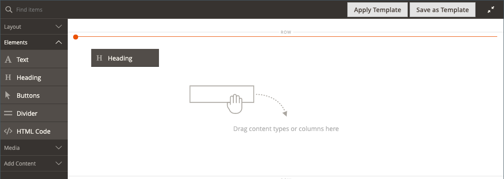

# 元素 — 标题

标题级别建立一个层次结构，用于组织内容并帮助搜索引擎为每个页面编制索引。 使用 _标题_ 中的内容类型 [[!DNL Page Builder] 阶段](workspace.md#stage) 将标题级别为H1到H6的文本容器添加到舞台中。 根据与当前主题关联的样式表设置标题的格式。

此 [内容标题](workspace.md) 中的字段 _[!UICONTROL Content]_部分可用于将H1标题添加到页面顶部。 但是，该字段是以前版本中的旧版 [!DNL Commerce] 版本和提供的支持较早的内容。 此字段不利用 [!DNL Page Builder]的高级功能。 建议您将“内容标题”字段留空，并使用 [!DNL Page Builder] 标题内容类型，用于向页面添加任何级别的标题。

以下示例显示了使用Luma主题设置格式时，内容标题和标题内容类型的显示方式。

{width="700" zoomable="yes"}

您可以从 _元素_ 的部分 [!DNL Page Builder] 面板到舞台上的行、列或选项卡集。 可以通过舞台上的编辑器工具栏或者使用来控制标题级别和对齐方式 _设置_ ( {width="20"} )控件。

{{$include /help/_includes/page-builder-save-timeout.md}}

## 标题编辑器

{width="500" zoomable="yes"}

## 标题容器工具箱

与所有内容容器一样，当您将鼠标悬停在该容器上时，将会显示工具箱。

{width="500" zoomable="yes"}

| 工具 | 图标 | 描述 |
| --------- | ----------------- | ---------------------- |
| 移动 | {width="25"} | 将标题容器移动到页面上的另一个有效位置。 |
| （标签） | 标题 | 将当前容器标识为标题。 |
| 设置 | {width="25"} | 打开“编辑标题”页面，您可以在此页面更改容器的属性。 |
| 隐藏 | {width="25"} | 隐藏标题容器。 |
| 显示 | {width="25"} | 显示隐藏的标题容器。 |
| 复制 | {width="25"} | 复制标题容器。 |
| 移除 | {width="25"} | 从舞台中删除标题容器及其内容。 |

{style="table-layout:auto"}

{{$include /help/_includes/page-builder-hidden-element-note.md}}

## 添加标题

1. 在 [!DNL Page Builder] 面板，展开 **[!UICONTROL Elements]** 并拖动 **[!UICONTROL Heading]** 舞台上的行、列或选项卡集的占位符。

   {width="600" zoomable="yes"}

1. 在编辑器中，输入 `Edit Heading Text` 占位符。

   默认情况下，为标题文本分配了第二级(H2)标题类型。

   {width="500" zoomable="yes"}

1. 在工具栏中，选择H1和H6之间的相应标题类型。

1. 根据需要更改对齐方式。

## 编辑标题设置

1. 将鼠标悬停在标题容器上以显示工具箱，然后选择 _设置_ ( {width="20"} )图标。

   {width="500" zoomable="yes"}

1. 更新标题内容(**[!UICONTROL Heading Type]** 和 **[!UICONTROL Heading Text]**)。

   您还可以在标题编辑器中更新此内容。

1. 更新 _[!UICONTROL Advanced]_设置。

   - 要控制标题在父容器中的位置，请选择 **[!UICONTROL Alignment]**：

     | 选项 | 描述 |
     | ------ | ----------- |
     | `Default` | 应用在当前主题的样式表中指定的对齐默认设置。 |
     | `Left` | 将列表沿父容器的左边框对齐，并允许使用指定的任何边距。 |
     | `Center` | 将列表与父容器的中心对齐，并允许使用指定的任何边距。 |
     | `Right` | 沿父容器的右边框对齐块，并允许指定的任何边距。 |

     {style="table-layout:auto"}

   - 设置 **[!UICONTROL Border]** 应用于标题容器所有四边的样式：

     | 选项 | 描述 |
     | ------ | ----------- |
     | `Default` | 应用关联样式表指定的默认边框样式。 |
     | `None` | 不提供任何容器边框的可见指示。 |
     | `Dotted` | 容器边框显示为虚线。 |
     | `Dashed` | 容器边框显示为虚线。 |
     | `Solid` | 容器边框显示为实线。 |
     | `Double` | 容器边框显示为双线。 |
     | `Groove` | 容器边框显示为一条开槽线。 |
     | `Ridge` | 容器边框显示为脊线。 |
     | `Inset` | 容器边框显示为内嵌行。 |
     | `Outset` | 容器边框显示为外线。 |

     {style="table-layout:auto"}

   - 如果设置的边框样式不是 `None`，完成边框显示选项：

     | 选项 | 描述 |
     | ------ |------------ |
     | [!UICONTROL Border Color] | 通过选择色板、单击拾色器或输入有效的颜色名称或等效的十六进制值来指定颜色。 |
     | [!UICONTROL Border Width] | 输入边框线条宽度的像素数。 |
     | [!UICONTROL Border Radius] | 输入像素数，以定义用于使边框每个角倒圆角的半径大小。 |

     {style="table-layout:auto"}

   - （可选）指定以下项目的名称： **[!UICONTROL CSS classes]** 要应用于容器的当前样式表中。

     用空格分隔多个类名。

   - 以像素为单位输入 **[!UICONTROL Margins and Padding]** 确定标题容器的外边距和内边距。

     在图表中输入相应的值。

     | 容器区域 | 描述 |
     | -------------- | ----------- |
     | [!UICONTROL Margins] | 应用于容器所有边的外边缘的空白空间量。 选项： `Top` / `Right` / `Bottom` / `Left` |
     | [!UICONTROL Padding] | 应用于容器所有边的内边缘的空白空间量。 选项： `Top` / `Right` / `Bottom` / `Left` |

     {style="table-layout:auto"}

1. 完成后，单击 **[!UICONTROL Save]** 以应用设置并返回到 [!DNL Page Builder] 工作区。

## 复制标题

对于具有特定设置的格式化标题，复制标题比使用新占位符重新开始更有效。

1. 将鼠标悬停在标题容器上以显示工具箱，然后选择 _复制_ ( {width="20"} )图标。

   副本会出现在原始文件的正下方。

   {width="500" zoomable="yes"}

1. 将鼠标悬停在新标题容器上以显示工具箱，然后选择 _移动_ ( {width="20"} )图标。

   {width="500" zoomable="yes"}

1. 选择并拖动标题，直到红色基准标记新位置。

   移动标题时，每个容器的顶边框和底边框均显示为虚线。

   {width="500" zoomable="yes"}

1. 如果要更改标题级别，请单击标题文本，然后在编辑器工具栏中选择新级别。

   {width="500" zoomable="yes"}
