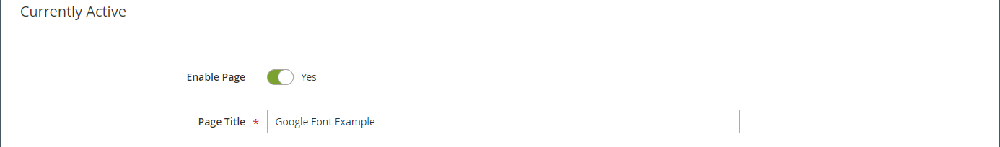

# 元素 — HTML代码

使用&#x200B;_HTML代码_&#x200B;内容类型在[[!DNL Page Builder] 阶段](workspace.md#stage)中添加HTML、CSS和JavaScript代码片段。 例如，您可能需要添加自定义HTML，声明可应用于页面上元素的CSS类。 或者，您可能希望为从第三方提供商收到的徽标、按钮或横幅添加一段代码。

## HTML代码工具箱

{width="500" zoomable="yes"}

| 工具 | 图标 | 描述 |
| --------- | ---------- | ----------------- |
| 移动 | {width="25"} | 将HTML代码容器移至页面上的另一个有效位置。 |
| 设置 | {width="25"} | 打开“编辑HTML代码”页面，您可以在该页面中更改容器的属性。 |
| 隐藏 | {width="25"} | 隐藏HTML代码容器。 |
| 显示 | {width="25"} | 显示隐藏的HTML代码容器。 |
| 复制 | {width="25"} | 复制HTML代码容器。 |
| 移除 | {width="25"} | 从舞台中删除HTML代码容器及其内容。 |

{{$include /help/_includes/page-builder-hidden-element-note.md}}

## 添加HTML代码

以下示例演示如何嵌入[Google Font][1]代码并声明覆盖当前样式表的自定义标题类。

### 步骤1：选择Google字体

1. 访问[Google Fonts][1]网站并选择要使用的字体系列。

1. 复制要嵌入到页面`<head>`部分中的生成代码，并将其临时粘贴到文本编辑器中。

   - 嵌入字体代码
   - CSS规则

1. 将字体系列规则添加到每个标题类中，并将标题类括在`<style>`标记中。

   此代码已粘贴到[!DNL Page Builder]中。

   ```html
   <style>
      h1 {color: teal; font-family: 'Khand', sans-serif; }
      h2 {color: teal; font-family: 'Khand', sans-serif; }
      h3 {color: teal; font-family: 'Khand', sans-serif; }
   </style>
   ```

### 第2步：将代码添加到页面中

1. 在商店的&#x200B;_管理员_&#x200B;侧边栏中，转到&#x200B;**[!UICONTROL Content]** > _[!UICONTROL Elements]_>**[!UICONTROL Pages]**。

1. 查找字体可用的页面，并在编辑模式下打开该页面。

1. 向下滚动并展开&#x200B;**[!UICONTROL Content]**&#x200B;部分。

1. 在[!DNL Page Builder]面板中，展开&#x200B;**[!UICONTROL Elements]**&#x200B;并将&#x200B;**[!UICONTROL HTML Code]**&#x200B;占位符拖到舞台上的行、列或选项卡集中。

   使用红色准则将分隔线放置在行、列或选项卡集中的另一个内容容器之前或之后。

   {width="600" zoomable="yes"}

1. 将鼠标悬停在HTML容器上以显示工具箱，然后选择&#x200B;_设置_ （ {width="20"} ）图标。

1. 在文本框中，粘贴您准备的嵌入Google Fonts代码和样式声明。

   为了便于阅读，您可以输入一些空格来缩进代码。

   {width="500" zoomable="yes"}

1. 根据需要更新其余设置(有关详细信息，请参阅[更改HTML代码设置](#html-settings))。

1. 单击右上角的&#x200B;**[!UICONTROL Save]**&#x200B;以应用设置并返回到[!DNL Page Builder]工作区。

   通过浏览器查看页面时，新字体将呈现。

### 步骤3：预览页面

1. 在&#x200B;_[!UICONTROL Currently Active]_&#x200B;部分中，将&#x200B;**[!UICONTROL Enable Page]**&#x200B;设置为`Yes`。

   {width="600" zoomable="yes"}

1. 单击右上角的&#x200B;**[!UICONTROL Save]**&#x200B;箭头并选择&#x200B;**[!UICONTROL Save & Close]**。

1. 在网格中查找该页面，并在&#x200B;_[!UICONTROL Actions]_&#x200B;列中选择&#x200B;**[!UICONTROL View]**。

   {width="700" zoomable="yes"}

## 更改HTML代码设置 {#html-settings}

1. 将鼠标悬停在HTML容器上以显示工具箱，然后选择&#x200B;_设置_ （ {width="20"} ）图标。

1. 在文本框中，根据需要编辑代码。

   支持HTML、CSS和JavaScript代码。 可以在此处输入属于页面`<head>`部分的代码片段。

   该编辑器还提供了在代码中插入特殊元素的按钮：

   | 按钮 | 描述 |
   | ------ | ----------- |
   | 插入构件…… | 单击以在HTML文本框中的光标位置处插入构件。 |
   | 插入图像…… | 单击以在HTML文本框中的光标位置处插入库中的上传图像或图像。 |
   | 插入变量…… | 单击可在HTML文本框中光标的位置处插入变量。 |

1. 根据需要更新&#x200B;_[!UICONTROL Advanced]_&#x200B;设置。

   - 要控制代码在父容器中的位置，请选择&#x200B;**[!UICONTROL Alignment]**：

     | 选项 | 描述 |
     | ------ | ----------- |
     | `Default` | 应用在当前主题的样式表中指定的对齐默认设置。 |
     | `Left` | 将列表沿父容器的左边框对齐，并允许使用指定的任何边距。 |
     | `Center` | 将列表与父容器的中心对齐，并允许使用指定的任何边距。 |
     | `Right` | 沿父容器的右边框对齐块，并允许指定的任何边距。 |

     在以下示例中，选项设置为对渲染的代码块使用中心对齐。

     {width="600" zoomable="yes"}

   - 设置应用于代码容器所有四个方面的&#x200B;**[!UICONTROL Border]**&#x200B;样式：

     | 选项 | 描述 |
     | ------ | ----------- |
     | `Default` | 应用关联样式表指定的默认边框样式。 |
     | `None` | 不提供任何容器边框的可见指示。 |
     | `Dotted` | 容器边框显示为虚线。 |
     | `Dashed` | 容器边框显示为虚线。 |
     | `Solid` | 容器边框显示为实线。 |
     | `Double` | 容器边框显示为双线。 |
     | `Groove` | 容器边框显示为一条开槽线。 |
     | `Ridge` | 容器边框显示为脊线。 |
     | `Inset` | 容器边框显示为内嵌行。 |
     | `Outset` | 容器边框显示为外线。 |

   - 如果设置了除`None`之外的边框样式，请完成边框显示选项：

     | 选项 | 描述 |
     | ------ |------------ |
     | [!UICONTROL Border Color] | 通过选择色板、单击拾色器或输入有效的颜色名称或等效的十六进制值来指定颜色。 |
     | [!UICONTROL Border Width] | 输入边框线条宽度的像素数。 |
     | [!UICONTROL Border Radius] | 输入像素数，以定义用于使边框每个角倒圆角的半径大小。 |

     {style="table-layout:auto"}

   - （可选）从当前样式表中指定要应用于容器的&#x200B;**[!UICONTROL CSS classes]**&#x200B;的名称。

     用空格分隔多个类名。

   - 输入&#x200B;**[!UICONTROL Margins and Padding]**&#x200B;的值（以像素为单位）以确定代码容器的外边距和内边距。

     在图表中输入相应的值。

     | 容器区域 | 描述 |
     | -------------- | ----------- |
     | [!UICONTROL Margins] | 应用于容器所有边的外边缘的空白空间量。 选项： `Top` / `Right` / `Bottom` / `Left` |
     | [!UICONTROL Padding] | 应用于容器所有边的内边缘的空白空间量。 选项： `Top` / `Right` / `Bottom` / `Left` |

[1]: https://fonts.google.com/
