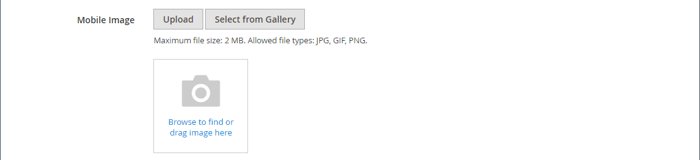

# 媒体 — 图像

使用 _图像_ 内容类型，用于将JPG、GIF或PNG图像添加到 [[!DNL Page Builder] 阶段](workspace.md#stage). 除了默认桌面映像之外，您还可以为移动设备指定次映像。 您还可以添加图像下显示的题注，并将图像链接到任何URL、产品、类别或页面。

>[!TIP]
>
>您可以使用 [Adobe Stock集成](../content-design/adobe-stock.md) 从提供的数百万资产中查找并保存合适的资产，这些资产来自 [Adobe Stock](https://stock.adobe.com). 请参阅 [使用Adobe Stock图像](../content-design/adobe-stock-manage.md) 有关如何搜索、优化Adobe Stock资源并将其保存到图库的详细信息。

{{$include /help/_includes/page-builder-save-timeout.md}}

## 图像工具箱

将鼠标悬停在图像容器上时，将显示图像工具箱。

{width="500" zoomable="yes"}

| 工具 | 图标 | 描述 |
|--- |--- |--- |
| 移动 | {width="25"} | 将图像移动到舞台上的另一个位置。 |
| （标签） | 图像 | 将当前内容容器标识为图像。 将鼠标悬停在图像容器上可查看工具箱。 |
| 设置 | {width="25"} | 打开 _编辑图像_ 页面，您可以在此页面更改图像和容器的属性。 |
| 隐藏 | {width="25"} | 隐藏当前图像。 |
| 显示 | {width="25"} | 显示隐藏的图像。 |
| 复制 | {width="25"} | 制作图像的副本。 |
| 移除 | {width="25"} | 从舞台上删除图像。 |
| 上传新图像 |  | 将图像从本地文件系统上传到图片库。 |
| 从图库中选择 |  | 从图库中选择现有图像。 |

{style="table-layout:auto"}

{{$include /help/_includes/page-builder-hidden-element-note.md}}

## 添加图像

1. 在 [!DNL Page Builder] 面板，展开 **[!UICONTROL Media]** 并拖动 **[!UICONTROL Image]** 目标容器的占位符。

   可以将图像添加到行、列或选项卡中。 在以下示例中，将图像拖到空列中。

   {width="600" zoomable="yes"}

1. 使用以下方法之一添加图像资源：

   {width="500" zoomable="yes"}

   >[!NOTE]
   >
   >最大文件大小为4 MB。 支持的文件类型为JPG、GIF和PNG。

   - _**上传新图像**_：使用此方法可从系统上传新图像文件。

      - 单击 **[!UICONTROL Upload Image]**.

      - 找到并选择图像以将其添加到图库和目标容器中。

     作为替代方法，您还可以将图像文件从系统中拖放到 _相机_ ( {width="20"} )图标。

   - _**选择现有资源**_：使用此方法可从媒体存储/图库中选择现有图像资产。

      - 单击 **[!UICONTROL Select from Gallery]**.

      - 使用树导航到图像。

      - 单击缩略图，然后单击 **[!UICONTROL Add Selected]**.

        {width="600" zoomable="yes"}

   - _**搜索并选择Adobe Stock图像**_：使用此方法可从Adobe Stock查找图像。

     >[!NOTE]
     >
     >此方法需要 [Adobe Stock集成](../content-design/adobe-stock.md) 为您的管理员配置。

      - 单击 **[!UICONTROL Search Adobe Stock]** 并搜索图像。

      - 将预览或许可的图像保存到图库。

        请参阅 [使用Adobe Stock图像](../content-design/adobe-stock-manage.md) 有关使用Adobe Stock资源的更多信息。

      - 选择库中的资产缩略图并单击 **[!UICONTROL Add Selected]**.

   图像会显示在目标容器中的占位符位置。 与背景图像不同，您可以将图像移动到当前容器中的不同位置或移动到其他容器。

   >[!NOTE]
   >
   >此 [横幅](banner.md) 和 [滑块](slider.md) 内容类型还包括 _上传图像_ 和 _从图库中选择_ 用于添加图像的选项。

   {width="500" zoomable="yes"}

## 更改图像设置

1. 将鼠标悬停在图像容器上以显示工具框并选择 _设置_ ({width="20"} )图标。
文件名、尺寸和文件大小显示在当前图像下方。

   {width="600" zoomable="yes"}

1. 更改当前 **[!UICONTROL Image]**，请执行下列操作之一：

   - _**上传新图像**_：使用此方法可从系统上传新图像文件。

      - 单击 **[!UICONTROL Upload Image]**.

      - 找到并选择图像以将其添加到图库和目标容器中。

   - _**选择现有资源**_：使用此方法可从媒体存储/图库中选择现有图像资产。

      - 单击 **[!UICONTROL Select from Gallery]**.

      - 使用树导航到图像。

      - 单击缩略图，然后单击 **[!UICONTROL Add Selected]**.

        {width="600" zoomable="yes"}

   - **搜索并选择Adobe Stock图像**：使用此方法可从Adobe Stock查找图像。

     >[!NOTE]
     >
     >此方法需要 [Adobe Stock集成](../content-design/adobe-stock.md) 为您的管理员配置。

      - 单击 **[!UICONTROL Search Adobe Stock]** 并搜索图像。

      - 将预览或许可的图像保存到图库。

        请参阅 [使用Adobe Stock图像](../content-design/adobe-stock-manage.md) 有关使用Adobe Stock资源的更多信息。

      - 选择库中的资产缩略图并单击 **[!UICONTROL Add Selected]**.

1. 添加 **[!UICONTROL Mobile Image]**，请使用上一步中描述的相同方法选择要在移动设备上显示的图像。

   {width="600" zoomable="yes"}

1. 如果需要，请指定 **[!UICONTROL Link]** 用于图像。

   该链接是客户单击图像时显示的目标页面。 您可以使用以下三种链接类型之一：

   - **[!UICONTROL URL]**  — 链接到相对或完全限定的URL。

   - **[!UICONTROL Product]**  — 根据产品名称或SKU标识目标页面。 根据部分名称或全名按名称搜索产品。 从搜索结果列表中选择产品。

     {width="600" zoomable="yes"}

   - **[!UICONTROL Category]**  — 将目标页面标识为类别树中的特定类别或子类别。 根据部分名称或全名搜索类别。 从所显示树的展开部分中选择类别。

     {width="600" zoomable="yes"}

   - **[!UICONTROL Page]**  — 将目标页面标识为特定内容页面。 根据部分名称或全名搜索页面。 从搜索结果列表中选择页面。

     {width="600" zoomable="yes"}

   如果要阻止访客离开您的商店，请选择 **[!UICONTROL Open in new tab]** 复选框。 取消选中复选框后，链接的目标将在同一浏览器选项卡中打开，这可以有效地将访客导航到您商店之外的位置。

1. 添加 **[!UICONTROL Image Caption]**，输入要显示在图像下方的文本。

   题注的格式由与当前主题关联的样式表决定。

   题注通常显示在图像下方，并为访客和搜索引擎提供有关图像的信息。 如果您的网站提供多种语言版本，则可以使用同一图像，但需要翻译标题。 在HTML中， `<figcaption>` 标记是 `<figure>` 标记之前。 `<figcaption>This is the image caption</figcaption>`

1. 根据需要更新任何其他设置：

   - [搜索引擎优化](#search-engine-optimization)
   - [高级](#advanced)

1. 完成后，单击 **[!UICONTROL Save]** 以应用设置并返回到 [!DNL Page Builder] 工作区。

## 移动图像

1. 将鼠标悬停在图像容器上以显示工具箱，然后选择 _移动_ ({width="20"} )图标。

   {width="500" zoomable="yes"}

1. 选择图像并将其拖动到新位置，正好位于红色准则的下方。

   {width="500" zoomable="yes"}

## 删除图像

1. 将鼠标悬停在图像容器上以显示工具箱，然后选择 _移除_ ( {width="20"} )图标。

1. 提示确认时，单击 **[!UICONTROL OK]**.

## 搜索引擎优化

这些设置的文本对搜索引擎可见，并改进了为页面编制索引的方式。

- 对象 **[!UICONTROL Alternative Text]**，输入 _alt_ 要显示的数字辅助工具的文本描述。

  替代文本的使用是辅助功能的最佳实践，在某些区域是法律所要求的。 在HTML中， `alt` 属性是 `image` 标记： `<image title="tooltip" alt="description" src="image.jpg">`.

- 对象 **[!UICONTROL Title Attribute]**，输入要作为鼠标悬停时的工具提示显示的文本。

  作为最佳实践，请选择一个描述性且关键词丰富的标题，以改进搜索引擎为图像编制索引的方式。 在HTML中， `title` 属性是 `image` 标记： `<image title="tooltip" alt="description" src="image.jpg">`.

## [!UICONTROL Advanced]

- 要控制添加到容器的图像的水平位置，请选择 **[!UICONTROL Alignment]**.

  | 选项 | 描述 |
  | ------ | ----------- |
  | `Default` | 应用在当前主题的样式表中指定的对齐默认设置。 |
  | `Left` | 将图像内容沿图像容器的左边框对齐，并允许使用指定的任何边距。 |
  | `Center` | 将图像内容对齐图像容器的中心，并允许指定的任何边距。 |
  | `Right` | 将图像内容沿图像容器的右边框对齐，并允许使用指定的任何边距。 |

  {style="table-layout:auto"}

- 设置 **[!UICONTROL Border]** 应用于图像容器所有四个边的样式：

  | 选项 | 描述 |
  | ------ | ----------- |
  | `Default` | 应用关联样式表指定的默认边框样式。 |
  | `None` | 不提供任何容器边框的可见指示。 |
  | `Dotted` | 容器边框显示为虚线。 |
  | `Dashed` | 容器边框显示为虚线。 |
  | `Solid` | 容器边框显示为实线。 |
  | `Double` | 容器边框显示为双线。 |
  | `Groove` | 容器边框显示为一条开槽线。 |
  | `Ridge` | 容器边框显示为脊线。 |
  | `Inset` | 容器边框显示为内嵌行。 |
  | `Outset` | 容器边框显示为外线。 |

  {style="table-layout:auto"}

- 如果设置的边框样式不是 `None`，完成边框显示选项：

  {width="600" zoomable="yes"}

  | 选项 | 描述 |
  | ------ |------------ |
  | [!UICONTROL Border Color] | 通过选择色板、单击拾色器或输入有效的颜色名称或等效的十六进制值来指定颜色。 |
  | [!UICONTROL Border Width] | 输入边框线条宽度的像素数。 |
  | [!UICONTROL Border Radius] | 输入像素数，以定义用于使边框每个角倒圆角的半径大小。 |

  {style="table-layout:auto"}

- （可选）指定以下项目的名称： **[!UICONTROL CSS classes]** 当前样式表中要应用于图像容器的URL。

  用空格分隔多个类名。

- 以像素为单位输入 **[!UICONTROL Margins and Padding]** 指定图像容器的外边距和内边距。

  在图像容器图表中输入每个相应的值。

  | 容器区域 | 描述 |
  | -------------- | ----------- |
  | [!UICONTROL Margins] | 应用于容器所有边的外边缘的空白空间量。 |
  | [!UICONTROL Padding] | 应用于容器所有边的内边缘的空白空间量。 |

  {style="table-layout:auto"}
