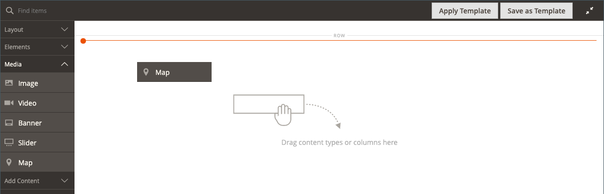

# 媒体 — 地图

使用&#x200B;_映射_&#x200B;内容类型将映射从[[!DNL Google Maps] 平台](https://cloud.google.com/maps-platform/)添加到[[!DNL Page Builder] 阶段](workspace.md#stage)。 例如，您可以将地图添加到块，然后将该块添加到[关于我们](../content-design/pages.md#about-us)和[联系我们](../getting-started/store-details.md#contact-us-form)页面。

若要充分利用[!DNL Google Maps] Platform，您可以自定义地图、突出显示商店位置，并使用Google [Places](https://cloud.google.com/maps-platform/places/)向所有[!DNL Google Maps]添加有关商店的丰富信息。

## 嵌入Google地图的好处

1. 直接在您的网站上为购买者提供您业务的完整信息（电话号码、网站、评论、星级评等）。

1. Google地图通常突出显示附近的景点、公园、餐馆等。 此信息可帮助您的客户确定实际地点并计划行程。

1. 使客户能够轻松找到您的实体商店地址，而无需打开新的浏览器窗口并离开您的网站。

1. 如果您有一连串实体店，那么在您的网站上添加Google地图有助于以高亮显示的商品的形式提高您的品牌知名度和可信度。

{width="700" zoomable="yes"}的地图

{{$include /help/_includes/page-builder-save-timeout.md}}

## 地图工具箱

将鼠标悬停在地图容器上时，将显示地图工具箱。

| 工具 | 图标 | 描述 |
|--- |--- |--- |
| 移动 | {width="25"} | 将地图移动到舞台上的另一个位置。 |
| （标签） | [!UICONTROL Map] | 将当前内容容器标识为映射。 将鼠标悬停在地图容器上可查看工具箱。 |
| 设置 | {width="25"} | 打开“编辑映射”页面，您可以在此页面更改映射和容器的属性。 |
| 隐藏 | {width="25"} | 隐藏当前映射。 |
| 显示 | {width="25"} | 显示隐藏的地图。 |
| 复制 | {width="25"} | 制作地图副本。 |
| 移除 | {width="25"} | 从舞台上删除映射。 |

{style="table-layout:auto"}

{{$include /help/_includes/page-builder-hidden-element-note.md}}

## 为您的管理员配置[!DNL Google Maps]

在添加映射之前，必须首先打开[帐户](https://cloud.google.com/maps-platform/user-guide/)以免费试用[!DNL Google Maps]平台。 免费试用期为12个月，包含300美元的点数。 如果您用完了信用，Google不会在未经您允许的情况下对您的帐户计费。

### 步骤1：获取您的[!DNL Google Maps] API密钥

根据您是否已经拥有[!DNL Google Maps]密钥，使用以下过程之一获取配置所需的API密钥。 要设置[!DNL Google Maps]密钥，您必须是有权为您的帐户启用帐单的站点管理员。 如果您尚未准备好设置[!DNL Google Maps]平台帐户，则可以跳过此步骤，暂时使用占位符映射。

1. 转到[Google Cloud Platform Console](https://cloud.google.com/console/google/maps-apis/overview)。

1. 单击项目下拉列表，然后选择或创建要为其添加API密钥的项目。

1. 要配置API凭据，请按照[文档中的](https://developers.google.com/maps/documentation/javascript/get-api-key)说明[!DNL Google Maps]操作。

1. 将API密钥复制到剪贴板。

### 步骤2：在[!DNL Google Maps]中配置[!DNL Commerce]

1. 在&#x200B;_管理员_&#x200B;侧边栏中，转到&#x200B;**[!UICONTROL Stores]** > _[!UICONTROL Settings]_>**[!UICONTROL Configuration]**。

1. 在左侧面板中的&#x200B;_[!UICONTROL General]_&#x200B;下，选择&#x200B;**[!UICONTROL Content Management]**。

1. 展开 **[!UICONTROL Advanced Content Tools]**。

   {width="600" zoomable="yes"}

   有关内容管理高级工具配置选项的详细信息，请参阅[配置参考指南](../configuration-reference/general/content-management.md)。

1. 对于&#x200B;**[!UICONTROL Google Maps API Key]**，粘贴您在步骤1中复制的密钥。

1. 单击&#x200B;**[!UICONTROL Test Key]**。

   如果您的密钥有问题，请返回[!DNL Google Maps]平台网站以解决该问题。 然后，重试。

1. 验证密钥后，单击&#x200B;**[!UICONTROL Save Config]**。

## 将地图添加到舞台

1. 打开[!DNL Page Builder]工作区的页面、块或动态块。

1. 在[!DNL Page Builder]面板中，展开&#x200B;**[!UICONTROL Media]**&#x200B;并将&#x200B;**[!UICONTROL Map]**&#x200B;占位符拖到舞台上。

   {width="600" zoomable="yes"}

   如果为商店配置了[!DNL Google Maps]平台，则会显示商店位置的地图。

   ![[!DNL Google Maps]](./assets/pb-tutorial2-google-map.png){width="600" zoomable="yes"}

   如果尚未为您的存储配置[!DNL Google Maps]平台，则会显示占位符映射。

   ![[!DNL Google Maps]占位符](./assets/pb-tutorial2-media-map-not-configured.png){width="600" zoomable="yes"}

## 添加自定义映射位置

1. 将鼠标悬停在地图容器上以显示工具箱，然后选择&#x200B;_设置_ （ {width="20"} ）图标。

1. 在&#x200B;_[!UICONTROL Edit Map]_&#x200B;页面的右上角，单击&#x200B;**[!UICONTROL Add Location]**。

1. 输入要与地图上的pin关联的&#x200B;**[!UICONTROL Location Name]**。

1. 收集要用于自定义位置的位置坐标。

   或者，在&#x200B;**[!UICONTROL Position]**&#x200B;框中，您可以拖动所显示地图中的图钉。

   如有必要，请在新的浏览器窗口中转到[[!DNL Google Maps]](https://www.google.com/maps)，然后使用以下方法之一获取坐标：

   {width="600" zoomable="yes"}

   **方法1：**&#x200B;从URL复制

   - 在左上角的&#x200B;**[!UICONTROL Search]**&#x200B;框中输入地址，然后单击&#x200B;_搜索_ （{width="20"} ）图标。

   - 复制URL中的坐标并将其粘贴到记事本中。

   **方法2：**&#x200B;从“此处是什么？”复制

   - 右键单击在地图上标记位置的红色图钉，然后在菜单中选择&#x200B;**[!UICONTROL What's here?]**。

   - 在显示的标签中，复制文本（包括坐标）并将文本粘贴到记事本中。

1. 在每个&#x200B;**[!UICONTROL Coordinates]**&#x200B;框中输入数字（不带逗号）。

   您还可以输入要在地图上可用的剩余信息。

1. 与您要与地图位置关联的任何其他信息竞争：

   | 选项 | 描述 |
   | ------ | ----------- |
   | [!UICONTROL Phone Number] | 位置的电话号码。 |
   | [!UICONTROL Street Address] | 地点的街道地址。 |
   | [!UICONTROL City] | 位置的城市。 |
   | [!UICONTROL Region/State] | 位置的区域或状态。 |
   | [!UICONTROL Zip/Postal Code] | 位置的邮政编码。 |
   | [!UICONTROL Country] | 位置所在的国家/地区。 |
   | [!UICONTROL Comment] | 要包括的任何注释。 |

   {style="table-layout:auto"}

1. 完成后，单击&#x200B;**[!UICONTROL Save]**。

   新位置将显示在&#x200B;_[!UICONTROL Edit Map]_&#x200B;页上的地图和地图位置网格中。

   ![[!DNL Page Builder] — 映射位置网格](./assets/pb-media-maps-settings-add-location-grid.png){width="600" zoomable="yes"}

## 为地图设置样式 {#styling}

使用[!DNL Google Maps]平台样式向导应用六个预定义主题之一或创建自定义主题。 您可以生成包含映射样式属性或指向样式化映射的链接的JSON文件。

### 更改映射样式

1. 在&#x200B;_管理员_&#x200B;侧边栏中，转到&#x200B;**[!UICONTROL Stores]** > _[!UICONTROL Settings]_>**[!UICONTROL Configuration]**。

1. 在左侧面板中的&#x200B;_[!UICONTROL General]_&#x200B;下，选择&#x200B;**[!UICONTROL Content Management]**。

1. 展开 **[!UICONTROL Advanced Content Tools]**。

1. 在&#x200B;**[!UICONTROL Google Maps Style]**&#x200B;文本框下，单击[创建映射样式](https://mapstyle.withgoogle.com/)。

   此操作将在单独的选项卡中打开[[!DNL Google Maps] 平台样式向导](https://mapstyle.withgoogle.com/)，您可以在其中定义[!DNL Google Maps]平台项目的样式。

1. 单击&#x200B;**[!UICONTROL Create a Style]**&#x200B;并按照提供的说明操作。

   完成后，单击&#x200B;**[!UICONTROL Finish]**。

1. 将完成的样式导出为JSON代码或URL，以便将其添加到[!DNL Commerce]配置。

   - **JSON**：在包含生成的JSON代码的框下，单击&#x200B;**[!UICONTROL Copy JSON]**。

   - **[!UICONTROL URL]**：在带有所生成URL的框下，单击&#x200B;**[!UICONTROL Copy URL]**。

1. 返回到“管理员浏览器”选项卡，并将生成的代码或URL粘贴到&#x200B;**Google映射样式**&#x200B;框中。

   如果您使用的是URL，请将`YOUR_API_KEY`占位符替换为您的[!DNL Google Maps] API密钥。 此URL链接到您样式化的Google地图。

1. 单击右上角的&#x200B;**[!UICONTROL Save Config]**。

### 更改映射设置

1. 将鼠标悬停在地图容器上以显示工具框，然后选择&#x200B;_设置_ （ {width="20"} ）图标。

1. 根据需要更改基本设置：

   | 选项 | 描述 |
   | ------ | ----------- |
   | [!UICONTROL Height] | 指定所显示地图的高度（以像素为单位）。 |
   | [!UICONTROL Show Controls] | 确定是否显示标准Google Map控件。 |

   {style="table-layout:auto"}

1. 根据需要修改&#x200B;_[!UICONTROL Advanced]_&#x200B;设置：

   - 要控制添加到容器的地图内容的水平位置，请选择&#x200B;**[!UICONTROL Alignment]**：

     | 选项 | 描述 |
     | ------ | ----------- |
     | `Default` | 应用在当前主题的样式表中指定的对齐默认设置。 |
     | `Left` | 将内容沿地图容器的左边框对齐，并允许使用指定的任何边距。 |
     | `Center` | 将内容与映射容器的中心对齐，并允许指定的任何边距。 |
     | `Right` | 将内容沿地图容器的右边框对齐，并允许指定的任何边距。 |

     {style="table-layout:auto"}

   - 设置应用于地图容器所有四面的&#x200B;**[!UICONTROL Border]**&#x200B;样式：

     | 选项 | 描述 |
     | ------ | ----------- |
     | `Default` | 应用关联样式表指定的默认边框样式。 |
     | `None` | 不提供任何容器边框的可见指示。 |
     | `Dotted` | 容器边框显示为虚线。 |
     | `Dashed` | 容器边框显示为虚线。 |
     | `Solid` | 容器边框显示为实线。 |
     | `Double` | 容器边框显示为双线。 |
     | `Groove` | 容器边框显示为一条开槽线。 |
     | `Ridge` | 容器边框显示为脊线。 |
     | `Inset` | 容器边框显示为内嵌行。 |
     | `Outset` | 容器边框显示为外线。 |

     {style="table-layout:auto"}

   - 如果设置了除`None`之外的边框样式，请完成边框显示选项：

     {width="600" zoomable="yes"}

     | 选项 | 描述 |
     | ------ |------------ |
     | [!UICONTROL Border Color] | 通过选择色板、单击拾色器或输入有效的颜色名称或等效的十六进制值来指定颜色。 |
     | [!UICONTROL Border Width] | 输入边框线条宽度的像素数。 |
     | [!UICONTROL Border Radius] | 输入像素数，以定义用于使边框每个角倒圆角的半径大小。 |

     {style="table-layout:auto"}

   - （可选）从当前样式表中指定要应用于映射容器的&#x200B;**[!UICONTROL CSS classes]**&#x200B;的名称。

     用空格分隔多个类名。

   - 输入&#x200B;**[!UICONTROL Margins and Padding]**&#x200B;的值（以像素为单位）以指定地图容器的外边距和内边距。

     在映射容器图中输入每个相应的值。

     | 容器区域 | 描述 |
     | -------------- | ----------- |
     | [!UICONTROL Margins] | 应用于容器所有边的外边缘的空白空间量。 |
     | [!UICONTROL Padding] | 应用于容器所有边的内边缘的空白空间量。 |

     {style="table-layout:auto"}

     >[!NOTE]
     >
     >填充对映射内容类型不可用。

1. 完成后，单击&#x200B;**[!UICONTROL Save]**&#x200B;以应用设置并返回到[!DNL Page Builder]工作区。

### 更改网格大小

网格大小确定与[阶段上的](column.md)列[!DNL Page Builder]相关的映射的大小。 默认情况下，映射的宽度为12列，最大为16列。

1. 在&#x200B;_管理员_&#x200B;侧边栏中，转到&#x200B;**[!UICONTROL Stores]** > _[!UICONTROL Settings]_>**[!UICONTROL Configuration]**。

1. 在左侧面板中的&#x200B;_[!UICONTROL General]_&#x200B;下，选择&#x200B;**[!UICONTROL Content Management]**。

1. 展开 **[!UICONTROL Advanced Content Tools]**。

1. 根据需要更新网格选项：

   >[!NOTE]
   >
   >如果需要，请清除&#x200B;**[!UICONTROL Use system value]**&#x200B;复选框以修改这些设置。

   - 对于&#x200B;**[!UICONTROL Default Column Grid Size]**，为网格的默认大小输入新值。

   - 对于&#x200B;**[!UICONTROL Maximum Column Grid Size]**，输入新的默认最大网格大小值。

   {width="600" zoomable="yes"}

1. 完成后，单击&#x200B;**[!UICONTROL Save Config]**。

<!-- Last updated from includes: 2023-09-11 14:30:19 -->
