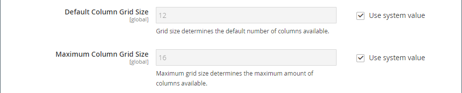

# 媒体 — 地图

使用 _地图_ 要添加映射的内容类型 [[!DNL Google Maps] 平台][1] 到 [[!DNL Page Builder] 阶段](workspace.md#stage). 例如，您可以向块添加映射，然后将该块添加到 [关于我们](../content-design/pages.md#about-us) 和 [联系我们](../getting-started/store-details.md#contact-us-form) 页数。

充分利用 [!DNL Google Maps] 平台，您可以自定义地图，突出显示您的商店位置，并使用Google [地标][2] 向所有人添加有关您商店的丰富信息 [!DNL Google Maps].

## 嵌入Google地图的好处

1. 直接在您的网站上为购买者提供您业务的完整信息（电话号码、网站、评论、星级评等）。

1. Google地图通常突出显示附近的景点、公园、餐馆等。 此信息可帮助您的客户确定实际地点并计划行程。

1. 使客户能够轻松找到您的实体商店地址，而无需打开新的浏览器窗口并离开您的网站。

1. 如果您有一连串实体店，那么在您的网站上添加Google地图有助于以高亮显示的商品的形式提高您的品牌知名度和可信度。

{width="700" zoomable="yes"}

{{$include /help/_includes/page-builder-save-timeout.md}}

## 地图工具箱

将鼠标悬停在地图容器上时，将显示地图工具箱。

| 工具 | 图标 | 描述 |
|--- |--- |--- |
| 移动 | {width="25"} | 将地图移动到舞台上的另一个位置。 |
| （标签） | [!UICONTROL Map] | 将当前内容容器标识为映射。 将鼠标悬停在地图容器上可查看工具箱。 |
| 设置 | {width="25"} | 打开“编辑映射”页面，您可以在此页面更改映射和容器的属性。 |
| 隐藏 | {width="25"} | 隐藏当前映射。 |
| 显示 | {width="25"} | 显示隐藏的地图。 |
| 复制 | {width="25"} | 制作地图副本。 |
| 移除 | {width="25"} | 从舞台上删除映射。 |

{style="table-layout:auto"}

{{$include /help/_includes/page-builder-hidden-element-note.md}}

## 配置 [!DNL Google Maps] （管理员）

添加映射之前，必须首先打开 [帐户][3] 免费试用 [!DNL Google Maps] 平台。 免费试用期为12个月，包含300美元的点数。 如果您用完了信用，Google不会在未经您允许的情况下对您的帐户计费。

### 步骤1：获取 [!DNL Google Maps] API密钥

根据您是否拥有 [!DNL Google Maps] 密钥，使用以下过程之一获取配置所需的API密钥。 要设置 [!DNL Google Maps] 密钥，您必须是获得授权可为帐户启用帐单的站点管理员。 如果您还没有准备好设置 [!DNL Google Maps] Platform帐户中，您可以跳过此步骤，暂时使用占位符映射。

1. 转到 [Google Cloud平台控制台](https://cloud.google.com/console/google/maps-apis/overview).

1. 单击项目下拉列表，然后选择或创建要为其添加API密钥的项目。

1. 要配置API凭据，请按照 [说明][4] 在 [!DNL Google Maps] 文档。

1. 将API密钥复制到剪贴板。

### 步骤2：配置 [!DNL Google Maps] 在 [!DNL Commerce]

1. 在 _管理员_ 侧栏，转到 **[!UICONTROL Stores]** > _[!UICONTROL Settings]_>**[!UICONTROL Configuration]**.

1. 在左侧面板中的 _[!UICONTROL General]_，选择&#x200B;**[!UICONTROL Content Management]**.

1. 展开  **[!UICONTROL Advanced Content Tools]**.

   {width="600" zoomable="yes"}

   有关内容管理高级工具配置选项的详细信息，请参见 [配置参考指南](../configuration-reference/general/content-management.md).

1. 对象 **[!UICONTROL Google Maps API Key]**，粘贴您在步骤1中复制的密钥。

1. 单击 **[!UICONTROL Test Key]**.

   如果您的钥匙有问题，请返回 [!DNL Google Maps] Platform站点来解决问题。 然后，重试。

1. 验证密钥后，单击 **[!UICONTROL Save Config]**.

## 将地图添加到舞台

1. 打开页面、块或动态块以访问 [!DNL Page Builder] 工作区。

1. 在 [!DNL Page Builder] 面板，展开 **[!UICONTROL Media]** 并拖动 **[!UICONTROL Map]** 舞台占位符。

   {width="600" zoomable="yes"}

   如果 [!DNL Google Maps] 已为您的商店配置平台，将显示商店位置的地图。

   ![[!DNL Google Maps]](./assets/pb-tutorial2-google-map.png){width="600" zoomable="yes"}

   如果 [!DNL Google Maps] 尚未为您的存储配置平台，而是会显示一个占位符映射。

   ![[!DNL Google Maps] 占位符](./assets/pb-tutorial2-media-map-not-configured.png){width="600" zoomable="yes"}

## 添加自定义映射位置

1. 将鼠标悬停在地图容器上以显示工具箱，然后选择 _设置_ ( {width="20"} )图标。

1. 在右上角 _[!UICONTROL Edit Map]_页面，单击&#x200B;**[!UICONTROL Add Location]**.

1. 输入 **[!UICONTROL Location Name]** 要与地图上的pin相关联。

1. 收集要用于自定义位置的位置坐标。

   或者，在 **[!UICONTROL Position]** 框内，可在显示的图表中拖动图钉。

   如有必要，请转到 [[!DNL Google Maps]][5] 在新的浏览器窗口中并使用以下方法之一获取坐标：

   {width="600" zoomable="yes"}

   **方法1：** 从URL复制

   - 在左上角的 **[!UICONTROL Search]** 框并单击 _Search_ ( {width="20"} )图标。

   - 复制URL中的坐标并将其粘贴到记事本中。

   **方法2：** 从“这是什么？”

   - 右键单击在地图上标记位置的红色管脚，然后选择 **[!UICONTROL What's here?]** 在菜单中。

   - 在显示的标签中，复制文本（包括坐标）并将文本粘贴到记事本中。

1. 在每个URL中输入数字，不带逗号 **[!UICONTROL Coordinates]** 盒子。

   您还可以输入要在地图上可用的剩余信息。

1. 与您要与地图位置关联的任何其他信息竞争：

   | 选项 | 描述 |
   | ------ | ----------- |
   | [!UICONTROL Phone Number] | 位置的电话号码。 |
   | [!UICONTROL Street Address] | 地点的街道地址。 |
   | [!UICONTROL City] | 位置的城市。 |
   | [!UICONTROL Region/State] | 位置的区域或状态。 |
   | [!UICONTROL Zip/Postal Code] | 位置的邮政编码。 |
   | [!UICONTROL Country] | 位置所在的国家/地区。 |
   | [!UICONTROL Comment] | 要包括的任何注释。 |

   {style="table-layout:auto"}

1. 完成后，单击 **[!UICONTROL Save]**.

   新位置将显示在地图中，并显示在上的地图位置网格中。 _[!UICONTROL Edit Map]_页面。

   ![[!DNL Page Builder]  — 映射位置网格](./assets/pb-media-maps-settings-add-location-grid.png){width="600" zoomable="yes"}

## 为地图设置样式 {#styling}

使用 [!DNL Google Maps] 平台样式向导，用于应用六个预定义主题之一或创建自定义主题。 您可以生成包含映射样式属性或指向样式化映射的链接的JSON文件。

### 更改映射样式

1. 在 _管理员_ 侧栏，转到 **[!UICONTROL Stores]** > _[!UICONTROL Settings]_>**[!UICONTROL Configuration]**.

1. 在左侧面板中的 _[!UICONTROL General]_，选择&#x200B;**[!UICONTROL Content Management]**.

1. 展开  **[!UICONTROL Advanced Content Tools]**.

1. 在 **[!UICONTROL Google Maps Style]** 文本框，单击 [创建映射样式][6].

   此操作将打开 [[!DNL Google Maps] 平台样式向导][6] 在单独的选项卡中，您可以为其定义样式 [!DNL Google Maps] 平台项目。

1. 单击 **[!UICONTROL Create a Style]** 并按照提供的说明操作。

   完成后，单击 **[!UICONTROL Finish]**.

1. 将完成的样式导出为JSON代码或URL，以便将其添加到 [!DNL Commerce] 配置。

   - **JSON**：在包含生成的JSON代码的框下，单击 **[!UICONTROL Copy JSON]**.

   - **[!UICONTROL URL]**：在生成的URL所在的框下，单击 **[!UICONTROL Copy URL]**.

1. 返回您的管理员浏览器选项卡，并将生成的代码或URL粘贴到 **Google映射样式** 盒子。

   如果您使用的是URL，请将 `YOUR_API_KEY` 占位符与您的 [!DNL Google Maps] API密钥。 此URL链接到您样式化的Google地图。

1. 在右上角，单击 **[!UICONTROL Save Config]**.

### 更改映射设置

1. 将鼠标悬停在地图容器上以显示工具框并选择 _设置_ ( {width="20"} )图标。

1. 根据需要更改基本设置：

   | 选项 | 描述 |
   | ------ | ----------- |
   | [!UICONTROL Height] | 指定所显示地图的高度（以像素为单位）。 |
   | [!UICONTROL Show Controls] | 确定是否显示标准Google Map控件。 |

   {style="table-layout:auto"}

1. 修改 _[!UICONTROL Advanced]_根据需要进行设置：

   - 要控制添加到容器的地图内容的水平位置，请选择 **[!UICONTROL Alignment]**：

     | 选项 | 描述 |
     | ------ | ----------- |
     | `Default` | 应用在当前主题的样式表中指定的对齐默认设置。 |
     | `Left` | 将内容沿地图容器的左边框对齐，并允许使用指定的任何边距。 |
     | `Center` | 将内容与映射容器的中心对齐，并允许指定的任何边距。 |
     | `Right` | 将内容沿地图容器的右边框对齐，并允许指定的任何边距。 |

     {style="table-layout:auto"}

   - 设置 **[!UICONTROL Border]** 应用于地图容器所有四个边的样式：

     | 选项 | 描述 |
     | ------ | ----------- |
     | `Default` | 应用关联样式表指定的默认边框样式。 |
     | `None` | 不提供任何容器边框的可见指示。 |
     | `Dotted` | 容器边框显示为虚线。 |
     | `Dashed` | 容器边框显示为虚线。 |
     | `Solid` | 容器边框显示为实线。 |
     | `Double` | 容器边框显示为双线。 |
     | `Groove` | 容器边框显示为一条开槽线。 |
     | `Ridge` | 容器边框显示为脊线。 |
     | `Inset` | 容器边框显示为内嵌行。 |
     | `Outset` | 容器边框显示为外线。 |

     {style="table-layout:auto"}

   - 如果设置的边框样式不是 `None`，完成边框显示选项：

     {width="600" zoomable="yes"}

     | 选项 | 描述 |
     | ------ |------------ |
     | [!UICONTROL Border Color] | 通过选择色板、单击拾色器或输入有效的颜色名称或等效的十六进制值来指定颜色。 |
     | [!UICONTROL Border Width] | 输入边框线条宽度的像素数。 |
     | [!UICONTROL Border Radius] | 输入像素数，以定义用于使边框每个角倒圆角的半径大小。 |

     {style="table-layout:auto"}

   - （可选）指定以下项目的名称： **[!UICONTROL CSS classes]** 要应用于映射容器的当前样式表中。

     用空格分隔多个类名。

   - 以像素为单位输入 **[!UICONTROL Margins and Padding]** 指定地图容器的外边距和内边距。

     在映射容器图中输入每个相应的值。

     | 容器区域 | 描述 |
     | -------------- | ----------- |
     | [!UICONTROL Margins] | 应用于容器所有边的外边缘的空白空间量。 |
     | [!UICONTROL Padding] | 应用于容器所有边的内边缘的空白空间量。 |

     {style="table-layout:auto"}

     >[!NOTE]
     >
     >填充对映射内容类型不可用。

1. 完成后，单击 **[!UICONTROL Save]** 以应用设置并返回到 [!DNL Page Builder] 工作区。

### 更改网格大小

网格大小确定与关联的地图的大小 [列](column.md) 在 [!DNL Page Builder] 暂存。 默认情况下，映射的宽度为12列，最大为16列。

1. 在 _管理员_ 侧栏，转到 **[!UICONTROL Stores]** > _[!UICONTROL Settings]_>**[!UICONTROL Configuration]**.

1. 在左侧面板中的 _[!UICONTROL General]_，选择&#x200B;**[!UICONTROL Content Management]**.

1. 展开  **[!UICONTROL Advanced Content Tools]**.

1. 根据需要更新网格选项：

   >[!NOTE]
   >
   >如有需要，清除 **[!UICONTROL Use system value]** 复选框，以修改这些设置。

   - 对象 **[!UICONTROL Default Column Grid Size]**&#x200B;中，为网格的默认大小输入新值。

   - 对象 **[!UICONTROL Maximum Column Grid Size]**，输入新的默认最大网格大小值。

   {width="600" zoomable="yes"}

1. 完成后，单击 **[!UICONTROL Save Config]**.

[1]: https://cloud.google.com/maps-platform/
[2]: https://cloud.google.com/maps-platform/places/
[3]: https://cloud.google.com/maps-platform/user-guide/
[4]: https://developers.google.com/maps/documentation/javascript/get-api-key
[5]: https://www.google.com/maps
[6]: https://mapstyle.withgoogle.com/
