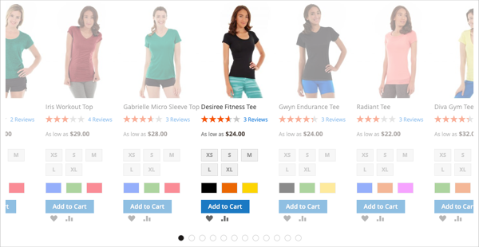
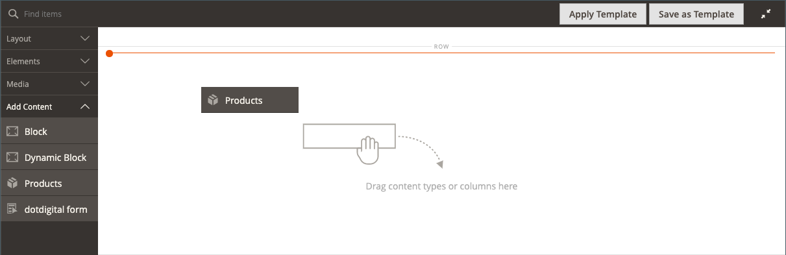
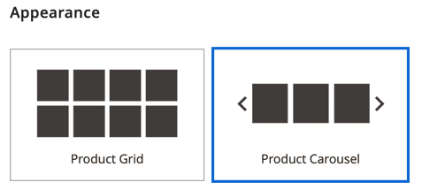

# 添加内容 — 产品

使用&#x200B;_Products_&#x200B;内容类型以网格或轮播布局将产品列表添加到[[!DNL Page Builder] 阶段](workspace.md#stage)。 使用[添加内容 — 块](block.md)工具将块放在[!DNL Page Builder]舞台上，然后在块内放置产品列表。 或者，您也可以直接在页面的一行中添加产品列表。

## 使用产品轮播的准则

产品轮播提供了一种强大而引人入胜的方式展示您的产品。 为了充分利用，建议遵循以下准则：

- 将产品轮播直接添加到页面宽度容器，如行、选项卡或一列布局。 使用页面宽度布局可确保产品得到最佳的响应式显示。 [!DNL Page Builder]根据页面宽度而不是容器宽度减少显示的产品数。

- 不要将产品轮播添加到窄列。 如前所述，[!DNL Page Builder]默认根据页面宽度而不是列宽确定要显示的产品数量。

- 如果希望产品轮播连续自动滚动，请将&#x200B;**[!UICONTROL Autoplay]**&#x200B;和&#x200B;**[!UICONTROL Infinite Loop]**&#x200B;都设置为`Yes`。 如果自动播放设置为`Yes`，而无限循环设置为`No`，则自动滚动将在产品列表的末尾停止。

- 将&#x200B;**[!UICONTROL Carousel Mode]**&#x200B;设置为`Continuous`以在轮盘中一次高亮、居中和滚动一个产品。 其他产品在列表中是可见的，但为突出显示居中的产品，其他产品是透明的。

  {width="600"}

- 要在轮播中一次显示和滚动最多五个产品，请将&#x200B;**[!UICONTROL Carousel Mode]**&#x200B;保留设置为`Default`。

  {width="600"}

以下说明显示如何将Products列表添加到块。 然后，您可以使用[小组件](../content-design/widgets.md)将块放置在商店中任何页面上的特定位置。

{{$include /help/_includes/page-builder-save-timeout.md}}

## 产品工具箱

| 工具 | 图标 | 描述 |
| --------- | ------------- | ----------------- |
| 移动 | {width="25"} | 将产品容器及其内容移动到舞台上的另一个位置。 |
| 设置 | {width="25"} | 打开&#x200B;_编辑产品_&#x200B;页面，您可以在其中选择产品列表并更改容器的属性。 |
| 隐藏 | {width="25"} | 隐藏当前产品容器及其内容。 |
| 显示 | {width="25"} | 显示隐藏的产品容器及其内容。 |
| 复制 | {width="25"} | 制作产品容器及其内容的副本。 |
| 移除 | {width="25"} | 从阶段中删除产品容器及其内容。 |

{style="table-layout:auto"}

{{$include /help/_includes/page-builder-hidden-element-note.md}}

## 创建产品列表块

1. 在&#x200B;_管理员_&#x200B;侧边栏上，转到&#x200B;**[!UICONTROL Content]** > _[!UICONTROL Elements]_>**[!UICONTROL Blocks]**。

1. 单击&#x200B;**[!UICONTROL Add New Block]**。

1. 输入&#x200B;**[!UICONTROL Block Title]**&#x200B;和&#x200B;**[!UICONTROL Identifier]**。

1. 选择要提供块的&#x200B;**[!UICONTROL Store View]**。

1. 向下滚动并单击&#x200B;**[!UICONTROL Edit with Page Builder]**&#x200B;或在内容预览区域中打开[!DNL Page Builder]工作区。

1. 在[!DNL Page Builder]面板中，展开&#x200B;**[!UICONTROL Add Content]**&#x200B;并将&#x200B;**[!UICONTROL Products]**&#x200B;占位符拖到舞台上。

   {width="600" zoomable="yes"}

## 配置产品列表容器

将鼠标悬停在空的&#x200B;_产品_&#x200B;容器上以显示工具箱，然后单击&#x200B;_设置_ （{width="20"} ）图标。

{width="500" zoomable="yes"}

根据以下部分完成&#x200B;_设置_：

### 外观

1. 要确定产品列表在页面上的显示方式，请选择以下外观类型之一：

   | 类型 | 描述 |
   | ---- | ----------- |
   | 产品网格 | 显示网格中的产品，其中每行显示五个产品（默认情况下），每行的行数与显示在&#x200B;**[!UICONTROL Number of Products to Display]**&#x200B;设置中输入的数字所需的行数相同。 |
   | 产品轮播 | 显示轮盘中的产品（也称为滑块）。 每张幻灯片最多可显示五个产品。   **响应性警报**：选择此外观时，最好直接将“产品”内容类型添加到响应式所在的行、选项卡或一列布局中，在较小的屏幕上每侧显示的产品更少。 如果将其添加到宽度小于页面宽度的内容类型（例如窄列），则无论屏幕大小如何，轮盘每张幻灯片显示的产品都会超过容器允许的数量。 |

   {style="table-layout:auto"}

   {width="300"}

   如果选择产品轮播，则还必须配置[轮播设置](#carousel-settings)。

1. 对于&#x200B;**[!UICONTROL Select Products By]**，选择产品选择方法：

   您可以按类别、SKU或条件选择产品。 这些选项相互排斥。 例如，您无法依次选择类别选项和类别选择器，然后再切换到条件选项以添加某些条件。 您的产品仅基于您为这三个选项中的&#x200B;_一个_&#x200B;设置的内容进行选择。

   - **[!UICONTROL Category]** — 选择此选项可显示使用选定类别的产品。

     {width="500"}

     选中此选项后，将提供&#x200B;**[!UICONTROL Category]**&#x200B;选择器。 单击箭头并向下展开以选择要显示的产品类别。 例如，在[!DNL Commerce]示例数据中，钻取并选择&#x200B;_女性>顶端>T恤_&#x200B;会显示该类别的所有产品。

     {width="500"}

   - **[!UICONTROL SKU]** — 选择此选项可显示使用一个或多个SKU的产品

     选中此选项后，会提供一个&#x200B;**[!UICONTROL Product SKUs]**&#x200B;文本框，您必须在该文本框中输入要显示的SKU列表（以逗号分隔）。

     {width="500"}

   - **[!UICONTROL Condition]** — 选择此选项可根据您定义的一个或多个条件显示产品。

     选中后，便可使用一些工具将条件添加到您的产品选择中。 例如，您只能选择将性别设置为Unisex的产品。

     {width="500"}

     >[!NOTE]
     >
     >选择类别或SKU选项会提供`Position`的&#x200B;**[!UICONTROL Sort By]**&#x200B;选项。 使用此排序选项，产品会以它们在目录中的显示顺序显示。 
     >
     >对于“类别”选项，按位置排序会按照产品在目录中的显示顺序来显示产品。 对于SKU选项，按位置排序将按您在&#x200B;**[!UICONTROL Product SKUs]**&#x200B;文本框中输入的顺序显示产品。

1. 对于&#x200B;**[!UICONTROL Sort By]**，选择列表中产品的排序顺序：

   | 选项 | 描述 |
   | ------ | ----------- |
   | `Position` （仅适用于类别和SKU选项） | 选择“类别”选项时，位置会按照产品在目录中的位置显示的顺序显示产品。 选择SKU选项后，职位会按照与产品SKU文本框中的SKU相同的顺序显示产品。 |
   | `Newest products first` | 按产品添加到目录的日期对产品进行排序，首先显示具有最近输入日期的产品。 |
   | `Oldest products first` | 按产品添加到目录的日期对产品进行排序，首先显示具有最早录入日期的产品。 |
   | `Name: A - Z` | 按字母顺序对产品排序。 |
   | `Name: Z - A` | 按反字母顺序对产品排序。 |
   | `SKU: ascending` | 按SKU的字母数字顺序对产品排序。 |
   | `SKU: descending` | 按SKU以反向字母数字顺序对产品排序。 |
   | `Stock: low stock first` | 将产品从最低库存排序到最高库存。 |
   | `Stock: high stock first` | 对产品从最高库存到最低库存进行排序。 |
   | `Price: high to low` | 将产品从最高价排序到最低价。 |
   | `Price: low to high` | 按从最低到最高的价格对产品进行排序。 |

   {style="table-layout:auto"}

   {width="300"}

1. 在轮播或网格中输入&#x200B;**[!UICONTROL Number of Products to Display]**。

   值可以从`1`到`999`。 网格的默认值为`5`，轮播的默认值为`20`。

   >[!NOTE]
   >
   >类别、SKU或条件设置中的某些产品可能不会显示在产品网格或轮播中。 例如，不会显示已禁用的产品、标记为不可见的产品、缺货的产品以及分配给其他网站的产品。

   >[!IMPORTANT]
   >
   >管理员中未定义可配置、分组和捆绑（动态价格）产品的价格。 因此，如果按价格过滤产品，则这些产品不会显示在&#x200B;**[!UICONTROL Preview]**&#x200B;中。 如果按价格排序，则无法在&#x200B;**[!UICONTROL Preview]**&#x200B;中正确订购这些产品。

### 轮播设置

1. 要确定产品在轮盘中的显示方式，请选择&#x200B;**[!UICONTROL Carousel Mode]**：

   | 选项 | 描述 |
   | ------ | ----------- |
   | `Default` | 默认情况下，轮盘每张幻灯片显示五个产品，并且会根据需要相应地减少该数量。 |
   | `Continuous` | 默认情况下，轮盘每张幻灯片显示五个产品（右侧和左侧显示一半产品），但会以无限循环的方式一次居中和滚动一个产品。 居中产品的右侧和左侧的产品将变暗，以便突出显示居中产品。 |

   {style="table-layout:auto"}

   如果在这两种模式之间切换，则保留其他轮播设置，但&#x200B;**[!UICONTROL Infinite Loop]**&#x200B;设置除外，该设置始终在连续模式下设置为`Yes`，并且字段被禁用。

   {width="600" zoomable="yes"}

1. 如果需要，请将&#x200B;**[!UICONTROL Autoplay]**&#x200B;选项设置为`Yes`。

   启用自动播放后，轮盘会在页面加载时自动开始滚动。 如果保留默认设置(`No`)，客户必须单击幻灯片导航（点或箭头）以按顺序显示每张幻灯片。

   如果启用此功能，请输入&#x200B;**[!UICONTROL Autoplay Speed]**&#x200B;以指定每张幻灯片之间的延迟时间（以毫秒为单位）。 默认值为`4000` （4秒）。

1. 如果需要，请将&#x200B;**[!UICONTROL Infinite Loop]**&#x200B;选项设置为`Yes`。

   启用无限循环后，在页面打开时，幻灯片放映将无限期地重播。 如果保留默认设置(`No`)，则幻灯片放映仅播放一次。

   >[!NOTE]
   >
   >如果您将&#x200B;**[!UICONTROL Infinite Loop]**&#x200B;设置为`No`，将&#x200B;**[!UICONTROL Autoplay]**&#x200B;设置为`Yes`，则自动播放将在要显示的产品数结束时停止。

1. 如果需要，请将&#x200B;**[!UICONTROL Show Arrows]**&#x200B;选项设置为`Yes`。

   启用此选项后，每张幻灯片在左侧和右侧都包含&#x200B;_下一个_&#x200B;和&#x200B;_上一个_&#x200B;导航箭头。 如果保留默认设置(`No`)，幻灯片将不会显示导航箭头。

1. 如果需要，请将&#x200B;**[!UICONTROL Show Dots]**&#x200B;选项设置为`No`。

   当设置为默认设置(`Yes`)时，导航点出现在轮盘滑块底部。 如果禁用此设置，则轮播滑块不会显示导航点。

### 高级

1. 要控制“产品”列表在父容器中的位置，请选择&#x200B;**[!UICONTROL Alignment]**：

   | 选项 | 描述 |
   | ------ | ----------- |
   | `Default` | 应用在当前主题的样式表中指定的对齐默认设置。 |
   | `Left` | 将列表沿父容器的左边框对齐，并允许使用指定的任何边距。 |
   | `Center` | 将列表与父容器的中心对齐，并允许使用指定的任何边距。 |
   | `Right` | 将列表沿父容器的右边框对齐，并允许使用指定的任何边距。 |

   {style="table-layout:auto"}

1. 设置应用于产品容器所有四个侧面的&#x200B;**[!UICONTROL Border]**&#x200B;样式：

   | 选项 | 描述 |
   | ------ | ----------- |
   | `Default` | 应用关联样式表指定的默认边框样式。 |
   | `None` | 不提供任何容器边框的可见指示。 |
   | `Dotted` | 容器边框显示为虚线。 |
   | `Dashed` | 容器边框显示为虚线。 |
   | `Solid` | 容器边框显示为实线。 |
   | `Double` | 容器边框显示为双线。 |
   | `Groove` | 容器边框显示为一条开槽线。 |
   | `Ridge` | 容器边框显示为脊线。 |
   | `Inset` | 容器边框显示为内嵌行。 |
   | `Outset` | 容器边框显示为外线。 |

   {style="table-layout:auto"}

1. 如果设置了除`None`之外的边框样式，请完成边框显示选项：

   | 选项 | 描述 |
   | ------ |------------ |
   | [!UICONTROL Border Color] | 通过选择色板、单击拾色器或输入有效的颜色名称或等效的十六进制值来指定颜色。 |
   | [!UICONTROL Border Width] | 输入边框线条宽度的像素数。 |
   | [!UICONTROL Border Radius] | 输入像素数，以定义用于使边框每个角倒圆角的半径大小。 |

   {style="table-layout:auto"}

1. （可选）从当前样式表中指定要应用于容器的&#x200B;**[!UICONTROL CSS classes]**&#x200B;的名称。

   用空格分隔多个类名。

1. 输入&#x200B;**[!UICONTROL Margins and Padding]**&#x200B;的值（以像素为单位）以确定“产品”容器的外边距和内边距。

   在图表中输入相应的值。

   | 容器区域 | 描述 |
   | -------------- | ----------- |
   | [!UICONTROL Margins] | 应用于容器所有边的外边缘的空白空间量。 选项： `Top` / `Right` / `Bottom` / `Left` |
   | [!UICONTROL Padding] | 应用于容器所有边的内边缘的空白空间量。 选项： `Top` / `Right` / `Bottom` / `Left` |

## 在舞台上保存并预览

单击右上角的&#x200B;**[!UICONTROL Save]**&#x200B;以应用设置并返回到[!DNL Page Builder]工作区。

如果您配置了产品轮播，则它应该类似于以下示例：

阶段上的{width="600"}

您现在可以使用[小组件](../content-design/widgets.md)将此块放置到商店中要显示的任意位置。 或者，您可以使用[添加内容 — 块](block.md)将块添加到现有页面、选项卡或块。
