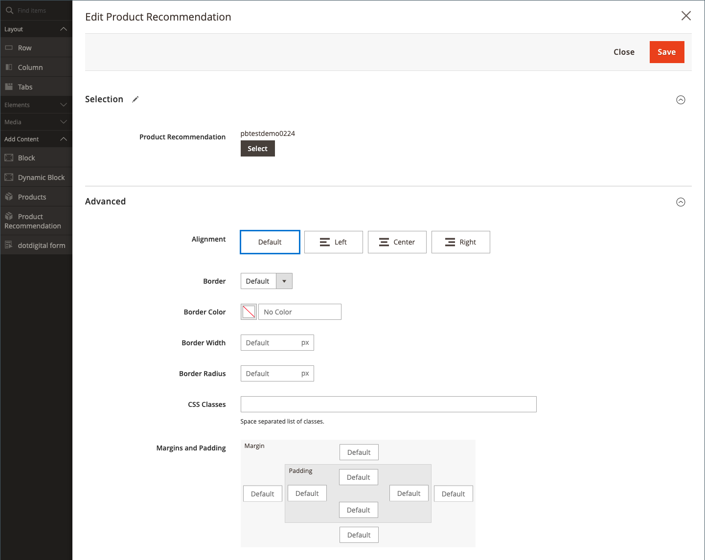

# 添加内容 — 产品Recommendations

使用&#x200B;_产品Recommendations_&#x200B;内容类型将现有的活动[推荐单元](https://experienceleague.adobe.com/en/docs/commerce-merchant-services/product-recommendations/admin/create)添加到CMS页面、块或动态块的[[!DNL Page Builder] 阶段](workspace.md#stage)。

>[!NOTE]
>
>Adobe Commerce 2.4.4及更高版本中支持[!DNL Page Builder] _产品Recommendations_&#x200B;内容类型，该内容类型可在[产品Recommendations元包版本3.0.x或更高版本](https://commercemarketplace.adobe.com/magento-product-recommendations.html)中使用。 要添加[!DNL Page Builder]对产品Recommendations的支持，[请查看安装信息](https://experienceleague.adobe.com/en/docs/commerce-merchant-services/product-recommendations/getting-started/install-configure)。 **此内容类型不可用于Magento Open Source。**

{{$include /help/_includes/page-builder-save-timeout.md}}

## 产品Recommendations工具箱

| 工具 | 图标 | 描述 |
| --- | --| --- |
| 移动 | {width="25"} | 将产品推荐容器及其内容移动到舞台上的另一个位置。 |
| 设置 | {width="25"} | 打开“编辑产品推荐”页面，您可以在其中选择推荐单元并更改容器的属性。 |
| 隐藏 | {width="25"} | 隐藏当前产品推荐容器及其内容。 |
| 显示 | {width="25"} | 显示隐藏的产品推荐容器及其内容。 |
| 复制 | {width="25"} | 复制产品推荐容器及其内容。 |
| 移除 | {width="25"} | 从阶段中删除产品推荐容器及其内容。 |

{style="table-layout:auto"}

{{$include /help/_includes/page-builder-hidden-element-note.md}}

## 添加现有的推荐单位

1. 确保您已[为[!DNL Page Builder]页面类型创建了推荐单元](https://experienceleague.adobe.com/en/docs/commerce-merchant-services/product-recommendations/admin/create)。

>[!NOTE]
>
>您只能在默认存储视图中为[!DNL Page Builder]页面类型创建推荐单位。

1. 在编辑模式下打开页面、块或动态块。

1. 展开&#x200B;_[!UICONTROL Content]_部分并单击&#x200B;**[!UICONTROL Edit with Page Builder]**或在内容预览区域中打开[!DNL Page Builder]工作区。

1. 在&#x200B;_[!UICONTROL Layout]_下的[!DNL Page Builder]面板中，将&#x200B;**[!UICONTROL Row]**占位符拖到舞台上。

1. 在&#x200B;_[!UICONTROL Add Content]_下的[!DNL Page Builder]面板中，将&#x200B;**[!UICONTROL Product Recommendation]**占位符拖到行中。

   {width="600" zoomable="yes"}

1. 执行以下操作之一：

   - 单击&#x200B;**[!UICONTROL Edit Product Recommendation]**。
   - 将鼠标悬停在空容器上以显示工具箱，然后单击&#x200B;_设置_ （）图标。

   {width="600" zoomable="yes"}

1. 在&#x200B;_[!UICONTROL Selection]_部分中，单击&#x200B;**[!UICONTROL Select]**。

1. 在活动产品推荐列表中，找到包含要添加的推荐单元的行，然后单击最后一列中的&#x200B;**[!UICONTROL Select]**。

   {width="600" zoomable="yes"}

1. 单击右上角的&#x200B;**[!UICONTROL Add Selected]**。

   所选产品推荐的名称显示在&#x200B;_[!UICONTROL Edit Product Recommendation]_页面的_[!UICONTROL Selection]_&#x200B;部分中。

1. 对[高级设置](#advanced-settings)进行任何必要的更改。

   {width="600" zoomable="yes"}

1. 完成后，执行以下操作：

   - 如果使用完全最大化的浏览器窗口，请单击工作区右上角的&#x200B;_关闭全屏_ （）图标。

   - 单击&#x200B;**[!UICONTROL Save]**&#x200B;以应用设置并返回到[!DNL Page Builder]工作区。

   当您返回到舞台时，产品占位符图像会显示在容器中。

## 编辑推荐单元设置

1. 将鼠标悬停在推荐单元容器上以显示工具箱，然后单击&#x200B;_设置_ （）图标。

   {width="600" zoomable="yes"}

1. 对[高级设置](#advanced-settings)进行任何必要的更改。

1. 完成后，单击&#x200B;**[!UICONTROL Save]**&#x200B;以应用设置并返回到[!DNL Page Builder]工作区。

## 复制推荐单位

1. 将鼠标悬停在推荐单元容器上以显示工具箱，然后单击工具箱中的&#x200B;_复制_ （）图标。

   副本会出现在原始文件的正下方。

1. 要将重复的建议单位移动到新位置，请将鼠标悬停在容器上，然后单击工具箱中的&#x200B;_移动_ （）图标。

1. 选择并拖动推荐单位，直到红色准则出现在新位置。

   移动推荐单元时，每个容器的顶边框和底边框均显示为虚线。

## 从阶段中删除推荐单位

1. 将鼠标悬停在推荐单元容器上，然后单击工具箱中的&#x200B;_删除_ （）图标。

1. 提示确认时，单击&#x200B;**[!UICONTROL OK]**。

## 高级设置

1. 要控制Product Recommendations单元在父容器中的位置，请选择&#x200B;**[!UICONTROL Alignment]**：

   | 选项 | 描述 |
   | ------ | ----------- |
   | `Default` | 应用在当前主题的样式表中指定的对齐默认设置。 |
   | `Left` | 将单位沿父容器的左边框对齐，并允许使用指定的任何边距。 |
   | `Center` | 将单位对齐父容器的中心，并允许指定的任何边距。 |
   | `Right` | 将单位沿父容器的右边框对齐，并允许使用指定的任何边距。 |

   {style="table-layout:auto"}

1. 设置应用于Product Recommendations单元所有四个方面的&#x200B;**[!UICONTROL Border]**&#x200B;样式：

   | 选项 | 描述 |
   | ------ | ----------- |
   | `Default` | 应用关联样式表指定的默认边框样式。 |
   | `None` | 不提供任何单位边框的可见指示。 |
   | `Dotted` | 单位边框显示为虚线。 |
   | `Dashed` | 单位边框显示为虚线。 |
   | `Solid` | 单位边框显示为实线。 |
   | `Double` | 单位边框显示为双线。 |
   | `Groove` | 单位边框显示为槽线。 |
   | `Ridge` | 单位边框显示为脊线。 |
   | `Inset` | 单位边框显示为内嵌线。 |
   | `Outset` | 单位边框显示为外线。 |

   {style="table-layout:auto"}

1. 如果设置了除`None`之外的边框样式，请完成边框显示选项：

   | 选项 | 描述 |
   | ------ |------------ |
   | [!UICONTROL Border Color] | 通过选择色板、单击拾色器或输入有效的颜色名称或等效的十六进制值来指定颜色。 |
   | [!UICONTROL Border Width] | 输入边框线条宽度的像素数。 |
   | [!UICONTROL Border Radius] | 输入像素数，以定义用于使边框每个角倒圆角的半径大小。 |

   {style="table-layout:auto"}

1. （可选）从当前样式表中指定要应用于该单位的&#x200B;**[!UICONTROL CSS classes]**&#x200B;的名称。

   用空格分隔多个类名。

1. 输入&#x200B;**[!UICONTROL Margins and Padding]**&#x200B;的值（以像素为单位）以确定单位的外边距和内边距。

   在图表中输入相应的值。

   | 容器区域 | 描述 |
   | ------ | ----------- |
   | [!UICONTROL Margins] | 应用到设备所有侧的外边缘的空白空间量。 选项： `Top` / `Right` / `Bottom` / `Left` |
   | [!UICONTROL Padding] | 应用于设备所有侧的内边缘的空白空间量。 选项： `Top` / `Right` / `Bottom` / `Left` |

   {style="table-layout:auto"}
