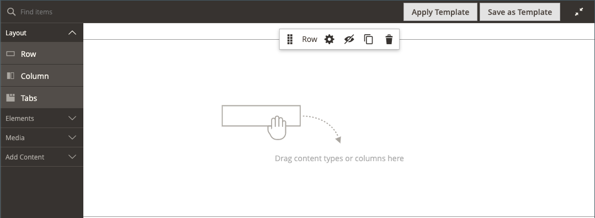

# 布局 — 行

使用&#x200B;_Row_&#x200B;内容类型在[[!DNL Page Builder] 阶段](workspace.md#stage)中添加行。

{{$include /help/_includes/page-builder-save-timeout.md}}

## 行工具箱

当您将鼠标悬停在行容器上时，行工具箱即会出现。 工具箱包括移动、隐藏、复制、编辑或移除行的选项。 设置的选择决定了行的外观、背景和布局。 可以将其他内容元素从左侧的[!DNL Page Builder]面板拖到行中。

{width="600" zoomable="yes"}

| 工具 | 图标 | 描述 |
| --------- | ---------- | ----------- |
| 移动 | {width="25"} | 相对于舞台上的其他行，将行移动到另一个位置。 |
| （标签） | [!UICONTROL Row] | 将当前内容容器标识为一行。 将鼠标悬停在容器上可查看工具箱。 |
| 设置 | {width="25"} | 打开“编辑行”页，您可以在该页中更改容器的属性。 |
| 隐藏 | {width="25"} | 隐藏当前行。 |
| 显示 | {width="25"} | 显示隐藏行。 |
| 复制 | {width="25"} | 生成行的副本。 |
| 移除 | {width="25"} | 从阶段中删除行容器及其内容。 |

{style="table-layout:auto"}

{{$include /help/_includes/page-builder-hidden-element-note.md}}

## 添加行

1. 在[!DNL Page Builder]下的&#x200B;_[!UICONTROL Layout]_面板中，将新的&#x200B;**[!UICONTROL Row]**拖到舞台上，刚好在第一行的下方。

1. 要格式化行，请将鼠标悬停在行容器上以显示工具箱，然后选择&#x200B;_设置_ （ {width="20"} ）图标。

   有关完成可用设置的详细信息，请参阅以下部分。

   {width="600" zoomable="yes"}

## 更改行设置

1. 将鼠标悬停在行容器上以显示工具箱，然后选择&#x200B;_设置_ （ {width="20"} ）图标。

   {width="600" zoomable="yes"}

1. 有关更新可用设置的详细信息，请参阅以下部分。

1. 完成后，单击&#x200B;**[!UICONTROL Save]**&#x200B;以应用设置并返回到[!DNL Page Builder]工作区。

## 外观

使用&#x200B;_外观_&#x200B;设置确定内容在行中的显示方式。

{width="600" zoomable="yes"}

- 要确定背景颜色和/或背景图像相对于容器和内容区域宽度的显示方式，请选择对齐方式：

  | 选项 | 描述 |
  | ------ | ----------- |
  | [!UICONTROL Contained] | 背景颜色或图像受限于主题定义的最大页面宽度。 |
  | [!UICONTROL Full Width] | 将内容限制为由主题定义的最大页面宽度。 背景颜色和/或图像不受限制，并会扩展行的完整宽度。 |
  | [!UICONTROL Full Bleed] | 内容和背景图像和/或颜色不受限制，并会扩展行的完整宽度。 完全出血只能与支持布局的[主题](../content-design/themes.md)一起使用。 |

  {style="table-layout:auto"}

- 输入行的&#x200B;**[!UICONTROL Minimum Height]**。 此值可以是具有任何有效CSS单位（如`100px`、`50%`、`50em`、`100vh`）的数字，也可以是计算（如`100vh - 237px`）。

  例如，您可以设置行的最小高度来延伸页面的全高，从而为全页背景图像和视频提供引人注目的选项。

- 选择&#x200B;**[!UICONTROL Vertical Alignment]**&#x200B;设置以对齐添加到行的任何内容容器（“顶部”、“中心”或“底部”）。

## 背景

有许多选项可用于定义行的背景显示。 您可以应用简单的颜色或背景图像，并管理更复杂的效果。

### 背景颜色

通过选择色板、单击拾色器或输入有效的颜色名称或等效的十六进制值来指定背景颜色。 此设置确定行的背景颜色。 您还可以调整颜色的不透明度。

{width="200"}

可以通过以下三种方式之一设置值：

- 预定义的颜色名称，如`White`
- 颜色的十六进制颜色值，如`#ffffff`
- 颜色的rgba值，具有不透明度百分比，如`rgba(255, 255, 255, 0.75)`

如果要选择颜色，请单击&#x200B;_无颜色_&#x200B;框左侧的色板。

{width="600" zoomable="yes"}

如果单击颜色框再次打开拾色器，则滑块下方的框显示当前的红色、绿色、蓝色和Alpha值(rgba)。 最后一个数字以小数表示当前的不透明度百分比。 可以使用滑块调整不透明度，或输入所需的小数值。

{width="600" zoomable="yes"}

>[!NOTE]
>
>[!DNL Page Builder]还支持背景图像中的透明层，即&#x200B;_Alpha通道_，这些背景图像可用于创建具有不同不透明度的背景。

### [!UICONTROL Background Type]

背景类型可以是图像或视频。 [!DNL Page Builder]默认为`Image`并显示各种图像设置。 如果选择`Video`，[!DNL Page Builder]会将图像设置与视频设置进行交换。 两种背景类型均描述如下。

{width="200"}

### 图像类型设置

如果将&#x200B;_[!UICONTROL Background Type]_设置为`Image`，请使用以下设置来定义背景图像显示。

{width="600" zoomable="yes"}

- **[!UICONTROL Background Image]** — 如果需要，请使用提供的工具选择要应用于行的背景图像：

  | 选项 | 描述 |
  | ------ | ----------- |
  | [!UICONTROL Upload] | 将图像文件从本地计算机上载到图片库，然后将其作为行的背景图像应用。 |
  | [!UICONTROL Select from Gallery] | 提示您从图库中选择现有图像作为行的背景图像。 |
  | {width="25"} | 允许您将图像拖到相机图块或浏览到本地文件系统中的图像。 |

  {style="table-layout:auto"}

- **[!UICONTROL Background Mobile Image]** — 如果需要，请使用相同的工具选择不同的背景图像以在移动设备上显示。

- **[!UICONTROL Background Size]** — 设置此选项以确定相对于行宽缩放背景图像的方式：

  | 选项 | 描述 |
  | ------ | ----------- |
  | `Cover` | 背景图像覆盖行的整个宽度。 |
  | `Contain` | 背景图像被限制为内容区域的宽度。 |
  | `Auto` | 应用当前样式表中的大小。 |

  {style="table-layout:auto"}

  {width="250"}

- **[!UICONTROL Background Position]** — 设置此选项以确定背景图像相对于行的锚定方式：

  | 锚点 | 位置 |
  | ------ | ----------- |
  | `Top` | 左/中/右 |
  | `Center` | 左/中/右 |
  | `Bottom` | 左/中/右 |

  {style="table-layout:auto"}

  锚点类似于将图像附加到指定背景位置的行的推针。

- **[!UICONTROL Background Attachment]** — 设置附件类型以确定背景图像相对于滚动页面的移动方式：

  | 选项 | 描述 |
  | ------ | ----------- |
  | `Scroll` | 当页面滚动时，将同步附加的背景图像以向下移动。 使用“视差背景”控制滚动速度。 |
  | `Fixed` | （不适用于移动设备）当容器在图像上滚动并且固定在指定的背景位置时，背景图像不会移动。 |

  {style="table-layout:auto"}

- **[!UICONTROL Background Repeat]** — 设置为`Yes`可重复背景图像以填充行中的可用空间。

### 视频类型设置

如果将&#x200B;_背景类型_&#x200B;设置为`Video`，请使用以下设置来定义背景图像显示。

- **[!UICONTROL Video URL]** — 输入有效的视频URL。 有效的视频URL可以是指向的链接：

   - YouTube视频： `https://youtu.be/CoDhMRUUjeI`
   - Vimeo视频： `https://vimeo.com/190156113`
   - 有效的视频文件（建议使用`.mp4`）： `https://myvideos.com/spiral.mp4`

  {width="300"}

- **[!UICONTROL Overlay Color]** — 选择要将透明色调应用于视频的颜色。

- **[!UICONTROL Infinite Loop]** — 设置为`No`可使视频播放一次并停止。 当此选项设置为`Yes`（默认）时，视频将无限循环重复。

- **[!UICONTROL Lazy Load]** — 设置为`No`以使视频随页面加载，即使不可见也是如此。 当此选项设置为`Yes`（默认）时，仅当在屏幕上可见时，才会从源加载视频。

- **[!UICONTROL Play Only When Visible]** — 设置为`No`可让视频在加载后立即开始播放，无论视频是否可见。 当此选项设置为`Yes`（默认）时，视频仅在可见时开始播放。

- **[!UICONTROL Fallback Image]** — 如果需要，请指定在视频加载之前以及由于某个原因视频未加载时要在屏幕上显示的图像。

## 视差背景

使用这些选项可控制相对于页面滚动的滚动背景图像或视频的速度。 背景可以设置为以更慢的速度滚动，从而产生沉浸感。

- 将&#x200B;**启用视差背景**&#x200B;设置为`Yes`。
- 输入&#x200B;**视差速度**&#x200B;作为介于`-1.0`和`2.0`之间的十进制值。

{width="600" zoomable="yes"}

## 高级

- 要控制添加到行的内容容器的水平位置，请选择&#x200B;**[!UICONTROL Alignment]**：

  | 选项 | 描述 |
  | ------ | ----------- |
  | `Default` | 应用在当前主题的样式表中指定的对齐默认设置。 |
  | `Left` | 将内容容器沿行容器的左边框对齐，并允许使用指定的任何边距。 |
  | `Center` | 将内容容器对齐行容器的中心，并允许指定的任何边距。 |
  | `Right` | 将内容容器沿行容器的右边框对齐，并允许使用指定的任何边距。 |

  {style="table-layout:auto"}

- 设置应用于行容器所有四个边的&#x200B;**[!UICONTROL Border]**&#x200B;样式：

  | 选项 | 描述 |
  | ------ | ----------- |
  | `Default` | 应用关联样式表指定的默认边框样式。 |
  | `None` | 不提供任何容器边框的可见指示。 |
  | `Dotted` | 容器边框显示为虚线。 |
  | `Dashed` | 容器边框显示为虚线。 |
  | `Solid` | 容器边框显示为实线。 |
  | `Double` | 容器边框显示为双线。 |
  | `Groove` | 容器边框显示为一条开槽线。 |
  | `Ridge` | 容器边框显示为脊线。 |
  | `Inset` | 容器边框显示为内嵌行。 |
  | `Outset` | 容器边框显示为外线。 |

  {style="table-layout:auto"}

- 如果设置了除`None`之外的边框样式，请完成边框显示选项：

  {width="600" zoomable="yes"}

  | 选项 | 描述 |
  | ------ |------------ |
  | [!UICONTROL Border Color] | 通过选择色板、单击拾色器或输入有效的颜色名称或等效的十六进制值来指定颜色。 |
  | [!UICONTROL Border Width] | 输入边框线条宽度的像素数。 |
  | [!UICONTROL Border Radius] | 输入像素数，以定义用于使边框每个角倒圆角的半径大小。 |

  {style="table-layout:auto"}

  以下示例中的行的边框半径为15。

  边框半径为15{width="500"}行

- （可选）从当前样式表中指定要应用于行容器的&#x200B;**[!UICONTROL CSS classes]**&#x200B;的名称。

  用空格分隔多个类名。

- 输入&#x200B;**[!UICONTROL Margins and Padding]**&#x200B;的值（以像素为单位）以指定行的外边距和内边距。

  在行容器图中输入每个相应的值。

  | 容器区域 | 描述 |
  | -------------- | ----------- |
  | [!UICONTROL Margins] | 应用于容器所有边的外边缘的空白空间量。 选项： `Top` / `Right` / `Bottom` / `Left` |
  | [!UICONTROL Padding] | 应用于容器所有边的内边缘的空白空间量。 选项： `Top` / `Right` / `Bottom` / `Left` |

  {style="table-layout:auto"}

  {width="600" zoomable="yes"}

<!-- Last updated from includes: 2023-09-11 14:30:19 -->
